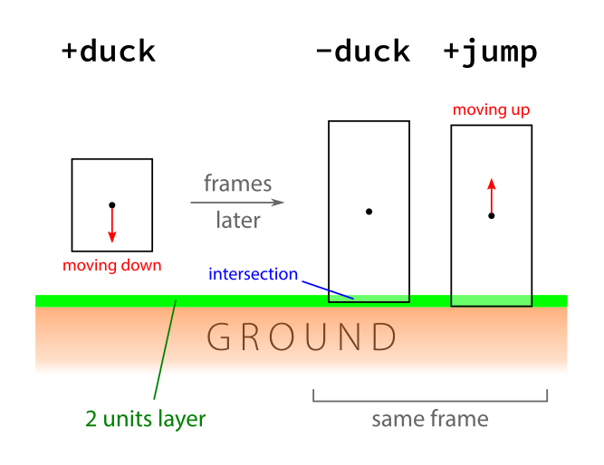

.. highlight:: none

Basic physics
=============

Walking through a frame
-----------------------

.. caution::
   This section is incomplete and outdated.

In this section we will describe what the game does in each frame that are
relevant to TASing.  Do not skip this section if you intend to understand the
rest of this document without much pain.

#. For our purposes we can consider ``PlayerPreThink`` in ``dlls/client.cpp``
   to be the first relevant function that gets called in each frame.  You might
   be wondering about the ``StartFrame`` function.  While usually it seems to
   get called prior to ``PlayerPreThink``, inexplicable things happen when one
   tries to output ``g_ulFrameCount`` and ``gpGlobals->time`` from both
   ``StartFrame`` and ``PlayerPreThink``.  What you will observe in 1000 fps is
   something like the following::

     startframe, g_ulFrameCount = 3, gpGlobals->time = 1.001
     prethink, g_ulFrameCount = 3, gpGlobals->time = 1.003
     startframe, g_ulFrameCount = 4, gpGlobals->time = 1.002
     prethink, g_ulFrameCount = 4, gpGlobals->time = 1.004
     ...
     ...

   If we look only at ``g_ulFrameCount``, it appears that ``StartFrame`` is
   indeed called prior to ``PlayerPreThink``.  However, the values for
   ``gpGlobals->time`` seem to tell us that the invocation of ``StartFrame`` is
   delayed by 2 frames.  We have no idea how to explain this contradiction,
   considering the fact that ``gpGlobals`` is a global pointer referencing the
   same memory location.  There could be some evil code that changes the value
   of ``gpGlobals->time`` to deceive ``StartFrame``.  Furthermore, when the
   frametime (the inverse of framerate, hereafter denoted as :math:`\tau`) is
   not a multiple of 0.001, sometimes ``StartFrame`` will be called multiple
   times in succession without executing the game physics at all, followed by
   several iterations of the game physics in sucession without calling
   ``StartFrame``.  Also, while a map is loading, the entire game physics is
   run multiple times after each ``StartFrame`` call.  From these observations,
   we conclude that one "frame" really refers to one iteration of the game
   physics, which can be thought to begin with the call to ``PlayerPreThink``
   as far as player physics is concerned, rather than ``StartFrame``.

#. ``PlayerPreThink`` will call ``CBasePlayer::PreThink`` located in
   ``dlls/player.cpp``.  Information such as the player health and those
   related to HUD will be sent over to the client in a function called
   ``CBasePlayer::UpdateClientData``.  Physics such as the using of trains,
   jumping animations, sounds and other cosmetic effects are run.  The physics
   associated with other entities in the map are not run at this point.

#. The ``UpdateClientData``, which is a completely different function located
   in ``dlls/client.cpp`` will get called a short while later.  This is where
   TasTools send the player velocity, position and other data in full precision
   to the clientside.  This is important because of lines like these in the
   ``delta.lst`` file located in the ``valve`` directory::

     DEFINE_DELTA( velocity[0], DT_SIGNED | DT_FLOAT, 16, 8.0 ),
     DEFINE_DELTA( velocity[1], DT_SIGNED | DT_FLOAT, 16, 8.0 ),
     ...
     ...
     DEFINE_DELTA( velocity[2], DT_SIGNED | DT_FLOAT, 16, 8.0 ),

   This means that each component of player velocity will be sent only with 16
   bits of precision and rounded to a multiple of one-eighth.  This is bad for
   optimal strafing computations done entirely at the clientside.

#. Assuming the string ``CL_SignonReply: 2`` has been printed to the console at
   some point (this will only be printed once).  Now the client starts working.
   The messages sent from the server just a moment ago are now received,
   including one that was sent by TasTools from ``UpdateClientData``.  Once the
   messages are processed, the game calls ``CL_CreateMove`` in
   ``cl_dlls/input.cpp``.  This is where the user input gets processed.  The
   user input can come from keyboard, mouse, joystick, or just console commands
   such as ``+attack``.  This is also where TasTools does all TAS-related
   computations such as optimal strafing.  The final viewangles, button presses
   (represented by a 16-bit integer) and other data are sent to the server at
   some point after ``CL_CreateMove`` returns, stored as ``usercmd_t`` defined
   in ``common/usercmd.h``.  Note that button presses do not record the actual
   keys pressed, but rather, they are represented by bits that are set when
   specific commands are issued.  For example, when the ``+forward`` command is
   issued, the ``IN_FORWARD`` bit will be set.  For some reasons, the game
   developers named the variable as ``buttons`` which is confusing.  The
   definition for all "button" bits can be found in ``common/in_buttons.h``.

#. Once the server receives the user input from the clientside, the ``PM_Move``
   in ``pm_shared/pm_shared.c`` gets called.  This is where all the fun begins,
   because the physics related to player movement are located here.  Due to the
   importance of the code in ``pm_shared/pm_shared.c``, we will devote a couple
   of paragraphs to them.  ``PM_Move`` calls ``PM_PlayerMove``, which is an
   unfortunately large function.

#. The first thing ``PM_PlayerMove`` does is to call ``PM_CheckParamters``
   [*sic*].  This is the function that scales ``forwardmove``, ``sidemove`` and
   ``upmove`` (hereafter written as :math:`F`, :math:`S` and :math:`U`
   respectively) in ``pmove->cmd`` so that the magnitude of the vector
   :math:`\langle F,S,U \rangle` does not exceed ``sv_maxspeed`` (denoted as
   :math:`M_m`).  This means if :math:`\lVert\langle F,S,U\rangle\rVert > M_m`
   then

   .. math:: \langle F,S,U\rangle \mapsto \frac{M_m}{\lVert\langle F,S,U\rangle\rVert} \langle F,S,U\rangle

   Otherwise, :math:`F`, :math:`S` and :math:`U` will remain unchanged.  This
   is why increasing ``cl_forwardspeed``, ``cl_sidespeed`` and ``cl_upspeed``
   may not result in greater acceleration.  ``PM_DropPunchAngle`` is also
   invoked to decrease the magnitude of punchangles.  The full equation is

   .. math:: \mathbf{P}' = \max\left[ \lVert\mathbf{P}\rVert \left( 1 - \frac{1}{2} \tau \right) - 10\tau, 0 \right] \mathbf{\hat{P}}

   where :math:`\mathbf{P} = \langle P_p, P_y, P_r\rangle`.  The punchangles
   are then added to the viewangles (which does not affect the viewangles at
   the clientside).  ``PM_ReduceTimers`` is now called to decrement various
   timers such as ``pmove->flDuckTime`` which purpose will be explained later.

#. A very important function, ``PM_CatagorizePosition`` [*sic*], is then
   called.  Here we will introduce a new concept: onground.  A player is said
   to be onground if the game thinks that the player is standing some "ground"
   so that certain aspects of the player physics will be different from that
   when the player is not onground.  ``PM_CatagorizePosition`` checks whether
   the player is onground and also determines the player's waterlevel (which
   carries a numerical value), yet another new concept.  In short, the player
   physics will differ significantly only when the waterlevel is more than 1,
   which happens when the player is immersed sufficiently deeply into some
   water (the specific conditions will be described later).

   The way by which ``PM_CatagorizePosition`` determins the player onground
   status is simple.  A player is onground if :math:`v_z` (vertical velocity)
   is at most 180 ups, *and* if there exists a plane at most 2 units below the
   player, such that the angle between the plane and the global horizontal
   :math:`xy` plane is at most :math:`\arccos 0.7 \approx 45.57` degrees with
   the plane normal pointing upward (this is another way of saying that the
   :math:`z` component of the unit normal vector is at least 0.7).  If the
   player is determined to be onground and his waterlevel is less than 2, then
   the game will forcibly shift the player position downward so that the player
   is really standing on the plane and not continue floating in the air at most
   2 units above the plane.

   TODO describe checkwater here

#. After the first onground check, the game will store :math:`-v_z` in
   ``pmove->flFallVelocity``.  Although this may seem insignificant, this
   turned out to be how the game calculates fall damage.  Next we have a call
   to ``PM_Ladder``, which determines whether the player is on some ladder.

#. ``PM_Duck``, as its name suggests, is pretty important.  This is the
   function responsible for ducking physics.  Here we must introduce two new
   concepts: bounding box and duckstate.  They are described in
   :ref:`ducking-phy` which must be read before moving on.

#. The game will now call ``PM_LadderMove`` if the player is on some ladder.

#. If ``+use`` and the player is onground, then :math:`\mathbf{v}` will be
   scaled down by 0.3.  This is the basis of USE braking.

#. The game will now do different things depending on ``pmove->movetype``.  If
   the player is on ladder then the movetype is ``MOVETYPE_FLY``.  Otherwise it
   will usually be the confusingly named ``MOVETYPE_WALK``.  We will assume the
   latter.  If the player waterlevel is at most 1, the game makes the first
   gravity computation as done by ``PM_AddCorrectGravity``.  Looking inside
   this function, assuming basevelocity is :math:`\mathbf{0}` we see that the
   game performs this following computation:

   .. math:: v_z' = v_z - \frac{1}{2} g\tau

   where :math:`g` is the gravitational acceleration, ``ent_gravity`` times
   ``pmove->movevars->gravity``.  Several notes must be made here:
   ``ent_gravity`` is ``pmove->gravity`` if the latter is nonzero, otherwise
   the former is 1.  ``pmove->gravity`` is usually 1, which can thought as a
   multiplier that scales ``pmove->movevars->gravity``.  For instance, it has a
   different value if we enter the Xen maps, which is how the game changes the
   gravitational acceleration without directly modifying the ``sv_gravity``
   cvar.  Now look closer to the computation, we see that it does seem
   incorrect as noted in the rather unhelpful comment.  However, the game
   always makes a call to ``PM_FixupGravityVelocity`` towards the end of
   ``PM_PlayerMove`` which performs the exact same computation except it
   completely ignores basevelocity.  Now the key idea is that the actual
   movement of player vertical position is done between these two calls.  In
   other words, we want the final vertical position after ``PM_PlayerMove`` to
   be

   .. math:: p_z' = p_z + v_z \tau - \frac{1}{2} g\tau^2

   which is exactly what we know from classical mechanics.  But by rewriting
   this equation ever so slightly, we obtain

   .. math:: p_z' = p_z + \tau \left( v_z - \frac{1}{2} g\tau \right) = p_z + \tau v_z'

   where :math:`v_z'` is the new velocity computed by ``PM_AddCorrectGravity``.
   It is now obvious why this function does it in the seemingly incorrect way.

   The final velocity after ``PM_PlayerMove`` must be :math:`v_z - g\tau` and
   *not* :math:`v_z - \frac{1}{2} g\tau`.  This is where
   ``PM_FixupGravityVelocity`` comes into play by subtracting another
   :math:`\frac{1}{2} g\tau`.  A final note: in both of these functions the
   ``PM_CheckVelocity`` is called.  This function ensures each component of
   :math:`\mathbf{v}` is clamped to ``sv_maxvelocity``.

#. TODO: waterjump etc

#. Assuming the waterlevel is less than 2.  If ``+jump`` is active then
   ``PM_Jump`` will be called.  The jumping physics will be dealt in a later
   section.

#. The game calls ``PM_Friction`` which reduces the magnitude of player
   horizontal velocity if the player is onground.  The friction physics is
   discussed much later.  Note that the vertical speed is zeroed out here.
   Another ``PM_CheckVelocity`` will be called regardless of onground status.

#. The game will now perform the main movement physics.  They are very
   intricate and we devoted several sections to them.

#. The final ``PM_CatagorizePosition`` will be called after the movement
   physics.  The basevelocity will be subtracted away from the player velocity,
   followed by yet another ``PM_CheckVelocity``.  Then the
   ``PM_FixupGravityVelocity`` is called.  Finally, if the player is onground
   the vertical velocity will be zeroed out again.

#. After ``PM_Move`` returns, the game will call ``CBasePlayer::PostThink``
   shortly after.  This is where fall damage is inflicted upon the player (only
   if the player is onground at this point), impulse commands are executed,
   various timers and counters are decremented, and usable objects in vicinity
   will be used if ``+use``.

#. The game will now execute the ``Think`` functions for all entities.  This is
   also where other damages and object boosting are handled.

Frame rate
----------

The term "frame rate" is potentially ambiguous.  If precision is desirable then
we can differentiate between three kinds of frame rate: computational frame
rate (CFR), usercmd frame rate (UFR) and rendering frame rate (RFR).  The RFR
is simply the rate at which frames are drawn on the screen.  (Note that it is
incorrect to define RFR as the "number of screen refreshes per second".  This
definition falls apart if ``r_norefresh 1``, which prevents the screen from
refreshing!)

TODO!!

.. _ducking-phy:

Ducking physics
---------------

The bounding box is an imaginary cuboid, usually enclosing the player model.
It is sometimes called the AABB, which stands for axis-aligned bounding box,
which means the edges of the box are always parallel to the corresponding axes,
regardless of player position and orientation.  The bounding box is used for
collision detection.  If a solid entity touches this bounding box, then this
entity is considered to be in contact with the player, even though it may not
actually intersect the player model.  The height of the player bounding box can
change depending on the duckstate.

When the player is not ducking, we say the player is unducked and thus the
duckstate is 0.  In this state the bounding box has width 32 units and height
72 units.  If the duck key has been held down for no longer than 1 second and
the player has been onground all the while, then we say that the player
duckstate is 1.  At this point the bounding box height remains the same as that
when the player has duckstate of 0.  If the duck key is held (regardless of
duration) but not onground, or if the duck key has been held down for more than
1 second while onground, the duckstate will be 2.  Now the bounding box height
will be 36 units, with the same width as before.

If the duck key is released while the player duckstate is 2, the duckstate will
be changed back to 0 immediately, and the bounding box height will switch back
to 72 units.  However, if the key is released while the duckstate is 1, magic
will happen: the player position will be shifted instantaneously 18 units above
the original position, provided that there are sufficient empty space above the
player.  This forms the basis of ducktapping, sometimes referred to as the
imprecise name "doubleduck".  Doubleduck is really a ducktap followed by
another duck.

Note that the bounding box is an actual concept in the game code, while
duckstate is simply an easier abstraction used in our literature.  In the code,
a duckstate of 0 means ``pmove->bInDuck == false`` and ``(pmove->flags &
FL_DUCKING) == 0``.  A duckstate of 1 means ``pmove->bInDuck == true`` and
``(pmove->flags & FL_DUCKING) == 0`` still.  Finally, a duckstate of 2 means
``pmove->bInDuck == false`` and ``(pmove->flags & FL_DUCKING) != 0``.  Whereas
the type of bounding box is essentially selected by modifying
``pmove->usehull``.

Now that we have described the concept of bounding box and duckstate, we will
now note that each of :math:`F`, :math:`S` and :math:`U` will be scaled down by
0.333 if the duckstate is 2.  After the scaling down, :math:`\lVert\langle
F,S,U\rangle\rVert` becomes :math:`0.333M`, ignoring floating point errors and
assuming original :math:`\lVert\langle F,S,U\rangle\rVert \ge M`.  However,
this is done *before* any change in duckstate happens in ``PM_Duck``.  Suppose
the player has duckstate 0 before the call to ``PM_Duck``, and after
``PM_Duck`` is called the duckstate changes to 2.  In this case, the
multiplication by 0.333 will *not* happen: the duckstate was not 2 before the
change.  Suppose the player has duckstate 2 and the call to ``PM_Duck`` makes
the player unducks, hence changing the duckstate back to 0.  In this case the
multiplication *will* happen.

Jumping physics
---------------

Assuming the player is ongorund.  Then jumping is possible only if he is
onground and the ``IN_JUMP`` bit is unset in ``pmove->oldbuttons``.

Jumpbug
-------

Jumpbug is one of a few exploits that can bypass fall damage when landing on
any ground.  The downside of jumpbug is that a jump must be made, which may be
undesirable under certain circumstances.  For example, when the player jumps
the bunnyhop cap will be triggered.

To begin a jumpbug sequence, suppose that the player is initially not onground
(as determined by the first onground check) and that the duckstate is 2, as
illustrated by the ``+duck`` bounding box in the figure above.  Some time later
the player unducks, hence ``PM_UnDuck`` will be called to change the duckstate
back to 0 and the second onground check will be triggered.  If there exists a
ground 2 units below the player, then the player will now be onground (as shown
by the ``-duck`` box above), and if ``+jump`` happens to be active the player
will jump when ``PM_Jump`` is called within the same frame (shown by the
``+jump`` box).  But recall that ``PM_Jump`` will always make the player to be
not onground.  Also, as the upward velocity is now greater than 180 ups, when
the third onground check is made the player will again be determined to be not
onground.  As a result, when the control passes to ``CBasePlayer::PostThink``,
the game will not inflict fall damage to the player.

Jumpbug can fail if the player was not able to unduck to make himself onground
after the second groundcheck.  The chances of this happening is greater at
lower frame rates and higher vertical speeds.

Edgebug
-------

TODO

Basevelocity and pushfields
---------------------------

In ``pm_shared.c`` the basevelocity is stored in ``pmove->basevelocity``.  This
is nonzero usually when being inside a ``trigger_push`` or conveyor belt, which
are called *pushfields*.  The way the player physics incorporates basevelocity
is vastly different for its horizontal and vertical components.

The basevelocity is always added to the player velocity *after* acceleration.
This means the new player position is computed by :math:`\mathbf{p}' =
\mathbf{p} + (\mathbf{v} + \mathbf{b}) \tau` where :math:`\mathbf{b}` is the
basevelocity.  Shortly after that the basevelocity will be subtracted away from
:math:`\mathbf{v}` before ``PM_PlayerMove`` returns.

Interestingly, whenever the player leaves a pushfield the basevelocity of the
pushfield will be added to the player's velocity somewhere in the game engine.
The added components will not be subtracted away.  This is the basis of the
famous push trigger boost, whereby a player ducks and unducks in rapid
succession so that the bounding box enters and leaves the pushfield repeatedly.

The :math:`b_z` is handled differently.  It is incorperated into :math:`v_z` in
``PM_AddCorrectGravity`` without being subtracted away later.  Instead,
:math:`b_z` is set to zero in the function.  Let us write :math:`v` to mean
:math:`v_z` for now.  The vertical velocity at the :math:`n`-th frame would be
:math:`v_n = v_0 + (b - g) n\tau`.  But bear in mind that the position is
computed using :math:`v_n = v_0 + (b - g) n\tau + \frac{1}{2} g\tau` instead.
Therefore, to find the position at an arbitrary :math:`n`\ -th frame we must
compute

.. math:: p_n = p_0 + \tau \sum_{k = 0}^n v_n = p_0 + \left( v_0 + \frac{1}{2} b\tau \right) n\tau + \frac{1}{2} n^2 \tau^2 (b - g)

These formulae can be useful in planning.

Water physics
-------------

Water movement is unfortunately not optimisable in Half-Life.  However, we will
still include a description of its physics here.

If the point 1 unit above the bottom of bounding box is immersed in water, then
the waterlevel is 1.  If the player origin (centre of bounding box) is
additionally in water, then the waterlevel will be increased to 2.  If the
player's view (origin plus view offset) is also in water, then the waterlevel
will be 3.  Depending on the existence of water current and the waterlevel, the
magnitude of basevelocity may be modified.

In water physics the acceleration vector is :math:`\mathbf{a} =
F\mathbf{\hat{f}} + S\mathbf{\hat{s}} + \langle 0,0,U\rangle` provided at least
one of :math:`F`, :math:`S`, :math:`U` is nonzero.  Otherwise :math:`\mathbf{a}
= \langle 0,0,-60\rangle`.  Note that :math:`\mathbf{a}` is an
:math:`\mathbb{R}^3` vector.  In the context of water physics we denote
:math:`M = 0.8\min\left( M_m, \lVert\mathbf{a}\rVert \right)`, where it can be
shown that, if not all :math:`F`, :math:`S`, :math:`U` are zero, then

.. math:: \lVert\mathbf{a}\rVert = \sqrt{F^2 + S^2 + U^2 + \langle 0,0,2U\rangle
          \cdot \left( F\mathbf{\hat{f}} + S\mathbf{\hat{s}} \right)}

Thus the water movement equation can be written as

.. math:: \mathbf{v}' = \mathbf{v}(1 - k\tau) + \mu\mathbf{\hat{a}}

with

.. math:: \mu =
          \begin{cases}
          \min(\gamma_1, \gamma_2) & \text{if } \gamma_2 > 0 \\
          0 & \text{otherwise}
          \end{cases}
          \quad\quad
          \gamma_1 = k\tau MA_g
          \quad\quad
          \gamma_2 = M - \lVert\mathbf{v}\rVert (1 - k\tau)

The first thing we should notice is that :math:`\gamma_2` is independent of
:math:`\mathbf{\hat{a}}`, which means as the speed increases :math:`\gamma_2`
will inevitably decrease until it is negative.  The speed can be written as

.. math:: \lVert\mathbf{v}'\rVert = \sqrt{\lVert\mathbf{v}\rVert^2 (1 - k\tau)^2 +
          \mu^2 + 2\lVert\mathbf{v}\rVert (1 - k\tau) \mu \cos\theta}

If :math:`\theta = 0` and :math:`\lVert\mathbf{v}\rVert` is sufficiently high
so that :math:`\gamma_2 < \gamma_1`, then we see that
:math:`\lVert\mathbf{v}'\rVert = M`.  This means the maximum possible swimming
speed is simply :math:`0.8M_m`.  Moreover, assuming :math:`\mu = \gamma_1` then
the acceleration is independent of frame rate:

.. math:: \text{accel} = \frac{\left[ \lVert\mathbf{v}\rVert (1 - k\tau) + k\tau MA_g \right] -
          \lVert\mathbf{v}\rVert}{\tau} = k \left( MA_g - \lVert\mathbf{v}\rVert \right)

Also observe that the player always experience geometric friction while in the
water.
