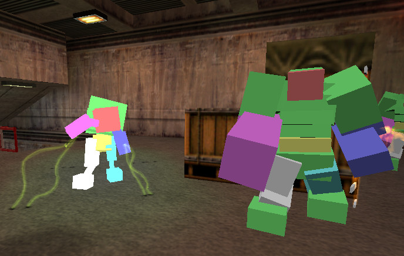
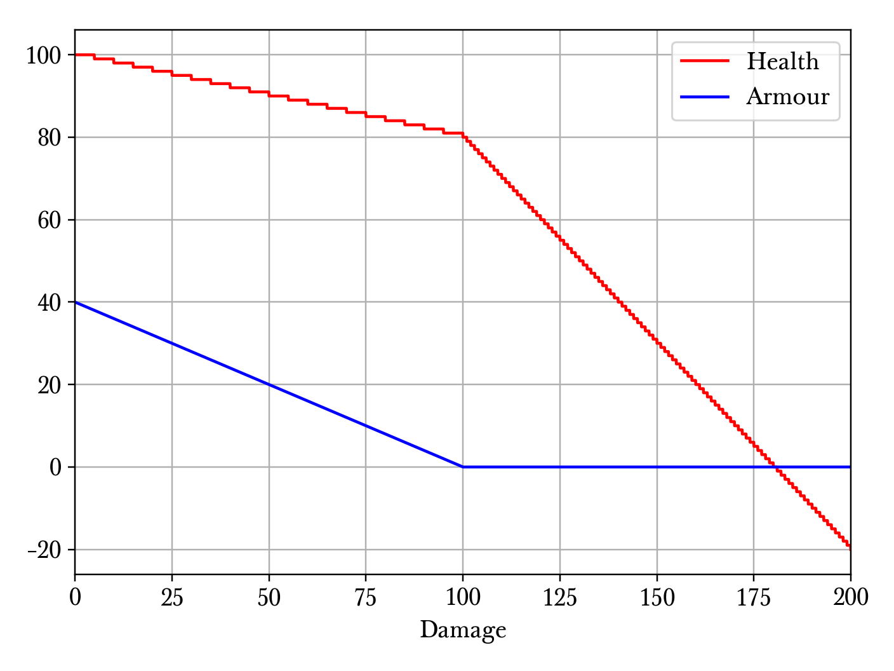

.. _health and damage:

Health and damage
=================

Understanding the health and damage system of the game can be important for precision speedrunning. All entities in Half-Life can be categorised into *damageable entities* and *non-damageable entities*. As the name suggests, a damageable entity is an entity that can receive damage, even if it can never be "killed" by receiving sufficient damage to have the health reduced to zero. For example, the tentacle monsters in Blast Pit are damageable, but they can never be killed without the test fire blast. In the Half-Life SDK, entities are tested for their "damageability" using the ``takedamage`` field in ``entvars_t``, which is set to zero if the entity in question cannot be damaged.

.. _hitgroup:

Hitgroup
--------

   The hitboxes of a vortigaunt and alien grunts.

When damageable entity receives damage, the damage is inflicted onto one of the *hitboxes* if they exist. Hitboxes are a series of cuboids that approximate the entity model. For example, the hitboxes of a scientist are arranged to look like cuboids attached to the scientist's skeleton.

Hitboxes are grouped to designate different parts of the entity's body, such as the head, the chest, the legs, and so on. A group of hitboxes is called a *hitgroup*. Most players are aware that different parts of an entity's body can receive different damages given the same damage source. This is because different hitgroups may be attached a different *damage multiplier*. In the case of the player, the head hitgroup has a damage multiplier of 3, while all other hitgroups have a damage multiplier of 1. If a damage of 8 is inflicted onto the player's head hitgroup, the damage ultimately received will be 24. But if the same damage is inflicted onto the other hitgroups, the player will receive 8 damage unmodified.

To view the hitboxes of entities that have them, set ``r_drawentities 3``. The hitboxes corresponding to the different hitgroups will be coloured differently. An example can be seen in :numref:`hitboxes`.

.. _player health:

Player health and armour
------------------------

The health and armour amounts of the player are stored as the ``health`` and ``armorvalue`` fields in the player's ``entvars_t``. Both values are stored as 32-bit floating pointer numbers, not integers as one might believe. To ease mathematical discussions, denote :math:`\mathcal{H}` and :math:`\mathcal{A}` the health and armour amounts of the player respectively. Denote :math:`\mathcal{H}'` and :math:`\mathcal{A}'` the new health and damage. Suppose :math:`D` is the damage received by the player, after the hitgroup computations. Assuming the damage type is not ``DMG_FALL`` and not ``DMG_DROWN``, then

.. math:: \mathcal{H}' = \mathcal{H} - \Delta\mathcal{H}
          \quad\quad\quad
          \mathcal{A}' =
          \begin{cases}
          0 & \mathcal{A} = 0 \\
          \max(0, \mathcal{A} - 2D/5) & \mathcal{A} \ne 0
          \end{cases}

where

.. math:: \Delta\mathcal{H} =
          \begin{cases}
          \operatorname{int}(D - 2\mathcal{A}) & \mathcal{A}' = 0 \\
          \operatorname{int}(D/5) & \mathcal{A}' \ne 0
          \end{cases}

If the damage type is ``DMG_FALL`` or ``DMG_DROWN``, then the armour value will remain the same, with :math:`\Delta\mathcal{H} = \operatorname{int}(D)`.

.. note::
   Note that :math:`D = 0` is not equivalent to not taking damage. Rather, it means some damage is still taken, and the ``TakeDamage`` function is still called, but with a value of zero. This will be important when :math:`\mathcal{A} < 0`, which is impossible in the game but mathematically possible.

Observe that even though the player health is stored as a 32-bit floating point number, in practice it will almost always have an integer value. This is because any change in health :math:`\Delta\mathcal{H}` due to damage is always an integer. This property is unique to the player entity. However, the armour value will often have a nonzero fractional part.

   A typical player health and armour against damage plot. This plot assumes an initial health and armour of 100 and 40 respectively, showing the new health and armour after a given damage.

In :numref:`player_hp` we observe that when the armour is nonzero, the health decreases with a smaller slope with increasing damage. But once the damage is sufficiently large that the armour gets to zero, the subsequent slope of the health line is much larger. The zigzag pattern of the health line is due to the integer truncation of damage.

Damage system
-------------

.. caution:: Rewording needed

Often, damages in Half-Life are not inflicted immediately.  Instead, a series
of damages may be accumulated by the *multidamage* mechanism.  There are three
important functions associated with this mechanism: ``ClearMultiDamage``,
``AddMultiDamage`` and ``ApplyMultiDamage``.  Each of these functions works on
a global variable called ``gMultiDamage`` which has the following type

.. code-block:: cpp

   typedef struct
   {
     CBaseEntity *pEntity;
     float amount;
     int type;
   } MULTIDAMAGE;

The ``pEntity`` field is the entity on which damages are inflicted while the
``amount`` field is the accumulated damage.  The ``type`` field is not
important.

``ClearMultiDamage`` is the simplest function out of the three.  It simply
assigns ``NULL`` to ``gMultiDamage->pEntity`` and zeros out
``gMultiDamage->amount`` and ``gMultiDamage->type``.  This function accepts no
parameter.

``ApplyMultiDamage`` is straightforward.  When called, it will invoke
``gMultiDamage->pEntity->TakeDamage`` with the damage specified by
``gMultiDamage->amount``.  As the name suggests, ``TakeDamage`` simply
subtracts the entity's health by the given damage.  When the entity is a
breakable crate and its health is reduced to below zero, it will turn into a
``SOLID_NOT``, which renders itself invisible to any tracing functions.  Then,
the crate will fire any associated targets, schedule its removal from memory
after 0.1s, then spawn its associated item.  At this point you may be confused:
if the crate becomes ``SOLID_NOT``, then how can any further damages be dealt
to it if the crate cannot be found by tracing functions?  Continue reading.

``AddMultiDamage`` is slightly trickier.  One of the parameters accepted by
this function is the target entity on which damages are to be inflicted.  When
this function is invoked, it checks whether the current
``gMultiDamage->pEntity`` differs from the supplied entity.  If so, it will
call ``ApplyMultiDamage`` to deal the currently accumulated damages on the
current ``gMultiDamage->pEntity``.  After that, it assigns the supplied entity
to ``gMultiDamage->pEntity`` and the supplied damage to
``gMultiDamage->amount``.  On the other hand, if the supplied entity is the
same as the current ``gMultiDamage->pEntity``, then the supplied damage will
simply be added to ``gMultiDamage->amount``.

When an explosive crate detonates, damage is dealt to the surrounding entities.
The function responsible of inflicting this blast damage is ``RadiusDamage``.
This function looks for entities within a given radius.  For each entity, it
usually does a ``ClearMultiDamage``, followed by ``TraceAttack`` (which simply
calls ``AddMultiDamage`` on the target entity) and then ``ApplyMultiDamage``.

Finally, we come to the final building block toward understanding the trick:
``FireBulletsPlayer``.  This function is called whenever a shotgun is fired.
At the very beginning of this function, ``ClearMultiDamage`` is called,
followed by a loop in which each pellet is randomly assigned a direction to
simulate spread, then a tracing function is called for each pellet to determine
what entity has been hit.  Then, this entity's ``TraceAttack`` is called.
After the loop ends, the function concludes with a call to
``ApplyMultiDamage``.

Damage types
------------

Half-Life has a diverse set of damage types that made the gameplay interesting. However, many of these damages can be categorised into a few groups based on their behaviour.

Time based
~~~~~~~~~~

One-off
~~~~~~~

Fall damage
~~~~~~~~~~~

In Half-Life, a player falling from great heights can cause potential health reduction. All other entities do not suffer from fall damage, however. The game calculates the amount of damage taken based on the new vertical velocity computed in the frame of impact. If the magnitude of the vertical velocity is above the *safe falling speed*, defined to be 580 ups as ``PLAYER_MAX_SAFE_FALL_SPEED`` in ``dlls/player.h``, the game will inflict a fall damage of

.. math:: D = \frac{25}{111} (v_z - 580) \quad v_z > 580

The constant of proportionality :math:`25/111` is defined to be ``DAMAGE_FOR_FALL_SPEED`` in ``dlls/player.h``. The damage type is ``DMG_FALL``, which, recalling from :ref:`player health`, bypasses the player's armour.

Observe that :math:`v_z = 1024` gives :math:`D = 100`. Assuming a gravitational acceleration of :math:`g = 800`, the maximum safe height is 210.25 units and the fatal height (assuming a health of 100) is 655.36 units. These values can help the speedrunner to make estimates in the plans, and possibly utilise one of the methods to bypass fall damage such as jumpbug (see :ref:`jumpbug`).

.. _damage boosting:

Damage boosting
---------------

The player velocity will be modified upon receiving most types of damage, forming the foundation for a variety of damage boosts.  First we have the concept of an "inflictor" associated with a damage, which may or may not exist.  Drowning damage, for example, does not have an inflictor.  Inflictor could be a grenade entity, a satchel charge entity, a human grunt, or even the player himself (in the case of selfgaussing, see :ref:`selfgauss`).  It is the first argument to ``CBaseMonster::TakeDamage`` in ``dlls/combat.cpp``.

Suppose :math:`\mathbf{v}` is the player velocity and :math:`\mathbf{r}` the
player position.  If an inflictor with position
:math:`\mathbf{r}_\text{inflictor}` exists, then with

.. math:: \mathbf{d} = \mathbf{r} - \mathbf{r}_\text{inflictor} + \langle 0, 0, 10\rangle

we have

.. math:: \mathbf{v}' = \mathbf{v} +
          \begin{cases}
          \min(1000, 10\Delta\mathcal{H}) \mathbf{\hat{d}} & \text{if duckstate} = 2 \\
          \min(1000, 5\Delta\mathcal{H}) \mathbf{\hat{d}} & \text{otherwise}
          \end{cases}

We can immediately see that if the duckstate is 2 the change in velocity is greater.  It is sad to see that the maximum possible boost given by a single damage is 1000 ups and not infinite.

The role of armour
~~~~~~~~~~~~~~~~~~

Armour is strictly never needed for damage boosting. The only function of armour is to cut the health loss :math:`\Delta\mathcal{H}` ultimately inflicted onto the player given the same damage :math:`D`. Theoretically, we do not need to use the armour to control the health loss at all. Instead, it can be done by simply moving the explosion origin away so that the damage falls off to match the desired health loss (see :ref:`explosions` for more details). In practice, however, this may be hard to achieve in confined spaces or awkward positions, especially when a small health loss is desired despite large source damage, which implies a large distance is required between the player and the explosion origin.

Suppose we have calculated the exact :math:`\Delta\mathbf{v}` boost needed for a damage boost, and determined that a health loss of :math:`\Delta\mathcal{H}` is desired. However, the damage inflicted :math:`D > \Delta\mathcal{H}`. Therefore, some amount of armour is needed to cut the damage, preferably as little as possible since the armour is a relatively scarce resource. We will assume :math:`\Delta\mathcal{H} \ge 0` and :math:`\mathcal{A}' = 0`, which implies the necessary condition

.. math:: \mathcal{A}' = \max(0, \mathcal{A} - 2D/5) \le 0 \implies \mathcal{A} \le \frac{2}{5} D

On the other hand, :math:`\mathcal{A}' = 0` also implies the health loss is related to the damage and armour by

.. math:: \Delta\mathcal{H} = \operatorname{int}(D - 2\mathcal{A}) \implies \frac{1}{2} \left( D - \Delta\mathcal{H} - 1 \right) < \mathcal{A} \le \frac{1}{2} \left( D - \Delta\mathcal{H} \right)
   :label: A=0_A_range

Combining the two inequalities, we can eliminate :math:`\mathcal{A}` and obtain the new inequality

.. math:: \frac{1}{2} \left( D - \Delta\mathcal{H} - 1 \right) < \frac{2}{5} D
   \implies D < 5 \left( \Delta\mathcal{H} + 1 \right)
   :label: A=0_D_range

In other words, the initial assumption of :math:`\mathcal{A}' = 0` is contingent upon the truth value of this inequality. This inequality sets an upper bound on the damage value for this approach to work. Assuming this inequality is true, then the requisite :math:`\mathcal{A}` value can be picked from the small range given by the second inequality.

If the necessary conditions mentioned above do not hold, then the assumption of :math:`\mathcal{A}' = 0` is false, implying :math:`\mathcal{A}' > 0`. This further implies that the armour value has the lower bound

.. math:: \mathcal{A} > \frac{2}{5} D

Furthermore, this assumption also implies the equality

.. math:: \Delta\mathcal{H} = \operatorname{int}\left( \frac{D}{5} \right)

Using the same analysis technique of replacing the integer truncation with a range, we obtain the equivalent range

.. math:: 5 \Delta\mathcal{H} \le D < 5 \left( \Delta\mathcal{H} + 1 \right)
   :label: A>0_D_range

Observe that this range overlaps with the range :eq:`A=0_D_range`. In fact, we need not consider the :math:`\mathcal{A}' > 0` case at all. This is because if :math:`\mathcal{A}' = 0` is not true, then the :math:`\mathcal{A}' > 0` case is not going to help us. If :math:`\mathcal{A}' > 0`, then this implies the upper bound on :math:`D` in :eq:`A=0_D_range`, and therefore :eq:`A>0_D_range` also fails. Therefore, we conclude that there exists no :math:`\mathcal{A}` that can produce the required health loss.

A small note to make is that if :math:`D` satisfies :eq:`A>0_D_range`, then it means that we can pick any value of :math:`A` to give the same :math:`\Delta\mathcal{H}`, as long as the lower bound in :eq:`A=0_A_range` is satisfied.

.. We'll keep this distribution thing here in health and damage, and not in explosions, because these are applicable for other kinds of damage as well

Distribution of health
~~~~~~~~~~~~~~~~~~~~~~

Health is a scarce resource in any speedrun because medkits and health chargers are relatively rare. Despite this harsh constraint, it is common to want to perform multiple damage boosts using whatever health that is available until the health becomes too low. A natural question to ask is: what is the optimal way to distribute the limited health over these damage boosts, so that the total time taken to reach the destination is minimised?

Intuitively, this question seems to have a simple answer. Suppose there are two straight paths we need to travel to reach the destination. We want to perform damage boosts at the very beginning of each path. Let the lengths of these two paths be 250 and 750 units. Assume that the initial horizontal speed at the beginning of each path is 100 ups. For simplicity, we will assume that we can consume up to 100 HP in total without dying.

Now observe that the length ratio is 1:3, so it is natural to guess that the health should also be distributed in 1:3 proportion for each straight path. Namely, allocate 25 HP to the damage boost for the shorter path and 75 HP for the longer path. Thus, we calculate that the total time taken to travel both paths is 1.597 seconds. However, what if we allocate 34 HP for the shorter path and 66 HP for the longer path instead? Then the total time is 1.555 seconds. In fact, we claim that this is the optimal distribution which minimises the total time. Even though the difference is small in this particular scenario, it is not at all obvious why the 1:3 distribution is suboptimal.

To find out the optimal health distribution, we construct a model which closely reflects actual situations. We first assume that we are required to perform damage boosts for :math:`n` *distance segments*. We define a distance segment as a straight line path which directly benefits from a damage boost done at the beginning of the path. To take a concrete example, imagine an extremely narrow L-shaped path where the turn is extremely sharp. Since the turn is very sharp, the player's horizontal speed will be reduced to a *fixed* value after making the turn. Thus, we consider the L-shaped path to be comprised of two distance segments, one for each straight path. Notice that no matter how much health is allocated to the initial boost, the speed gained will be lost after making the turn. Thus, the two straight paths are of distinct distance segment: the time taken to travel across the second straight path is independent of whatever that happens while travelling in the first straight path.

In practice, there is, of course, no perfect distance segment. Turns are rarely so sharp that all boosts in the horizontal speed are nullified. Nevertheless, the concept of distance segments can serve as a helpful guide and approximation to practical situations. Note also that the distance segments need not be continuous as is the case in the L-shaped path example described previously. Indeed, distance segments are completely independent of each other.

Let :math:`s_1, \ldots, s_n` be the lengths of the distance segments. Let :math:`u_1, \ldots, u_n` be the initial horizontal speeds are the beginning of each distance segment before damage boosting. These initial speeds are assumed to be fixed, independent of previous damage boosts. They are typically approximated in practice. And let :math:`\Delta v_1, \ldots, \Delta v_n` be the change in horizontal speed as a result of the damage boost at the beginning of each distance segment. Now assume that the speed stays constant after boosting. We can then compute that the total time required to traverse all distance segments is

.. math:: T(\Delta v_1, \ldots, \Delta v_n) = \frac{s_1}{u_1 + \Delta v_1} + \cdots + \frac{s_n}{u_n + \Delta v_n}

Here, the total time is written as a function with parameters :math:`\Delta v_1, \ldots, \Delta v_n`. We want to minimise this quantity by finding the optimal values for each of :math:`\Delta v_i`. Note also that we have a constraint, namely the amount of health given at the beginning of everything, before any boosting is done. We may express this constraint simply as

.. math:: H(\Delta v_1, \ldots, \Delta v_n) = \Delta v_1 + \cdots + \Delta v_n = 10\mathcal{H}

where :math:`\mathcal{H}` is the total health amount that will be consumed. Here, the coefficient of :math:`10` reflects the assumption that the player will duck for each damage boosting. Indeed, recall that by ducking the player will receive twice the amount of speed boost compared to that received in upright position. By stating the optimisation problem this way, it may readily be solved via the method of Lagrange multipliers.

This optimisation method is particularly useful when we have a multivariate objective function and an equation constraining the parameters. In this optimisation problem, we want to solve the :math:`n + 1` equations consisting of the constraint along the equations encoded as :math:`\nabla T = -\lambda \nabla H` where :math:`\lambda` is the Lagrange multiplier. Writing out the latter explicitly, we have

.. math:: \frac{s_i}{(u_i + \Delta v_i)^2} = \lambda
   :label: explicit_lagrange

for all :math:`1 \le i \le n`.  To proceed, we introduce a temporary variable :math:`\mathcal{\tilde{H}}` such that

.. math:: 10\mathcal{H} = \mathcal{\tilde{H}} - u_1 - \cdots - u_n

As a result, the constraint equation may be written as

.. math:: (u_1 + \Delta v_1) + \cdots + (u_n + \Delta v_n) = \mathcal{\tilde{H}}

Using :eq:`explicit_lagrange`, we then eliminate all :math:`u_i + \Delta v_i`, yielding

.. math:: \sqrt{\frac{s_1}{\lambda}} + \cdots + \sqrt{\frac{s_n}{\lambda}} = \mathcal{\tilde{H}}

Or equivalently, by eliminating the temporary variable,

.. math:: \left( \frac{\sqrt{s_1} + \cdots + \sqrt{s_n}}{10\mathcal{H} + u_1 + \cdots + u_n} \right)^2 = \lambda

Eliminating :math:`\lambda` using :eq:`explicit_lagrange` again, we have the solution for each :math:`\Delta v_i` in the following form:

.. math:: \Delta v_i = \frac{\sqrt{s_i}}{\sum_{k=1}^n \sqrt{s_k}} \left(
          10\mathcal{H} + \sum_{k=1}^n u_k \right) - u_i

Looking at this equation, we observe the rather counterintuitive ratio. In particular, the ratio is *not* given by

.. math:: \frac{s_i}{\sum_{k=1}^n s_i}

as one would have guessed.

We want to remark that this model makes the assumption that the speed is constant after boosting. This is normally not true in practice. However, consider that the speed after a damage boost is typically very high, and recall from strafing physics that the acceleration at higher speeds is noticeably lower.

Upward diagonal boost
~~~~~~~~~~~~~~~~~~~~~

It is fairly common in Half-Life to be faced with the situation where we need to reach a certain height.
