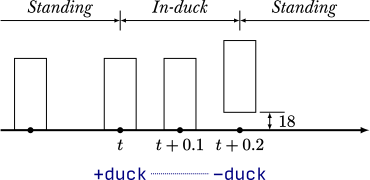
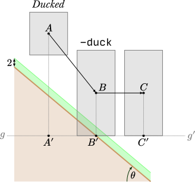

Ducking and jumping
===================

Ducking and jumping are some of the fundamental player actions. Understanding the intricacies associated with these actions is vital to writing an effecting TAS and troubleshooting issues that might arise along the way.

.. _ducking:

Ducking
-------

Ducking is one of the most important actions in playing Half-Life. And yet, it has some of the more misunderstood behaviours. Ducking can be performed with the use of the duck key, which issues ``+duck``. The subsequent behaviour depends on whether the player is onground, and how long the duck key is held before releasing.

.. figure:: images/player-hulls.svg

   Depiction of standing and ducking hulls (also known as axis-aligned bounding boxes) of the player entity. The hulls are drawn to scale and projected orthographically.

There are three ducking states in Half-Life, namely *standing*, *in-duck*, and *ducked*. The *standing* state is simply the player's default state, when the duck key is not held. In this state, the player bounding box is set to be 72 units tall. The *in-duck* state refers to the transitional state between the standing and ducked states. Lastly, the *ducked* state is when the player is fully ducked, with a bounding box of 36 units height. The standing and ducked states are relatively straightforward, but what happens in the in-duck state is less obvious and potentially misleading.

   Illustration of how bounding box varies over time when the duck key is pressed, held, and released, while the player is **on the ground**. Notice that while in the in-duck state, the bounding box stays unchanged, despite the camera seemingly moving downwards.

Suppose the player presses the duck key. Suppose also the player is onground. The ducking state will instantly transition from standing to in-duck. As a result, the game will start a countdown of 0.4 seconds. Meanwhile, the game will begin to slowly animate the player vertical view offset downwards. This can be observed in-game as the camera position seemingly easing downwards when ducking. However, this is misleading: the player hull size has not changed thus far, and the height remains at 72 units throughout. Only when the 0.4 seconds time is up the game will set the ducking state to *ducked* and instantaneously set the hull height to 36 units. And only in the *following frame* does the FSU values (see :ref:`FSU`) get scaled down by a factor of 0.333:

.. math:: F \mapsto 0.333F \quad S \mapsto 0.333S \quad U \mapsto 0.333U

As long as the duck key is still being held, the ducking state will remain unchanged no matter what situation the player is in, and no matter how long. (Note that the factor of 0.333 is *exact* and actually used in the SDK. This is *not* an approximation made by this documentation.)

   Illustration of how bounding box varies over time when the duck key is pressed, held, and released, while the player is **in the air**. Notice that the centre of bounding boxes does not move after ducking or unducking, assuming the player has not moved in the meantime due to gravity.

On the other hand, if the player is not onground (in the air), then the game will skip the in-duck state entirely, and transition immediately to the ducked state. This means that changing hull size is instantaneously as long as the player is in the air. This allows for very quick responses when navigating around narrow terrains. For example, the player can duck in the air to immediately dodge an obstructing object. Again, the FSU values will only get scaled down in the following frame.

   Illustration of how bounding box varies over time when the duck key is pressed, held, and released before the *in-duck* state is over, while the player is **on the ground**. Note that the ``-duck`` need not be issued at :math:`t + 0.2` shown in this figure to trigger a ducktap; it works as long as it is issued when *in-duck*.

Now let us backtrack and assume the player is onground. What if the player releases the duck key before the 0.4 seconds is up? The game will attempt to unduck. If the player is onground, the game will consider the location 18 units above the current player position, and the game will begin player tracing from the current position to 18 units above, taking the player hull size into account (72 units height in this case). If the area 18 units above the player is clear, then the unducking process is considered successful, and the player position will be instantaneously set to 18 units above the ground. This is peculiar behaviour forms the foundation of ducktapping (see :ref:`ducktapping`).

.. _duckbug:

Duckbug
~~~~~~~

The duckbug is one of the many ways of cancelling fall damage. Duckbug requires a slope, but otherwise works like a combination of jumpbug (see :ref:`jumpbug`) and edgebug. Similar to the jumpbug, the player must unduck to go from being in the air to onground within a frame, though no jump is required. And similar to the edgebug, the player must be able to exit the onground layer of the slope before the end of the frame by "sliding off" the ground.

   Illustration of a player (represented by the bounding box) performing a duckbug. This figure is not drawn to scale. The length of :math:`\mathit{A'B'}` should almost equal that of :math:`\mathit{BC}`.

Referring to :numref:`duckbug bbox`, the player begins at frame :math:`n` by being in *ducked* state and in the air at position :math:`A` with velocity :math:`\mathbf{v}`. At the beginning of frame :math:`n + 1`, the player would have moved to position :math:`B`, and considered to be in the air. But because ``-duck`` is issued in this frame, the player switches to the standing bounding box. The bottom of the bounding box at :math:`B'` happens to be within the ongrond layer, which causes the game to consider the player onground at the end of ``PM_UnDuck``, and cancelling the vertical velocity. At the end of frame :math:`n + 1`, the player ends up at position :math:`C`, such that the bottom of the bounding box *exits the onground layer*, ending up at :math:`C'`. Since the player is in the air in the beginning and at the end of frame :math:`n + 1`, fall damage will not be inflicted.

There is a minimum horizontal speed required to exit the 2 units onground layer. The horizontal displacement in one frame, represented by the length :math:`\mathit{BC}`, must be sufficient large. If :math:`v` is the horizontal speed, :math:`\tau` is the frame time, and :math:`\theta` is the angle of the slope, then the inequality

.. math:: v \tau > 2 \cot\theta

must be satisfied for duckbug to work at all. Observe that the greater the slope angle :math:`\theta`, the smaller the horizontal speed required. And if we have a perfectly horizontal ground with :math:`\theta = 0` instead of a slope, then an infinite horizontal speed is required, as expected.

In addition to the horizontal speed, the frame rate must not be too high or too low. This is unlike jumpbug, where higher frame rates are generally better, and unlike edgebug, where lower frame rates are usually preferred. With duckbug, a frame rate too high makes it difficult to exit the 2 units onground layer, because the minimum required horizontal speed would too high. A frame rate too low makes it difficult to unduck onto the ground. In practice, we probably should pick a frame rate that is as high as possible while ensuring the inequality above is met. In most situations, there is not much leeway in altering the horizontal speed prior to a duckbug, therefore the frame rate is the most important control input.

.. _ducktapping:

Ducktapping
~~~~~~~~~~~

Suppose a player is onground and the duckstate is *in-duck* or *ducked*. When the player then unducks, ``PM_UnDuck`` will be called. This function will try to move the player origin up by 18 units, and will succeed in doing so provided sufficient space above the player. Suppose the player is in the *ducked* state. Then this upward displacement makes sense, as one can check that the difference in vertical player position (measured at the centre point of the hull in use) using the ducked and standing hulls when resting on the same ground level is exactly 18 units. If the function did not forcibly displace the player in such a way, the player would be stuck to the ground with 18 units buried below it. Interestingly, the behaviour of ``PM_UnDuck`` does not distinguish between *in-duck* and *ducked* states, and it does not "notice" that the standing hull is used in the *in-duck* state. This results in the player incorrectly being displaced 18 units upwards when unducked in the *in-duck* state, while using the standing hull throughout. This lies the basis for ducktapping, where the player holds the duck key to get into the *in-duck* state from the *standing* state, and then releasing the duck key while the player is still in the *in-duck* state, preferably as soon as possible. The player will be teleported to 18 units in the air, and air movement physics will take over.

Ducktapping is an alternative to jumping in minimising or eliminating the effect of ground friction (see :ref:`player friction`) on the player's horizontal speed. Ducktapping is especially critical in the presence of the bunnyhop cap. Nonetheless, even without the bunnyhop cap, ducktapping can be useful in altering the player vertical position some time later to a more desirable location. For example, a tight vent may be hard to get in by a series of pure jumps because the player may not be in the right vertical position at the mouth of the vent. By doing ducktaps in place of jumping at appropriate points, however, the player vertical position may be manipulated to level with the vent, making entrance much easier. The downside of ducktapping, at least in its standard form, is that there is always one frame where the player is onground, and therefore subjected to ground friction. This may be eliminated in newer Half-Life engines by setting the frame rate to a very high value on landing, thereby causing the usercmd frame time (see :ref:`frame rate`) to be zero, or :math:`\tau = 0`, in at least the frame the player is onground. This has an effect of completely eliminating friction, while still allowing ducking and jumping physics to work as normal. If the frame in which the player is onground is made to have :math:`\tau = 0`, and the player also gets displaced into the air in this frame, then ground friction can be bypassed completely.

.. _jumping:

Jumping
-------

When the jump bit is set, the player will jump. To be precise, the act of jumping refers to setting the vertical velocity to

.. math:: v_z = \sqrt{2 \cdot 800 \cdot 45} = 120 \sqrt{5} \approx 268.3

The unsimplified expression for the vertical velocity is how it is calculated in the code. It implies the intention of jumping to the height of 45 units with :math:`g = 800`, though all of the numbers are hardcoded constants independent of any game variables.

The condition of jumping is being onground.

.. _bunnyhop cap:

Bunnyhop cap
~~~~~~~~~~~~

Denote :math:`M_m` the value of ``sv_maxspeed``. Keep in mind that it is not always the case that :math:`M_m = M` (where :math:`M` has been defined in :ref:`player air ground`), since :math:`M` is dependent on the duckstate (see :ref:`ducking`) and the values of :math:`F`, :math:`S`, and :math:`U`.

Consider player velocity vectors in the *3D space*, :math:`\mathbf{v} \in \mathbb{R}^3`. All, or at least, most, Steam versions of Half-Life have an infamous "cap" on speed which is triggered only when jumping off a ground with speed :math:`\lVert\mathbf{v}\rVert > 1.7M_m`. When this mechanism is triggered, the new velocity will become :math:`\mathbf{v}' = 1.105 M_m \mathbf{\hat{v}}`. Again, note that this speed "cap" is a not *horizontal* speed cap, but rather, a cap on the magnitude of the entire 3D vector. This distinguish is very important when performing jumpbugs (see :ref:`jumpbug`) in the presence of bunnyhop cap.

.. _jumpbug:

Jumpbug
~~~~~~~

.. note:: TODO: explain what onground, position categorisation means

Fall damage is computed after the player movement functions based on the condition that, *within a frame*, the player is not onground (i.e. in the air) after the very first position categorisation in ``PM_PlayerMove`` and that the player is onground after the final position categorisation in the same function. It is possible for the player position to change momentarily to something else between the two. For example, the player could be in the air before *and* after, but onground some point in the middle. This is the loophole that allows jumpbug to work.

   Illustration of a player (represented by the bounding box) performing a jumpbug. This figure is not drawn to scale.

Assuming the player is in the air at the first position categorisation and falling towards the ground. The exact vertical velocity does not matter as long as it is negative or below 180. Observe that there is a position categorisation step at the end of ``PM_UnDuck``, which is only called by ``PM_Duck`` when the player attempts to unduck. Suppose the player duck state is *ducked* in the air, and crucially, *would* become onground after unducking due to the position categorisation in ``PM_UnDuck``. This condition will be met if the player position (i.e. the position of the centre point of the player's bounding box) is between 36 to 38 units above the ground when the unducking is done, *and* the vertical velocity is below 180. [#poscalc]_ If these conditions are met, and if the player now unducks, the player will be considered onground at the end of ``PM_UnDuck``. As a result, the subsequent player physics will be run with that assumption.

As explained in :ref:`jumping`, a player is allowed to jump only if the player is onground at the moment when ``PM_Jump`` is called. Therefore, if the player is onground after ``PM_UnDuck``, the player will be allowed to jump, regardless of what happened before unducking! By jumping, the vertical velocity will be set to the positive value given in :ref:`jumping`. Since this value is larger than the 180 ups limit for being onground, the final position categorisation (occurs after ``PM_WalkMove`` or ``PM_AirMove``) will consider the player to be in the air again. As a result, the game sees the player as being in the air before *and* after, and thus the fall damage will be completely bypassed.

The criteria for jumpbug is extremely stringent. There is a mere 2 units window for jumpbug to work. Therefore, the frame rate plays a significant role in enabling jumpbug. The higher the frame rate, the smaller the difference between player positions before and after a frame, and therefore more likely to hit the 2 units window. The exact frame rate needed depends on the height and initial falling speed.

Effect of bunnyhop cap
++++++++++++++++++++++

It is very important to note that, jumpbug may trigger the bunnyhop cap as well (see :ref:`bunnyhop cap`). In fact, jumpbug is significantly prone to triggering it, because the bunnyhop cap considers the 3D velocity vector and not just in the horizontal directions. For example, suppose the player is moving with velocity :math:`\mathbf{v} = \langle 320, 0, -800\rangle` with default :math:`M_m = 320`. After a jumpbug, the new velocity will be cut to :math:`\mathbf{v}' \approx \langle 131.3, 0, -328.3\rangle`. Then, before ``PM_Jump`` returns, the vertical speed is set to that given in :ref:`jumping`. Notice that, despite the horizontal speed being less than the cap, it is still scaled down due to the very high vertical speed. The conclusion is that jumpbug should be avoided as far as possible when the bunnyhop cap is a significant concern, and alternative methods of avoiding fall damage, such as the edgebug or duckbug (:ref:`duckbug`) should be used instead.

.. _duckjump:

Duckjump
~~~~~~~~

.. TODO model animation

Fast stair climbing
-------------------

Stairs are not exactly ubiquitous in Half-Life, though they are still fairly common, and mastering how to climb stairs as fast as possible is an essential to every speedrunner. When walking up to a step, the game checks if the step has height less than or equal to ``sv_stepsize``, which has a default value of 18. If this is indeed the case, instead of getting blocked by the step, the player would simply "teleport" up by the step size and continue moving forward as though the step was not there. However, this ability to simply "walk up" to a step does not work when the player is in the air. If the player flies into stairs without jumping or ducking, the motion will be stopped entirely.

Although it has roots in the Counter Strike and Adrenaline Gamer jump maps, quadrazid popularised the trick of ducking and unducking repeatedly to climb stairs in Half-Life. This has been referred to by various names, including duckspamming, duckrolling, ducklooping, and doubleducking. We will call it *fast stair climbing* for less ambiguity. When the ducking frequency is set to the right value, which may be achieved by the rudimentary method of changing frame rates, the player will magically be able to climb stairs fluently as though the they were a simple slope. Fundamentally, the mechanism that allows this trick to work is ducktapping (see :ref:`ducktapping`). Ducktapping from step to step is fast because it does not add vertical speed, unlike jumping.

However, there still are restrictions on how fast one could travel horizontally when implementing this trick. When ducktapping from a step, it takes time for gravity to pull the player down and land on the next step. If the horizontal speed is too high, the player might crash into a step further ahead and stopping the horizontal motion as a result. This section is devoted to better understand these speed limits.

Preliminaries
~~~~~~~~~~~~~

Referring to :numref:`stairparts` and borrowing architectural terminology, we will define a step to be a *riser* (vertical wall) of *rise height* :math:`h` followed by a *tread* (horizontal ground) of *tread depth* :math:`d`. Most stairs in Half-Life are homogeneous, in that the measurements of every step are the same throughout. This assumption will simplify analyses and cover the vast majority of circumstances a speedrunner would encounter in the field. On that account, we could describe stairs by the 3-tuple :math:`(d, h, n)` which encodes the tread depth, rise height, and number of steps respectively. 

.. TODO: change this to svg

   A schematic drawing of a stair.

As described in ducking physics, tapping the duck key causes the player to teleport 18 units upward. However, if we consider the player position at the feet rather than the bounding box centre, and the player ducks in the air, the player effectively teleports 36 units upward. The height of this teleportation may be denoted as :math:`H`.

Ducktapping yields a parabolic trajectory if the player also moves forward with nonzero speed :math:`v`. The horizontal distance from the point at which ducktapping is initiated to the landing point is :math:`D`. This distance is a function of only :math:`v`, :math:`H`, :math:`g`, :math:`d`, :math:`h`, and the *depth offset* :math:`\phi`. The depth offset is the distance from the edge of a step on which the player is standing to the player's feet, and so :math:`0 \le \phi < d`. In a given set of stair steps, :math:`d`, :math:`h`, and :math:`g` are fixed, and :math:`v` is also more or less constant. This leaves :math:`D` to be dependent only on :math:`H` and :math:`\phi`, the former of which takes only two possible values.

The climbing action roughly refers to how the trajectory emerges that is also dependent on all the variables that define :math:`D`. After a ducktap the new :math:`\phi'` satisfies :math:`\phi' \equiv \phi + D \pmod{d}`, and therefore

.. math:: \Delta\phi \equiv D \pmod{d}

This change in :math:`\phi` after landing on a new step is used in defining the four possible climbing actions:

constant action
  :math:`\Delta\phi = 0`
leading action
  :math:`\Delta\phi > 0`
trailing action
  :math:`\Delta\phi < 0`
colliding action
  collision with a riser, :math:`\Delta\phi` is undefined

If leading or trailing action is attainable on some values of :math:`\phi`, then there must exist other values of :math:`\phi` on which it is not. To see why, suppose :math:`\Delta\phi = d/2`. If the player ducktaps at old :math:`\phi = 3d/4`, then the player may simply collide with the riser of the step ahead of the supposed landing step. Similarly, suppose :math:`\Delta\phi = -d/2`, and the player ducktaps at old :math:`\phi = 0`, then the player would simply not be able to reach the desired landing step at all, and would instead collide with the riser or simply lands on the step before the desired one. The range of :math:`\phi` values that will *not* degenerate into colliding action may be called the *leading window* and *trailing window* associated with leading and trailing actions, the sizes of which may be denoted as :math:`\delta_\ell` and :math:`\delta_t`.

To compute the window sizes, we first note that the player trajectory may be given by the following equation of motion, relative to the edge of the current step:

.. math:: y = H - \frac{g}{2v^2} \left( x - \phi \right)^2

Denote :math:`k` the number of steps advanced, so that if we ducktap at some step :math:`p`, we land on step :math:`p + k`. To compute the window sizes, we solve

.. math:: H - \frac{g}{2v^2} \left( \left( k + 1 \right) d - \delta_\ell \right)^2 - kh - 2 = 0 \\
          kh \le H - \frac{g}{2v^2} \left( \left( k - 1 \right) d + \delta_r \right)^2 \le kh + 2
   :name: delta equations

To solve these systems, for each :math:`0 \le k \le \min(\lfloor H/h \rfloor, n)`, solve for :math:`\delta_1` algebraically. A solution is valid if :math:`0 \le \delta_\ell < d`. The same is repeated for :math:`\delta_r`, except that the solution should be computed as an interval and it is valid if it overlaps with :math:`[0, d)`. Once :math:`\delta_\ell` and :math:`\delta_r` have been found, the distances :math:`D_\ell` and :math:`D_r` can be trivially computed as

.. math:: D_\ell = \left( k + 1 \right) d - \delta_\ell \qquad D_r = \left( k - 1 \right) d + \delta_r
   :name: D from delta

Single-action climbing
~~~~~~~~~~~~~~~~~~~~~~

The simplest climbing strategy may be called the *single-action climbing*. This refers to stair climbing by the same type of climbing action.

The constant action is the simplest climbing action. It preserves :math:`\phi`, and therefore will never collide with the riser of any step. This action can be used to climb stairs for an indefinite amount of time without collision, as long as all other variables on which :math:`\phi` depends on remain constant. This type of climbing action serves as a baseline on stair climbing speed, which may be improved upon by use of other climbing strategies. The constant action requires :math:`D` to be a multiple of :math:`d`, which implies, from :eq:`D from delta`, that we must have :math:`\delta = 0`. Setting :math:`\delta = 0` in :eq:`delta equations` yields an easy way to compute the required :math:`v`.

The constant action, however, does not yield the highest :math:`v` possible to climb stairs. To increase the speed without collision, we can implement the leading action as the sole action for climbing, because intuitively, increasing :math:`\phi` requires a greater speed than keeping it constant. However, the speed cannot be too great or collision will ensue. Assuming a finite number of ducktaps :math:`m` over all of the :math:`n` steps and a constant speed :math:`v`, the increase in offset :math:`\Delta\phi` must be evenly distributed among the :math:`m` ducktaps, so that :math:`\phi \approx d` at the final ducktap, barely avoiding collision. [#phidapprox]_ To this end, we require

.. math:: \Delta\phi \approx \frac{d}{m - 1}

This, of course, assumes :math:`m \ge 2`. If there is only one ducktap required, then there must only be one step, and there is no speed limit defined for ducktapping away from stairs. If :math:`\Delta\phi` and :math:`k` are known, we can compute :math:`D`, and therefore :math:`\delta` using :eq:`D from delta` and therefore the required speed :math:`v` using :eq:`delta equations`.

The trailing action can also be chosen as the sole action for climbing if the speed limit is higher than that of the other actions. Similar to using leading action as the action of choice, the *decrease* in :math:`\phi` must be evenly distributed among the :math:`m` ducktaps. This implies the existence of a *lower* speed limit required to avoid collision. We have

.. math:: \Delta\phi \approx -\frac{d}{m - 1}

The required speed can be computed similarly.

.. ================================================================================
   FIXME FIXME FIXME

   not D_r! should be D_t for trailing

.. ================================================================================
   TODO

   talk about the special case of 16 units high steps

   TODO

   talk about ducktapping _within_ a tread

Mixed-action climbing
~~~~~~~~~~~~~~~~~~~~~

Rather than using the same action throughout the climb, it may be possible to use both leading and trailing actions on different values of :math:`\phi`, depending on the stair and player movement configurations.

Suppose the :math:`\phi` cycles between two points. Then :math:`\Delta\phi_\ell = -\Delta\phi_r`, implying :math:`D_\ell \equiv -D_r \pmod{d}` or :math:`D_\ell + D_r \equiv 0 \pmod{d}`. Now suppose we have :math:`D_\ell + D_r = 3d`, for example, with :math:`k_\ell = 1` and :math:`k_r = 2`. What is the set of solution that satisfy the equations?

.. TODO maybe we should first find an example of configuration where both leading and trailing exist first!

.. A quick FindInstance in mathematica doesn't seem to have any solutions???? Maybe it can't be like a cycle, maybe it's irrational and has no cycles!

   

.. ================================================================================

   TODO

   talk about edgejumping stair steps

.. rubric:: Footnotes

.. [#poscalc] The bottom position is half the height of the player's bounding box below the centre position. The height of the bounding box is 72 units, therefore half the height is 36 units. On the other hand, one condition for being onground is that the bottom of the player's bounding box lies within 2 units above the ground. It follows that the centre position must be between 36 and 38 units above the ground.

.. [#phidapprox] The :math:`\approx` symbol is required here because the final :math:`\phi` cannot exactly be equal to :math:`d`, as the position at :math:`\phi = d` is not included in the set of all possible positions along the tread of a step.
