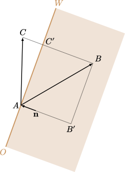

.. _entities:

Entities
========

.. TODO: entities get removed if moving too fast

For a more in-depth descriptions of specific entities, refer to

Basic properties
----------------

Camera
------

Not all entities can see, but for those that do, the eyes are the windows to the soul. In the Half-Life universe, an entity is called the *camera* or the *view*. The camera is located at a fixed position relative to the entity's origin, at least at server side. At client side, the player's camera position is slightly complicated by view bobbing if enabled.

.. TODO: origin, velocity, body target, etc

Movement
--------

.. TODO: how position, velocity is stepped through time

All entities in Half-Life has an associated movement type, or *movetype*. These
are all the possible movetypes in Half-Life:

``MOVETYPE_NONE``
   The entity never moves and not subjected to gravity. Examples of entities
   using this movetype are triggers, RPG laser spots, ``env_explosion``, etc. In
   the engine code, ``SV_Physics_None`` handles the physics of this movetype.
   This function simply calls the ``Think`` function associated with the entity
   and returns.

``MOVETYPE_WALK``
   This movetype is only used by the player and gives rise to the familiar air
   and ground movement physics of the player (see :ref:`player movement`).

``MOVETYPE_STEP``
   This is the primary movetype used by monsters, analogous to ``MOVETYPE_WALK``
   for the player. ``SV_Physics_Step`` handles this movetype, and it computes
   water buoyancy physics, gravity by Euler's method (see :ref:`gravity`),
   friction, position update, and also runs the entity's ``Think`` function.

``MOVETYPE_FLY``
   This movetype is used by entities that do not experience gravity, but has
   collision. For example, the Nihilanth (:ref:`nihilanth`) uses this movetype,
   so does the tripmine (:ref:`tripmine`), crossbow bolt, and many others.
   Notably, this movetype is also used by the player on a ladder (:ref:`ladder
   physics`). The ``SV_Physics_Toss`` is responsible of this movetype. It runs
   the ``Think`` function, perform other checks, and compute position update and
   collisions.

   .. TODO talk about the SV_AngularMove somewhere, also in MOVETYPE_FLY there
      is no friction, but other movetypes within SV_Physics_Toss does have it.

``MOVETYPE_TOSS``
   This movetype is used by gibs, dead monsters, and certain pickup items such
   as the battery and suit. Similar to ``MOVETYPE_FLY``, the ``SV_Physics_Toss``
   function handles this movetype, though with gravity.

``MOVETYPE_PUSH``
   This movetype is used by entities that can push and crush other entities, but
   does not clip to worldspawn. These are buttons, doors, func_breakable
   (:ref:`func_breakable`, but not func_pushable), func_rotating, func_wall,
   func_pendulum, etc. ``SV_Physics_Pusher`` runs the physics for this movetype,
   which calls either ``SV_PushRotate`` or ``SV_PushMove`` at some point, and
   calls the ``Think`` function of the entity.

``MOVETYPE_NOCLIP``
   Entities with this movetype does not experience gravity, and does not clip
   with any other entity. ``SV_Physics_Noclip`` is responsible of the physics,
   which consists of running the ``Think`` function, computing position and
   angle update, and ``SV_LinkEdict``.

``MOVETYPE_FLYMISSILE``
   This movetype is not found to be used by any entity in vanilla Half-Life. The
   ``SV_Physics_Toss`` function is responsible of its physics.

``MOVETYPE_BOUNCE``
   This movetype is used by entities that can bounce off other entities. A
   prominent example is the hand grenade (:ref:`handgrenade`), but satchel
   charges (:ref:`satchel`), MP5 greandes, and others use this movetype as well.
   Similar to ``MOVETYPE_TOSS``, ``SV_Physics_Toss`` is called for this
   movetype, but with the bounce coefficient (see :ref:`collision`) computed by
   :math:`b = 2 - k_e`.

``MOVETYPE_BOUNCEMISSILE``
   Just like ``MOVETYPE_FLYMISSILE``, this movetype does not seem to be used by
   any entity in the unmodded Half-Life. ``SV_Physics_Toss`` is also called for
   this movetype, and the bounce coefficient (see :ref:`collision`) is set to be
   :math:`b = 2`, independent of entity gravity.

``MOVETYPE_FOLLOW``
   Entities of this movetype tracks the movement of the entity given by
   ``pev->aiment``. For example, the ``CBasePlayerItem`` class, subclassed by
   all player weapons, follows the player and is set to this movetype. Entities
   of this movetype does not experience gravity or collision.
   ``SV_Physics_Follow`` runs its physics code, and consists of calling
   ``Think`` and copying the ``aiment`` origin and angles, along with
   ``SV_LinkEdict``.

``MOVETYPE_PUSHSTEP``
   This entity seems to only be used by func_pushable. The physics of this
   movetype is very similar to that of ``MOVETYPE_PUSH``, except that
   ``MOVETYPE_PUSHSTEP`` uses a slightly different way to collide with other
   entities.

   TODO

``MOVETYPE_COMPOUND``
   This movetype does not seem to be used.

.. _gravity:

Gravity
-------

.. TODO: player gravity is computed differently, with leapfrog integration

.. _friction:

Friction
--------

Hitboxes
--------

.. TODO: hitboxes briefly but refer reader to damage chapter

.. _collision:

Collision
---------

Many entities in Half-Life collide with one another.  The velocity of the
colliding entity usually changes as a result, while the position and velocity
of the entity receiving the collision usually stay constant, countering real
world Newtonian physics.  The process of changing the velocity is usually
referred to as *velocity clipping*.  Collision is one of the most common events
in Half-Life, so it is worthwhile to study its physics.

Collision is detected by determining the planes that run into the way of a line
traced from the moving entity's position to the future position.  The future
position depends on the frame rate, the velocity and the base velocity
associated with the colliding entity.  Let :math:`\mathbf{\hat{n}}` be the
plane normal and let :math:`\mathbf{v}` be the velocity at the instant of
collision.  Let :math:`b` be the *bounce coefficient* which, under certain
conditions, depends on ``sv_bounce`` (denoted as :math:`B`) and :math:`k_e`
(see :ref:`friction`).  The bounce coefficient controls how the velocity is
reflected akin to a light ray.  If :math:`\mathbf{v}'` is the velocity
resulting from the collision, then the *general collision equation* (GCE) can
be written as

.. math:: \mathbf{v}' = \mathbf{v} - b (\mathbf{v} \cdot \mathbf{\hat{n}})
          \mathbf{\hat{n}}

Before we proceed, we must point out that this equation may be applied multiple
times per frame.  The functions responsible of actually displacing entities are
``SV_FlyMove`` for non-players and ``PM_FlyMove`` for players.  These functions
perform at most four aforementioned line tracing, each time potentially calling
the velocity clipping function.

   Depiction of a general case of collision, where the player collides with plane :math:`\mathit{OW}` at :math:`A`.

Collision in the general case is depicted in :numref:`collision overbounce`. The point at which collision occurs is :math:`A`, and let the arrow :math:`\mathit{AB}` the velocity vector :math:`\mathbf{v}`. Then, the length of :math:`\mathit{AB'}` represents the dot product :math:`\mathbf{v} \cdot \mathbf{\hat{n}}`, and :math:`B'` is a projection of :math:`B` onto the line :math:`\mathit{AB'}`, which is parallel to the plane normal. In general, this dot product is scaled by :math:`b`, causing the final velocity vector to point out of the plane, shown by :math:`\mathit{AC}`. If :math:`b = 1` instead, then :math:`\mathit{AC'}` would be the final vector.

In most cases, players have :math:`b = 1` because :math:`k_e = 1` and so is
:math:`B`.  In general, :math:`b` for players is computed by :math:`b = 1 + B
(1 - k_e)`.  The case of :math:`b \ne 1` is more common for other entities.
For example, snarks have :math:`b = 3/2` and :math:`k_e = 1/2`.  In general, if
the movement type of an entity is designated as ``MOVETYPE_BOUNCE``, then
:math:`b = 2 - k_e`.

Care must be taken when :math:`b < 1`.  To understand why, we first observe
that :math:`\mathbf{v} \cdot \mathbf{\hat{n}} < 0`, because otherwise there
would not be any collision events.  With

.. math:: \mathbf{v}' \cdot \mathbf{\hat{n}} = (1 - b) \mathbf{v} \cdot
          \mathbf{\hat{n}}

we see that if :math:`b < 1` then the angle between the resultant velocity and
the plane normal is obtuse.  As a result, collisions will occur indefinitely
with an increasing :math:`\mathbf{v}`.  To prevent this, the game utilises a
safeguard immediately after the line tracing process in the respective
``FlyMove`` functions to set :math:`\mathbf{v}' = \mathbf{0}`.

Hence, assuming :math:`b \ge 1` we employ the following trick to quickly find
:math:`\lVert\mathbf{v}'\rVert`: write :math:`\lVert\mathbf{v}'\rVert^2 =
\mathbf{v}' \cdot \mathbf{v}'` and expanding each :math:`\mathbf{v}'` in the
RHS to give

.. math:: \lVert\mathbf{v}'\rVert = \lVert\mathbf{v}\rVert \sqrt{1 - b(2 - b)
          \cos^2 \alpha}

where :math:`\alpha` is the *smallest* angle between :math:`\mathbf{v}` and
:math:`\mathbf{\hat{n}}` confined to :math:`[-\pi/2, \pi/2]`.  Observe that the
resulting speed is strictly increasing with respect to :math:`b` in :math:`[1,
\infty)`.  In fact, the curve of resultant speed against :math:`b` is
hyperbolic provided :math:`\alpha \ne 0` and :math:`\alpha \ne \pm\pi/2`.  When
:math:`\alpha` does equal zero, the resultant speed will be linear in :math:`b`
like so:

.. math:: \lVert\mathbf{v}'\rVert = \lVert\mathbf{v}\rVert (b - 1)

Again, this result assumes :math:`b \ge 1`.  On the other hand, for the very
common case of :math:`b = 1` we have

.. math:: \lVert\mathbf{v}'\rVert = \lVert\mathbf{v}\rVert \,
          \lvert\sin\alpha\rvert

Observe that the resultant velocity is always parallel to the plane, as one can
verify that :math:`\mathbf{v}' \cdot \mathbf{\hat{n}} = 0` is indeed true.

Speed preserving circular walls
~~~~~~~~~~~~~~~~~~~~~~~~~~~~~~~

In Half-Life, we can sometimes find concave walls made out of multiple planes
that approximate a circular arc. Examples can be found in some Office Complex
maps such as the wall shown in :numref:`arc wall c1a2`. Circular walls can be a
blessing for speedrunners because they allow making sharp turns without losing
too much speed. In fact, if the number of planes increases, the approximation
will improve, and so the speed will be better preserved.

   An example of a "speed preserving" wall in the Office Complex map of
   ``c1a2``, which is made up of multiple planes to approximate an arc.

Let :math:`n` be the number of walls and let :math:`\beta` be the angle
subtended by the arc joining the midpoints of every wall. For example, with
:math:`\beta = \pi/2` the first and the last walls will be perpendicular, and
with :math:`\beta = \pi` they will be opposite and parallel instead. Let
:math:`\mathbf{v}_i` be the velocity immediately after colliding with the
:math:`i`-th wall, and assuming :math:`\mathbf{v}_0` is parallel to and
coincident with the first wall. Assume also that :math:`0 \le \beta / (n-1) \le
\pi/2`, which means that the angle between adjacent planes cannot be acute. If
the velocity does not change due to other external factors throughout the
collisions, then

.. math:: \lVert\mathbf{v}_{i+1}\rVert = \lVert\mathbf{v}_i\rVert \cos \left(
          \frac{\beta}{n - 1} \right)

The general equation at frame :math:`n` is simply

.. math:: \lVert\mathbf{v}_n\rVert = \lVert\mathbf{v}_0\rVert \cos^{n-1} \left(
          \frac{\beta}{n-1} \right)

It can be verified that

.. math:: \lim_{n \to \infty} \lVert\mathbf{v}_n\rVert = \lVert\mathbf{v}_0\rVert

This demonstrates the speed preserving property of circular walls. Observe also
that the final speed is completely independent of the radius of the arc.
Perfectly circular walls are impossible in Half-Life due to the inherent
limitations in the map format, so some amount of speed loss is unavoidable.
Nevertheless, even with :math:`n = 3` and :math:`\beta = \pi/2` we can still
preserve half of the original speed.

This is somewhat analogous to uniform circular motion in the real world. In the
real world, an object rotating around a point in a circular path experiences
centripetal acceleration :math:`a_c = \omega^2 r` with constant angular speed
:math:`\omega`. The velocity of the rotating body changes its *direction*
continuously to keep up with the circular arc, but crucially, the *magnitude* or
*speed* remains constant throughout. In theory, there is no restriction on how
small the radius of curvature :math:`r` can be.
