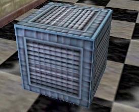

Func entities
=============

We will refer to entities with class name prefixed by ``func_`` as *func entities*. There are a few func entities in Half-Life that are of interest to speedrunners. A complete description of all entities in Half-Life is beyond the scope of this documentation. The reader is invited to study the Half-Life SDK code and reverse engineer for further investigations.

func_pushable
-------------

   A movable box (func_pushable).

func_pushable is a rather common entity type in Half-Life. They are characterised by their ability to be moved by the player. Every time a pushable entity, it means the potential to go extraordinarily fast (see :ref:`object manoeuvre`). It is perhaps for this reason that later Half-Life mappers and modders tend to avoid pushable entities as much as possible, seeing the exploitations speedrunners have done with these innocuous objects. Indeed, in modern Half-Life maps, movable objects tend to be much harder to come by than the vanilla Half-Life maps.

.. _object manoeuvre:

Object manoeuvre
~~~~~~~~~~~~~~~~

Object manoeuvring is the act of boosting around by means of ``+use`` on a movable entity. Before describing the specific tricks to perform object manoeuvring, we must first write down the general equation for the player and object velocities during a ``+use`` operation on a movable entity.

.. TODO: reference the vel clip function

Recall that :math:`\mathfrak{C}(\mathbf{x})` is the velocity clip function that limits each component of some vector :math:`\mathbf{x}` to the value of ``sv_maxvelocity``. Define :math:`\mathbf{u}` the movable entity's velocity in the horizontal plane that is used to update the entity position. Namely, if :math:`\mathbf{q}` is the movable entity's position, then in the next frame :math:`\mathbf{q} \gets \mathbf{q} + \tau\mathbf{u}`. Define :math:`\mathbf{v}` the player velocity in the horizontal plane that is used to update the player horizontal position.

When ``+use`` is held, the *initial* velocities may be denoted as :math:`\mathbf{u}_0` and :math:`\mathbf{v}_0`. At any frame :math:`j > 0`, :math:`\mathbf{u}_j` and :math:`\mathbf{v}_j` are defined to be the *final* velocities in the frame used for position update. For example, :math:`\mathbf{u}_1` is the final velocity in the *first* frame at which ``+use`` is issued. Then for all :math:`j \ge 0`, we have

.. math:: \boxed{\mathbf{u}_{j + 1} = \lambda_\mathrm{obj} \mathfrak{C}(\mathbf{u}_j + f \mathbf{v}_{j + 1})}
   :label: obbo object vel

On the other hand, the player velocity is computed as

.. math:: \boxed{\mathbf{v}_{j + 1} =
          \begin{cases}
          \mathfrak{C}(0.3 \lambda \mathfrak{C}(\mathbf{v}_0) + \Delta\mathbf{v}_\mathrm{PM}) & j = 0 \\
          \mathfrak{C}(0.3 \lambda \mathfrak{C}(\mathbf{u}_{j - 1} + f \mathbf{v}_j) + \Delta\mathbf{v}_\mathrm{PM}) & j > 0
          \end{cases}}
   :label: obbo player vel

Note that these equations are as general as they reasonably can, but they did not account for other phenomena that can affect the velocities, such as collision events. :math:`f` is a scale factor that depends on a few circumstances. If the player is standing on the ground and not in water, then :math:`f = 1`.

Suppose ``-use`` is issued in the current frame :math:`n`. Then the *final* velocity in the current frame is

.. math:: \boxed{\mathbf{v} = \mathfrak{C}(\lambda \mathfrak{C}(\mathbf{u}_{n - 1} + f \mathbf{v}_n) + \Delta\mathbf{v}_\mathrm{PM})}

Observe that if we ignore :math:`\Delta\mathbf{v}_\mathrm{PM}`, and assume :math:`\lambda_\mathrm{obj} = \lambda` (which is true the vast majority of the time), then :math:`\mathbf{v} = \mathbf{u}_{n - 1}`, and the factor of :math:`0.3` is gone from the usual case. In other words, by releasing the use key, the player velocity is "recovered" to equal the object velocity.

To observe the behaviour of :math:`\mathbf{u}_j`, we first ignore the velocity clip :math:`\mathfrak{C}` for a moment, and assume :math:`f = 1`, :math:`j \ge 1` and :math:`\lambda_\mathrm{obj} = \lambda = 1 - \tau k`. Then the equations may be written as

.. math::
   \begin{align*}
   \mathbf{u}_{j + 1} &= 1.3 (1 - \tau k) \mathbf{u}_j \\
   \mathbf{v}_{j + 1} &= 0.3 \mathbf{u}_j
   \end{align*}

Here we immediately see that the growth of the object speed :math:`\lVert\mathbf{u}\rVert` is exponential, and so is the growth of the player speed, albeit at a slower rate and much lower speed than the corresponding object speed. This is why when one holds ``+use`` on an object for too long, the object will quickly move past the player until it is out of the use radius, due to it very high speed relative to the player.

func_breakable
--------------

Item duplication
~~~~~~~~~~~~~~~~

Box item duplication is a trick useful for duplicating items dropped by crates.
To perform this trick, we simply fire a shotgun simultaneously at two adjacent
crates, one of which is explosive and the other will spawn the desired item
upon destruction.  Consequently, the desired item will be duplicated.  It seems
straightforward to understand how this trick works: the crate in question
breaks twice due to damages inflicted simultanously by the explosive crate and
the shotgun pellets.  Such explanation implies that any type of simultaneous
damages inflicted in the same frame can trigger the glitch.  Unfortunately,
this is false.  For instance, if we shoot the crate while a hand grenade
explodes in the same frame, the box items will not be duplicated.

.. TODO: rephrase

We can now make use of the knowledge we learnt above to understand how the
trick works.  Suppose we have two crates, one explosive and the other carrying
the desired item.  To perform the trick we fire the shotgun so that both crates
are simultaneously broken.  First of all, ``FireBulletsPlayer`` will be called.
The ``ClearMultiDamage`` at the beginning of the function ensures that any
leftover multidamage will not interfere with our current situation.  Suppose
the first few pellets strike the explosive crate.  For each of these pellets,
``TraceAttack`` is being called on the explosive crate.  This in turns call
``AddMultiDamage`` which accumulates the damage dealt to the explosive crate.
Suppose now the loop comes to a pellet that is set to deal damage on the
desired crate.  As a result, ``TraceAttack`` and so ``AddMultiDamage`` is
called on the desired crate, which is a *different entity* than the explosive
crate.  Since the desired crate is not the same as ``gMultiDamage->pEntity``,
``AddMultiDamage`` will call ``ApplyMultiDamage`` to inflict the accumulated
damage against the explosive crate.  This is the moment where the explosive
crate explodes.

The explosive crate calls ``RadiusDamage`` which in turn inflicts damage onto
the desired crate.  When this happens, the ``TakeDamage`` associated with the
desired crate will be called, which causes the associated item to spawn.  The
desired crate now turns into ``SOLID_NOT``.  Once ``RadiusDamage`` returns, we
go back to the last ``AddMultiDamage`` call mentioned in the previous
paragraph.  Here, ``gMultiDamage->pEntity`` will be made to point to the
desired crate, and the damage for the current pellet will be assigned to
``gMultiDamage->amount``.

Remember the ``FireBulletsPlayer`` at the beginning of this series of events?
The loop in this function will continue to iterate.  However, since the desired
crate is of ``SOLID_NOT`` type, the tracing functions will completely miss the
crate.  In other words, the rest of the shotgun pellets will not hit the
desired crate, and that in total only one pellet hits the crate.  When the loop
finally completes, the final ``ApplyMultiDamage`` then inflicts the damage
dealt by the one pellet onto the desired crate.  Since ``ApplyMultiDamage``
does not rely on tracing functions to determine the target entity, but rather,
it uses ``gMultiDamage->pEntity`` set a moment ago, the damage will be
successfully inflicted which triggers the second ``TakeDamage`` call for the
desired crate.  This will again causes it to spawn the associated item.

One assumption we made in the description above is that the loop in
``FireBulletsPlayer`` breaks the explosion crate first.  If this is not the
case, then the item will not be duplicated.  To see this, notice that the
desired crate becomes ``SOLID_NOT`` as soon as the first set of pellets breaks
it, which causes the later explosion to miss the crate.

So why does shooting the target crate when a grenade explodes not work?  To see
this, suppose the grenade explodes first.  The grenade will call
``RadiusDamage`` to inflict blast damage onto the target crate.  After that,
the crate becomes ``SOLID_NOT``.  The bullets will therefore miss the crate.
On the other hand, suppose the bullets hit the crate first.  The crate will
then break and becomes ``SOLID_NOT`` again.  When the grenade later calls
``RadiusDamage``, the tracing functions within ``RadiusDamage`` will again miss
the crate.

To put it simply, this trick does not work in cases like this because usually
there is no way for the second damage to find the crate, since they depend on
tracing functions and they do not save the pointer to the desired crate
*before* the crate becomes ``SOLID_NOT``.

func_rotating
-------------

