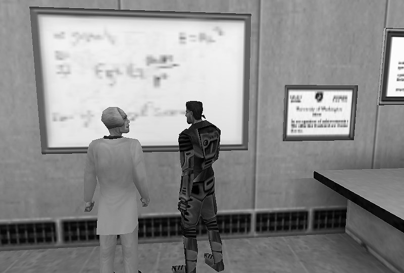

Half-Life Physics Reference
===========================

.. caution::
   This documentation is work in progress!

This is an unofficial documentation for the physics governing the Half-Life_ universe. There have been many very comprehensive wikis for games in the Half-Life series, such as the `Half-Life Wikia`_ and the `Combine OverWiki`_. These wikis focus on the storyline and casual gaming aspects of the Half-Life series video games. There is also a wiki for the practical speedrunning aspects of these games, namely the `SourceRuns Wiki`_. Even years after Half-Life's release, one can still find casual gaming or speedrunning communities centred around the game.

.. _Half-Life: https://en.wikipedia.org/wiki/Half-Life_(video_game)
.. _Half-Life Wikia: http://half-life.wikia.com/wiki/Main_Page
.. _Combine OverWiki: http://combineoverwiki.net/wiki/Main_Page
.. _SourceRuns Wiki: http://wiki.sourceruns.org/wiki/Main_Page

Despite the wealth of strategy guides for Half-Life, it is next to impossible to find documentations describing the physics of the game with a satisfying level of technical accuracy. One can only speculate about the reasons for such scarcity. Knowledge about the physics of Half-Life is important for developing tools for Half-Life TAS production and for the process of TASing itself. Highly precise tools are required to exploit the in-game physics to the fullest extent. Perhaps more importantly, developing an understanding and intuition for Half-Life physics is vital in producing a highly optimised TAS for the game.

Thus, this documentation strives to detail all aspects of the physics in a way that would help any curious minds to gain a much deeper appreciation for Half-Life and its speedruns. The potential tool developers will also find this documentation a helpful guide. This documentation aims to serve as a definitive reference material for Half-Life physics.

.. _notations:

Notations Used
--------------

One of the most important mathematical objects in discussions of Half-Life physics is the Euclidean vector. All vectors are in either :math:`\mathbb{R}^2` or :math:`\mathbb{R}^3`, where :math:`\mathbb{R}` denotes the real numbers. This is sometimes not specified explicitly if the contextual clues are sufficient for disambiguation.

All vectors are written in boldface like so:

.. math:: \mathbf{v}

Every vector has an associated length, which is referred to as the *norm*. The norm of some vector :math:`\mathbf{v}` is thus denoted as

.. math:: \lVert\mathbf{v}\rVert

A vector of length one is called a *unit vector*. So the unit vector in the direction of some vector :math:`\mathbf{v}` is written with a hat:

.. math:: \mathbf{\hat{v}} = \frac{\mathbf{v}}{\lVert\mathbf{v}\rVert}

There are three special unit vectors, namely

.. math:: \mathbf{\hat{i}} \quad \mathbf{\hat{j}} \quad \mathbf{\hat{k}}

These vectors point towards the positive :math:`x`, :math:`y` and :math:`z` axes respectively.

Every vector also has components in each axis. For a vector in :math:`\mathbb{R}^2`, it has an :math:`x` component and a :math:`y` component. A vector in :math:`\mathbb{R}^3` has an additional :math:`z` component. To write out the components of a vector explicitly, we have

.. math:: \mathbf{v} = \langle v_x, v_y, v_z\rangle

This is equivalent to writing :math:`\mathbf{v} = v_x \mathbf{\hat{i}} + v_y \mathbf{\hat{j}} + v_z \mathbf{\hat{k}}`. However, we never write out the components this way in this documentation as it is tedious. Notice that we are writing vectors as row vectors. This will be important to keep in mind when we apply matrix transformations to vectors.

The dot product between two vectors :math:`\mathbf{a}` and :math:`\mathbf{b}` is written as

.. math:: \mathbf{a} \cdot \mathbf{b}

On the other hand, the cross product between :math:`\mathbf{a}` and :math:`\mathbf{b}` is

.. math:: \mathbf{a} \times \mathbf{b}

Contact
-------

This documentation is currently a one-man project. `Contact me`_.

.. _Contact me: me@jwchong.com

Contents
--------

.. toctree::
   :numbered:
   :maxdepth: 2

   game
   entity
   player
   movement
   duckjump
   strafing
   gravitymotion
   surfing
   damage
   explosions
   ladder
   weapons
   monsters
   triggers
   funcs
   snippets
   casestudies
   practical
   glossary
