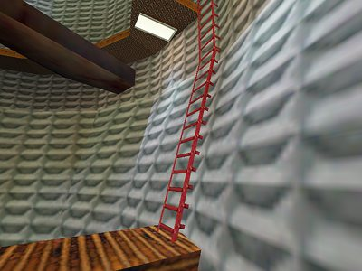
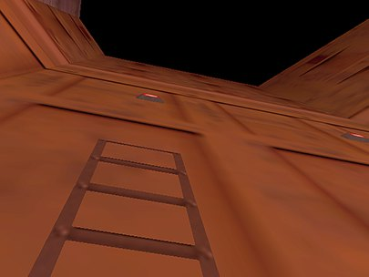

.. _ladder physics:

Ladders
-------

Ladders are ubiquitous in Half-Life maps, most of which are perfectly vertical.
The climbing speed along a ladder can be increased beyond what the developers
intended, and the method is so straightforward that even a beginner speedrunner
could pull it off. A sloped ladder is much rarer, and the viewangles to optimise
the climbing speed is less obvious. In this chapter, we derive these viewangles
for the general case of a sloped ladder.

   A sloped ladder section in the Blast Pit map of ``c1a4e``, connected to a
   perfectly vertical section above. What would the optimal climbing viewangles
   be for this ladder?

.. _ladder preliminaries:

Preliminaries
~~~~~~~~~~~~~

Whether a player is on a ladder or not is checked by the ``PM_Ladder`` function
near the beginning of ``PM_PlayerMove``. If the player is on a ladder, the
``PM_LadderMove`` function will be called soon after, which handles the physics
of moving on a ladder and set the ``movetype`` to ``MOVETYPE_FLY``. This means
that the gravity, friction, and other player movement physics described in
:ref:`player movement` are completely skipped. Nevertheless, the basevelocity
(see :ref:`basevelocity`) and collision (see :ref:`collision`) still apply and
``PM_FlyMove`` is called to update the player position. The fact that no gravity
is exerted under ``MOVETYPE_FLY`` is significant, as will be explained in
:ref:`ladder exit`.

We first introduce :math:`\mathcal{F}` and :math:`\mathcal{S}`, which are
analogues of :math:`F` and :math:`S` from the standard movement physics. Issuing
``+forward`` adds 200 to :math:`\mathcal{F}`, and issuing ``+back`` subtracts
200 from it. Thus, when both ``+forward`` and ``+back`` are issued we have
:math:`\mathcal{F} = 0`. Similarly, executing ``+moveright`` adds 200 to
:math:`\mathcal{S}` and ``+moveleft`` subtracts 200 from it. Note that the value
of 200 cannot be modified without recompilation. For ladder physics, it does not
matter what :math:`F` and :math:`S` are. If the duckstate is 2, then
:math:`\mathcal{F} \mapsto 0.333\mathcal{F}` and :math:`\mathcal{S} \mapsto
0.333\mathcal{S}` in newer Half-Life versions. This is not true for earlier
versions such as the one bundled in NGHL. Regardless of viewangles, jumping off
ladder always sets

.. math:: \mathbf{v}' = 270\mathbf{\hat{n}}

where :math:`\mathbf{\hat{n}}` is the unit normal vector of the ladder's
climbable plane.

If :math:`\mathbf{u} = \mathcal{F} \mathbf{\hat{f}} + \mathcal{S}
\mathbf{\hat{s}}` and :math:`\mathbf{\hat{n}} \ne \langle 0,0,\pm 1\rangle` then

.. math::
   \mathbf{v}' = \mathbf{u} - (\mathbf{u} \cdot \mathbf{\hat{n}}) \left(
   \mathbf{\hat{n}} + \mathbf{\hat{n}} \times \frac{\langle 0,0,1\rangle \times
   \mathbf{\hat{n}}}{\lVert \langle 0,0,1\rangle \times \mathbf{\hat{n}}\rVert}
   \right)

This equation may be called the *fundamental ladder equation* and forms the
basis of any analysis of movement on the ladder.

Optimal angle between :math:`\mathbf{u}` and :math:`\mathbf{\hat{n}}`
~~~~~~~~~~~~~~~~~~~~~~~~~~~~~~~~~~~~~~~~~~~~~~~~~~~~~~~~~~~~~~~~~~~~~

To optimise the vertical climbing speed, we assume :math:`\mathbf{\hat{n}} =
\langle n_x, 0, n_z\rangle`. We further assume that :math:`u_y = 0`. Now we
have

.. math:: \mathbf{v}' = \mathbf{u} - \lVert\mathbf{u}\rVert \cos\alpha ( \langle n_x,0,n_z \rangle + \langle -n_z,0,n_x\rangle )

where :math:`\alpha` is the angle between :math:`\mathbf{u}` and
:math:`\mathbf{\hat{n}}`. :math:`\langle -n_z,0,n_x\rangle` is actually
:math:`\mathbf{\hat{n}}` rotated by :math:`\pi/2` anticlockwise when viewing
into the positive direction of :math:`y`-axis. Expanding
:math:`\lVert\mathbf{v}'\rVert = \sqrt{\mathbf{v}' \cdot \mathbf{v}'}`,

.. math:: \begin{aligned}
          \lVert\mathbf{v}'\rVert &= \lVert\mathbf{u}\rVert \sqrt{1 - 2\sqrt{2} \cos\alpha \cos(\alpha - \pi/4) + 2 \cos^2\alpha} \\
          &= \sqrt{\mathcal{F}^2 + \mathcal{S}^2} \sqrt{1 - 2\sqrt{2} \cos^2\alpha \cos(\pi/4) -
          2\sqrt{2} \cos\alpha \sin\alpha \sin(\pi/4) + 2\cos^2\alpha} \\
          &= \sqrt{\mathcal{F}^2 + \mathcal{S}^2} \sqrt{1 - \sin(2\alpha)}
          \end{aligned}

We conclude that :math:`\alpha = 3\pi/4` maximises
:math:`\lVert\mathbf{v}'\rVert`. If :math:`\lvert\mathcal{F}\rvert =
\lvert\mathcal{S}\rvert = 200`, we have :math:`\lVert\mathbf{v}'\rVert = 400`.

Knowing the optimal angle :math:`\alpha` is useful for theoretical
understanding, but in practice we must be able to calculate the player's yaw
and pitch angles that maximises vertical climbing speed. For ladders that are
perfectly vertical the optimal viewangles are trivial to find, but we need
explicit formulae for slanted ladders.

Formulae for optimal yaw and pitch
~~~~~~~~~~~~~~~~~~~~~~~~~~~~~~~~~~

Let :math:`\mathbf{\hat{n}} = \langle n_x, n_y, n_z\rangle` with the constraint
:math:`n_x^2 + n_y^2 + n_z^2 = 1`, so that

.. math:: \mathbf{\hat{n}} + \mathbf{\hat{n}} \times
          \frac{\langle 0,0,1\rangle \times \mathbf{\hat{n}}}
          {\lVert\langle 0,0,1\rangle \times \mathbf{\hat{n}}\rVert} =
          \langle N_x, N_y, N_z\rangle

We are concerned with the vertical velocity, :math:`v'_z`. Written in full and
simplifying,

.. math:: v'_z = -\mathcal{F} \sin\varphi (1 - N_z n_z) - N_z \left(
          \mathcal{F} \cos\varphi \cos(\vartheta - \theta) + \mathcal{S}
          \sin(\vartheta - \theta) \right) \sqrt{n_x^2 + n_y^2}
   :label: laddervz

where :math:`\theta = \operatorname{atan2}(n_y,n_x)`. To maximise this quantity,
we compute

.. math:: \frac{\partial v'_z}{\partial\varphi} = -\mathcal{F} \cos\varphi (1 -
          N_z n_z) + \mathcal{F} N_z \sin\varphi \cos(\vartheta - \theta)
          \sqrt{n_x^2 + n_y^2}

.. math:: \frac{\partial v'_z}{\partial\vartheta} = -N_z (
          -\mathcal{F} \cos\varphi \sin(\vartheta - \theta) +
          \mathcal{S} \cos(\vartheta - \theta) ) \sqrt{n_x^2 + n_y^2}

Setting them to zero and simplifying, we obtain the following equations
respectively

.. math:: (1 - N_z n_z) \cos\varphi =
          N_z \sin\varphi \cos(\vartheta - \theta)
          \sqrt{n_x^2 + n_y^2}
   :label: ladder-eq1

.. math:: \mathcal{F} \cos\varphi \sin(\vartheta - \theta) =
          \mathcal{S} \cos(\vartheta - \theta)
   :label: ladder-eq2

To solve these equations, we begin by assuming :math:`\lvert\mathcal{F}\rvert =
\lvert\mathcal{S}\rvert \ne 0` and rewriting equation :eq:`ladder-eq2` as

.. math:: \tan\varphi = \pm\frac{\sqrt{1 - 2\cos^2 (\vartheta - \theta)}}
          {\cos(\vartheta - \theta)}

Eliminating :math:`\varphi` from equation :eq:`ladder-eq1`, we get

.. math:: \frac{1 - N_z n_z}{N_z \sqrt{n_x^2 + n_y^2}} =
          \pm \sqrt{1 - 2\cos^2 (\vartheta - \theta)}

Squaring both sides and simplifying gives

.. math:: \tan^2 (\vartheta - \theta) = \frac{1}{2 n_z \sqrt{n_x^2 + n_y^2}}
   :label: tansqthetas

Immediately we observe that :math:`n_z \ge 0` is required for this equation to
have real solutions. We will deal with this in a later section. At this point we
are required to take square roots. This is a critical step and we must carefully
choose the signs for the numerator and the denominator, as they will determine
the quadrant in which :math:`(\vartheta - \theta)` resides.

We define three *free variables*:

- The sign of :math:`\mathcal{S}`. Positive if rightward and negative if
  leftward.
- The sign of :math:`\mathcal{F}`. Positive if forward and negative if backward.
- The sign of :math:`v'_z`. Positive if upward and negative if downward.

The motivation is that we want to be able to automatically determine the correct
signs for the numerator and the denominator given our choices of the signs of
the free variables. This is useful in practice because we often make conscious
decisions regarding the directions in which we want to strafe when climbing
ladders. For example, we may choose to invoke ``+forward`` and ``+moveleft``, or
``+back`` and ``+moveright``. In both cases the resulting velocity is
identically optimal, and yet the viewangles are different. By declaring the
signs of :math:`\mathcal{S}` and :math:`\mathcal{F}` as free variables, we can
choose the strafing directions mathematically by simply setting the correct
signs.

Optimal ladder climbing can go in two possible directions, that is upward or
downward. Again, the maximum climbing speed does not depend on the direction,
though the viewangles do. Hence we declare the sign of :math:`v'_z` as a free
variable.

We will now attempt to formulate the final viewangles in terms of these free
variables. To begin, we examine Equation :eq:`laddervz` more closely. We make
three observations:

#. We have :math:`1 - N_z n_z \ge 0` when :math:`0 \le n_z \le 1/\sqrt{2}` and
   :math:`1 - N_z n_z < 0` when :math:`1/\sqrt{2} < n_z \le 1`.

#. We have :math:`N_z > 0`.

#. We have :math:`\cos\varphi \ge 0` for :math:`-\pi/2 \le \varphi \le \pi/2`.

We start by considering the sign of :math:`v'_z`. Obviously, the right hand side
of Equation :eq:`laddervz` must have the same sign as the :math:`v'_z`. But
observe that there are two terms in the right hand side. Therefore, both terms
should also be as large as possible in the direction indicated by the sign of
:math:`v'_z`. For example, if we choose :math:`v'_z < 0`, then the terms on the
right hand side should be as negative as possible, and vice versa.

We will deal with the angle :math:`(\vartheta - \theta)` first, which appears
only in the second term, so we will assume that the first term has been dealt
with (that is, conforming to the sign of :math:`v'_z` while being as large as
possible in magnitude). Now, we want

.. math:: \operatorname{sgn}(v'_z) = \operatorname{sgn}\left( -N_z (\mathcal{F} \cos\varphi \cos(\vartheta - \theta) + \mathcal{S} \sin(\vartheta - \theta)) \sqrt{n_x^2 + n_y^2} \right)

By one of the observations we made, we have :math:`N_z > 0` and
:math:`\cos\varphi \ge 0`. Also, :math:`\sqrt{n_x^2 + n_y^2}` is always
positive. Hence, equivalently we need

.. math:: \operatorname{sgn}(v'_z) = -\operatorname{sgn}( \mathcal{F} \cos(\vartheta - \theta) + \mathcal{S} \sin(\vartheta - \theta) )

And further,

.. math::
   \begin{aligned}
   \operatorname{sgn}(v'_z) &= -\operatorname{sgn}(\mathcal{F} \cos(\vartheta - \theta)) \\
   \operatorname{sgn}(v'_z) &= -\operatorname{sgn}(\mathcal{S} \sin(\vartheta - \theta))
   \end{aligned}

And thus,

.. math::
   \begin{aligned}
   \operatorname{sgn}(\sin(\vartheta - \theta)) &= -\operatorname{sgn}(\mathcal{F} v'_z) \\
   \operatorname{sgn}(\cos(\vartheta - \theta)) &= -\operatorname{sgn}(\mathcal{S} v'_z)
   \end{aligned}

Observe that the required signs of :math:`\sin(\vartheta - \theta)` and
:math:`\cos(\vartheta - \theta)` depends on the chosen signs of
:math:`\mathcal{F}` and :math:`\mathcal{S}` respectively, in addition to the
sign of :math:`v'_z`. If we look at Equation :eq:`tansqthetas` again, notice
that the signs of :math:`\sin(\vartheta - \theta)` and :math:`\cos(\vartheta -
\theta)` determine the signs of the numerator and denominator respectively after
removing the squares, because :math:`\tan(x) = \sin(x) / \cos(x)` for all
:math:`x`.

Deriving from Equation :eq:`tansqthetas`, the formula for the optimal yaw is
thus, in all its glory,

.. math:: \vartheta = \operatorname{atan2}(n_y, n_x) +
          \operatorname{atan2}\left( -\operatorname{sgn}(\mathcal{S} v'_z),\;
          -\operatorname{sgn}(\mathcal{F} v'_z) \sqrt{2 n_z \sqrt{n_x^2 +
          n_y^2}} \right)
   :label: ladder-vartheta

We can adopt the same line of attack for the final formula for :math:`\varphi`.
Combining Equation :eq:`ladder-eq2` and Equation :eq:`tansqthetas` gives

.. math:: \cos\varphi = \cot(\vartheta - \theta) = \sqrt{2 n_z \sqrt{n_x^2 + n_y^2}}

Note that the positive square root is taken for the cotangent term because we
want :math:`-\pi/2 \le \varphi \le \pi/2`. This is followed by a simple rewrite:

.. math:: \varphi = \pm \arccos \sqrt{2 n_z \sqrt{n_x^2 + n_y^2}}

Here, we only need to determine the sign of the right hand side as a whole,
rather than considering the numerator and the denominator separately. The sign
of :math:`\varphi` will indicate whether the player should look upward or
downward when climbing. Going back to Equation :eq:`laddervz` again, we assume
the second term has been dealt with, in the same way we assumed the first term
to have been dealt with when deducing the signs for the optimal yaw. Now we must
have

.. math:: \operatorname{sgn}(v'_z) = \operatorname{sgn}(-\mathcal{F} \sin\varphi (1 - N_z n_z))

Since the sign of :math:`\sin\varphi` is completely determined by the sign of
:math:`\varphi`, the relation is simplified to

.. math:: \operatorname{sgn}(v'_z) = -\operatorname{sgn}(\mathcal{F} \varphi (1 - N_z n_z))

And equivalently,

.. math:: \operatorname{sgn}(\varphi) = -\operatorname{sgn}(\mathcal{F} v'_z (1 - N_z n_z))

Notice that the sign of :math:`(1 - N_z n_z)` plays a role here. In practice,
however, :math:`1 - N_z n_z` is less efficient to compute. Using one of the
observations, we see that :math:`\operatorname{sgn}(1 - N_z n_z) =
\operatorname{sgn}\left( 1/\sqrt{2} - n_z \right)`. So we are done and we can
write out the complete formula for the optimal pitch as follows:

.. math:: \varphi = -\operatorname{sgn}\left( \mathcal{F} v'_z \left(1/\sqrt{2} - n_z\right) \right)
          \arccos\sqrt{2 n_z \sqrt{n_x^2 + n_y^2}}
   :label: ladder-varphi

Optimal yaw and pitch when :math:`n_z < 0`
~~~~~~~~~~~~~~~~~~~~~~~~~~~~~~~~~~~~~~~~~~

When :math:`n_z < 0`, the derivatives will never be zero. However, we can
observe that :math:`\lvert\varphi\rvert` increases when :math:`n_z` decreases.
We also note we constrain the range of :math:`\varphi` to :math:`[-\pi/2,
\pi/2]` while the value of :math:`\vartheta` is unrestricted. Hence we can
substitute the maximum value :math:`\lvert\varphi\rvert = \pi/2` into
:math:`\partial v'_z/\partial\varphi = 0` and solve for :math:`\vartheta`. It is
found to be

.. math:: \vartheta = \theta \pm \frac{\pi}{2}

We need to determine what the sign of :math:`\pi/2` means. Substituting
:math:`\varphi = \pm\pi/2` and :math:`\vartheta - \theta = \pm\pi/2` into the
original vertical velocity equation gives

.. math:: v'_z = -\mathcal{F} \operatorname{sgn}(\varphi) (1 - N_z n_z) - N_z
          \mathcal{S} \operatorname{sgn}(\vartheta - \theta) \sqrt{n_x^2 +
          n_y^2}

Note that :math:`N_z < 0` when :math:`n_z < -1/\sqrt{2}`. Now we can use the
similar technique to deduce the required signs of :math:`\varphi` and
:math:`(\vartheta - \theta)`, which results in

.. math:: \vartheta = \operatorname{atan2}(n_y,n_x) +
          \operatorname{sgn}(\mathcal{S} v_z' (n_z + 1/\sqrt{2})) \frac{\pi}{2}

.. math:: \varphi = -\operatorname{sgn}(\mathcal{F} v'_z) \frac{\pi}{2}

Again, we wrote these formulae so that they give the correct angles given the
freely chosen signs of :math:`\mathcal{S}`, :math:`\mathcal{F}` and
:math:`v'_z`.

Optimal yaw and pitch when :math:`n_z = 1`
~~~~~~~~~~~~~~~~~~~~~~~~~~~~~~~~~~~~~~~~~~

Up to this point we have been assuming the normal vector not being vertical.
If :math:`\mathbf{\hat{n}} = \langle 0,0,\pm 1\rangle`, then the second term in
the bracket vanishes (since ``VectorNormalize`` in ``pm_shared/pm_math.c``
returns a zero vector if the input, which is :math:`\langle 0,0,1\rangle \times
\mathbf{\hat{n}}`, is also a zero vector) instead of being indeterminate,
leaving only

.. math:: \mathbf{v}' = \mathbf{u} - \lVert\mathbf{u}\rVert \cos\alpha \langle 0,0,\pm 1\rangle

thus

.. math:: \lVert\mathbf{v}'\rVert = \sqrt{\mathcal{F}^2 + \mathcal{S}^2} \sqrt{1 - \cos^2 \alpha}

which is maximised when :math:`\alpha = \pi/2`. This can be achieved by setting
:math:`\varphi = 0`. If :math:`\lvert\mathcal{F}\rvert = \lvert\mathcal{S}\rvert
\ne 0` then the yaw should be 45 or 135 degrees away from the intended
direction, depending on the signs.

.. _ladder exit:

Ladder exit
~~~~~~~~~~~

We call "exiting a ladder" to mean moving out of a ladder so that the player is
no longer on the ladder (as determined by ``PM_Ladder``). This is different from
ladder jumping, where the player jumps off a ladder, which has been described in
:ref:`ladder preliminaries`. In some speedrunning context, ladder exit may be
referred to as ladder jumping, though for the purpose of this documentation we
do not adopt this meaning.

   A common and old trick in the ``c1a0e`` test chamber map, where the player
   jumps onto the lamp above by exiting the ladder at full speed at a lower
   frame rate.

:numref:`ladder exit c1a0e` illustrates a common use of ladder exit strategy in
speedrunning. In the test chamber map, it is desirable to avoid getting
teleported to Xen, and one way to avoid this is to jump onto the lamp above to
avoid a big ``trigger_transition`` below. Interestingly, the lamp is unreachable
at higher frame rates, but easily accessible at lower frame rates. This runs
counter to the intuition of jumping in Half-Life where the normal jumping height
is frame rate independent as explained in :ref:`player gravity`.

To understand this trick, first recall that the ``movetype`` is assigned to be
``MOVETYPE_FLY`` while on the ladder, which prevents the gravity to act on the
player. Suppose in a frame, the player starts off on the ladder with vertical
position :math:`z_0` and is moving away to exit the ladder at some vertical
climbing speed :math:`v_0`. The player position will be updated as per usual by
``PM_FlyMove``.

.. math:: v_1 = v_0 \qquad z_1 = z_0 + v_1 \tau = z_0 + v_0 \tau

Suppose the new position :math:`z_1` is no longer on the ladder and is in the
air. Despite this, the new vertical velocity is the same as before and no
gravity will be applied until the next frame!

Now consider the next frame. Since the ``movetype`` is no longer
``MOVETYPE_FLY``, gravity will act on the player like normal. The game thus
computes

.. math:: v_2 = v_1 - g\tau = v_0 - g\tau \qquad
   z_2 = z_1 + v_1 \tau - \frac{1}{2} g\tau^2
   = z_0 + 2 v_0 \tau - \frac{1}{2} g\tau^2

And at frame :math:`n`, it can be shown that

.. math:: v_n = v_0 - g(n - 1)\tau \qquad
   z_n = z_0 + v_0 (n + 1) \tau - \frac{1}{2} g(n\tau)^2

Or writing in terms of time :math:`t`,

.. math:: v_t = v_0 - gt + g\tau \qquad
   z_t = z_0 + v_0 t - \frac{1}{2} gt^2 + v_0\tau

Observe that at any time :math:`t`, the vertical velocity is always higher than
expected by normal jumping physics by a constant :math:`g\tau`. In addition, the
vertical position higher than expected by :math:`v_0\tau`. This is why the
ladder exit strategy in the test chamber works. By lowering the frame rate, the
jump height can be increased. For example, at 1000 fps and :math:`v_0 = 400`,
the extra height is only :math:`400 \cdot 0.001 = 0.4`. At 20 fps, however, the
extra height is :math:`400 \cdot 0.05 = 20`. The extra 20 units can make a
noticeable difference.

In general, if it is desired to attain as much height as possible by exiting a
ladder, possibly with damage boosting immediately afterwards, it is always more
optimal to exit the ladder at a lower frame rate.
