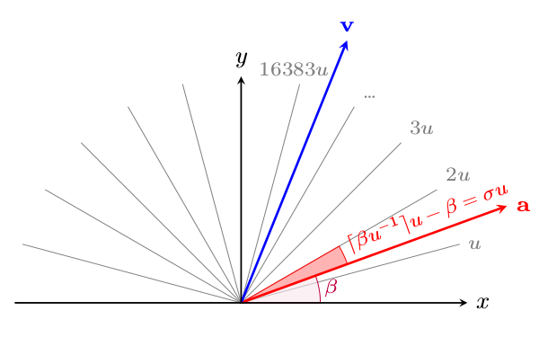

Algorithms
==========

Line strafing
-------------

Line strafing refers to the act of strafing along a fixed line towards a
particular direction.  It is not possible to strafe so that the path is a
straight line, therefore we have to choose the strafing directions (either left
or right) carefully to approximate a straight path and minimise the deviation
from the path.  We will describe the approach used by TasTools mod here.

Recall that every line in :math:`\mathbb{R}^n` can be represented as a
parametric equation :math:`\mathbf{r} = \mathbf{a} + s \mathbf{b}`, such that
the line is the locus of :math:`\mathbf{r}`, :math:`s` is the parameter,
:math:`\mathbf{a}` is a known point on the line and :math:`\mathbf{b}` is a
vector parallel to the line.  In the context of line strafing
:math:`\mathbf{a}` is called the *origin of line strafe* (OLS) and
:math:`\mathbf{b}` is the *direction of line strafe* (DLS).  For simplicity we
often normalise :math:`\mathbf{b}`.  Let :math:`\mathbf{p}` be the player
position, then the distance of the player from the line is given by

.. math:: \left\lVert (\mathbf{a} - \mathbf{p}) - \left[ (\mathbf{a} - \mathbf{p})
          \cdot \mathbf{\hat{b}} \right] \mathbf{\hat{b}} \right\rVert

To line strafe, we would use Equation :eq:`newvelmat` to compute two different
player positions corresponding to left and right strafe.  Then the distances of
these positions from the line is compared, the direction that causes the
smallest deviation from the line is chosen to be the final strafing direction
for this particular frame.

The advantage of this method is that it allows some control over the amplitude
of line strafe.  If the initial player position is relatively far away from the
line, then the amplitude of the subsequent path will be approximately equal to
the initial point-to-line distance.

In practice, the method to compute :math:`\mathbf{\hat{b}}` depends on the
value of :math:`\mathbf{v}`.  If :math:`\mathbf{v} = \mathbf{0}`, then we might
set :math:`\mathbf{\hat{b}} = \langle \cos\vartheta, \sin\vartheta \rangle`,
which means line strafing towards the initial viewing direciton.  Otherwise, we
would set :math:`\mathbf{\hat{b}} = \mathbf{\hat{v}}`.  At times we might want
to override :math:`\mathbf{\hat{b}}` manually.  In TasTools, this can be
accomplished by issuing ``tas_yaw`` while ``+linestrafe`` is active.

Computing strafing inputs
-------------------------

Up to this point we have been analysing strafing in terms of :math:`\theta`,
the angle between velocity and acceleration vectors.  To actually strafe in
practice, we need to adjust the yaw angle and provide the input (such as
``+moveright``) correctly.  In this section we describe a simple algorithm to
produce such input.

We start off by computing the intended :math:`\theta` **in degrees**, which is
the foundation of all.  Now we must set :math:`F` and :math:`S`, which can be
achieved by issuing the correct commands (``+forward``, ``+moveleft``,
``+moveright``, ``+back``).  Assume that :math:`\lvert S\rvert = \lvert
F\rvert` and :math:`\lVert\langle F,S\rangle\rVert \ge M` before
``PM_CheckParamters`` is called.  In principle it does not matter which of the
four commands are issued, but to minimise screen jittering we can adopt the
following guideline:

* If :math:`0 \le \theta < 22.5` then ``+back`` with negative ``cl_backspeed``.
* If :math:`22.5 \le \theta < 67.5` then ``+back`` and ``+move(right|left)``
  with negative ``cl_backspeed``.
* If :math:`67.5 \le \theta` then ``+move(right|left)``.

where 22.5 is midway between 0 and 45, and 67.5 is midway between 45 and 90.
You must be wondering about the ``+back`` and negative ``cl_backspeed`` as
well.  The rationale is this: we want to avoid accidentally pushing movable
entities.  If you look at the ``CPushable::Move`` function in
``dlls/func_break.cpp``, notice that an object can be pushed only if
``+forward`` or ``+use`` is active.

To compute the new yaw angle, in the most general way we compute
:math:`\alpha`, :math:`\beta` and :math:`\phi`, **all in degrees**, where

.. math:: \phi = \arctan\left( \left\lvert \frac{S}{F} \right\rvert \right)
          \quad\quad
          \alpha = \operatorname{atan2}(v_y, v_x)
          \quad\quad
          \beta = \alpha \pm (\phi - \theta)

Notice the :math:`\pm` sign in :math:`\beta`?  It should be replaced by a
:math:`+` if right strafing and :math:`-` if left strafing.  We must add that
if :math:`\mathbf{v} = \mathbf{0}` then we are better off setting :math:`\theta
= 0` and :math:`\alpha = \vartheta`.  In practice, when the speed is zero what
we want is to strafe towards the yaw direction.  In this case it does not make
sense to have :math:`\theta` carrying nonzero values, even though it is
mathematically valid.  The ``atan2`` function is available in most sensible
programming languages.  Do not use the plain arc tangent to compute
:math:`\alpha` or you will land yourself in trouble.  In addition, we often do
not need to compute :math:`\phi` in the manner presented above if :math:`\lvert
S\rvert = \lvert F\rvert`, unless vectorial compensation is employed (will be
discussed later).

Now we can compute the following trial new yaw angles, denoted as
:math:`\tilde{\vartheta}_1` and :math:`\tilde{\vartheta}_2`, such that

.. math:: \tilde{\vartheta}_1 = \operatorname{anglemod}(\beta)
          \quad\quad
          \tilde{\vartheta}_2 = \operatorname{anglemod}(\beta + \operatorname{sgn}(\beta) u)

We see a new function anglemod and a new constant :math:`u = 360/65536`.
Anglemod is a function defined in ``pm_shared/pm_math.c`` to wrap angles to
:math:`[0, 360)` degrees.  Except, it accomplishes this by means of a faster
approximation, instead of a more expensive but correct method which may involve
``fmod``.  The spirit is not dissimilar to the famous `fast inverse square
root`__ approximation.  The angles produced by anglemod is always a multiple of
:math:`u`.  Consequently the strafing may be less accurate, now that the actual
:math:`\theta` will only be an approximation of the intended :math:`\theta`.

__ https://en.wikipedia.org/wiki/Fast_inverse_square_root

The anglemod function truncates the input angle, instead of rounding it.  The
following optimisation can be done to improve the accuracy slightly.  Set
:math:`\theta_1 = \tilde{\vartheta}_1 \mp \phi` and :math:`\theta_2 =
\tilde{\vartheta}_2 \mp \phi` which are the actual :math:`\theta`\ s, then use
these :math:`\theta`\ s and the scalar FME to compute the new speeds.  Now
compare the new speeds to determine the :math:`\tilde{\vartheta}` that gives
the higher speed.  This will be the final yaw angle.

Autoactions
-----------

An autoaction refers to a set of input that are generated automatically when
certain conditions are met.  In TasTools they are (in order of precedence)
``tas_jb``, ``tas_lgagst``, ``tas_db4l``, ``tas_db4c``, ``tas_dtap``,
``tas_dwj`` and ``tas_cjmp``.  The tables below show the conditions and
corresponding actions.  If a condition is not displayed, no-op is assumed.
Key: ``og`` is onground status, ``d`` is user ``+duck`` input, ``j`` is user
``+jump`` input, and ``dst`` is duckstate.  The abbreviation "a.u." stands for
"after unducking", while "a.d." stands for "after ducking".

When we say a command is taken precedence over the other, it means if the
former command performs an action all lower precedence commands will be
inhibited.

Implementing automatic jumpbug can be tricky.  Suppose ``+duck`` is not active,
player is not onground and falling.  We want to make sure the player is not
onground after the final groundcheck, which requires predicting the new
position after ``PM_AddCorrectGravity`` and movement physics.  The following is
the action table for jumpbug implementation.  Jumpbug is usually prioritised
over other autoactions.  If :math:`v_z > 180` then jumpbug is impossible.

1. If dst 2 AND unduckable AND jumpable AND onground with dst 0, stop with
   ``-duck`` and ``+jump``.
2. If new position is unduckable AND new position is onground with dst 0, stop
   with ``+duck`` and ``-jump``.

Automatic ducktap is taken priority over automatic jump unless stated
otherwise.  Recall that ducktapping only works if there exists sufficient space
to accomodate the player bounding box if he is moved vertically up by 18 units,
while the duckstate is not 2.  If the duckstate is 2 then the player must first
unduck for this frame.  Ducktap is relatively complex:

==  ==  ==  ===  ======
og  d   j   dst  action
==  ==  ==  ===  ======
0   0   1   2    ``-jump`` if unduckable AND onground a.u..
1   --  --  0    ``-jump`` and ``+duck`` if sufficient space, automatic jump otherwise.
1   --  --  1    ``-duck`` and decrement if sufficient space., automatic jump otherwise.
1   --  --  2    ``-jump`` and ``-duck`` if unduckable AND sufficient space a.u., automatic jump otherwise.
==  ==  ==  ===  ======

For automatic jumping, the need to handle ``pmove->oldbuttons`` complicates
matters.  At the time of writing, TasTools assumes ``IN_JUMP`` is unset in
``pmove->oldbuttons``.  A rare use case for this would be to temporarily
disable automatic jumping simply by issuing ``+jump``.

==  ==  ==  ===  ======
og  d   j   dst  action
==  ==  ==  ===  ======
0   0   1   0    ``-jump`` if new position is onground with dst 0.
0   1   1   2    ``-jump`` if new position is onground with dst 2.
0   0   --  2    Decrement and ``+jump`` if unduckable AND onground a.u. AND jumpable.  ``-jump`` if new position is unduckable AND new position is onground with dst 0.
0   1   1   0    ``-jump`` if new position a.d. is onground.
1   0   --  1    Decrement and ``+jump`` if jumpable AND insufficient space, ``-jump`` otherwise.
1   1   --  1    Decrement and ``+jump`` if jumpable, ``-jump`` otherwise.
1   --  --  0/2  Decrement and ``+jump`` if jumpable, ``-jump`` otherwise.
==  ==  ==  ===  ======

Next we have DB4L.  As with jumpbug, if :math:`v_z > 180` then this is
impossible.

==  ===  ======
og  dst  action
==  ===  ======
1   2    Decrement and set state to 0 if state is 1
0   0    ``+duck`` and set state to 1 if new position is obstructed by ground.
0   2    ``+duck`` and set state to 1 if unduckable AND (onground a.u. OR new position a.u. is obstructed by onground).  Otherwise, decrement and set state to 0 if state is 1.
==  ===  ======

Then we have DB4C.

==  ==  ===  ======
og  d   dst  action
==  ==  ===  ======
0   0   0    Decrement and ``+duck`` if new position is obstructed OR (new position a.d. is obstructed AND new speed is less than new speed a.d.).
==  ==  ===  ======

We also have DWJ, which is inserting ``+duck`` at the instant the player jumps.
This can be useful for longjump and as a jumping style itself.  To selfgauss
with headshot immediately after jumping usually requires this jumping style to
work.  There is no action table for this -- the counter is decremented and
``+duck`` is inserted whenever the player successfully jumps.

Vectorial compensation
----------------------

Vectorial compensation (VC) is a novel technique developed to push the strafing
accuracy closer to perfection by further compensating the effects of anglemod.
It is called *vectorial* as it manipulates the values for ``cl_forwardspeed``
and ``cl_sidespeed``, thereby changing the direction of
:math:`\mathbf{\hat{a}}` slightly.  This technique is not implemented in
TasTools, however, as its use can significantly reduce the enjoyability of the
resulting TAS due to the screen shaking haphazardly, effectively transforming
the resulting videos into some psychedelic art.  Furthermore, the advantages of
VC over the simple anglemod compensation described previously are largely
negligible.  It is for these reasons that we decided against implementing VC in
TasTools, though the technique will still be described here for academic
interests.

The idea is the following: while the yaw angle in degrees is always a multiple
of :math:`u`, we can adjust the values of ``cl_forwardspeed`` and
``cl_sidespeed`` in combination with ``cl_yawspeed`` so that the polar angle of
:math:`\mathbf{\hat{a}}` can reside between any two multiples of :math:`u`.  As
a result, the actual :math:`\theta` can now be better approximated, hence
higher strafing accuracy.

Have a look at the illustration below.

The :math:`\mathbf{a}` in the figure is the *intended* :math:`\mathbf{a}`.  The
actual :math:`\mathbf{a}` being computed by the game will likely be an
approximation of the intended vector.  Also, the spaces between the lines
corresponding to the multiples of :math:`u` are exaggerated so that they are
easier to see.  The figure above depicts strafing to the right.

The algorithm would begin with the decision to strafe left or right, then
compute :math:`\theta` **in degrees**, along with

.. math:: \alpha = \operatorname{atan2}(v_y, v_x)
          \quad\quad
          \beta = \alpha \mp \theta
          \quad\quad
          \sigma =
          \begin{cases}
          \lceil\beta u^{-1}\rceil u - \beta & \text{if right strafing} \\
          \beta - \lfloor\beta u^{-1}\rfloor u & \text{if left strafing}
          \end{cases}

where the :math:`\mp` in :math:`\beta` should be replaced by :math:`-` if right
strafing and vice versa.  The quantity :math:`\sigma` has the following
meaning: :math:`\lceil \beta u^{-1} \rceil u - \beta` represents the difference
between :math:`\beta` and the smallest multiple of :math:`u` not lower than
:math:`\beta`, while the other represents the difference between :math:`\beta`
and the largest multiple of :math:`u` not greater than :math:`\beta`.  It is
exactly these differences that we are compensating in this algorithm.

Now we must find :math:`\phi = \arctan(S/F)` with :math:`F \ge 0` and :math:`S
\ge 0` so that :math:`\phi - \lfloor\phi u^{-1}\rfloor u` closely approximates
:math:`\sigma`.  A naive, inefficient and hackish way would be: for all
:math:`(F,S)` pairs with :math:`\lVert\langle F,S\rangle\rVert \ge M`, compute
the associated :math:`\phi - \lfloor\phi u^{-1}\rfloor u` and then find the one
which approximates :math:`\sigma` to the desired accuracy.  The problem with
this approach, leaving aside its crudeness, is that there are about 4 million
:math:`(F,S)` pairs that satisfy the above constraint with :math:`M = 320`,
which translates to 4 million arc tangent computations *per frame*.  This takes
about 0.25s on a modern 2.0 GHz Core i7.

TODO

Delicious recipes
-----------------

We will provide some implementations of basic strafing functions in Python.
``import math`` is required.

The following function returns speed after one frame of optimal strafing.

.. code-block:: python

   def fme_spd_opt(spd, L, tauMA):
       tmp = L - tauMA
       if tmp < 0:
           return math.sqrt(spd * spd + L * L)
       if tmp < spd:
           return math.sqrt(spd * spd + tauMA * (L + tmp))
       return spd + tauMA

If computing the velocity vector is required, instead of just the speed, then
one might use the following implementation, where ``d`` is the direction: ``1``
for right and ``-1`` for left.

.. code-block:: python

   def fme_vel_opt(v, d, L, tauMA):
       tmp = L - tauMA
       spd = math.hypot(v[0], v[1])
       ax = 0
       ay = 0
       if tmp < 0:
           ax = L * v[1] * d / spd
           ay = -L * v[0] * d / spd
       elif tmp < spd:
           ct = tmp / spd
           st = d * math.sqrt(1 - ct * ct)
           ax = tauMA * (v[0] * ct + v[1] * st) / spd
           ay = tauMA * (-v[0] * st + v[1] * ct) / spd
       else:
           ax = tauMA * v[0] / spd
           ay = tauMA * v[1] / spd
       v[0] += ax
       v[1] += ay

On the other hand, if we want to compute the velocity as a result of an
arbitrary :math:`\theta` then we would instead use

.. code-block:: python

   def fme_vel_gen(v, theta, L, tauMA):
       spd = math.hypot(v[0], v[1])
       ct = math.cos(theta)
       mu = L - spd * ct
       if mu < 0:
           return
       if tauMA < mu:
           mu = tauMA
       st = math.sin(theta)
       ax = mu * (v[0] * ct + v[1] * st) / spd
       ay = mu * (-v[0] * st + v[1] * ct) / spd
       v[0] += ax
       v[1] += ay

Note that these two implementations will no work if the speed is zero.  This is
a feature and not a bug: when the speed is zero the direction is undefined.  In
other words, the meaning of "rightstrafe" or "leftstrafe" will be lost without
specifying additional information.

For backpedalling, we have

.. code-block:: python

   def fme_spd_back(spd, L, tauMA):
       return abs(spd - min(tauMA, L + spd))

Then we have the following function which applies friction.  This function must
be called before calling the speed functions when groundstrafing.

.. code-block:: python

   def apply_fric(spd, E, ktau):
       if spd > E:
           return spd * (1 - ktau)
       tmp = E * ktau
       if spd > tmp:
           return spd - tmp
       return 0
