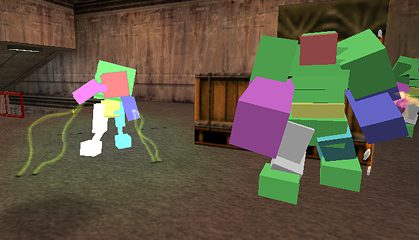
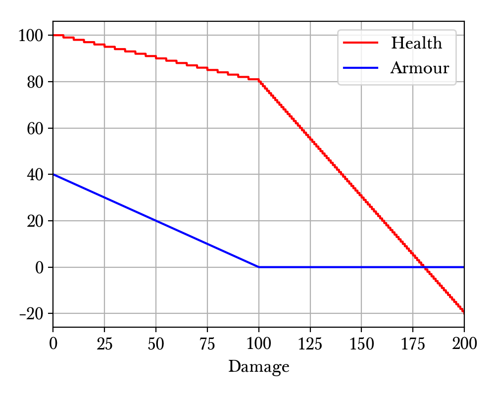

.. _health and damage:

Health and damage
=================

Understanding the health and damage system of the game can be important for precision speedrunning. All entities in Half-Life can be categorised into *damageable entities* and *non-damageable entities*. As the name suggests, a damageable entity is an entity that can receive damage, even if it can never be "killed" by receiving sufficient damage to have the health reduced to zero. For example, the tentacle monsters in Blast Pit are damageable, but they can never be killed without the test fire blast. In the Half-Life SDK, entities are tested for their "damageability" using the ``takedamage`` field in ``entvars_t``, which is set to zero if the entity in question cannot be damaged.

.. _hitgroup:

Hitgroup
--------

   The hitboxes of a vortigaunt and alien grunts.

When damageable entity receives damage, the damage is inflicted onto one of the *hitboxes* if they exist. Hitboxes are a series of cuboids that approximate the entity model. For example, the hitboxes of a scientist are arranged to look like cuboids attached to the scientist's skeleton.

Hitboxes are grouped to designate different parts of the entity's body, such as the head, the chest, the legs, and so on. A group of hitboxes is called a *hitgroup*. Most players are aware that different parts of an entity's body can receive different damages given the same damage source. This is because different hitgroups may be attached a different *damage multiplier*. In the case of the player, the head hitgroup has a damage multiplier of 3, while all other hitgroups have a damage multiplier of 1. If a damage of 8 is inflicted onto the player's head hitgroup, the damage ultimately received will be 24. But if the same damage is inflicted onto the other hitgroups, the player will receive 8 damage unmodified.

To view the hitboxes of entities that have them, set ``r_drawentities 3``. The hitboxes corresponding to the different hitgroups will be coloured differently. An example can be seen in :numref:`hitboxes`.

.. _player health:

Player health and armour
------------------------

The health and armour amounts of the player are stored as the ``health`` and ``armorvalue`` fields in the player's ``entvars_t``. Both values are stored as 32-bit floating pointer numbers, not integers as one might believe. To ease mathematical discussions, denote :math:`\mathcal{H}` and :math:`\mathcal{A}` the health and armour amounts of the player respectively. Denote :math:`\mathcal{H}'` and :math:`\mathcal{A}'` the new health and damage. Suppose :math:`D` is the damage received by the player, after the hitgroup computations. Assuming the damage type is not ``DMG_FALL`` and not ``DMG_DROWN``, then

.. math:: \mathcal{H}' = \mathcal{H} - \Delta\mathcal{H}
          \quad\quad\quad
          \mathcal{A}' =
          \begin{cases}
          0 & \mathcal{A} = 0 \\
          \max(0, \mathcal{A} - 2D/5) & \mathcal{A} \ne 0
          \end{cases}

where

.. math:: \Delta\mathcal{H} =
          \begin{cases}
          \operatorname{int}(D - 2\mathcal{A}) & \mathcal{A}' = 0 \\
          \operatorname{int}(D/5) & \mathcal{A}' \ne 0
          \end{cases}

If the damage type is ``DMG_FALL`` or ``DMG_DROWN``, then the armour value will remain the same, with :math:`\Delta\mathcal{H} = \operatorname{int}(D)`.

.. note::
   Note that :math:`D = 0` is not equivalent to not taking damage. Rather, it means some damage is still taken, and the ``TakeDamage`` function is still called, but with a value of zero. This will be important when :math:`\mathcal{A} < 0`, which is impossible in the game but mathematically possible.

Observe that even though the player health is stored as a 32-bit floating point number, in practice it will almost always have an integer value. This is because any change in health :math:`\Delta\mathcal{H}` due to damage is always an integer. This property is unique to the player entity. However, the armour value will often have a nonzero fractional part.

   A typical player health and armour against damage plot. This plot assumes an initial health and armour of 100 and 40 respectively, showing the new health and armour after a given damage.

In :numref:`player_hp` we observe that when the armour is nonzero, the health decreases with a smaller slope with increasing damage. But once the damage is sufficiently large that the armour gets to zero, the subsequent slope of the health line is much larger. The zigzag pattern of the health line is due to the integer truncation of damage.

.. _damage system:

Damage system
-------------

Damage to an entity is typically not inflicted immediately. Consider firing the shotgun at some entity. If the damage of each bullet is applied immediately and separately, the performance will suffer. Instead, the game accumulates a series of damages, and then apply them all at once in one single combined damage to the entity. This is done via the *multidamage* mechanism.

There are three important operations associated with the multidamage mechanism. We may refer to them as *clear*, *add*, and *apply*. These operations correspond to the functions ``ClearMultiDamage``, ``AddMultiDamage``, and ``ApplyMultiDamage`` respectively, all of which are defined in ``weapons.cpp``. The multidamage mechanism operates on a single global state, stored as ``gMultiDamage`` in the code. This global variable has the type

.. code-block:: cpp

   typedef struct
   {
     CBaseEntity *pEntity;
     float amount;
     int type;
   } MULTIDAMAGE;

The ``pEntity`` field stores a pointer to the entity on which damages are inflicted. The ``amount`` field stores the accumulated damage. The ``type`` field is not important for our purposes.

.. code-block:: cpp

   void ClearMultiDamage(void)
   {
     gMultiDamage.pEntity = NULL;
     gMultiDamage.amount = 0;
     gMultiDamage.type = 0;
   }

The *clear* operation corresponding to ``ClearMultiDamage`` is the simplest operation out of the three. It simply nullifies the ``pEntity`` pointer and zeros out the ``amount`` and ``type`` fields. This function accepts no inputs.

.. code-block:: cpp

   void ApplyMultiDamage(entvars_t *pevInflictor, entvars_t *pevAttacker )
   {
     Vector          vecSpot1;//where blood comes from
     Vector          vecDir;//direction blood should go
     TraceResult     tr;

     if ( !gMultiDamage.pEntity )
       return;

     gMultiDamage.pEntity->TakeDamage(pevInflictor, pevAttacker, gMultiDamage.amount, gMultiDamage.type );
   }

The *apply* operation corresponding to ``ApplyMultiDamage`` is also straightforward. It invokes the ``TakeDamage`` method associated with ``pEntity``, and a damage amount of ``amount`` will be input to ``TakeDamage``. If ``pEntity`` is ``NULL``, then nothing will be done.

.. code-block:: cpp

   void AddMultiDamage( entvars_t *pevInflictor, CBaseEntity *pEntity, float flDamage, int bitsDamageType)
   {
     if ( !pEntity )
       return;

     gMultiDamage.type |= bitsDamageType;

     if ( pEntity != gMultiDamage.pEntity )
     {
       ApplyMultiDamage(pevInflictor,pevInflictor); // UNDONE: wrong attacker!
       gMultiDamage.pEntity = pEntity;
       gMultiDamage.amount = 0;
     }

     gMultiDamage.amount += flDamage;
   }

The *add* operation is slightly trickier. The corresponding ``AddMultiDamage`` accepts the target entity as an input. It first checks if the target entity is the same as ``pEntity`` in the global state. If the target entity is different from that in the global state, then the *apply* operation will be done, followed by zeroing out the damage amount and storing the target entity to ``pEntity``. Regardless of whether the target entity is the same, this function adds the input damage to the ``amount`` field.

.. _gibbing:

Gibbing
~~~~~~~

Gibbing monsters in Half-Life is inherently fun from a gameplay point of view,
but it can be critical for speedrunning as well. Due to the narrow corridors commonly found in Half-Life and its mods, killing monsters are sometimes necessary to allow uninterrupted passages. However, killing is not enough, as the dying monster tends to leave behind a large invisible obstruction for about one second. Gibbing instantly deletes any obstruction posed to the player.

A damage may contain flags to indicate how it gibs monsters. These flags are
``DMG_NEVERGIB`` and ``DMG_ALWAYSGIB``. The names are self-explanatory. When the
damage is inflicted onto a living monster (i.e. not a corpse) and neither of
these flags are set for the damage, then the monster will only gib if its health
gets below ``GIB_HEALTH_VALUE``, defined to be :math:`-30` in ``cbase.h``.

Sometimes, inflicting a massive damage to a monster does not gib it, even though the health falls below :math:`-30`. This is usually because the monster is running a script under the script monster state. Examining ``CBaseMonster::TakeDamage``, we see the following:

.. code-block::
   :caption: ``CBaseMonster::TakeDamage`` in ``dlls/combat.cpp``

   // do the damage
   pev->health -= flTake;

   // HACKHACK Don't kill monsters in a script.  Let them break their scripts first
   if ( m_MonsterState == MONSTERSTATE_SCRIPT )
   {
     SetConditions( bits_COND_LIGHT_DAMAGE );
     return 0;
   }

This early return is located just before the gibbing code. Assuming the script is interruptible, the early return provided a chance to interrupt the script with the ``bits_COND_LIGHT_DAMAGE`` set. Usually, the game ends up calling ``CBaseMonster::CineCleanup``, which contains the following code:

.. code-block::
   :caption: ``CBaseMonster::CineCleanup`` in ``dlls/scripted.cpp``

   if ( pev->health > 0 )
     m_IdealMonsterState = MONSTERSTATE_IDLE; // m_previousState;
   else
   {
     // Dropping out because he got killed
     // Can't call killed() no attacker and weirdness (late gibbing) may result
     m_IdealMonsterState = MONSTERSTATE_DEAD;
     SetConditions( bits_COND_LIGHT_DAMAGE );
     pev->deadflag = DEAD_DYING;
     FCheckAITrigger();
     pev->deadflag = DEAD_NO;
   }

With the ideal monster state set to dead, the monster state will in turn be dead in the next AI iteration, causing the "Die" schedule to run. From taking the *coup de grâce* to running the "Die" schedule, the game does not call any gibbing code on the monster in question.

There are several ways to deal with this problem, even though none of them are always possible in all circumstances. We could simply wait for the script to finish before dealing the death blow. We could plant an explosive, deal the death blow, and trigger the explosive to gib the corpse. We could also deal the death blow so that the health falls below :math:`-30` and attack with a crowbar or other weapons that allow gibbing.

Dying monster obstruction
~~~~~~~~~~~~~~~~~~~~~~~~~

Most Half-Life players, even casual ones, have experienced a dying monster obstructing the player. The obstruction usually persists for about a second, even after the death animation seemingly ended. A dying body that continues to exhibit collision is undoubtedly an annoyance in speedrunning. In any Half-Life speedrun, the first instance of this is in the Office Complex chapter, where a dying headcrab would obstruct the speedrunner in the vent leading away from the flooded room.

Assuming the death blow does not gib the monster (see :ref:`gibbing`), the ``CBaseMonster::Killed`` function is usually called. This function sets the ideal monster state to dead, which sets the stage for the dying process. The code eventually arrives at running the ``TASK_DIE`` of the "Die" schedule in ``CBaseMonster::StartTask`` and ``CBaseMonster::RunTask``. In the ``StartTask`` method, the death activity is set. Then looking at the code of ``RunTask``, it is clear why a dying monster continues to obstruct entities:

.. code-block:: c++
   :caption: ``CBaseMonster::RunTask`` in ``dlls/schedule.cpp``

   case TASK_DIE:
   {
     if ( m_fSequenceFinished && pev->frame >= 255 )
     {
       pev->deadflag = DEAD_DEAD;

       SetThink ( NULL );
       StopAnimation();

       if ( !BBoxFlat() )
       {
         // a bit of a hack. If a corpses' bbox is positioned such that being left solid so that it can be attacked will
         // block the player on a slope or stairs, the corpse is made nonsolid.
   //              pev->solid = SOLID_NOT;
         UTIL_SetSize ( pev, Vector ( -4, -4, 0 ), Vector ( 4, 4, 1 ) );
       }
       else // !!!HACKHACK - put monster in a thin, wide bounding box until we fix the solid type/bounding volume problem
         UTIL_SetSize ( pev, Vector ( pev->mins.x, pev->mins.y, pev->mins.z ), Vector ( pev->maxs.x, pev->maxs.y, pev->mins.z + 1 ) );

       if ( ShouldFadeOnDeath() )
       {
         // this monster was created by a monstermaker... fade the corpse out.
         SUB_StartFadeOut();
       }
       else
       {
         // body is gonna be around for a while, so have it stink for a bit.
         CSoundEnt::InsertSound ( bits_SOUND_CARCASS, pev->origin, 384, 30 );
       }
     }
     break;
   }

Observe that the entire block does not run unless ``m_fSequenceFinished`` and ``pev->frame >= 255``. This implies that ``TASK_DIE`` continues to run until the death activity completes. This gives rise to why a dying monster retains the original bounding box.

Assuming the death activity has completed, the size of the monster is set to have only a height of one. This prevents the body from colliding with the player entity, matching the experience of players where running over a dead body does not result in collisions or speed losses. Nonetheless, the one-unit high body still collides with some other entities such as boxes and doors. This again corresponds to gaming experience where dead bodies do obstruct the movements of boxes and doors.

Damage types
------------

Half-Life has a diverse set of damage types that made the gameplay interesting. However, many of these damages can be categorised into a few groups based on their behaviour.

Time based
~~~~~~~~~~

One-off
~~~~~~~

Fall damage
~~~~~~~~~~~

In Half-Life, a player falling from great heights can cause potential health reduction. All other entities do not suffer from fall damage, however. The game calculates the amount of damage taken based on the new vertical velocity computed in the frame of impact. If the magnitude of the vertical velocity is above the *safe falling speed*, defined to be 580 ups as ``PLAYER_MAX_SAFE_FALL_SPEED`` in ``dlls/player.h``, the game will inflict a fall damage of

.. math:: D = \frac{25}{111} (v_z - 580) \quad v_z > 580

The constant of proportionality :math:`25/111` is defined to be ``DAMAGE_FOR_FALL_SPEED`` in ``dlls/player.h``. The damage type is ``DMG_FALL``, which, recalling from :ref:`player health`, bypasses the player's armour.

Observe that :math:`v_z = 1024` gives :math:`D = 100`. Assuming a gravitational acceleration of :math:`g = 800`, the maximum safe height is 210.25 units and the fatal height (assuming a health of 100) is 655.36 units. These values can help the speedrunner to make estimates in the plans, and possibly utilise one of the methods to bypass fall damage such as jumpbug (see :ref:`jumpbug`).

.. _damage boosting:

Damage boosting
---------------

The player velocity will be modified upon receiving most types of damage, forming the foundation for a variety of damage boosts.  First we have the concept of an "inflictor" associated with a damage, which may or may not exist.  Drowning damage, for example, does not have an inflictor.  Inflictor could be a grenade entity, a satchel charge entity, a human grunt, or even the player himself (in the case of selfgaussing, see :ref:`selfgauss`).  It is the first argument to ``CBaseMonster::TakeDamage`` in ``dlls/combat.cpp``.

Suppose :math:`\mathbf{v}` is the player velocity and :math:`\mathbf{r}` the
player position.  If an inflictor with position
:math:`\mathbf{r}_\text{inflictor}` exists, then with

.. math:: \mathbf{d} = \mathbf{r} - \mathbf{r}_\text{inflictor} + \langle 0, 0, 10\rangle

we have

.. math:: \mathbf{v}' = \mathbf{v} +
          \begin{cases}
          \min(1000, 10\Delta\mathcal{H}) \mathbf{\hat{d}} & \text{ducked} \\
          \min(1000, 5\Delta\mathcal{H}) \mathbf{\hat{d}} & \text{standing or in-duck}
          \end{cases}

We can immediately see that if the duckstate is *ducked* then the change in
velocity is greater. It is unfortunate that the maximum possible boost given by
a single damage is bounded by 1000 ups and not infinite.

The role of armour
~~~~~~~~~~~~~~~~~~

Armour is strictly never needed for damage boosting. The only function of armour is to cut the health loss :math:`\Delta\mathcal{H}` ultimately inflicted onto the player given the same damage :math:`D`. Theoretically, we do not need to use the armour to control the health loss at all. Instead, it can be done by simply moving the explosion origin away so that the damage falls off to match the desired health loss (see :ref:`explosions` for more details). In practice, however, this may be hard to achieve in confined spaces or awkward positions, especially when a small health loss is desired despite large source damage, which implies a large distance is required between the player and the explosion origin.

Suppose we have calculated the exact :math:`\Delta\mathbf{v}` boost needed for a damage boost, and determined that a health loss of :math:`\Delta\mathcal{H}` is desired. However, the damage inflicted :math:`D > \Delta\mathcal{H}`. Therefore, some amount of armour is needed to cut the damage and preferably as little as possible since the armour is a scarce resource. We will assume :math:`\Delta\mathcal{H} \ge 0` and :math:`\mathcal{A}' = 0`, which implies the necessary condition

.. math:: \mathcal{A}' = \max(0, \mathcal{A} - 2D/5) \le 0 \implies \mathcal{A} \le \frac{2}{5} D

On the other hand, :math:`\mathcal{A}' = 0` also implies the health loss is related to the damage and armour by

.. math:: \Delta\mathcal{H} = \operatorname{int}(D - 2\mathcal{A}) \implies \frac{1}{2} \left( D - \Delta\mathcal{H} - 1 \right) < \mathcal{A} \le \frac{1}{2} \left( D - \Delta\mathcal{H} \right)
   :label: zeroA Arange

Combining the two inequalities, we can eliminate :math:`\mathcal{A}` and obtain the new inequality

.. math:: \frac{1}{2} \left( D - \Delta\mathcal{H} - 1 \right) < \frac{2}{5} D
   \implies D < 5 \left( \Delta\mathcal{H} + 1 \right)
   :label: zeroA Drange

In other words, the initial assumption of :math:`\mathcal{A}' = 0` is contingent upon the truth value of this inequality. This inequality sets an upper bound on the damage value for this approach to work. Assuming this inequality is true, then the requisite :math:`\mathcal{A}` value can be picked from the small range given by the second inequality.

If the necessary conditions mentioned above do not hold, then the assumption of :math:`\mathcal{A}' = 0` is false, implying :math:`\mathcal{A}' > 0`. This further implies that the armour value has the lower bound

.. math:: \mathcal{A} > \frac{2}{5} D

Furthermore, this assumption also implies the equality

.. math:: \Delta\mathcal{H} = \operatorname{int}\left( \frac{D}{5} \right)

Using the same analysis technique of replacing the integer truncation with a range, we obtain the equivalent range

.. math:: 5 \Delta\mathcal{H} \le D < 5 \left( \Delta\mathcal{H} + 1 \right)
   :label: posA Drange

Observe that this range overlaps with the range :eq:`zeroA Drange`. In fact, we need not consider the :math:`\mathcal{A}' > 0` case at all. This is because if :math:`\mathcal{A}' = 0` is not true, then the :math:`\mathcal{A}' > 0` case is not going to help us. If :math:`\mathcal{A}' > 0`, then this implies the upper bound on :math:`D` in :eq:`zeroA Drange`, and therefore :eq:`posA Drange` also fails. Therefore, we conclude that there exists no :math:`\mathcal{A}` that can produce the required health loss.

A small note to make is that if :math:`D` satisfies :eq:`posA Drange`, then it means that we can pick any value of :math:`A` to give the same :math:`\Delta\mathcal{H}`, as long as the lower bound in :eq:`zeroA Arange` is satisfied.

.. We'll keep this distribution thing here in health and damage, and not in explosions, because these are applicable for other kinds of damage as well

Distribution of health
~~~~~~~~~~~~~~~~~~~~~~

Health is a scarce resource in any speedrun because medkits and health chargers are relatively rare. Despite this harsh constraint, it is common to want to perform multiple damage boosts using whatever health that is available until the health becomes too low. A natural question to ask is: what is the optimal way to distribute the limited health over these damage boosts, so that the total time taken to reach the destination is minimised?

Intuitively, this question seems to have a simple answer. Suppose there are two straight paths we need to travel to reach the destination. We want to perform damage boosts at the very beginning of each path. Let the lengths of these two paths be 250 and 750 units. Assume that the initial horizontal speed at the beginning of each path is 100 ups. For simplicity, we will assume that we can consume up to 100 HP in total without dying.

Now observe that the length ratio is 1:3, so it is natural to guess that the health should also be distributed in 1:3 proportion for each straight path. Namely, allocate 25 HP to the damage boost for the shorter path and 75 HP for the longer path. Thus, we calculate that the total time taken to travel both paths is 1.597 seconds. However, what if we allocate 34 HP for the shorter path and 66 HP for the longer path instead? Then the total time is 1.555 seconds. In fact, we claim that this is the optimal distribution which minimises the total time. Even though the difference is small in this particular scenario, it is not at all obvious why the 1:3 distribution is suboptimal.

To find out the optimal health distribution, we construct a model which closely reflects actual situations. We first assume that we are required to perform damage boosts for :math:`n` *distance segments*. We define a distance segment as a straight line path which directly benefits from a damage boost done at the beginning of the path. To take a concrete example, imagine an extremely narrow L-shaped path where the turn is extremely sharp. Since the turn is very sharp, the player's horizontal speed will be reduced to a *fixed* value after making the turn. Thus, we consider the L-shaped path to be comprised of two distance segments, one for each straight path. Notice that no matter how much health is allocated to the initial boost, the speed gained will be lost after making the turn. Thus, the two straight paths are of distinct distance segment: the time taken to travel across the second straight path is independent of whatever that happens while travelling in the first straight path.

In practice, there is, of course, no perfect distance segment. Turns are rarely so sharp that all boosts in the horizontal speed are nullified. Nevertheless, the concept of distance segments can serve as a helpful guide and approximation to practical situations. Note also that the distance segments need not be continuous as is the case in the L-shaped path example described previously. Indeed, distance segments are completely independent of each other.

Let :math:`s_1, \ldots, s_n` be the lengths of the distance segments. Let :math:`u_1, \ldots, u_n` be the initial horizontal speeds are the beginning of each distance segment before damage boosting. These initial speeds are assumed to be fixed, independent of previous damage boosts. They are typically approximated in practice. And let :math:`\Delta v_1, \ldots, \Delta v_n` be the change in horizontal speed as a result of the damage boost at the beginning of each distance segment. Now assume that the speed stays constant after boosting. We can then compute that the total time required to traverse all distance segments is

.. math:: T(\Delta v_1, \ldots, \Delta v_n) = \frac{s_1}{u_1 + \Delta v_1} + \cdots + \frac{s_n}{u_n + \Delta v_n}

Here, the total time is written as a function with parameters :math:`\Delta v_1, \ldots, \Delta v_n`. We want to minimise this quantity by finding the optimal values for each of :math:`\Delta v_i`. Note also that we have a constraint, namely the amount of health given at the beginning of everything, before any boosting is done. We may express this constraint simply as

.. math:: H(\Delta v_1, \ldots, \Delta v_n) = \Delta v_1 + \cdots + \Delta v_n = 10\mathcal{H}

where :math:`\mathcal{H}` is the total health amount that will be consumed. Here, the coefficient of :math:`10` reflects the assumption that the player will duck for each damage boosting. Indeed, recall that by ducking the player will receive twice the amount of speed boost compared to that received in upright position. By stating the optimisation problem this way, it may readily be solved via the method of Lagrange multipliers.

This optimisation method is particularly useful when we have a multivariate objective function and an equation constraining the parameters. In this optimisation problem, we want to solve the :math:`n + 1` equations consisting of the constraint along the equations encoded as :math:`\nabla T = -\lambda \nabla H` where :math:`\lambda` is the Lagrange multiplier. Writing out the latter explicitly, we have

.. math:: \frac{s_i}{(u_i + \Delta v_i)^2} = \lambda
   :label: explicit_lagrange

for all :math:`1 \le i \le n`.  To proceed, we introduce a temporary variable :math:`\mathcal{\tilde{H}}` such that

.. math:: 10\mathcal{H} = \mathcal{\tilde{H}} - u_1 - \cdots - u_n

As a result, the constraint equation may be written as

.. math:: (u_1 + \Delta v_1) + \cdots + (u_n + \Delta v_n) = \mathcal{\tilde{H}}

Using :eq:`explicit_lagrange`, we then eliminate all :math:`u_i + \Delta v_i`, yielding

.. math:: \sqrt{\frac{s_1}{\lambda}} + \cdots + \sqrt{\frac{s_n}{\lambda}} = \mathcal{\tilde{H}}

Or equivalently, by eliminating the temporary variable,

.. math:: \left( \frac{\sqrt{s_1} + \cdots + \sqrt{s_n}}{10\mathcal{H} + u_1 + \cdots + u_n} \right)^2 = \lambda

Eliminating :math:`\lambda` using :eq:`explicit_lagrange` again, we have the solution for each :math:`\Delta v_i` in the following form:

.. math:: \Delta v_i = \frac{\sqrt{s_i}}{\sum_{k=1}^n \sqrt{s_k}} \left(
          10\mathcal{H} + \sum_{k=1}^n u_k \right) - u_i

Looking at this equation, we observe the rather counterintuitive ratio. In particular, the ratio is *not* given by

.. math:: \frac{s_i}{\sum_{k=1}^n s_i}

as one would have guessed.

We want to remark that this model makes the assumption that the speed is constant after boosting. This is normally not true in practice. However, consider that the speed after a damage boost is typically very high, and recall from strafing physics that the acceleration at higher speeds is noticeably lower.

Upward diagonal boost
~~~~~~~~~~~~~~~~~~~~~

TODO TODO TODO

Minimal health loss
~~~~~~~~~~~~~~~~~~~

.. note::
   TODO TODO proper cross references

Damage boosting is often used to reach a less accessible location that is hard to achieve by strafing alone. The downside of damage boosting is health loss. Health is typically a much more constrained resource than time, because the available health is often limited. It can be useful to calculate the *minimum health loss* needed to boost to a particular location.

Before calculating the health loss, we must determine if it is possible to reach the final position by strafing alone. If pure strafing is sufficient, then we do not need any damage boosting at all. This assumes knowledge of the initial velocity :math:`\mathbf{v}_i` in full.

.. TODO: TODO: link to motion under gravity!!!!!!!

Assuming strafing is not sufficient to reach the final position. The damage boost results in a change in velocity :math:`\Delta\mathbf{v}`. The "initial velocity" given to the equations of motion is now the velocity after damage boosting. This requires the mappings

.. math:: v_{i,x} \mapsto v_{i,x} + \Delta v_x \qquad v_{i,z} \mapsto v_{i,z} + \Delta v_z

in all equations of motion, including the time constraint equation. Now recall that the health loss :math:`\Delta\mathcal{H}` is proportional to the magnitude :math:`\lVert\Delta\mathbf{v}\rVert`. This gives the optimisation problem of minimising :math:`f(\Delta v_x, \Delta v_z) = \Delta v_x^2 + \Delta v_z^2` subject to the time constraint equation :math:`t_x = t_z`.

While this optimisation problem can be solved by Lagrange multipliers, the derivatives of the time constraint equations are fairly unwieldy, and they are unlikely to yield closed form solutions anyway. A direct numerical attack is likely the most practical solution method. We start by writing the equation

.. math:: \Delta v_y = \frac{gt_x^2 + 2z_f}{2t_x} - v_{i,z}

which is slightly modified from the original by the variable mapping mentioned above. We then eliminate :math:`\Delta v_y` from the objective function to obtain a univariate function in :math:`\Delta v_x`,

.. math:: f(\Delta v_x) = \Delta v_x^2 + \left( \frac{gt_x^2 + 2z_f}{2t_x} - v_{i,z} \right)^2

where :math:`t_x = t_x(\Delta v_x)`. By converting the objective function to a single-variable function, the process of minimising the function is made easier and more numerically tractable. There are many numerical algorithms available to solve this optimisation problem.

From numerical experimentations, we frequently found that the solution obtained produces a path that has a decreasing curve at the end.

Timing of horizontal boosts
~~~~~~~~~~~~~~~~~~~~~~~~~~~

The timing of horizontal boosts can have a outsized effect on the overall time taken to travel a given distance. Specifically, delaying a damage boost slightly after strafing started may result in respectable time saves. This may be surprising to some, as it does not match the experience in real life. In real life, accelerations are typically fairly constant, and under such circumstances it is indeed better to perform damage boosts at the very beginning without hesitance. However, the acceleration due to strafing, especially starting from low speeds with a combination of ground and air strafing, is highly non-linear and varies drastically over a short amount of time. The usual human intuition thus breaks down when strafing is introduced.

For experienced speedrunners, however, this may not come as a surprise. In general, when starting off with a low speeds, it is better to build up some speed by strafing and then perform a boost. One way to understand this is to observe that the acceleration at low speeds is extremely high. The time it takes to gain 100 ups is much shorter at lower speeds than that when the player is already moving very fast. Suppose a boost provides a speed boost of 1000 ups. If a player receives such a boost at 300 ups, then the player speed should end up at 1300 ups. Now if the player decides to strafe a little before boosting instead, and then receives the boost at 500 ups, the final speed after the boost will be 1500 ups. Now the key is to understand that gaining speed from 300 ups to 500 ups takes much shorter time than gaining the same speed from 1300 ups to 1500 ups. Therefore, the *average* speed in the latter case would be higher.

