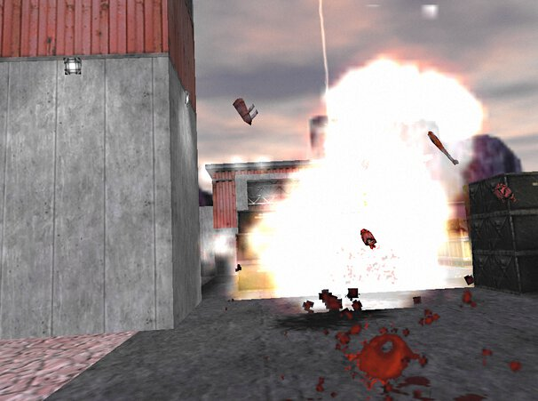
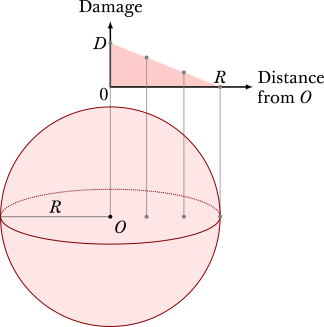
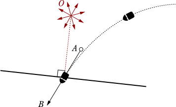
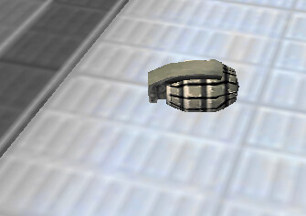
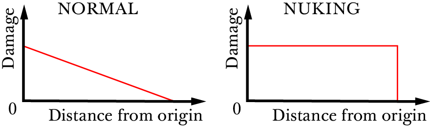

.. _explosions:

Explosions
==========

This page details the physics of explosion and explosive weapons, along with some speedrunning tricks that arise of out these aspects of the game. Familiarity with the health and damage system is assumed (see :ref:`health and damage`).

   A powerful explosion created by a mortar strike in We've Got Hostile that gibbed a human grunt in one hit and inflicted some damage to the player from a distance.

.. _explosion physics:

General physics
---------------

An explosion is a phenomenon in Half-Life that inflicts damage onto surrounding
entities. An explosion need not be visible, though it is normally accompanied
with a fiery visual effect. We may describe an explosion in terms of three
fundamental properties. Namely, as illustrated in :numref:`explosion terms`, an
explosion has an *origin*, a *source damage*, and a *radius*.

   Illustration of the three main properties used to describe an explosion, namely the origin :math:`O` at the centre of the explosion, the source damage :math:`D` at the origin, and the radius :math:`R` of explosion. Here, it is assumed that nuking (see :ref:`nuking`) is *not* done, and so the damage falls off linearly with distance from origin.

Suppose an explosion occurs. Let :math:`D` be its source damage and :math:`R` its radius, as shown in :numref:`explosion terms`. Suppose there is an entity adjacent to the explosion origin. From gaming experience, we know that the further away this entity is from the explosion origin, the lower the damage inflicted on this entity. In fact, the game only looks for entities within a sphere of radius :math:`R` from the explosion origin, ignoring all entities beyond. In the implementation, this is achieved by calling ``UTIL_FindEntityInSphere`` with the radius as one of the parameters.

Assume the entity in question is within :math:`R` units from the explosion origin. First, the game traces a line from the explosion origin to the entity's *body target*. Recall from :ref:`entities` that the body target of an entity is usually, but not always, coincident with the entity's origin. Then, the game computes the distance between this entity's body target and the explosion origin as :math:`\ell`. The damage inflicted onto this entity is thus computed to be

.. math:: D \left( 1 - \frac{\ell}{R} \right) \qquad (0 \le \ell \le R)
   :label: damage attenuation

Observe that the damage inflicted attenuates linearly with distance, also illustrated in :numref:`explosion terms`, and not with the square of distance as is the case in the real world. This process is repeated with other entities found within the sphere.

Interestingly, the computed distance :math:`\ell` may not equal to the actual distance between this entity and explosion origin. In particular, if the line trace is startsolid, then the game computes :math:`\ell = 0`. As a result, the damage inflicted on the entity is exactly the source damage of the explosion. Indeed, all entities within the sphere will receive the same damage.

The case where the line trace is startsolid is seemingly impossible to achieve. Fortunately, this edge case is not hard to exploit in game, the act of which is named *nuking* as will be detailed in :ref:`nuking`. The key to understanding how such exploits might work is to observe that the explosion origin may not coincide with the origin of the entity just before it detonates. The exact way the explosion origin is computed depends on the type of entity generating the explosion.

.. _explosion origin:

Explosion origin
----------------

Explosions are always associated with a *source entity*. This entity could be a grenade (of which there are three kinds) or an ``env_explosion``.

Denote :math:`\mathbf{r}` the position of the associated entity. When an explosion occurs, the game will trace a line from :math:`A` to :math:`B`. The exact coordinates of these two points depend on the type of the associated source entity, but they are always, in one way or the other, offset from the source entity's origin. In general, we call :math:`\mathbf{c}` the end position from the line trace. If the trace fraction is not 1, the game will modify the position of the source entity. Otherwise, the position will not be changed, making :math:`\mathbf{r}' = \mathbf{r}`.

Assuming the trace fraction is not 1, the new position of the source entity is
computed to be

.. math:: \mathbf{r}' := \mathbf{c} + \frac{3}{5} (D - 24) \mathbf{\hat{n}}
   :label: new position

All numerical constants are hardcoded. Call the coefficient of
:math:`\mathbf{\hat{n}}` the *pull out distance*, as per the comments in the
implementation in ``ggrenade.cpp``. This is so named because if the source
entity is a grenade, it is typically in contact with some plane or ground when
it explodes. By modifying the origin this way, the source entity is being pulled
out of the plane by that distance. Remarkably, this distance depends on the
source damage of the explosion. For instance, MP5 grenades create explosions
with a source damage of :math:`D = 100`, therefore MP5 grenades are pulled out
of the plane by 45.6 units at detonation.

Subsequently, the source entity will begin to properly explode. The physics
driving the rest of this event has been described in :ref:`explosion physics`.
Most importantly, the explosion origin is set to be :math:`\mathbf{r}' +
\mathbf{\hat{k}}` where :math:`\mathbf{\hat{k}} = \langle 0, 0, 1\rangle` is the
:math:`z` axis unit vector. Observe how the :math:`\mathbf{\hat{k}}` is added to
the entity's origin, the purpose of which is to pull non-contact grenades out of
the ground slightly, as noted in the comments. In the implementation, the
addition of this term is done in the function responsible for applying explosive
damage, namely ``RadiusDamage``. Since all explosion code invoke this function,
this term is always added to the origin for any explosion that happens.

.. _contact grenades:

Contact grenades
~~~~~~~~~~~~~~~~

A contact grenade is a type of grenade which detonates upon contact with a solid entity. This includes the MP5 grenades and RPGs.

   Illustration of a contact grenade striking a surface and computing position of the the explosion origin :math:`O`. The line :math:`\mathit{AB}` is tangent to the trajectory at the final position.

Let :math:`\mathbf{r}` be the origin of a contact grenade moving in space. Assuming the map is closed, the grenade will eventually hit some entity and then detonate. Denote unit vector :math:`\mathbf{\hat{n}}` the normal to the plane on the entity that got hit. Note that at the instant the grenade collides with the plane, its position will be on the plane. Thus at this instant, let :math:`\mathbf{v}` be the velocity of the grenade.

Then, the start and end points of the line trace are given by

.. math::
	\begin{aligned}
	A &:= \mathbf{r} - 32 \mathbf{\hat{v}} \\
	B &:= \mathbf{r} + 32 \mathbf{\hat{v}}
	\end{aligned}

Here, :math:`A` is 32 units away from the position of the grenade at collision, in the opposite direction of its velocity. And :math:`B` is 32 units away from that position, but in the direction of the velocity. It is easy to imagine that, more often than not, the end position of the line trace will coincide with the grenade position. This line trace will also rarely be startsolid. This is because the grenade has to pass through open space before hitting the plane, and :math:`A` is approximately one of the grenade's past positions.

Timed grenades
~~~~~~~~~~~~~~

Timed grenades are grenades that detonate after a specific amount of time. This
includes hand grenades, which explode three seconds after the pin is pulled.

   The handgrenade is the most common example of a timed grenade.

Denote :math:`\mathbf{r}` the origin of a timed grenade. At detonation, the
grenade may or may not be lying on a plane. Since the grenade could well be
resting on the ground with zero velocity, it does not make sense to use the
velocity in computing the start and end points for the line trace. Instead,
Valve decided to use :math:`\mathbf{\hat{k}}` to offset those points from the
grenade origin. So, we have

.. math::
	\begin{aligned}
	A &:= \mathbf{r} + 8 \mathbf{\hat{k}} \\
	B &:= \mathbf{r} - 32 \mathbf{\hat{k}}
	\end{aligned}

Now, :math:`A` is simply 8 units above the grenade and :math:`B` is 32 units below the grenade. This means that there is a greater chance that this line trace is startsolid and also that the trace fraction is 1. The former can occur if there is a solid entity above the grenade, while the latter can occur if the grenade is sufficiently high above the ground.

Explosions by ``env_explosion``
~~~~~~~~~~~~~~~~~~~~~~~~~~~~~~~

An ``env_explosion`` is an invisible entity that can explode, which may be
created by monsters, explosive ``func_breakable`` creates, or map designers.

Denote :math:`\mathbf{r}` the origin of the ``env_explosion``. Then

.. math::
   \begin{aligned}
   A &:= \mathbf{r} + 8 \mathbf{\hat{k}} \\
   B &:= \mathbf{r} - 32 \mathbf{\hat{k}}
   \end{aligned}

Notice that the :math:`A` and :math:`B` for this entity type is similar to that
of a timed grenade.

Tripmines
~~~~~~~~~

A tripmine is a grenade that detonates when it is "killed". In this context, a
tripmine can be killed by some external damage or by something blocking the
beam.

Denote :math:`\mathbf{r}` the origin of a tripmine, and :math:`\mathbf{\hat{f}}`
the tripmine's unit forward vector (unrelated to the player's unit forward
vector). Then we have

.. math::
   \begin{aligned}
   A &:= \mathbf{r} + 8 \mathbf{\hat{f}} \\
   B &:= \mathbf{r} - 64 \mathbf{\hat{f}}
   \end{aligned}

The unit forward vector is very well defined in the game, because it is parallel
to the beam.

.. _nuking:

Nuking
------

Nuking refers to the trick of placing explosives in locations confined in a particular way so as to disable damage attenuation computed by :eq:`damage attenuation`. The result is that the original damage :math:`D` will inflict onto all entities found within the sphere of radius :math:`R`, as though the entities coincide with the explosion origin (effectively :math:`\ell = 0`). The usefulness of this trick is obvious. It is important to keep in mind that the explosion radius does not change when nuking. Entities outside the sphere will remain untouched by the explosion.

   Comparison of how damage varies with distance from the explosion origin for
   normal explosions and nuking. In both cases, the source damage and the radius
   of explosion are the same.

Nuking is typically achieved by detonating an explosive so that the explosion origin :math:`\mathbf{r}'` is inside some solid entity, which makes startsolid true when tracing a line from the explosion origin to any damageable entity. For example, a MP5 grenade touching the ground with a damage of 100 will explode with the origin 46.6 units above the ground (calculated by :eq:`new position` and adding :math:`\mathbf{\hat{k}}`). If 46.6 units above the contact plane is inside some solid entity, then nuking will occur.
