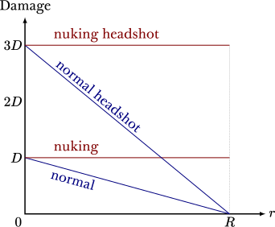

.. _explosions:

Explosions
==========

This page details the physics of explosion and explosive weapons, along with some speedrunning tricks that arise of out these aspects of the game. Familiarity with the health and damage system is assumed (see :ref:`health and damage`).

.. figure:: images/explosion-mortar.jpg
   :name: mortar explosion

   A powerful explosion created by a mortar strike in We've Got Hostile that gibbed a human grunt in one hit and inflicted some damage to the player from a distance.

.. _explosion physics:

General physics
---------------

An explosion, or radius damage, is a phenomenon in Half-Life that inflicts damage onto surrounding entities. In this section, we describe this phenomenon without associated with any entity such as grenades. On its own, an explosion is not visible. For instance, when a gauss beam reflects, an explosion is created at the point of reflection as described in :ref:`gauss`. This explosion is completely invisible in-game, and a casual player would not notice that an explosion has occurred. Nevertheless, the game usually creates a fiery cosmetic effect to accompany an explosion for better gameplay, an example of which may be seen in :numref:`mortar explosion`.

.. figure:: images/explosion-parts.svg
   :name: explosion terms

   Illustration of the three main properties used to describe an explosion, namely the origin :math:`O` at the centre of the explosion, the source damage :math:`D` at the origin, and the radius :math:`R` of explosion. Here, it is assumed that nuking (see :ref:`nuking`) is *not* done, and so the damage falls off linearly with distance from origin.

We may describe an explosion in terms of three fundamental properties. Namely, as illustrated in :numref:`explosion terms`, an explosion has an *origin* [#explosion-origin]_, a *source damage*, and a *radius*. Suppose an explosion occurs. Let :math:`D` be its source damage and :math:`R` its radius, as shown in :numref:`explosion terms`. Suppose there is an entity adjacent to the explosion origin. From gaming experience, we know that the further away this entity is from the explosion origin, the lower the damage inflicted on this entity. In fact, the game only looks for entities within a sphere of radius :math:`R` from the explosion origin, ignoring all entities beyond. In the implementation, this is achieved by calling ``UTIL_FindEntityInSphere`` with the radius as one of the parameters.

For each entity within :math:`R` units from the explosion origin, the game traces a line from the explosion origin to the entity's *body target*. Recall from :ref:`entities` that the body target of an entity is usually, but not always, coincident with the entity's origin. Then, assuming the line trace is not *startsolid*, the game computes the distance between this entity's body target and the explosion origin as :math:`\ell`. The damage inflicted onto this entity is given by

.. math:: D \left( 1 - \frac{\ell}{R} \right) \qquad (0 \le \ell \le R)
   :label: damage attenuation

Observe that the damage inflicted attenuates linearly with distance, also illustrated in :numref:`explosion terms`, rather than the square of distance as is the case in the real world by the inverse square law.

If the line trace is *startsolid*, however, the game sets :math:`\ell = 0`. As a result, the damage inflicted on the entity exactly equals the source damage of the explosion :math:`D` regardless of the actual distance of the entity from the explosion origin. The line trace being *startsolid* appears to be impossible in the game. Intuitively, we expect explosions to happen not inside a solid body, because grenades collide with solid entities and cannot enter them. Fortunately, this edge case is not hard to exploit in game, the act of which is named *nuking* as will be detailed in :ref:`nuking`. The key to understanding how such exploits might work is to observe that the explosion origin may not coincide with the origin of the entity when the entity detonates. The exact way the explosion origin is computed depends on the type of entity generating the explosion.

Grenade explosions
------------------

Grenades are the primary source of explosions in Half-Life, and they share similar physics. For example, the explosion radius :math:`R` of all grenades described in this section depends on the source damage :math:`D`, with

.. math:: R = \frac{5}{2} D

This allows us to rewrite the attenuated damage in :eq:`damage attenuation` for grenades as

.. math:: D - \frac{2}{5} \ell

The explosion origin as a result of a grenade detonation is more complicated. When a grenade explodes, the explosion origin may be different from the origin of the grenade entity. Denote :math:`\mathbf{r}` the position of the grenade. When an explosion occurs, the game will trace a line from :math:`A` to :math:`B`. The exact coordinates of these two points depend on the type of the grenade which will be described in the later parts of this section, but they are always, in one way or the other, offset from the grenade's origin. In general, we call :math:`\mathbf{c}_{\mathit{AB}}` the end position from the line trace. If the trace fraction is not 1, the game will modify the position of the grenade. Otherwise, the position of the grenade will not change and :math:`\mathbf{r}' = \mathbf{r}`.

Assuming the trace fraction is not 1, :math:`\mathbf{\hat{n}}` is the normal of the plane hit by the line trace, and :math:`D` is the source damage of the grenade, the new position of the grenade is computed to be

.. math:: \mathbf{r}' = \mathbf{c}_{\mathit{AB}} + \frac{3}{5} \left( D - 24 \right) \mathbf{\hat{n}}
   :label: explosion new position

All numerical constants are hardcoded. Call the coefficient of :math:`\mathbf{\hat{n}}`, or

.. math:: \frac{3}{5} \left( D - 24 \right)

the *pull out distance*, as per the comments in the SDK in ``ggrenade.cpp``. This is so named because a grenade is typically in contact with some plane or ground when it explodes. By modifying the grenade origin this way, it is being pulled out of the plane by that distance. Remarkably, this distance depends on the source damage of the explosion. For instance, an MP5 grenade creates an explosion with a source damage of :math:`D = 100`. Its pull out distance is therefore 45.6 units at detonation.

Having computed the new grenade position :math:`\mathbf{r}'`, the explosion origin for the actual explosion is set to be :math:`\mathbf{r}' + \mathbf{\hat{k}}` where :math:`\mathbf{\hat{k}} = \langle 0, 0, 1\rangle` is the :math:`z` axis unit vector (see [#explosion-origin]_ for an explanation). The rest of the physics is described in :ref:`explosion physics`.

.. _contact grenades:

Contact grenades
~~~~~~~~~~~~~~~~

A contact grenade is a type of grenade which detonates upon contact with a solid entity. This includes the MP5 grenades and RPGs.

.. figure:: images/explosion-contact-grenades.svg
   :name: explosion contact grenades

   Illustration of a contact grenade striking a surface and computing position of the the explosion origin :math:`O`. The line :math:`\mathit{AB}` is tangent to the trajectory at the final position.

Let :math:`\mathbf{r}` be the origin of a contact grenade moving in space. Assuming the map is closed, the grenade will eventually hit some entity and then detonate. Denote unit vector :math:`\mathbf{\hat{n}}` the normal to the plane on the entity that got hit. Note that at the instant the grenade collides with the plane, its position will be on the plane. Thus at this instant, let :math:`\mathbf{v}` be the velocity of the grenade.

Then, the start and end points of the line trace are given by

.. math::
	\begin{aligned}
	A &:= \mathbf{r} - 32 \mathbf{\hat{v}} \\
	B &:= \mathbf{r} + 32 \mathbf{\hat{v}}
	\end{aligned}

Here, :math:`A` is 32 units away from the position of the grenade at collision, in the opposite direction of its velocity. And :math:`B` is 32 units away from that position, but in the direction of the velocity. It is easy to imagine that, more often than not, the end position of the line trace will coincide with the grenade position. This line trace will also rarely be startsolid. This is because the grenade has to pass through open space before hitting the plane, and :math:`A` is approximately one of the grenade's past positions.

Timed grenades
~~~~~~~~~~~~~~

Timed grenades are grenades that detonate after a specific amount of time. This
includes hand grenades, which explode three seconds after the pin is pulled.

.. figure:: images/timed-grenade.jpg

   The handgrenade is the most common example of a timed grenade.

Denote :math:`\mathbf{r}` the origin of a timed grenade. At detonation, the
grenade may or may not be lying on a plane. Since the grenade could well be
resting on the ground with zero velocity, it does not make sense to use the
velocity in computing the start and end points for the line trace as is the case for contact grenades in :ref:`contact grenades`. Instead,
Valve decided to use :math:`\mathbf{\hat{k}}` to offset those points from the
grenade origin. So, we have

.. math::
	\begin{aligned}
	A &:= \mathbf{r} + 8 \mathbf{\hat{k}} \\
	B &:= \mathbf{r} - 32 \mathbf{\hat{k}}
	\end{aligned}

Now, :math:`A` is simply 8 units above the grenade and :math:`B` is 32 units below the grenade. This means that there is a greater chance that this line trace is startsolid and also that the trace fraction is 1. The former can occur if there is a solid entity very close above the grenade, while the latter can occur if the grenade is sufficiently high above the ground.

Explosions by ``env_explosion``
~~~~~~~~~~~~~~~~~~~~~~~~~~~~~~~

An ``env_explosion`` is an invisible entity that can explode, which may be created by monsters, explosive ``func_breakable`` creates, or map designers. Although it does not subclass from the grenade class, its explosion physics is very similar. Denote :math:`\mathbf{r}` the origin of the ``env_explosion``. Then

.. math::
   \begin{aligned}
   A &:= \mathbf{r} + 8 \mathbf{\hat{k}} \\
   B &:= \mathbf{r} - 32 \mathbf{\hat{k}}
   \end{aligned}

Notice that the :math:`A` and :math:`B` for this entity type is similar to that of a timed grenade.

.. _tripmine explosion:

Tripmines
~~~~~~~~~

A tripmine is a grenade that detonates when it is "killed". In this context, a
tripmine can be killed by some external damage or by something blocking the
beam.

Denote :math:`\mathbf{r}` the origin of a tripmine, and :math:`\mathbf{\hat{f}}`
the tripmine's unit forward vector (unrelated to the player's unit forward
vector). Then we have

.. math::
   \begin{aligned}
   A &:= \mathbf{r} + 8 \mathbf{\hat{f}} \\
   B &:= \mathbf{r} - 64 \mathbf{\hat{f}}
   \end{aligned}

The unit forward vector is very well defined in the game, because it is parallel
to the beam.

.. _detonating grenades:

Detonating grenades
~~~~~~~~~~~~~~~~~~~

A detonating grenade is an explosive that can only be detonated via some in-game triggers or interactions. The satchel charge described in :ref:`satchel` is the primary example of a detonating grenade. Let :math:`\mathbf{r}` be the origin of a detonating grenade. Then we have

.. math::
   \begin{aligned}
   A &:= \mathbf{r} + 8\mathbf{\hat{k}} \\
   B &:= \mathbf{r} - 32\mathbf{\hat{k}}
   \end{aligned}

Compared to a timed grenade or an ``env_explosion`` entity, the :math:`B` is located deeper beneath the entity.

.. _nuking:

Nuking and headshots
--------------------

There are two techniques that can increase the damage potential of explosions under certain conditions. One of them is commonly referred to in the community as *nuking*, while the other is a simple headshot. These two independent techniques have created some confusions among speedrunners, because "nuking" is misleading and players are generally unaware that an explosion can headshot.

Recall in :ref:`explosion physics` that, in any explosion, the game searches for entities within some radius :math:`R` from the explosion origin to inflict damage. For each entity, the game performs a line trace towards the entity's body target. Similar to a normal gunshot, this line trace can strike any hitbox associated with the entity. If the line trace happens to hit the head, this constitutes a headshot. If the entity receives three times the damage for headshots, the attenuated damage given by :eq:`damage attenuation` will be tripled. In some sense, this phenomenon deserves to be named "nuking", justified by the dramatic increase in inflicted damage.

In the community, *nuking* commonly refers to the trick of placing explosives in locations confined in a particular way so as to disable damage attenuation computed by :eq:`damage attenuation`. The result is that the original source damage :math:`D` will inflict onto all entities found within the sphere of radius :math:`R`, as though all the entities coincide with the explosion origin with effectively :math:`\ell = 0`. If we write :math:`D'(r)` the attenuated damage as a function of :math:`r`, then we have :math:`D'(r) = D`. The usefulness of this trick is obvious. It is important to keep in mind that the source damage :math:`D` and the explosion radius :math:`R` does not change when nuking. Entities outside the sphere will remain untouched by the explosion. It is also possible to headshot entities by nuking, which would deal a damage of :math:`3D` to the entities. Based on the physics of nuking, a more correct name for the technique may be *disattenuation*.

   Comparison of how damage varies with distance from the explosion origin for normal explosions, nuking, and their headshots if applicable for the target entity.

Nuking is typically achieved by detonating an explosive so that the explosion origin :math:`\mathbf{r}'` given by :eq:`explosion new position` is inside some solid entity, which makes *startsolid* true when tracing a line from the explosion origin to any damageable entity. For example, an MP5 grenade touching the ground with a damage of 100 will explode with the origin :math:`\mathbf{r}'` 46.6 units above the ground. If this position is inside some solid entity, nuking will occur. Similarly, a handgrenade will cause nuking if the point 46.6 units above it is inside a solid entity.

.. rubric:: Footnotes

.. [#explosion-origin] To be precise, we define the explosion origin to be the point where the line trace to search for entities nearby starts from, corresponding to the ``UTIL_FindEntityInSphere`` function in the SDK. A careful reader may notice that this position is not the same as the ``vecSrc`` passed into the ``RadiusDamage`` function, as the game adds :math:`\langle 0,0,1\rangle` to ``vecSrc`` before performing the search:

   .. code-block:: cpp
      :caption: ``RadiusDamage`` in ``combat.cpp``

      vecSrc.z += 1;// in case grenade is lying on the ground

   Despite the comment referring to "grenade", this is done for all explosions regardless of the associated entity, if any.
