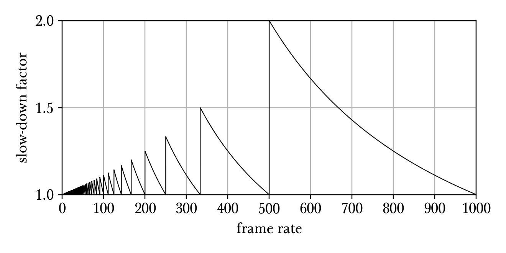

Game fundamentals
=================

This page describes the notations that we will use throughout this documentation. We will also introduce some basic concepts that will be used and assumed in all our discussions.

.. _tracing:

Tracing
-------

Tracing is one of the most important computations done by the game. Tracing is done countless times per frame, and it is vital to how entities interact with one another.

.. note:: expansion needed

Randomness
----------

The Half-Life universe is full of uncertainties, much like our universe at the level of quantum mechanics. There are two sources of random generation, the *shared RNG* and the *non-shared RNG*. The shared RNG is named so because it is computed serverside, while the non-shared RNG is computed at both sides with no synchronisation between them. The shared RNG is usually more important because entities that require RNG in behaviour tend to use shared RNG. On the other hand, the non-shared RNG is typically used for sound and cosmetics.

.. _shared rng:

Shared RNG
~~~~~~~~~~

The shared RNG code is open to public, given in ``dlls/util.cpp``. The computation relies on a *seed table*, which contains 256 entries of unsigned integers. The state of the RNG is global, which is stored as a 32-bit unsigned integer global variable named ``glSeed`` which is initialised to zero at program start up.

To seed the RNG, the code would call ``U_Srand``, which is likely never called directly, as will be explained in a moment. The function seeds the RNG by using the lower 8 bits of a 32-bit unsigned integer parameter as an index to the seed table. The value returned by the seed table is then assigned to ``glSeed``. This implies that there are only 256 ways of seeding the RNG.

The entity code typically call one of two functions to generate random numbers: ``UTIL_SharedRandomLong`` for signed integers and ``UTIL_SharedRandomFloat`` for single precision floating point numbers. The implementations of the two functions can be found in the Half-Life SDK. It is interesting to note that, both of these functions seed the RNG at the very beginning using values dependent solely on their input parameters and nothing else (not even the system time). In fact, these two functions appear to be the only locations in the Half-Life SDK calling the seeding function. Given the observation that there are only 256 possible seeds, it follows that there are only 256 possible values returned by each of these functions. Calling the same function with the same seed repeatedly will result in the same value returned over and over again.

Searching through the Half-Life SDK, the shared RNG is only used for idle weapon animations and randomisation of bullet spread in ``FireBulletsPlayer``. The ``FireBulletsPlayer`` function is called by many conventional weapons such as the MP5, 357, and shotgun (basis of box item duplication, see :ref:`item duplication`). It is not used by the glock, however. The implication is that there are only 256 ways bullets can spread when these weapons are fired. For example, it is feasible to enumerate all of 256 shotgun spread patterns given different seeds and select the ones most suited for a particular purpose.

.. _nonshared rng:

Non-shared RNG
~~~~~~~~~~~~~~

The code for the non-shared RNG is not publicly available. Nevertheless, the Xash3D engine and the leaked Half-Life 2 source code provide the same non-shared RNG code in C++. The non-shared RNG is considerably more complex than the shared RNG. The non-shared RNG is used much more in the game for computations of bullet spreads (such as ``FireBullets``), explosion targets (``BodyTarget``), grenade tumbling velocities, delay between entity "thinks", NPC talking sequences, sounds, etc.

.. note:: expansion needed

.. _frame rate:

Frame rate
----------

   Frame rate dependent slow-down of player movement in older Half-Life engines.

Savestates
----------

.. _delta:

DELTA
-----

The DELTA mechanism is one of the ways Half-Life uses to save bandwidth in
client-server communication.

TODO

Walking through a frame
-----------------------

This section attempts to outline some of the major events relevant to speedrunning that happen in a frame. Extreme detail on how each part of the game engine works is beyond the scope of this documentation. In fact, some believe that code is documentation! Until Valve releases the source code of Half-Life, one can study the Xash3D engine source or the disassembly of Half-Life.
