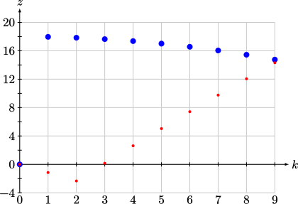
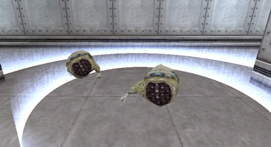

Monsters
========

Monsters, also known as NPCs, have some of the least understood behaviours in
Half-Life. Some of the most unpredictable and perplexing tricks are related to
NPC behaviour. For example, luring the scientist in Questionable Ethics to a
retina scanner fluently is a notoriously hit-and-miss endeavour. Therefore, it
is the goal of this chapter to attempt to describe monster behaviour in
Half-Life to validate and disprove existing beliefs or superstitions.

General AI
----------

.. attention:: This section is **work-in-progress**. The information here may be incomplete.

In this section, we will describe the general AI framework shared by all
monsters in Half-Life, specifically subclasses of ``CBaseMonster``.
Understanding the AI system in Half-Life is crucial in comprehending behaviours
of specific monster types. Keep the Half-Life SDK code opened on the side to aid
understanding.

For a given monster, all AI behaviour starts with ``RunAI`` defined in ``monsterstate.cpp``. This function is
called by ``MonsterThink`` 10 times per second. This function may be overridden
by subclasses. In vanilla Half-Life, only the human assassin, bullsquid, and
controller monster classes do so. As a high level overview, this function checks
for enemies and ensures the *schedules* are running.

A *schedule* composes a series of *tasks* to represent a complex behaviour. Each
task represents an atomic, basic, predefined action, along with a floating point
parameter, the meaning of which depends on the task. For example,
``TASK_MOVE_TO_TARGET_RANGE`` causes the monster to move to within some radius
from the entity pointed to by ``m_hTargetEnt``, where the radius is specified by
the parameter given to the task. Therefore, in addition to the task type, a
schedule also defines a parameter for each task type.

The ``MaintainSchedule`` called by ``RunAI`` is responsible of executing the
tasks in the current schedule or getting new schedules to run. It has a big loop
which executes at most 10 iterations. The loop initiates the execution of new
schedules or tasks with ``StartTask`` within the current schedule. In general,
tasks that can be completed immediately as soon as they are executed will be
executed across several iterations of this loop, until encountering no more
tasks or a task that will take some time to complete (for example, walking to a
point can take many frames). If task is taking a while to execute, every time
``MaintainSchedule`` is called, the ``RunTask`` function is called on the
currently executing task.

The ``StartTask`` and ``RunTask`` functions mentioned above are defined in the
base monster class, though they are often extended by subclasses. These
functions are essentially implementations of the finite state machine, where
given a task and some existing states or conditions, some action is performed
and the task is either completed, failed, or made to continue executing, with
potentially some state changes.

TODO

TODO

As mentioned above, a schedule can be interrupted when some conditions
associated with the entity are set (bits in ``m_afConditions``). The specific
conditions needed to interrupt a schedule vary from schedule to schedule and are
up to the game developer. Generally, for "talk monsters", which is the
superclass of talking monsters like barney guards and scientists, schedules are
interrupted by conditions related to sound, damage, or seeing a new enemy. This
is why shooting a scientist while he is talking will interrupt it. And this is
also why when you push a scientist away, he would literally prefer death to
being interrupted by damage or grenades while walking. This is shown by the
definition of ``slMoveAway`` in ``talkmonster.cpp``:

.. code-block:: c++
   :emphasize-lines: 6

   Schedule_t slMoveAway[] =
   {
     {
       tlMoveAway,
       ARRAYSIZE ( tlMoveAway ),
       0,
       0,
       "MoveAway"
     },
   };

Observe that the ``iInterruptMask`` is 0 in the highlighted line, which means
nothing can interrupt the schedule except death. NPCs in Half-Life can be
surprisingly persistent and stubborn, and this is just one of the ways this
character trait is manifested.

Interestingly, when ``bits_COND_HEAR_SOUND`` is set in ``iInterruptTask``, the
monster will only be interrupted by sounds defined in ``iSoundMask``. The
possible bits for the sound mask is defined in ``dll/soundent.h``. The code for
this behaviour is implemented in ``Listen``, where ``bits_COND_HEAR_SOUND`` or
smell conditions are set only if the sound matches the sound mask, or if
``pCurrentSound->m_iType & iMySounds`` is true.

TODO

TODO

.. TODO think about where to put the following paragraph, and organise it
   better! The functions are introduced in quite an ad-hoc way.

Yawing to face a particular direction is a common task done by monsters.
Examples of these tasks are ``TASK_FACE_ENEMY``, ``TASK_FACE_PLAYER`` etc.
Yawing is done by first setting the *ideal yaw* of the entity, typically by
calling ``MakeIdealYaw`` defined in ``dll/monsters.cpp``. This function takes a
destination vector as argument and computes the yaw that would face it. Then,
``ChangeYaw`` is called with yaw speed as its argument. If the input yaw speed
is :math:`\omega`, then ``ChangeYaw`` adds :math:`\min(10\omega\tau,
\vartheta_\mathrm{ideal} - \vartheta)` to the current yaw. In the case of
``TASK_FACE_PLAYER``, the task will be completed when the difference between
ideal and current yaw is less than 10 degrees and the minimum time to finish the
task has been met (given by the floating point argument to the task). Since this
task is only run 10 times per second, the *actual* yawing speed (in degrees per
second) is only

.. math:: 100\tau\omega

Therefore, the lower the frame rate (i.e. the higher the frame time
:math:`\tau`), the higher the yawing speed.

.. TODO talk about overshoot? Does this actually happen?

Taking cover from sound
~~~~~~~~~~~~~~~~~~~~~~~

Most players would be familiar with the behaviour of monsters running away from
grenades. Most people also believe that these monsters have the capability to
look at grenades, get visual confirmation, and attempt to run away. This is not
true, however. Monsters generally do not track grenades visually. Instead, they
listen to the sounds. Under the right conditions, a hand grenade (see
:ref:`handgrenade`) generates a specific sound which triggers surrounding
entities to flee. Similarly, firing an MP5 grenade (see :ref:`mp5`) also creates
the same type of sound alert. Upon hearing these specific types of sound, a
monster will attempt to take cover.

Each monster type can have its specific implementation of this behaviour. For
example, the human grunt implements ``slGruntTakeCoverFromBestSound`` and does
not use the default ``slTakeCoverFromBestSound`` defined in ``defaultai.cpp``.
Also, each monster may differ in how this schedule is triggered, though
generally ``GetScheduleOfType(SCHED_TAKE_COVER_FROM_BEST_SOUND)`` is called in
``GetSchedule`` when the closest sound returned by ``PBestSound`` has type
``bits_SOUND_DANGER``. This type of sound is created when a hand grenade lands
at a low speed, or when an MP5 grenade if fired, for example.

Regardless of the specific schedule used, the
``TASK_FIND_COVER_FROM_BEST_SOUND`` is typically defined, and this task is
handled by ``CBaseMonster::StartTask``. The most important function called is
``FindCover``, which uses the world's node graph to traverse the map.
Consequently, if no node graph is defined in adjacency, then this function would
not work. If the right conditions are met, of which there are many, a suitable
node will be selected, and ``MoveToLocation`` will be called to move towards the
selected node. ``MoveToLocation`` in turn builds a complete route towards the
node, and the route is stored in ``m_Route``. In subsequent calls to
``MaintainSchedule``, the monster will move from one point to another in the
route array until something causes it to fail, or the route is completed.

Attacking enemies
~~~~~~~~~~~~~~~~~

Most monsters in Half-Life attack the player or other monsters. This is not
surprising, as otherwise there would be no game play to speak of. As a
high-level overview, when a monster sees an enemy, some condition bits will be
set, and the monster state will transition into the *combat* state. Under this
state, the base class's ``GetSchedule`` will return the appropriate schedules to
attack, chase, or take cover.

TODO

Gonarch
-------

The gonarch is a complex monster.

.. _nihilanth:

Nihilanth
---------

Nihilanth is one of the more complex monsters in Half-Life. The nihilanth begins
with 20 floating health spheres around its head. There are three crystal health
recharger in big cylindrical chamber. Nihilanth has an initial health
:math:`\mathcal{H}` of 800 in easy and medium modes, and 1000 in hard mode. When
its health gets reduced below the original health, it will absorb energy
spheres, with each sphere giving a health of :math:`\mathcal{H} / 20`.
Effectively, the nihilanth starts off with twice the designated health.

Death process
~~~~~~~~~~~~~

The process of getting the nihilanth to open his head involves a few steps. The
nihilanth in turn maintains a few critical state information involves these
steps, such as the integers *level* and the *irritation*, among others. The
*level* starts off at 1, and *irritation* at 0. We know that the nihilanth only
opens his head when the *irritation* is 2. In order for the *irritation* to get
to 2, the *level* must get to 10 or above.

As long as either the health is below half the original health *or* the number
of health spheres is below 10, and *level* is at most 9, and ``m_hRecharger`` is
null (he has not found a crystal recharger), then *level* will be incremented
gradually. In fact, it is incremented every time some sequence has completed,
namely when ``m_fSequenceFinished`` is true. For example, when the nihilanth is
in the process of firing some energy balls, the sequence is still ongoing, and
therefore *level* will *not* be incremented until it is done.

As soon as *level* goes above 9, *irritation* will be set to 2. This is seen in
this code segment in ``NextActivity``:

.. code-block:: cpp

   ALERT( at_aiconsole, "nihilanth can't find %s\n", szName );
   m_iLevel++;
   if (m_iLevel > 9)
     m_irritation = 2;

When *irritation* is 2, then the head will open, provided he is not firing the
usual high-damage energy balls attack. You can guarantee this by ensuring the
health is below half the original health. This is because, according to
``NextActivity`` again,

.. code-block:: cpp
   :emphasize-lines: 1

   if (m_irritation >= 2 && pev->health < gSkillData.nihilanthHealth / 2.0)
   {
     pev->sequence = LookupSequence( "attack1_open" );
   }
   else
   {
     ...
   }

That is, only when the health if below half the original, and *irritation* is 2
or above, would the ``attack1_open`` sequence be used, corresponding to the
low-damage single-shot energy ball attack with the head open.

Unfortunately, *irritation* being 2 is the necessary condition to kill
nihilanth, therefore placing a hard limit on how soon we can kill him. To
understand why, notice that when the *irritation* is *not* 3, ``TakeDamage``
always sets the nihilanth's new health to

.. math:: \mathcal{H}' =
          \begin{cases}
          \mathcal{H} - D & D < \mathcal{H} \\
          1 & D \ge \mathcal{H}
          \end{cases}

This implies that there is no way to get his health below 0, thus preventing him
from dying by running ``DyingThink``. Only if *irritation* is 3 does
``TakeDamage`` allow his health to get below 0. In order to get *irritation* to
3, we must look at this relevant block in ``TraceAttack``:

.. code-block:: cpp

   if (m_irritation == 2 && ptr->iHitgroup == 2 && flDamage > 2)
     m_irritation = 3;

This is the only location in ``nihilanth.cpp`` which bumps up *irritation* to 3.
Presumably, hitgroup 2 refers to the part inside nihilanth's head.

In a speedrun, most of the time combating nihilanth is spent waiting for *level*
to gradually increment to 10. The speedrunner must minimise the number of times
nihilanth does any kind of attack, because an attack sequence takes longer to
complete, and while it is playing, ``NextActivity`` will not be called, and
therefore slowing down *level* increments. In addition, the speedrunner must get
the health to as low as possible, even though this is technically not necessary
for *level* to increment. Consider this line in ``HuntThink`` after obtaining
the next sequence to run:

.. code-block:: cpp

   pev->framerate = 2.0 - 1.0 * (pev->health / gSkillData.nihilanthHealth);

That is, the sequence frame rate is higher when the health is lower. Higher
sequence frame rate meant that a sequence completes faster, which implies
``NextActivity`` gets called more frequently, and therefore *level* increments
quicker. In fact, the frame rate at 1 health is nearly twice of that at full
health, implying *level* increments twice as fast.

Reducing health absorption
~~~~~~~~~~~~~~~~~~~~~~~~~~

It is also worth noting that, we can make nihilanth absorb only 10 health
spheres as opposed to 20, thus greatly reducing the amount of damage needed to
inflict upon nihilanth to minimise its health and maximising sequence frame
rate. Namely, we simply save and load when the number of spheres that have been
absorbed is at least 10. When the game loads, the rest of the sphere entities
will be gone, despite them seemingly being visible in the game. To see why,
consider this line in ``nihilanth.cpp`` defining data to be saved:

.. code-block:: cpp

   DEFINE_ARRAY( CNihilanth, m_hSphere, FIELD_EHANDLE, N_SPHERES ),

The ``CNihilanth`` class stores an array of 20 health spheres as ``m_hSphere``,
and of type ``EHANDLE``. When the game is saved, ``CSave::WriteFields`` in
``utils.cpp`` checks to see if a field is empty by checking if the data of that
field is all zeros or nulls. The ``DataEmpty`` function is used for this
purpose, and crucially, this function checks its given data byte-by-byte. A
lookup table of the sizes of various types of field data is used to look up the
size of one element. The developers, however, defined the size of ``EHANDLE`` to
be equal to the size of ``int``, when, in fact, ``sizeof(EHANDLE)`` is 8 while
``sizeof(int)`` is 4. As a result, only the first :math:`20 \cdot 4 = 80` bytes
of ``m_hSphere`` is checked, skipping the next 80 bytes. Therefore, when 10
spheres have been absorbed, the first half of the ``m_hSphere`` array will be
all nulls, fooling ``WriteFields`` into thinking the entire array is empty, when
in fact, it may not be. Consequently, ``m_hSphere`` is never written onto the
disk, and upon restore, the entire array is zero-initialised and losing all
health spheres.

Talk monster
------------

A talk monster is a class that is overridden by monsters that can talk,
including barney guards and scientists. A talk monster makes idle chatter from
time to time. This is done mostly by the ``GetScheduleOfType`` function which
returns chatter schedules based on non-shared RNG (see :ref:`nonshared rng`).

Notably, talk monsters have the ability to move away from a player's push, coded
by the ``slMoveAway`` schedule. In the schedule definition, we see that a talk
monster walks for 100 units before stopping and yawing towards the player.

Talk monsters generally can be used by the player to follow him. The
``FollowerUse`` function is responsible of checking the conditions for following
and calling ``StartFollowing`` on the player entity. In the ``StartFollowing``
function, ``m_hTargetEnt`` is assigned to be the player entity. Subsequently,
the specific schedules and tasks a monster takes to actually do the following
can vary.

Take the scientist in ``scientist.cpp`` as an example. When the monster state is
*idle* or *alert*, ``GetSchedule`` will check for some conditions and ultimately
call ``GetScheduleOfType(SCHED_TARGET_FACE)`` (or the "scared" counterpart),
which returns ``slFaceTarget`` in the right conditions. In the definition for
the ``slFaceTarget`` schedule, we see that the ``TASK_SET_SCHEDULE`` is defined
with ``SCHED_TARGET_CHASE`` as its parameter. When this task is executed,
``GetScheduleOfType(SCHED_TARGET_CHASE)`` will return ``slFollow``, which is the
final schedule that actually makes the scientist moves to the target pointed by
``m_hTargetEnt``, which is the player if used earlier. A similar tracing can be
done for barney.

.. note:: Not all monsters who can talk are talk monsters. For example, the
          G-Man can speak scripted sentences, but he inherits from
          ``CBaseMonster``.

Barney
~~~~~~

Barney guards are common in Half-Life. They play a vital role in a few very
time-saving tricks in Half-Life speedruns.

Due to wearing a vest, the damage received when hitting the stomach may be
halved, depending on the type of damage. This is confirmed by looking at
``TraceAttack``:

.. code-block:: cpp

   case HITGROUP_STOMACH:
     if (bitsDamageType & (DMG_BULLET | DMG_SLASH | DMG_BLAST))
     {
       flDamage = flDamage / 2;
     }
     break;

A barney guard will take cover from his enemy when he receives heavy damage,
specifically, when ``bits_COND_HEAVY_DAMAGE`` is set. This bit is set when a
monster receives a damage :math:`D \ge 20`, according to
``CBaseMonster::TakeDamage`` in ``combat.cpp``.

The barney is also known to retaliate when the player attacks him. However, not
all damage from the player will cause him to do so. Specifically, if the player
attacks barney for the first time but is not looking at him (determined by the
``IsFacing`` function), then the guard will become suspicious but still give the
player the benefit of the doubt. However, any attack the second time will make
barney mad and make the player the enemy. This is done by setting the
``bits_MEMORY_PROVOKED`` bit to ``m_afMemory``. As a result, the next time
``RunAI`` is called, ``GetEnemy`` will be called, which in turn calls
``BestVisibleEnemy``. ``BestVisibleEnemy`` then iterates through a linked list
of monsters, and selects an enemy based on ``IRelationship``. Looking at
``CTalkMonster::IRelationship``, we see that, indeed, when
``bits_MEMORY_PROVOKED`` is set, this function returns ``R_HT``, representing
hatred.

When ``m_hEnemy`` is the player, the barney will begin to attack the player like
any other enemy. The behaviour of attacking and chasing the player is similar to
that of other attacking monsters.

.. TODO Chase Enemy, Range Attack1

Scientist
~~~~~~~~~

Scientists are very weak.

A scientist can heal the player if the player health is less than or equal to 50 and if the player is at most 128 units away from the scientist. Once healed, the scientist will not heal again until after one minute. The heal amount is always 25 health, as specified by the ``sk_scientist_heal`` skill cvars.

.. _squeak grenade monster:

Snarks
------

As a weapon, the behaviour of snarks has been described in :ref:`snarks weapon`.

.. TODO: talk about how snarks classify other enemies!

A snark monster has entity friction and gravity of 0.5. In the default game settings, a snark has a health of 2 regardless of the difficulty. Interestingly, despite being classified as a monster, it behaves more like a grenade with complex seeking and touching behaviours. It does not have an AI in the usual sense of running tasks and schedules. When a snark is spawned, it runs the ``CSqueakGrenade::HuntThink`` function after 0.1s, and once every 0.1s subsequently. Whenever the snark touches any entity, the ``CSqueakGrenade::SuperBounceTouch`` will be called.

.. _snark touching:

Touching behaviour
~~~~~~~~~~~~~~~~~~

When the snark collides with an entity, assuming the movetype is ``MOVETYPE_BOUNCE``, which typically the case if the snark is not underwater, the snark will tend to be bouncy. Recall from :ref:`entity movement` that an entity of ``MOVETYPE_BOUNCE`` will have a bounce coefficient of :math:`b = 2 - k_e` (see :ref:`collision`). Since the snark's entity friction is 0.5, it has :math:`b = 1.5`. This allows snarks to bounce off surfaces very well.

The snark has an owner property. If the snark is tossed by the player, for example, the owner will be set to the player. When ``SuperBounceTouch`` is called, if the owner property is set and the entity that touches the snark is also the owner, it will not run the subsequent logic. In fact, if the owner is set to the player, the snark will not collide with the player at all. However, if the entity that touches the snark is not the owner, then the snark will simply clear the owner property, making it without an owner. Consequently, if the snark touches the ex-owner at some point in the future, the subsequent logic in the ``SuperBounceTouch`` function will run.

.. code-block:: c++
   :caption: ``CSqueakGrenade::SuperBounceTouch``

   // don't hit the guy that launched this grenade
   if ( pev->owner && pOther->edict() == pev->owner )
     return;

   // at least until we've bounced once
   pev->owner = NULL;

The snark also has a property that prevents running the touching logic too frequently:

.. code-block:: c++
   :caption: ``CSqueakGrenade::SuperBounceTouch``

   // avoid bouncing too much
   if (m_flNextHit > gpGlobals->time)
     return;

If all of the following conditions are true, the snark will inflict damage onto the touched entity:

- If the entity that touches the snark is damageable
- The snark's next attack delay is over (``m_flNextAttack < gpGlobals->time``)
- The touched entity is the same as the entity hit by the global trace
- The touched entity is not another snark

The snark inflicts damage using the multidamage mechanism (see :ref:`damage system`). It first does a *clear* operation. Then, it performs *apply* with a damage of :math:`D = 10` in the default game settings, corresponding to the ``sk_snark_dmg_biteX`` cvars. It also adds 5 damage to its accumulated explosive damage, but without inflicting the touched entity with it yet. Finally, it sets the next attack delay to be 0.5s.

Regardless of whether the snark inflicts damage, it always set the ``m_flNextHit`` to be 0.5s from the current game time, and resets ``m_flNextHunt`` to be the current game time, which allows the hunting logic in ``CSqueakGrenade::HuntThink`` to run the next time the think function is called. It also inserts a sound of ``bits_SOUND_COMBAT`` of differing volume and duration depending on whether the snark is onground.

.. _snark hunting:

Hunting behaviour
~~~~~~~~~~~~~~~~~

The snark has a relatively complex think function and behaviour. It first checks if its position and velocity are acceptable and within bounds, and remove itself is not:

.. code-block:: c++
   :caption: ``CSqueakGrenade::HuntThink``

   if (!IsInWorld())
   {
     SetTouch( NULL );
     UTIL_Remove( this );
     return;
   }

The snark then checks if it is time to kill itself, where ``m_flDie`` has previously been set to 15s from the time it spawned in ``CSqueakGrenade::Spawn``:

.. code-block:: c++
   :caption: ``CSqueakGrenade::HuntThink``

   // explode when ready
   if (gpGlobals->time >= m_flDie)
   {
     g_vecAttackDir = pev->velocity.Normalize( );
     pev->health = -1;
     Killed( pev, 0 );
     return;
   }

If the snark's waterlevel is not zero, it will change the movetype to ``MOVETYPE_FLY``, which ignores gravity. Then, the snark's velocity is altered to become

.. math:: 0.9 \mathbf{v}_S + 8 \mathbf{\hat{k}}

where :math:`\mathbf{v}_S` is the current velocity of the snark and :math:`\mathbf{\hat{k}} = \langle 0,0,1\rangle`. If the snark's waterlevel is zero, however, the velocity will remain unchanged but the movetype will be set to ``MOVETYPE_BOUNCE``.

The snark imposes a rate limiting on how frequently it runs the subsequent logic:

.. code-block:: c++
   :caption: ``CSqueakGrenade::HuntThink``

   // return if not time to hunt
   if (m_flNextHunt > gpGlobals->time)
     return;

   m_flNextHunt = gpGlobals->time + 2.0;

Recalled from the description of ``CSqueakGrenade::SuperBounceTouch`` that the snark typically resets ``m_flNextHunt`` to be the current game time when touched by an entity. For example, once the snark touches the ground, it will run the hunting logic as soon as its think function is next called.

.. TODO: finding logic?

Once the snark has found an enemy, it will attempt to jump towards the enemy's eye position. Let :math:`\mathbf{e}` be the enemy's eye position, and :math:`\mathbf{r}_S` be the position of the snark. Then the snark's new velocity will be set to

.. math:: \mathbf{v}_S' = \min\left( 1.2, \frac{50}{\lVert\mathbf{v}_S\rVert + 10} \right) \mathbf{v}_S + 300 \frac{\mathbf{e} - \mathbf{r}_S}{\lVert \mathbf{e} - \mathbf{r}_S \rVert}
   :label: snark hunt vel

Subsequently, if the snark's current position compared to the previous position when this part of the ``HuntThink`` is run differs by a length of less than 1, the snark will use the non-shared RNG (see :ref:`nonshared rng`) to randomly generate its horizontal velocity:

.. math::
   \begin{aligned}
   (S_1, v_{S,x}) &\gets \mathfrak{U}_\mathit{NS}(S_0, -100, 100) \\
   (S_2, v_{S,y}) &\gets \mathfrak{U}_\mathit{NS}(S_1, -100, 100)
   \end{aligned}

In :eq:`snark hunt vel`, the maximum speed is achieved when :math:`\mathbf{v}_S` is parallel to :math:`\mathbf{e} - \mathbf{r}_S`. If we then solve for a fixed point by setting :math:`\lVert\mathbf{v}_S'\rVert = \lVert\mathbf{v}_S\rVert`, we obtain the theoretically maximum speed achievable by hunting alone, disregarding gravity or other external factors, to be

.. math:: \max \lVert\mathbf{v}_S\rVert = 10 \left( 17 + \sqrt{319} \right) \approx 348.6

Indeed, we find that hunting with speeds above that results in a lower new speed :math:`\lVert\mathbf{v}_S'\rVert < \lVert\mathbf{v}_S\rVert`.

.. FIXME: maybe we should really move these to the weapons chapter? and only talk about things like Classify here

.. _snark boosting:

Snark boosting
~~~~~~~~~~~~~~

Snark boosting refers to a general technique of using snarks to prop the player up to gain vertical height. The mechanism is analogous to "prop flying" in Source engine speedruns, except the snark is not under the player's control once released. There are two ways snark boosting can be done: the ad-hoc way and the standard or "right" way. Many speedrunners never figured out how snark boosting can be done in a consistent and reliable way. They would opt for an ad-hoc way of snark boosting, which are characterised by

- using more than one snark
- jumping and/or ducking aperiodically or haphazardly
- inconsistent height gains
- higher frequency of attacks from the snarks

One example of an ad-hoc snark boosting may be found in `this video`_ by qckdth. An ad-hoc snark boosting may still be optimal under certain circumstances if the sequence of actions are tailored and adapted specifically to them. For example, if the player only needs to perform a jump on a snark to leap over some obstacles, then the ad-hoc method may be preferable over the standard method.

.. _this video: https://youtu.be/Hv_ZlxBbfrk?t=1279

In order to achieve the opposite effects of ad-hoc snark boosting, most importantly being able to gain height consistently and indefinitely, we must instead perform it the standard way. There are two phases in standard snark boosting: the transition and the steady state. The process begins with the transition phase, in which the player positions themselves onto a snark. The snark itself is usually tossed by the player a few moments prior, though it could also be released by the map or the environment. In the transition phase, the snark may attack the player occasionally, and the height gains may not be consistent. Once the player is able to perform a ducktap once every 0.1s and achieve consistent height gains, along with the snark undergoing a periodic behaviour, the transition phase ends and the steady state commences.

In the steady state, a cycle begins with the player landing on the snark and becoming onground. Within the same frame, the snark collides with the player, and bounces downward (due to :math:`b = 1.5` given to the general collision equation in :ref:`collision`) with a steady state velocity. In the next frame, the player ducktaps and lifts off into the air, while the snark continues to move downward. Some frames later in the :math:`n_h`-th frame, the snark begins to hunt with the behaviour described in :ref:`snark hunting`, and sets the velocity so that it points upward. At this point, the player is moving downward and the snark is moving upward. Eventually, the player will land on the snark again and the cycle repeats.

   The positions of the player and the snark in one cycle of snark boosting at 100 fps. The blue dots represent the player position, while the red dots represent the snark positions. Note that both the player and the snark are initially at :math:`z = 0`.

Suppose the player lands and becomes onground in frame :math:`k = 0` and ducktaps in frame :math:`k = 1`. Define :math:`z(0) = 0` the initial player *feet* position. Then the player velocity may be given by

.. math:: v_z(k) = -gk\tau_p

The player vertical feet position may be given by

.. math:: z_p(k) = 18 H(k - 1) - \frac{1}{2} gk^2\tau_p^2

where :math:`H(x)` is the Heaviside step function.

Denote :math:`v_c` the vertical velocity in frame :math:`k = 0`, which is the velocity after the snark collides with the player. Let :math:`v_h(v)` be the hunting velocity given by :eq:`snark hunt vel`, restricted to the vertical axis. The snark vertical velocity may be given by

.. math:: v_{z,s}(k) = \left( v_c - g_sk\tau_g \right) \left( 1 - H(k - n_h) \right) \\
   {} + \left( v_h(v_c - g_s \left( n_h - 1 \right) \tau_g) - g_s \left(k - n_h + 1\right) \tau_g \right) H(k - n_h)
   :label: snark boost vel

The snark position at its top is given by the sum

.. math:: z_s(k) = z_s(k-1) + v_{z,s}(k) \tau_g = \tau_g \sum_{i=1}^k v_{z,s}(i)

Suppose the :math:`n_c` is the cycle length, or the number of frames in a cycle. Then using the general collision equation (see :ref:`collision`) we additionally also have

.. math:: v_c = v_{z,s}(n_c) \left( 1 - b_s \right) = v_{z,s}(0)
   :label: snark boost vel cycle

This is the steady state snark velocity. In order for the standard snark boosting to work, we must have

.. math:: z_p(n_c) - 2 \le z_s(n_c-1) \le z_p(n_c-1) - 2
   :label: snark boosting inequality

This is the snark boosting inequality. In other words, in frame :math:`k = n_c - 1`, the player must end with a position above the 2-unit onground layer of the snark, but in frame :math:`k = n_c`, the player position must either end up within the 2-unit onground layer, or below the snark, which implies a collision has occurred.

As described in :ref:`snark hunting`, the snark hunting frequency is rate limited. The way the snark can eliminate the delay is by having its ``CSqueakGrenade::SuperBounceTouch`` called, as described in :ref:`snark touching`, which allows the hunting to occur the soonest in the next frame. However, there is a 0.1s delay for the touching behaviour as well. This implies the snark must touch the player at least 0.1s since the last touch. This provides a lower bound to the cycle length. In addition, the ``CSqueakGrenade::HuntThink`` also has a 0.1s delay between calls that cannot be reset. In order for snark boosting to work consistently, the hunting must also occur at a constant (on average) offset of frames since the start of the cycle, which is given by :math:`n_h`. This is only possible if the cycle length is 0.1s on average.

Finding a :math:`n_h` that satisfies :eq:`snark boosting inequality` is tedious to carry out analytically. We can therefore solve it numerically instead. The general strategy is to simply check the admissibility of each value of :math:`1 \le n_h \le n_c - 1`. For each iteration, we must solve for the steady state velocity :math:`v_c` iteratively from an initial guess using :eq:`snark boost vel` and :eq:`snark boost vel cycle`. The rate of convergence is typically very rapid.

Arresting falls
~~~~~~~~~~~~~~~

Besides damage boosting (see :ref:`damage boosting`), snarks provide the only way of arresting a free fall anywhere mid-air.

Houndeye
--------

Houndeyes are one of the less commonly encountered monsters in speedrunning. Nevertheless, they have a simple and yet unique attack system. Namely, houndeyes can form squads and the damage depends on squad size.

Damage mechanism
~~~~~~~~~~~~~~~~

Houndeyes can form a squad with at most four members. Let :math:`n` be the number of squad members in a squad. Then, upon a sonic attack, a houndeye enumerates entities within a radius of 384 units, or ``HOUNDEYE_MAX_ATTACK_RADIUS`` as defined in the SDK. The houndeye will ignore other houndeyes and entities that cannot take damage.

   A squad of two houndeyes attacking the player.

For each entity in the sphere, denote :math:`\ell` the distance between the centre (not the body centre used in explosion computations) that entity and the houndeye. If the entity is visible from the houndeye's point of view, apply damage

.. math:: D = D_0 \left( 1.1 n - 0.1 \right) \left( 1 - \frac{\ell}{384} \right)

where :math:`D_0` is the default houndeye damage indicated by the ``sk_houndeye_dmg_blast`` skill cvars, which is 10 on normal and 15 on both medium and hard modes. On the other hand, if the entity is not visible then what happens depends on the entity type. If the entity is a player, then the houndeye halves the damage :math:`D \gets D/2` dealt. If the entity is ``func_breakable`` or ``func_pushable``, then the original damage is dealt without halving. For all other entity types, the damage will be set to zero :math:`D \gets 0`.

This is one of the more complex damage formula. The damage dealt depends on the squad size, and reaches a maximum of 4.3 times the original damage in the case of :math:`n = 4`, which can be devastating. The damage also depends on the radius of the target entity away from the houndeye, similar to how explosive damage works (see :ref:`explosions`).

Hopping
~~~~~~~

Houndeyes are also one of the few monsters that can hop into the air. When the animation frame ``HOUND_AE_HOPBACK`` is played, the houndeye will set its velocity to

.. math:: \mathbf{v} = -200 \mathbf{\hat{f}} + \langle 0,0, 0.3g \rangle

where :math:`\mathbf{\hat{f}}` is the last ``gpGlobals->v_forward``, and :math:`g` is the value of ``sv_gravity``. This can and has been exploited to allow the player to jump to higher platforms, by having the houndeye jump first, and then jumping on top of it. One example of such use can be found in `this Blue Shift run <https://youtu.be/VPBckCOJ2Kk?t=353>`_ at 5:53 by quadrazid and rayvex, where he shot the houndeye to make it jump.

.. TODO: is this the player's view vector or the houndeye's? Or is it not either? gpGlobals->v_forward can be changed by MakeVectors. OK there's a call in GetSchedule

..
   Assuming :math:`g = 800` and the player views vertically downward so that :math:`\mathbf{\hat{f}} = \langle 0,0,-1\rangle`, we can make the houndeye jump with an upward speed of 440 ups. This is a relatively high jumping speed, almost twice of that of the player (see :ref:`jumping`).

Headcrab
--------

.. TODO: talk about the conditions for jumping

Headcrabs are one of the most iconic monsters in Half-Life. They have a unique ability to jump towards the enemy's face and apply ``DMG_SLASH`` to it upon touch.

   Illustration of how a headcrab plots its trajectory when attacking an enemy by leaping.

When a headcrab is ready to attack by leaping, it will first shifts its position up by one unit. Then it targets the enemy's view (offset from the enemy's centre, as indicated by the point :math:`V` in :numref:`headcrab jump`) and tries to make its final vertical velocity at :math:`V` be zero. This amounts to computing the *initial* vertical speed, as obtained from solving classical mechanics,

.. math:: v_z = \sqrt{2\max(g,1)\max(h,16)}

where :math:`h` is the height difference between the centre of headcrab at :math:`C_H` and :math:`V`, and :math:`g` is the value of ``sv_gravity``. Notice that the headcrab will always make the height difference to be at least 16. The headcrab will then compute the time needed to travel to that height given this vertical velocity by

.. math:: \Delta t = \frac{v_z}{g}

This is followed by computing the initial horizontal velocity and replacing the vertical component by the initial vertical velocity computed above:

.. math:: \mathbf{v} = \frac{\mathbf{r}_V - \mathbf{r}_{C_H}}{\Delta t} \operatorname{diag}(1,1,0) + \left\langle 0,0,v_z \right\rangle

where :math:`\operatorname{diag}(1,1,0)` is a matrix projecting points to the horizontal plane, or simply one which extracts only the :math:`x` and :math:`y` components. The resulting trajectory is one that is illustrated by the parabola in :numref:`headcrab jump` from :math:`C_H` to :math:`V`. However, the headcrab does not stop here. If the speed :math:`\lVert\mathbf{v}\rVert > 650`, then the headcrab will scale it down to 650. This prevents the headcrab from jumping too far. This also implies that the headcrab can theoretically jump a maximum height of approximately 264 units when its initial vertical velocity is 650.

As soon as the headcrab starts jumping, the headcrab begins to have a touch function set, which applies damage to any damageable entity that is not of the ``CLASS_ALIEN_PREY`` class. If this condition satisfies, the headcrab will apply damage when it's not on ground, and immediately after that, disable the touch function so as to prevent further damages.

Bullsquid
---------

Bullsquids are one of the few monsters that can hop slightly into the air. When the ``BSQUID_AE_HOP`` animation frame is played, the bullsquid will set its vertical velocity to

.. math:: v_z' = v_z + 0.3125g

where :math:`g` is the value of ``sv_gravity``. If :math:`g = 800`, then the boost in vertical velocity is :math:`\Delta v_z = 250`, which is just a little under the player jumping speed (see :ref:`jumping`).

Bullsquid melee attacks are also notable in the ability to launch the player into the air. For the ``BSQUID_AE_THROW`` attack, the bullsquid could set the player velocity to

.. math:: \mathbf{v}' = \mathbf{v} + 300 \mathbf{\hat{f}} + 300 \mathbf{\hat{u}}

where :math:`\mathbf{\hat{f}}` and :math:`\mathbf{\hat{u}}` are the *bullsquid's* forward and up view vectors respectively.

Bullsquid's ranged attack is the highly recognisable spitting of green acid from a long distance. The green spit travels at a speed of *approximately* 900 ups as hardcoded in the SDK, in the direction towards the enemy. It is not exactly 900 ups because the spread of the spit is calculated without normalising the direction vector. Namely, if :math:`\mathbf{\hat{d}}` is the unit direction vector, then the spread is computed by setting

.. math:: \mathbf{d}' = \mathbf{\hat{d}} + \left\langle U(-0.05,0.05), U(-0.05,0.05), U(-0.05,0) \right\rangle

where :math:`U(a,b)` denotes a sample from the uniform distribution in :math:`[a, b]`, and the final spit velocity would be :math:`\mathbf{v} = 900\mathbf{d'}`.

Alien grunt
-----------

Alien grunts are some of the toughest monsters in the game, and for a good reason. In the game storyline, they are armoured, and thus they are able to sustain more damage. But to be specific, they do not have an armour that work like the player's armour value. Instead, there is a hitgroup on the hitboxes that causes damages to it to be significantly reduced. When an enemy attacks the armoured hitboxes with damage :math:`D` and damage type ``DMG_BULLET``, or ``DMG_SLASH`` or ``DMG_CLUB``, the actual damage dealt will be

.. math:: D' =
          \begin{cases}
          D - 20 & D > 20 \\
          0.1 & D \le 20
          \end{cases}

That is, roughly, the damage dealt will be cut by a flat value of 20. In addition to the special armoured hitgroups, we must note that damaging the head of an alien grunt brings no benefits, unlike most other monsters. There is no three times scaling of damage from headshots.

..
   Zombie
   ------

   Zombies are one of the most iconic monsters in Half-Life as well. They do not have particularly interesting behaviour in the speedrunning context, though there is a notable aspect when receiving damage. Namely, a damage :math:`D` that is of pure ``DMG_BULLET`` type will only deal :math:`0.3D` to the zombie's health. This can be an important consideration when killing zombies as fast as possible is a concern. It is important to note that this only applies when the damage type is purely ``DMG_BULLET`` without other bits like ``DMG_NEVERGIB`` set.

