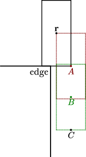

.. _player movement:

Player movement basics
======================

.. TODO: talk about edgebug, slopejump?, player specific friction, edgefriction, basevelocity, put down FMEs, onground stuff!

In this chapter, we will focus on the fundamental governing equations for the air and ground player movements, and the exploitation of some of the miscellaneous physical phenomena. This chapter also serves as a prerequisite to :ref:`strafing`.

.. _player gravity:

Gravity
-------

Like other entities in the Half-Life universe, the player experiences gravity. Whenever the player is in the air, the waterlevel is less than 2, and not waterjumping (see :ref:`waterjump`), a constant downward acceleration will be applied. The gravity in the Half-Life universe works in a similar way to the Newtonian gravity in the real world. Namely, a free falling object experiences a *constant* acceleration of :math:`g`, with value specified by

.. math:: g = \mathtt{sv\_gravity} \cdot g_e

where :math:`g_e` is may be called the *entity gravity*, which is a modifier that scales the default gravity. Typically, :math:`g_e = 1`, though it can take a fractional value in Xen, for example. The consequence of a constant acceleration is that the velocity and position of the object at time :math:`t` is

.. math:: v_t = v_0 - gt, \quad s_t = s_0 + v_0 t - \frac{1}{2} g t^2
   :label: gravity kinematics

Recall that the Half-Life universe runs at quantised time, that is assuming constant frame rate we may write :math:`t = n\tau`. Or, :math:`t = \tau` after one frame. In Half-Life physics, the new position is not updated directly using the position equation above, but rather, it is obtained by a position update step described in :ref:`player position update`.

Looking closely at the code of ``PM_PlayerMove``, we see that the game applies *half gravity* to the player *before* acceleration and position update by using ``PM_AddCorrectGravity``, which modifies the vertical velocity and the vertical basevelocity by

.. math::
   \begin{aligned}
   v_z &\gets v_z - \frac{1}{2} g\tau_p + b_z\tau_p \\
   b_z &\gets 0
   \end{aligned}

where :math:`b_z` is the vertical :math:`z` component of the basevelocity :math:`\mathbf{b}`. After position update, the the second half of gravity will be added using ``PM_FixupGravityVelocity``, altering the vertical velocity by

.. math:: v_z \gets v_z - \frac{1}{2} g\tau_p

To see the game splits the gravity computation into halves like so, ignoring basevelocity, we write the vertical velocity after the first half of gravity as

.. math:: \tilde{v}_z' = v_z - \frac{1}{2} g\tau

The position update step follows from there, by computing the new vertical position

.. math:: r_z' = r_z + \tilde{v}_z' \tau = r_z + v_z \tau - \frac{1}{2} g\tau^2

After this, the second half of gravity is applied to compute the correct final vertical velocity

.. math:: v_z' = \tilde{v}_z' - \frac{1}{2} g\tau = v_z - g\tau

Now observe that both :math:`r_z'` and :math:`v_z'` are correct in accordance to classical mechanics in :eq:`gravity kinematics`. Had the gravity been calculated in any other way, the final vertical position and velocity would be incorrect. This technique of breaking up the acceleration is a variant of the `leapfrog integration`_ in the study of numerical integration. It can be shown that trajectory of player motion is indeed parabolic and independent of the frame rate. That is, the trajectory fits the parabolic curve generated using classical mechanics perfectly. Consequently, the jump height is also independent of frame rate. Vertically launching from a ladder, however, does result in frame rate-dependent heights (see :ref:`ladder exit`).

.. _leapfrog integration: https://en.wikipedia.org/wiki/Leapfrog_integration

On the other hand, the straightforward way of integrating gravity is to calculate the full (as opposed to half) gravity :math:`v_z' = v_z - g\tau`, followed by the position update :math:`r_z' = r_z + v_z' \tau`. Notice that this means

.. math:: r_z' = r_z + v_z \tau - \color{red}{g\tau^2}

In other words, the new vertical position :math:`r_z'` is incorrect, because the term in red is incorrect compared to :eq:`gravity kinematics`. Essentially, this approach is equivalent to the `Euler's method`_ of integrating a differential equation. Not only would the errors accumulate over time, but also that the jump height will be dependent on the frame rate.

.. _Euler's method: https://en.wikipedia.org/wiki/Euler_method

.. _player friction:

Ground friction
---------------

When the player is moving on the ground, friction will be applied to reduce the horizontal speed. The friction is applied before air and ground movement calculations (see :ref:`player air ground`) in ``PM_Friction``. The player friction differs from the friction applied to all other entities in that different types of friction is applied depending on the horizontal speed.

Let :math:`E` be the *stop speed*, the value of ``sv_stopspeed`` which is typically 100. Let :math:`k` be the value of

.. math:: k = \mathtt{sv\_friction} \cdot k_e \cdot e_f

which is usually 4 and where :math:`k_e` is called the *entity friction*. The entity friction can be modified by a friction entity (see :ref:`func_friction`). The :math:`e_f` is the *edgefriction* which will be described in a moment. It is usually 1 but can often be 2. The two dimensional player velocity immediately after applying friction (but before air or ground acceleration) is now

.. math:: \lambda(\mathbf{v}) =
   \begin{cases}
   (1 - \tau k) \mathbf{v} & \lVert\mathbf{v}\rVert \ge E \\
   \mathbf{v} - \tau Ek \mathbf{\hat{v}} & \max(0.1, \tau Ek) \le \lVert\mathbf{v}\rVert < E \\
   \mathbf{0} & \lVert\mathbf{v}\rVert < \max(0.1, \tau Ek)
   \end{cases}
   :label: general friction

Assuming :math:`\lVert\mathbf{v}\rVert \ge E`. Now observe that the player speed is scaled by a constant factor (assuming :math:`k` and :math:`\tau` are constant) each frame, resulting in an exponential decrease. This may be called *geometric friction*, because the series of speeds in consecutive frames forms a geometric series. At higher horizontal speeds this type of friction can be devastating, because higher speeds are harder to achieve and maintain (owing to the sublinear growth of speed by pure strafing, see :ref:`strafing`), but the factor scales down the speed by an amount proportional to it.

Assuming no other influences and the condition for geometric friction is always satisfied. At frame :math:`n`, the speed due to geometric friction is

.. math:: \lVert\mathbf{v}_n\rVert = \lVert\lambda^n(\mathbf{v}_0)\rVert = (1 - \tau k)^n \lVert\mathbf{v}_0\rVert

Since time is discretised in the Half-Life universe, we have :math:`t = \tau n`. Therefore,

.. math:: \lVert\mathbf{v}_t\rVert = (1 - \tau k)^{t/\tau} \lVert\mathbf{v}_0\rVert

From this equation, it can be shown, assuming sensible positive values for :math:`k` and :math:`tau`, that the lower the frame rate, the greater the geometric friction. However, the difference in friction between different frame rates is so minute that it does not make much practical difference.

In the second case in :eq:`general friction`, the type of friction being applied may be called *arithmetic friction*, because the speeds of consecutive frames form an arithmetic series. Namely, at frame :math:`n`, we have

.. math:: \lVert\mathbf{v}_n\rVert = \lVert\mathbf{v}_0\rVert - n\tau Ek, \quad
   \lVert\mathbf{v}_t\rVert = \lVert\mathbf{v}_0\rVert - tEk

This type of friction is independent of the frame rate, unlike the geometric friction.

In the third case of :eq:`general friction`, where the speed is very low, the speed is simply set to zero. This case makes little practical difference.

.. _edgefriction:

Edgefriction
~~~~~~~~~~~~

Edgefriction is a an extra friction applied to the player when the player is sufficiently close to an edge that is sufficiently high above from a lower ground. Let :math:`\mathbf{r}` be the player position, and :math:`\mathbf{v}` the player velocity. Define

.. math::
   \begin{aligned}
   A &= \mathbf{r} + 16 \mathbf{\hat{v}} \operatorname{diag}(1,1,0) - \langle 0,0,H_z\rangle \\
   B &= A - \langle 0,0,34\rangle
   \end{aligned}

Here, :math:`\operatorname{diag}(1,1,0)` is a matrix with diagonal entries of :math:`1, 1, 0`. :math:`H_z` is half the hull height of the player, which depends on the ducking state.

.. math:: H_z =
   \begin{cases}
   36 & \text{standing} \\
   18 & \text{ducked}
   \end{cases}

See :ref:`ducking` for a descriptions of ducking states. Effectively, this makes :math:`A` level with the player's feet. With :math:`A` and :math:`B` computed, the game performs a player trace from :math:`A` to :math:`B`. If nothing is in the way between the two points, the game will set :math:`e_f` to the value of ``edgefriction``. In the default settings of Half-Life, this amounts to :math:`e_f = 2`, doubling :math:`k` from its normal value.

   If the player hull trace from :math:`A` to :math:`B` does not collide with a solid entity, then edgefriction will be applied. Note that :math:`C` is :math:`34 + 36 = 70` units below :math:`A`.

Although doubling :math:`k` seems minor at first glance, the effect is *devastating*. Prolonged groundstrafing towards an edge can drastically reduce the horizontal speed, which in turn affects the overall airstrafing acceleration after jumping off the edge. One way to avoid edgefriction is to jump or ducktap before reaching an edge and start airstrafing. In human speedrunning terms, the technique of ducktapping before an edge is sometimes called *countjump*. However, this is sometimes infeasible due to space or other constraints. The most optimal way to deal with edgefriction is highly dependent on the circumstances. Extensive offline simulations may be desirable.

.. _player air ground:

Air and ground movements
------------------------

The physics governing the player's air and ground movements are of primary importance. With precise inputs, they can be exploited to allow mathematically unbounded speed gain (barring ``sv_maxvelocity``). The consequences of the air and ground physics will be described in detail in :ref:`strafing`.

.. note:: All vectors in this section are two dimensional on the :math:`xy` plane unless stated otherwise.

The air or ground accelerations are computed before position update (see :ref:`player position update`). Let :math:`\mathbf{v}` the initial player velocity in *two dimensions*, namely the velocity immediately before friction and acceleration are applied. Then the FME is simply

.. math:: \mathbf{v}' = \lambda(\mathbf{v}) + \mu\mathbf{\hat{a}}

Here, :math:`\mathbf{\hat{a}}` is called the *unit acceleration vector*, such that

.. math:: \mathbf{a} = F \mathbf{\hat{f}} + S \mathbf{\hat{s}} \implies
          \mathbf{\hat{a}} = \frac{F\mathbf{\hat{f}} + S\mathbf{\hat{s}}}{\sqrt{F^2 + S^2}}

A few notes to be made here. First, the :math:`F` and :math:`S` are the forwardmove and sidemove respectively, described in :ref:`FSU`. Second, :math:`\mathbf{\hat{f}}` and :math:`\mathbf{\hat{s}}` are the unit forward and side view vectors described in :ref:`view vectors`. But more importantly, they are obtained by setting :math:`\varphi = 0` in the equations, regardless of the player's actual pitch. Consequently, they do not have a component in the :math:`z` axis.

Define :math:`M` such that

.. math:: M = \min\left( M_m, \lVert\mathbf{a}\rVert \right) = \min\left( M_m, \sqrt{F^2 + S^2} \right)

where :math:`M_m` is ``sv_maxspeed``. Observe that :math:`M` is always capped by ``sv_maxspeed``. Observe also that if :math:`F` and :math:`S` are not sufficiently large, one can end up with a smaller value of :math:`M` below ``sv_maxspeed``, which results in lower accelerations, as we will see later. In addition, if :math:`U \ne 0`, then :math:`F` and :math:`S` will be smaller compared to that when :math:`U = 0`, and so :math:`M` will also be smaller. Therefore, it is undesirable to have any :math:`U` at all if we want as much horizontal acceleration as possible.

In the FME, we also have the :math:`\mu` coefficient. This coefficient may be written as

.. math:: \mu =
   \begin{cases}
   \min(\gamma_1, \gamma_2) & \gamma_2 > 0 \\
   0 & \gamma_2 \le 0
   \end{cases}

where

.. math:: \gamma_1 = k_e \tau MA \quad\quad
   \gamma_2 = L - \lambda(\mathbf{v}) \cdot \mathbf{\hat{a}} = L - \lVert\lambda(\mathbf{v})\rVert \cos\theta

Recall that :math:`k_e` is the entity friction described in :ref:`player friction`. :math:`A` is the value of either ``sv_accelerate`` or ``sv_airaccelerate``, used for ground and air movement respectively. :math:`L` is either :math:`M` or :math:`\min(30, M)`, for ground and air movement respectively. :math:`\theta` is the shortest angle between :math:`\mathbf{v}` and :math:`\mathbf{\hat{a}}`.

We can observe that if :math:`\gamma_2 \le 0`, there will be no acceleration at all. This occurs when

.. math:: \cos\theta \ge \frac{L}{\lVert\lambda(\mathbf{v})\rVert}

Now observe that if :math:`\lVert\lambda(\mathbf{v})\rVert < L`, then this condition will never hold because the maximum value of :math:`\cos\theta` is :math:`1`. That is to say, at lower speeds, the player will be able to accelerate regardless of :math:`\theta` (barring a few zero points). With speeds beyond :math:`L`, acceleration will not occur with angles

.. math:: \lvert\theta\rvert \le \arccos \frac{L}{\lVert\lambda(\mathbf{v})\rVert}

This is just one of the consequences of the FME. Exploitations of this equation will be detailed in :ref:`strafing`.

Having computed the new velocity :math:`\mathbf{v}'`, the basevelocity :math:`\mathbf{b}` will be added to the player velocity as

.. math:: \mathbf{v}' \gets \mathbf{v} + \mathbf{b}

Then, a position update will be performed as described in :ref:`player position update`. Once the position is updated, the basevelocity will be "removed" from the velocity by

.. math:: \mathbf{v}' \gets \mathbf{v} - \mathbf{b}

Water movements
---------------

.. TODO: talk about waterlevel

Water movement has less exploitation potential than air and ground movement. Nonetheless, due to its ability to slow the player down, we should strive to understand its physics. Here, all vectors are three dimensional and the waterlevel must be 2 or above to run water physics.

Let :math:`\mathbf{v}` be the player velocity and :math:`\mathbf{b}` the basevelocity. Then the game first modifies the velocity as such:

.. math:: \mathbf{v} \gets \mathbf{v} + \mathbf{b}

Subsequently, the acceleration vector is computed as

.. math:: \mathbf{a} =
          \begin{cases}
          F \mathbf{\hat{f}} + S \mathbf{\hat{s}} + \langle 0, 0, U\rangle & F \ne 0 \lor S \ne 0 \lor U \ne 0 \\
          \langle 0, 0, -60 \rangle & F = 0 \land S = 0 \land U = 0
          \end{cases}

Similar, but not identical to that in the air or ground movement physics, :math:`M` is defined to be

.. math:: M = \frac{4}{5} \min\left( M_m, \lVert\mathbf{a}\rVert \right)

The only difference is the presence of the :math:`4/5` factor. Then, velocity is updated as

.. math:: \mathbf{v} \gets \left(1 - k_e k \tau\right) \mathbf{v} + \mu \mathbf{\hat{a}}

where

.. math:: \mu =
          \begin{cases}
          \min(\gamma_1, \gamma_2) & \gamma_2 > 0 \land M \ge 0.1\\
          0 & \gamma_2 \le 0 \lor M < 0.1
          \end{cases}

and :math:`A` is the value of ``sv_accelerate``, such that

.. math:: \gamma_1 = k_e \tau MA \qquad \gamma_2 = M - \left(1 - k_e k\tau\right) \lVert\mathbf{v}\rVert

Note that, unlike air and ground movement, the basevelocity is added *before* acceleration, rather than after the acceleration.

Next, the player tries to swim up a step based on ``sv_stepsize``. This is followed by a position update as explained in :ref:`player position update`. In the final step, the basevelocity is "removed" from the velocity by

.. math:: \mathbf{v}' \gets \mathbf{v} - \mathbf{b}

To see why it is impossible to accelerate beyond a certain speed without external help, observe that
when the speed is sufficiently high, then regardless of view angles or other
inputs, :math:`\gamma_2` will become negative. This always sets :math:`\mu = 0`,
resulting in zero acceleration. In the absence of acceleration, the friction
will reduce the speed rapidly.

It is worth noting that there is no restriction in the magnitude of player velocity while the waterlevel is 2 or above. This is because ``PM_CheckVelocity`` is never called at any point in the code path associated with water physics. Although it is rare for the player to achieve great speeds under water, it is possible with means such as rapid ducking over push trigger, as described in :ref:`trigger_push`.

.. _waterlevel:

Waterlevel
~~~~~~~~~~

The player has a *waterlevel* ranging from 0 to 3, inclusive. Higher levels indicate being more "immersed" in water. The setting of waterlevel is done by ``PM_CheckWater``, which is called from various points in the player movement code, a notable one being ``PM_CatagorizePosition``. As a high level description,

waterlevel is 1
   When 1 unit above the player's feet, or equivalently, :math:`\mathbf{r} - \left( H_z + 1 \right) \langle 0,0,1\rangle`, is under water, where :math:`H_z` is half the height of the player hull

waterlevel is 2
   When the centre of the player hull, equivalent to the position :math:`\mathbf{r}`, is under water

waterlevel is 3
   When :math:`\mathbf{r} + \mathbf{w}` is under water, where :math:`\mathbf{w}` is the player's view offset

Note that the conditions for a particular level must also encompass the conditions for earlier levels. For example, the waterlevel will not be 2 if the conditions for waterlevel to be 1 is not met. If none of these conditions are satisfied, the waterlevel is 0.

.. _sharking:

Sharking
~~~~~~~~

When the waterlevel is 2, and the jump key is held, then ``PM_Jump`` sets the vertical
velocity to :math:`v_z = 100`, and leaving the horizontal components intact. This means
that :math:`F` and :math:`S` will not be scaled down unlike the case where
:math:`U \ne 0`. A good thing about pressing the jump key instead of ``+moveup``
to swim up is that the jump key *sets* the vertical velocity upwards
instantaneously, while ``+moveup`` takes time to accelerate the player up.

When the jump key is held while the waterlevel is bordering between 1 and 2, the
player will likely be less submerged in the water, and therefore getting a
waterlevel of 1. Suppose a frame :math:`k` such that, at the end of the frame,
the waterlevel changes from 2 to 1 due to holding down the jump key. Despite
leaving the water at the end of frame, the normal water physics would still be
run, because the game does not detect the change until a
``PM_CatagorizePosition`` or ``PM_CheckWater`` is called. There is no such call
between ``PM_Jump`` and ``PM_WaterMove``.

After leaving the water, the normal air movement physics will take over, and
gravity will be exerted onto the player. Due to the small vertical speed
resulting from jumping, gravity will quickly bring the player back into water
again. Suppose at some frame :math:`m`, the player falls back into the water.
Then, the ``PM_CatagorizePosition`` immediately after ``PM_FlyMove`` will set
the waterlevel to 2 or above. In the next frame :math:`m + 1`, ``PM_Jump`` will
set the player vertical velocity again, and normal water physics will run, which
applies some amount of water friction to the player. It is likely that at frame
:math:`m + 2`, the player will be back in air again. The cycle will repeat, and
this is sometimes called "sharking" in speedrunning.

.. _waterjump:

Waterjump
~~~~~~~~~

Waterjumping refers to the phenomenon where the player vertical velocity is set to :math:`v_z = 225` without any movement inputs or actually issuing ``+jump`` when being near a wall. This phenomenon is not to be confused with sharking (:ref:`sharking`) or the literal "jumping out of the water" or basevelocity related techniques (:ref:`trigger_push`). The function responsible of initiating waterjumping is ``PM_CheckWaterJump`` in the SDK. This function is only called when the waterlevel is exactly 2, implying that waterjumping will not be initiated when the waterlevel is not 2. As a high level description, set

.. math::
   \begin{aligned}
   \mathbf{\bar{v}} &= \mathbf{v} \operatorname{diag}(1,1,0) \\
   \mathbf{\bar{f}} &= \mathbf{\hat{f}} \operatorname{diag}(1,1,0)
   \end{aligned}

where :math:`\mathbf{\hat{f}}` is the player's unit forward vector, and :math:`\operatorname{diag}(1,1,0)` is a diagonal matrix with :math:`1,1,0` as the diagonal entries. Define further

.. math::
   \begin{aligned}
   A &= \mathbf{r} + \langle 0,0,8\rangle \\
   B &= A + 24 \mathbf{\hat{\bar{f}}}
   \end{aligned}

where :math:`\mathbf{\hat{\bar{f}}}` is simply the normalised :math:`\mathbf{\bar{f}}`. The game then performs a player trace using the point hull from :math:`A` to :math:`B`. If this collides with a wall, defined as a plane with normal :math:`n_z < 0.1` or roughly, one which is slanted by more than :math:`84.3^\circ`, then define

.. math::
   \begin{aligned}
   C &= \mathbf{r} + \langle 0,0,H_z\rangle \\
   D &= C + 24 \mathbf{\hat{\bar{f}}}
   \end{aligned}

where :math:`H_z` is half the player hull height. The game then performs a trace from :math:`C` to :math:`D`. If there is no obstruction, waterjumping will be initiated by setting :math:`v_z = 225` and various other flags and properties.

.. TODO: talk about jumping out of water to land type of jump, and also jumping water onto a ceiling to boost

.. _player position update:

Position update
---------------

Having a high speed is useless if the player position does not actually get updated. The player position is updated in the ``PM_FlyMove`` function in the SDK. This function is also responsible of handling collisions, which usually causes velocity to change as described in :ref:`collision`. In the simplest case, which is what is assumed in most simulations and analyses of player movement, is to compute the new position as

.. math:: \mathbf{r}' \gets \mathbf{r} + \tau_p \mathbf{v}'

where :math:`\mathbf{r}` is the current position, :math:`\tau_p` is the player frame time (see :ref:`frame rate`), and :math:`\mathbf{v}'` is the velocity computed after the acceleration step.

At a higher level, in each iteration :math:`1 \le i \le 4` the function performs a player trace from :math:`\mathbf{r}` to :math:`\mathbf{r} + \tau_p \mathbf{v}' \prod_{k=1}^{i-1} \left( 1 - f_k \right)`. This trace will produce a trace fraction :math:`f_i` within :math:`[0, 1]`, and the position will be set to the end position of the trace. If :math:`f_t = 1`, which implies the player does not collide with any entity, then the iteration will be stopped. Otherwise, the general collision equation described in :ref:`collision` will be used to modify the velocity. The iteration will continue, for a total of four iterations.

Whenever a collision occurs, recall from :eq:`general collision equation` that the new velocity depends on the bounce coefficient :math:`b(C_b, k_e)`. The exact form of the bounce coefficient depends on various conditions. Given a plane the player collides with, if

.. math:: \mathtt{MOVETYPE\_WALK} \land \left( \text{in the air} \lor k_e \ne 1 \right) \land n_z \le 0.7
   :label: bounce condition

then we have

.. math:: b(C_b, k_e) = 1 + C_b \left( 1 - k_e \right)

If :eq:`bounce condition` is not met, then we always have :math:`b = 1`.
