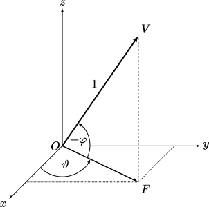

Player fundamentals
===================

The *player* refers to the self. Specifically it is not necessarily *you*, but rather the *self* in the Half-Life universe.

Input
-----

All player movements can be controlled through commands. In the default game setup, pressing down the "W" key usually results in the ``+forward`` command being issued. Releasing the same key will cause ``-forward`` to be issued. This is because the "W" key is bound to the ``+forward`` command with the ``bind`` command, usually issued from ``config.cfg``. The ``-forward`` command need not be explicitly bound.

There are many similar commands available. It is beyond the scope of this documentation to provide a detailed description for all commands and indeed all cvars. The reader is invited to generate a list of all commands with the ``cmdlist`` command and study the SDK code for each of them.

There are, however, a few points to note about command issuing that are of concern to speedrunning. One of them is the *impulse down* phenomena. This affects primarily the viewangles (see :ref:`player viewangles`) and the FSU (see :ref:`FSU`) computations. For example, the viewangles are typically changed by one of the viewangles commands such as ``+left`` for yawing left. This is done by adding to subtracting the viewangles by the value

.. math:: \tau \times \mathtt{cl\_yawspeed/cl\_pitchspeed} \times \mathrm{key state}

The "key state" is the state of the command being issued (``+left`` for example). The key state is typically 1, but in the *first frame* in which the command is being issued the value is 0.5. In other words, the change in viewangles is half of what it normally is in the *first frame* of the active command.

This is not limited to the viewangles. The FSU values (which is crucial to player movement as will be described in :ref:`FSU`) are also affected by the impulse down. For example, by issuing ``+forward``, the following value will be added to :math:`F`:

.. math:: \mathtt{cl\_forwardspeed} \times \mathrm{key state}

Again, the key state here is typically 1, except the first frame of the ``+forward`` command. This can result in a noticeably drop in player acceleration.

.. tip:: The reader is advised to perform a detailed study of ``cl_dlls/input.cpp`` to understand the processes and computations involved to greater depths.

.. _player viewangles:

Viewangles
----------

The term *viewangles* is usually associated with the player entity. The viewangles refer to a group of three angles which describe the player's view orientation. We call these angles *yaw*, *pitch* and *roll*. Mathematically, we denote the yaw by

.. math:: \vartheta

and the pitch by

.. math:: \varphi

Note that these are different from :math:`\theta` and :math:`\phi`. We do not have a mathematical symbol for roll as it is rarely used. In mathematical discussions, the viewangles are assumed to be in *radians* unless stated otherwise. However, do keep in mind that they are stored in degrees in the game.

   Illustration of the geometric meaning of :math:`\vartheta` and :math:`\varphi`, with the camera's view represented by :math:`\mathit{OV}` and :math:`\mathit{OF}` is the projection of :math:`\mathit{OV}` on the horizontal plane. Note that since the sign convention of in-game :math:`\varphi` differs from that of standard trigonometry, a negative sign is needed.

One way to change the yaw and pitch is by moving the mouse. This is not useful for tool-assisted speedrunning, however. A better method for precise control of the yaw and pitch angles is by issuing the commands ``+left``, ``+right``, ``+up``, or ``+down``. When these commands are active, the game increments or decrements the yaw or pitch by a certain controllable amount per frame. The amounts can be controlled by adjusting the variables ``cl_yawspeed`` and ``cl_pitchspeed``. For instance, when ``+right`` is active, the game multiplies the value of ``cl_yawspeed`` by the frame time, then subtracts the result from the yaw angle.

.. TODO: should we talk about anglemod in the discussion about client-server in Game fundamentals?

.. _anglemod:

Anglemod
~~~~~~~~

When the viewangles are sent to the server, their values *in degrees* are rounded slightly using the *anglemod* function, which will be denoted :math:`\mathfrak{A}`. We'll define the function precisely as follows.

.. prf:definition:: Integer truncation
   :label: integer truncation

   For all :math:`x \in \mathbb{R}`, define :math:`\operatorname{int} : \mathbb{R} \to \mathbb{I}_n` the *integer part* or *integer truncation* function as

   .. math:: \operatorname{int}(x) =
         \begin{cases}
         \left\lfloor x\right\rfloor & x \ge 0 \\
         \left\lceil x\right\rceil & x < 0,
         \end{cases}

   where :math:`\mathbb{I}_n \subset \mathbb{Z}` is an :math:`n`-bit integer in two's complement. We will assume in this documentation that :math:`n > 16`.

.. prf:definition:: Degrees-anglemod
   :label: degrees anglemod

   The *degrees-anglemod* function :math:`\mathfrak{A}_d : \mathbb{R} \to \mathbb{R}` may be written as

   .. math:: \mathfrak{A}_d(x) = \frac{360}{65536} \left( \operatorname{int}\!\left( x \frac{65536}{360} \right) \mathbin{\mathtt{AND}} 65535 \right)

   where ``AND`` is the bitwise AND binary operator.

.. prf:definition:: Radians-anglemod
   :label: radians anglemod

   The *radians-anglemod* function :math:`\mathfrak{A}_r : \mathbb{R} \to \mathbb{R}` may be written as

   .. math:: \mathfrak{A}_r(x) = \frac{2\pi}{65536} \left( \operatorname{int}\!\left( x \frac{65536}{2\pi} \right) \mathbin{\mathtt{AND}} 65535 \right).

To illustrate, we have the following examples of the output of degrees-anglemod.

==============  =========================  ======================
:math:`x`       :math:`\mathfrak{A}_d(x)`  :math:`x \bmod 360`
==============  =========================  ======================
:math:`0`       :math:`0`                  :math:`0`
:math:`1`       :math:`0.99975586`         :math:`1`
:math:`20`      :math:`19.995117`          :math:`20`
:math:`45`      :math:`45`                 :math:`45`
:math:`89`      :math:`88.99475`           :math:`89`
:math:`400`     :math:`39.995728`          :math:`40`
:math:`-0.005`  :math:`0`                  :math:`359.995`
:math:`-1`      :math:`359.00024`          :math:`359`
:math:`-20`     :math:`340.00488`          :math:`340`
:math:`-45`     :math:`315`                :math:`315`
:math:`-400`    :math:`320.00427`          :math:`320`
==============  =========================  ======================

The philosophy behind the anglemod function is to "wrap" the input angle into the range of :math:`[0^\circ, 360^\circ)` (for the degrees version). Except, rather than implementing the function in the most straightforward way using conditional branches and floating point divisions, the game *approximates* the result with a combination of integer bitwise operations and floating point multiplications, presumably to improve performance on 1990s hardware. On modern hardware, one could simply call the ``fmod`` standard library function in C. Incidentally, the CryEngine 1 also contains small uses of anglemod, though it's not used for view computation.

.. prf:definition:: Real version of modulo
   :label: real modulo

   A version of the modulo binary operator :math:`x \bmod y` may be defined for :math:`x \in \mathbb{R}` and :math:`y \in \mathbb{Z}^+` with :math:`y > 0` such that :math:`x = yq + r` where :math:`q \in \mathbb{Z}` and :math:`r \in \mathbb{R}` with :math:`0 \le r < y`.

Anglemod, then, is an approximation of :math:`x \bmod 360` with :math:`x \in \mathbb{R}` for the version in degrees.

:prf:ref:`bitwise and equivalence` is useful for converting the bitwise AND operation into the mathematically more well understood and convenient :math:`\bmod` operator. Since we assume the :math:`\operatorname{int}` operator produces :math:`\mathbb{I}_n` where :math:`n > 16`, this lemma is applicable to the anglemod function as it computes an integer of more than 16 bits modulo :math:`65536 = 2^{16}` with :math:`m = 16`. This will be useful in the subsequent proofs.

.. prf:lemma:: Equivalence of bitwise AND and modulo
   :label: bitwise and equivalence

   Let :math:`x` be an :math:`n`-bit integer in two's complement and :math:`m < n` an integer. Then :math:`x \mathbin{\mathtt{AND}} \left(2^m - 1\right) = x \bmod 2^m = r`, such that :math:`x = 2^m q + r` with :math:`0 \le r < 2^m`.

.. prf:proof::

   Assume :math:`x \ge 0` with :math:`n` bits. We may write :math:`x = \sum_{k=0}^n b_k 2^k`. Then :math:`x \mathbin{\mathtt{AND}} \left(2^m - 1\right) = \sum_{k=0}^{m-1} b_k 2^k` as this is equivalent to "masking out" the least significant :math:`m` bits. Separately, note that :math:`x \bmod 2^m` removes higher order terms :math:`\sum_{k=m}^n b_k 2^k` because :math:`2^m` divides the sum, hence :math:`x \bmod 2^m = \sum_{k=0}^{m-1} b_k 2^k = x \mathbin{\mathtt{AND}} \left(2^m - 1\right)`, as required.

   Now assume :math:`x < 0`. Since :math:`x` is stored in two's complement, if we *reinterpret* the bits as an *unsigned* integer, we obtain :math:`\tilde{x} = 2^n + x > 0`. Now since :math:`m < n`, we have

   .. math:: \tilde{x} \mathbin{\mathtt{AND}} \left(2^m - 1\right) = \left(2^n + x\right) \mathbin{\mathtt{AND}} \left(2^m - 1\right)
         = \left(2^n + x - 2^n\right) \mathbin{\mathtt{AND}} \left(2^m - 1\right)
         = x \mathbin{\mathtt{AND}} \left(2^m - 1\right).

   Namely, the most significant sign bit will be cleared as a result of masking out the least significant :math:`n - 1` bits at most. On the other hand,

   .. math:: \tilde{x} \mathbin{\mathtt{AND}} \left(2^m - 1\right)
         = \left( 2^n + x \right) \mathbin{\mathtt{AND}} \left(2^m - 1\right) = \left( 2^n + x \right) \bmod 2^m = x \bmod 2^m

   as required.

.. prf:lemma:: Partial periodicity of anglemod
   :label: periodicity of anglemod

   The degrees-anglemod :math:`\mathfrak{A}_d` is "partially" periodic with a period of :math:`p = 360` in the sense that

   .. math::
      \begin{aligned}
      \mathfrak{A}_d(x) &= \mathfrak{A}_d(x + p) & x &\ge 0 \\
      \mathfrak{A}_d(x) &= \mathfrak{A}_d(x - p) & x &< 0.
      \end{aligned}

.. prf:proof::

   Assume :math:`x \ge 0`. By :prf:ref:`bitwise and equivalence` and :prf:ref:`integer truncation`, we have

   .. math::
      \begin{aligned}
      \mathfrak{A}_d(x + p) &= \frac{360}{65536} \left( \left\lfloor x \frac{65536}{360} + 65536 \right\rfloor \bmod 65536 \right) \\
      &= \frac{360}{65536} \left( \left( \left\lfloor x \frac{65536}{360} \right\rfloor + 65536 \right) \bmod 65536 \right) \\
      &= \frac{360}{65536} \left( \left\lfloor x \frac{65536}{360} \right\rfloor \bmod 65536 \right) \\
      &= \mathfrak{A}_d(x).
      \end{aligned}

   Now assume :math:`x < 0`. We similarly have

   .. math::
      \begin{aligned}
      \mathfrak{A}_d(x - p) &= \frac{360}{65536} \left( \left\lceil x \frac{65536}{360} - 65536 \right\rceil \bmod 65536 \right) \\
      &= \frac{360}{65536} \left( \left( \left\lceil x \frac{65536}{360} \right\rceil - 65536 \right) \bmod 65536 \right) \\
      &= \frac{360}{65536} \left( \left\lceil x \frac{65536}{360} \right\rceil \bmod 65536 \right) \\
      &= \mathfrak{A}_d(x).
      \end{aligned}

.. prf:theorem:: Error bounds of anglemod
   :label: anglemod error bounds

   Let :math:`x \in \mathbb{R}`. Assume :math:`x \bmod 360` to carry the meaning defined in :prf:ref:`real modulo`. The error bounds on degrees-anglemod are given as follows.

   .. math::
      \begin{aligned}
      \displaystyle 0 \le \left( x \bmod 360 \right) - \mathfrak{A}_d(x) &< \frac{360}{65536} & \displaystyle \text{for } & x \ge 0 \\[1ex]
      \displaystyle 0 < 360 - \left( x \bmod 360 \right) - \mathfrak{A}_d(x) &< \frac{360}{65536} & \displaystyle \text{for } & {-\frac{360}{65536}} < x < 0 \\[1ex]
      \displaystyle 0 \le \mathfrak{A}_d(x) - \left( x \bmod 360 \right) &< \frac{360}{65536} & \displaystyle \text{for } & x \le -\frac{360}{65536}.
      \end{aligned}

.. prf:proof::

   Let :math:`f(x) = \left( x \bmod 360 \right) - \mathfrak{A}_d(x)`.

   Suppose :math:`x \ge 0`. By inspection and :prf:ref:`periodicity of anglemod`, we only need to consider :math:`0 \le x < 360`, as any :math:`x \ge 360` can be reduced to these bounds by subtracting a multiple of :math:`360`. This allows us to simplify and write :math:`f = x - \mathfrak{A}_d(x)`. By :prf:ref:`integer truncation`, we can also replace the integer truncation function :math:`\operatorname{int}` with the simpler floor function :math:`\lfloor \cdot \rfloor` in :math:`\mathfrak{A}_d`. Now

   .. math::
      \begin{aligned}
      f &= \frac{360}{65536} \left( x \frac{65536}{360} - \left( \left\lfloor x \frac{65536}{360} \right\rfloor \bmod 65536 \right) \right) \\
      &= \frac{360}{65536} \left( y - \left( \left\lfloor y \right\rfloor \bmod 65536 \right) \right)
      \end{aligned}

   where we have set :math:`y = x \cdot 65536 / 360`. The assumption :math:`0 \le x < 360` implies :math:`0 \le \left\lfloor y\right\rfloor < 65536` and :math:`\left\lfloor y\right\rfloor \bmod 65536 = \left\lfloor y\right\rfloor`, so

   .. math:: 0 \le f = \frac{360}{65536} \left( y - \left\lfloor y\right\rfloor \right) < \frac{360}{65536}.

   Suppose :math:`-360/65536 < x < 0`. Observe that :math:`\mathfrak{A}_d(x) = 0` but :math:`x \bmod 360 = 360 - x`. So :math:`360 - \left( x \bmod 360 \right) = x`, as required.

   Finally, suppose :math:`-360 < x \le -360/65536`. Again with :prf:ref:`periodicity of anglemod`, any :math:`x \le -360` can be reduced to these bounds or the case above by adding a multiple of :math:`360`. So :math:`f = 360 + x - \mathfrak{A}_d(x)`. We can replace the :math:`\operatorname{int}` function with :math:`\left\lceil \cdot \right\rceil` in :math:`\mathfrak{A}_d` by :prf:ref:`integer truncation`. So similarly,

   .. math::
      \begin{aligned}
      f &= \frac{360}{65536} \left( 65536 + x \frac{65536}{360} - \left( \left\lceil x \frac{65536}{360} \right\rceil \bmod 65536 \right) \right) \\
      &= \frac{360}{65536} \left( 65536 + y - \left( \left\lceil y\right\rceil \bmod 65536 \right) \right) \\
      &= \frac{360}{65536} \left( 65536 + y - \left( -\left\lfloor \left\lvert y\right\rvert \right\rfloor \bmod 65536 \right) \right).
      \end{aligned}

   Note that the assumption :math:`-360 < x \le -360/65536` implies :math:`-65536 < y \le -1`. This allows us to reduce :math:`-\left\lfloor \left\lvert y\right\rvert\right\rfloor \bmod 65536 = 65536 - \left\lfloor \left\lvert y\right\rvert\right\rfloor`. Hence,

   .. math:: f = \frac{360}{65536} \left( 65536 + y - \left(65536 - \left\lfloor \left\lvert y\right\rvert\right\rfloor \right) \right)
      = \frac{360}{65536} \left( \left\lfloor \left\lvert y\right\rvert \right\rfloor - \left\lvert y\right\rvert \right).

   This gives us the bounds :math:`0 \le -f < 360/65536`.

As stated by :prf:ref:`anglemod error bounds`, anglemod introduces a loss of precision in setting angles. This can result in a loss of optimality in strafing. There are two ways to reduce the effects of anglemod, namely by the *simple anglemod compensation* and the more advanced *vectorial compensation*. These techniques will be described in :ref:`vectorial compensation`.

.. _view vectors:

View vectors
------------

There are two vectors associated with the player's viewangles. These are called the *view vectors*. For discussions in 3D space, they are defined to be

.. math::
   \begin{aligned}
   \mathbf{\hat{f}} &:= \langle \cos\vartheta \cos\varphi, \sin\vartheta \cos\varphi, -\sin\varphi \rangle \\
   \mathbf{\hat{s}} &:= \langle \sin\vartheta, -\cos\vartheta, 0 \rangle
   \end{aligned}

We will refer to the former as the *unit forward vector* and the latter as the *unit right vector*. The negative sign for :math:`f_z` is an idiosyncrasy of the GoldSrc engine inherited from Quake. This is the consequence of the fact that looking up gives negative pitch angles and looking down gives positive pitch angles.

We sometimes restrict our discussions to the horizontal plane, such as in the description of strafing. In this case we assume :math:`\varphi = 0` and define

.. math::
   \begin{aligned}
   \mathbf{\hat{f}} &:= \langle \cos\vartheta, \sin\vartheta \rangle \\
   \mathbf{\hat{s}} &:= \langle \sin\vartheta, -\cos\vartheta \rangle
   \end{aligned}

Such restriction is equivalent to projecting the :math:`\mathbf{\hat{f}}` vector onto the :math:`xy` plane, provided the original vector is not vertical.

The above definitions are not valid if the roll is nonzero. Nevertheless, the roll is very rarely nonzero in practice, and so it rarely affects the physics described in this document, if at all.

Punchangles
-----------

The punchangles can refer to the client side or the server side values. The client side punchangles are usually affected by weapon recoil and are cosmetic in nature. Namely, they do not affect the aiming viewangles of the player. The player may be aiming with zero pitch while the camera appears to point elsewhere. The server side punchangles, on the other hand, affects the viewangles and therefore the aiming. The server side punchangles are affected by certain types of damage (see :ref:`health and damage`) and punches from monsters (which are different from the purely damage itself).

.. TODO: the client side value can be set to server side after a saveload?

The punchangles may be denoted as :math:`\mathbf{P}`, consisting of punch pitch, punch yaw, and punch roll. When the punchangles are nonzero, the game will smoothly decrease the angles until all of them become zero. In each frame, the game calculates

.. math:: \mathbf{P}' = \max\left( 0, \lVert\mathbf{P}\rVert \left( 1 - \frac{1}{2} \tau \right) - 10\tau \right) \mathbf{\hat{P}}

The punchangles are rarely big issues except when the punch yaw and punch roll are nonzero. In these cases, strafing (:ref:`strafing`) can be affected. Though this very rarely happens.

When a saveload is performed, the punchangles will be added to the viewangles permanently, while the punchangles will be set to zero. When this happens, the viewangles will not be reduced gradually like the case when punchangles are nonzero.

.. _FSU:

Forwardmove, sidemove, and upmove
---------------------------------

When the movement keys are held, there exists three values, :math:`F`, :math:`S`, and :math:`U`, that are set. These values are called the *forwardmove*, *sidemove*, and *upmove* respectively, or *FSU* for short, and are used in player movement physics (see :ref:`player movement`). In the beginning of player movement physics, the FSU values are computed in the following way. First, define client side analogues of :math:`\tilde{F}`, :math:`\tilde{S}`, and :math:`\tilde{U}`. Then,

``+forward`` and ``+back``
   Assigns the positive or negative ``cl_forwardspeed`` to :math:`\tilde{F}`

``+moveright`` and ``+moveleft``
   Assigns the positive or negative ``cl_sidespeed`` to :math:`\tilde{S}`

``+moveup`` and ``+movedown``
   Assigns the positive or negative ``cl_upspeed`` to :math:`\tilde{U}`

This is done at client side. Before sending these values to the server, however, they will be truncated to integers and clamped to :math:`[-2047, 2047]`. Let :math:`M_m` the value of ``sv_maxspeed``. Then, ``PM_CheckParamters`` [*sic*] computes the final server side FSU values such that, assuming not all of FSU are zero,

.. math:: F = \frac{\tilde{F}M_m}{\sqrt{\tilde{F}^2 + \tilde{S}^2 + \tilde{U}^2}} \quad
          S = \frac{\tilde{S}M_m}{\sqrt{\tilde{F}^2 + \tilde{S}^2 + \tilde{U}^2}} \quad
          U = \frac{\tilde{U}M_m}{\sqrt{\tilde{F}^2 + \tilde{S}^2 + \tilde{U}^2}}

If all of FSU are zero, then nothing is done and they remain zero.
