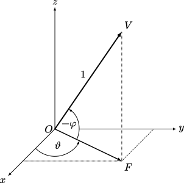

Player inputs
=============

The player entity is special in Half-Life in that it can be controlled by inputs on the client side. Before we examine how we might exploit player movement for speedrunning purposes, we must first understand the "control surface" available to us. We must also understand some of the important states associated with the player.

All player movements can be controlled through commands. For instance, in the default game setup, pressing down the "W" key usually results in the ``+forward`` command being issued. Releasing the same key will cause ``-forward`` to be issued. This is because the "W" key is bound to the ``+forward`` command with the ``bind`` command, usually issued from ``config.cfg``. Though, the ``-forward`` command need not be explicitly bound.

There are many similar commands available. It is beyond the scope of this documentation to provide a detailed description for all commands and indeed all cvars. The reader is invited to generate a list of all commands with the ``cmdlist`` command and study the SDK code for each of them, for example, in the ``cl_dlls/input.cpp`` file in the Half-Life SDK. Many of the commands are also self-explanatory or intuitive in their operations. For example, ``+attack2`` simply fires the secondary attack if a weapon is available. For speedrunning purposes, we will focus on the movement and the viewangles commands and cvars.

.. _player viewangles:

Viewangles
----------

The term *viewangles* is commonly used to refer to viewing direction of the "camera" associated with the player entity. This is not a purely client side state: the "source of truth" is maintained on the server side, which is replicated to the client side for graphics rendering.

.. prf:definition:: Viewangles
   :label: viewangles

   The viewangles is the triplet :math:`(\varphi, \vartheta, \varrho) \in \mathbb{R}^3` which respectively denotes the pitch, yaw, and roll angles.

As we will see in :ref:`anglemod`, the actual viewangles values stored on the server side are truncated and clamped into a multiple of :math:`360/65536`. Hence, we may alternatively define the *truncated viewangles* as in :prf:ref:`truncated viewangles`.

.. prf:definition:: Truncated viewangles
   :label: truncated viewangles

   Define the set

   .. math:: \mathcal{V} = \left\{ \frac{360}{65536} k \mid k \in \{ 0, 1, 2, \ldots, 65535 \} \right\}.

   The truncated viewangles are the triplet :math:`(\varphi, \vartheta, \varrho) \in \mathcal{V}^3`.

Note that the notations for the pitch, yaw, roll are different from :math:`\theta`, :math:`\phi`, and :math:`\rho`. In mathematical discussions, the viewangles are assumed to be in *radians* unless stated otherwise. However, do keep in mind that they are stored in degrees in the game. The roll angle :math:`\varrho` is rarely used or involved in player physics, and it is almost always zero. With only the pitch and yaw to worry about, we may illustrate how they correspond to the camera viewing angle by :numref:`viewangles illustration`.

   Illustration of the geometric meaning of :math:`\varphi` and :math:`\vartheta`, with the camera's view represented by :math:`\mathit{OV}`. Note that :math:`\mathit{OF}` is the projection of :math:`\mathit{OV}` on the horizontal plane. Note also that since the sign convention of in-game :math:`\varphi` differs from that of standard trigonometry, a negative sign is needed to represent "looking up".

One way to control the pitch and yaw is by moving the mouse. This is far too imprecise for tool-assisted speedrunning, however. A better method for precise control of the angles is by issuing the commands ``+left``, ``+right``, ``+up``, or ``+down``. When one or more of these commands are active, the game increments or decrements the pitch or yaw by a certain amount per frame. The amount can in turn be controlled by adjusting the cvars ``cl_yawspeed`` and ``cl_pitchspeed``. The roll angle can't be directly controlled by player inputs.

.. prf:definition:: Pitch and yaw controls

   Assume :math:`\varphi` and :math:`\vartheta` are in **degrees**. For all frame :math:`k \in \mathbb{Z}`, the player pitch and yaw angles are modified in order as follows.

   #. :math:`\varphi \gets \varphi + \left( \operatorname{KS}(\mathrm{down}, k) - \operatorname{KS}(\mathrm{up}, k) \right) \cdot \mathrm{cl\_pitchspeed} \cdot \tau_g`.
   #. :math:`\vartheta \gets \vartheta + \left( \operatorname{KS}(\mathrm{right}, k) - \operatorname{KS}(\mathrm{left}, k) \right) \cdot \mathrm{cl\_yawspeed} \cdot \tau_g`.
   #. :math:`\varphi \gets \mathfrak{A}_d(\varphi)`.
   #. :math:`\vartheta \gets \mathfrak{A}_d(\vartheta)`.

   Here, :math:`\operatorname{KS}` is defined in :prf:ref:`key state`, :math:`\mathfrak{A}_d` is defined in :prf:ref:`degrees anglemod`, and :math:`\tau_g` is defined in :ref:`frame rate`.

Although the viewangles commands were originally intended to allow moving the camera slowly by arrow keys, in a TAS they are the primary means to precisely pinpointing the pitch and yaw angles to the desired value instantaneously at the beginning of a frame before all the game physics are run. For example, suppose in frame :math:`k` we have :math:`\tau_g = 0.001`, :math:`\operatorname{KS}(\mathrm{down}, k) = 1`, and :math:`\varphi = 0`. If we wish to set :math:`\varphi = 9 \cdot 360 / 65536` in frame :math:`k + 1`, we may set the cvar :math:`\mathrm{cl\_pitchspeed} = 9 \cdot \left( 360 / 65536 \right) / \tau_g \approx 49.4`. In practice, to avoid floating point rounding issues, we should target :math:`9.5 \cdot 360 / 65536` instead and calculate :math:`\mathrm{cl\_pitchspeed}` accordingly, allow the :math:`\mathfrak{A}_d` function to truncate the :math:`9.5 \cdot 360 / 65536` down to :math:`9 \cdot 360 / 65536`.

.. _anglemod:

Anglemod
~~~~~~~~

When the viewangles are sent to the server, their values *in degrees* are rounded slightly using the *anglemod* function, which will be denoted :math:`\mathfrak{A}`. We'll define the function precisely as follows.

.. prf:definition:: Integer truncation
   :label: integer truncation

   For all :math:`x \in \mathbb{R}`, define :math:`\operatorname{int} : \mathbb{R} \to \mathbb{I}_n` the *integer part* or *integer truncation* function as

   .. math:: \operatorname{int}(x) =
         \begin{cases}
         \left\lfloor x\right\rfloor & x \ge 0 \\
         \left\lceil x\right\rceil & x < 0,
         \end{cases}

   where :math:`\mathbb{I}_n \subset \mathbb{Z}` is an :math:`n`-bit integer in two's complement. We will assume in this documentation that :math:`n > 16`. We may also interpret this function as rounding :math:`x` towards zero.

.. prf:definition:: Degrees-anglemod
   :label: degrees anglemod

   The *degrees-anglemod* function :math:`\mathfrak{A}_d : \mathbb{R} \to \mathbb{R}` may be written as

   .. math:: \mathfrak{A}_d(x) = \frac{360}{65536} \left( \operatorname{int}\!\left( x \frac{65536}{360} \right) \mathbin{\mathtt{AND}} 65535 \right)

   where ``AND`` is the bitwise AND binary operator.

.. prf:definition:: Radians-anglemod
   :label: radians anglemod

   The *radians-anglemod* function :math:`\mathfrak{A}_r : \mathbb{R} \to \mathbb{R}` may be written as

   .. math:: \mathfrak{A}_r(x) = \frac{2\pi}{65536} \left( \operatorname{int}\!\left( x \frac{65536}{2\pi} \right) \mathbin{\mathtt{AND}} 65535 \right).

To illustrate, we have the following examples of the output of degrees-anglemod.

==============  =========================  ======================
:math:`x`       :math:`\mathfrak{A}_d(x)`  :math:`x \bmod 360`
==============  =========================  ======================
:math:`0`       :math:`0`                  :math:`0`
:math:`1`       :math:`0.99975586`         :math:`1`
:math:`20`      :math:`19.995117`          :math:`20`
:math:`45`      :math:`45`                 :math:`45`
:math:`89`      :math:`88.99475`           :math:`89`
:math:`400`     :math:`39.995728`          :math:`40`
:math:`-0.005`  :math:`0`                  :math:`359.995`
:math:`-1`      :math:`359.00024`          :math:`359`
:math:`-20`     :math:`340.00488`          :math:`340`
:math:`-45`     :math:`315`                :math:`315`
:math:`-400`    :math:`320.00427`          :math:`320`
==============  =========================  ======================

The philosophy behind the anglemod function is to "wrap" the input angle into the range of :math:`[0^\circ, 360^\circ)` (for the degrees version). Except, rather than implementing the function in the most straightforward way using conditional branches and floating point divisions, the game *approximates* the result with a combination of integer bitwise operations and floating point multiplications, presumably to improve performance on 1990s hardware. On modern hardware, one could simply call the ``fmod`` standard library function in C. Incidentally, the CryEngine 1 also contains small uses of anglemod, though it's not used for view computation.

.. prf:definition:: Real version of modulo
   :label: real modulo

   A version of the modulo binary operator :math:`x \bmod y` may be defined for :math:`x \in \mathbb{R}` and :math:`y \in \mathbb{Z}^+` with :math:`y > 0` such that :math:`x = yq + r` where :math:`q \in \mathbb{Z}` and :math:`r \in \mathbb{R}` with :math:`0 \le r < y`.

Anglemod, then, is an approximation of :math:`x \bmod 360` with :math:`x \in \mathbb{R}` for the version in degrees.

:prf:ref:`bitwise and equivalence` is useful for converting the bitwise AND operation into the mathematically more well understood and convenient :math:`\bmod` operator. Since we assume the :math:`\operatorname{int}` operator produces :math:`\mathbb{I}_n` where :math:`n > 16`, this lemma is applicable to the anglemod function as it computes an integer of more than 16 bits modulo :math:`65536 = 2^{16}` with :math:`m = 16`. This will be useful in the subsequent proofs.

.. prf:lemma:: Equivalence of bitwise AND and modulo
   :label: bitwise and equivalence

   Let :math:`x` be an :math:`n`-bit integer in two's complement and :math:`m < n` an integer. Then :math:`x \mathbin{\mathtt{AND}} \left(2^m - 1\right) = x \bmod 2^m = r`, such that :math:`x = 2^m q + r` with :math:`0 \le r < 2^m`.

.. prf:proof::

   Assume :math:`x \ge 0` with :math:`n` bits. We may write :math:`x = \sum_{k=0}^n b_k 2^k`. Then :math:`x \mathbin{\mathtt{AND}} \left(2^m - 1\right) = \sum_{k=0}^{m-1} b_k 2^k` as this is equivalent to "masking out" the least significant :math:`m` bits. Separately, note that :math:`x \bmod 2^m` removes higher order terms :math:`\sum_{k=m}^n b_k 2^k` because :math:`2^m` divides the sum, hence :math:`x \bmod 2^m = \sum_{k=0}^{m-1} b_k 2^k = x \mathbin{\mathtt{AND}} \left(2^m - 1\right)`, as required.

   Now assume :math:`x < 0`. Since :math:`x` is stored in two's complement, if we *reinterpret* the bits as an *unsigned* integer, we obtain :math:`\tilde{x} = 2^n + x > 0`. Now since :math:`m < n`, we have

   .. math:: \tilde{x} \mathbin{\mathtt{AND}} \left(2^m - 1\right) = \left(2^n + x\right) \mathbin{\mathtt{AND}} \left(2^m - 1\right)
         = \left(2^n + x - 2^n\right) \mathbin{\mathtt{AND}} \left(2^m - 1\right)
         = x \mathbin{\mathtt{AND}} \left(2^m - 1\right).

   Namely, the most significant sign bit will be cleared as a result of masking out the least significant :math:`n - 1` bits at most. On the other hand,

   .. math:: \tilde{x} \mathbin{\mathtt{AND}} \left(2^m - 1\right)
         = \left( 2^n + x \right) \mathbin{\mathtt{AND}} \left(2^m - 1\right) = \left( 2^n + x \right) \bmod 2^m = x \bmod 2^m

   as required.

.. prf:lemma:: Partial periodicity of anglemod
   :label: periodicity of anglemod

   The degrees-anglemod :math:`\mathfrak{A}_d` is "partially" periodic with a period of :math:`p = 360` in the sense that

   .. math::
      \begin{aligned}
      \mathfrak{A}_d(x) &= \mathfrak{A}_d(x + p) & x &\ge 0 \\
      \mathfrak{A}_d(x) &= \mathfrak{A}_d(x - p) & x &< 0.
      \end{aligned}

.. prf:proof::

   Assume :math:`x \ge 0`. By :prf:ref:`bitwise and equivalence` and :prf:ref:`integer truncation`, we have

   .. math::
      \begin{aligned}
      \mathfrak{A}_d(x + p) &= \frac{360}{65536} \left( \left\lfloor x \frac{65536}{360} + 65536 \right\rfloor \bmod 65536 \right) \\
      &= \frac{360}{65536} \left( \left( \left\lfloor x \frac{65536}{360} \right\rfloor + 65536 \right) \bmod 65536 \right) \\
      &= \frac{360}{65536} \left( \left\lfloor x \frac{65536}{360} \right\rfloor \bmod 65536 \right) \\
      &= \mathfrak{A}_d(x).
      \end{aligned}

   Now assume :math:`x < 0`. We similarly have

   .. math::
      \begin{aligned}
      \mathfrak{A}_d(x - p) &= \frac{360}{65536} \left( \left\lceil x \frac{65536}{360} - 65536 \right\rceil \bmod 65536 \right) \\
      &= \frac{360}{65536} \left( \left( \left\lceil x \frac{65536}{360} \right\rceil - 65536 \right) \bmod 65536 \right) \\
      &= \frac{360}{65536} \left( \left\lceil x \frac{65536}{360} \right\rceil \bmod 65536 \right) \\
      &= \mathfrak{A}_d(x).
      \end{aligned}

.. prf:theorem:: Error bounds of anglemod
   :label: anglemod error bounds

   Let :math:`x \in \mathbb{R}`. Assume :math:`x \bmod 360` to carry the meaning defined in :prf:ref:`real modulo`. The error bounds on degrees-anglemod are given as follows.

   .. math::
      \begin{aligned}
      \displaystyle 0 \le \left( x \bmod 360 \right) - \mathfrak{A}_d(x) &< \frac{360}{65536} & \displaystyle \text{for } & x \ge 0 \\[1ex]
      \displaystyle 0 < 360 - \left( x \bmod 360 \right) - \mathfrak{A}_d(x) &< \frac{360}{65536} & \displaystyle \text{for } & {-\frac{360}{65536}} < x < 0 \\[1ex]
      \displaystyle 0 \le \mathfrak{A}_d(x) - \left( x \bmod 360 \right) &< \frac{360}{65536} & \displaystyle \text{for } & x \le -\frac{360}{65536}.
      \end{aligned}

.. prf:proof::

   Let :math:`f(x) = \left( x \bmod 360 \right) - \mathfrak{A}_d(x)`.

   Suppose :math:`x \ge 0`. By inspection and :prf:ref:`periodicity of anglemod`, we only need to consider :math:`0 \le x < 360`, as any :math:`x \ge 360` can be reduced to these bounds by subtracting a multiple of :math:`360`. This allows us to simplify and write :math:`f = x - \mathfrak{A}_d(x)`. By :prf:ref:`integer truncation`, we can also replace the integer truncation function :math:`\operatorname{int}` with the simpler floor function :math:`\lfloor \cdot \rfloor` in :math:`\mathfrak{A}_d`. Now

   .. math::
      \begin{aligned}
      f &= \frac{360}{65536} \left( x \frac{65536}{360} - \left( \left\lfloor x \frac{65536}{360} \right\rfloor \bmod 65536 \right) \right) \\
      &= \frac{360}{65536} \left( y - \left( \left\lfloor y \right\rfloor \bmod 65536 \right) \right)
      \end{aligned}

   where we have set :math:`y = x \cdot 65536 / 360`. The assumption :math:`0 \le x < 360` implies :math:`0 \le \left\lfloor y\right\rfloor < 65536` and :math:`\left\lfloor y\right\rfloor \bmod 65536 = \left\lfloor y\right\rfloor`, so

   .. math:: 0 \le f = \frac{360}{65536} \left( y - \left\lfloor y\right\rfloor \right) < \frac{360}{65536}.

   Suppose :math:`-360/65536 < x < 0`. Observe that :math:`\mathfrak{A}_d(x) = 0` but :math:`x \bmod 360 = 360 - x`. So :math:`360 - \left( x \bmod 360 \right) = x`, as required.

   Finally, suppose :math:`-360 < x \le -360/65536`. Again with :prf:ref:`periodicity of anglemod`, any :math:`x \le -360` can be reduced to these bounds or the case above by adding a multiple of :math:`360`. So :math:`f = 360 + x - \mathfrak{A}_d(x)`. We can replace the :math:`\operatorname{int}` function with :math:`\left\lceil \cdot \right\rceil` in :math:`\mathfrak{A}_d` by :prf:ref:`integer truncation`. So similarly,

   .. math::
      \begin{aligned}
      f &= \frac{360}{65536} \left( 65536 + x \frac{65536}{360} - \left( \left\lceil x \frac{65536}{360} \right\rceil \bmod 65536 \right) \right) \\
      &= \frac{360}{65536} \left( 65536 + y - \left( \left\lceil y\right\rceil \bmod 65536 \right) \right) \\
      &= \frac{360}{65536} \left( 65536 + y - \left( -\left\lfloor \left\lvert y\right\rvert \right\rfloor \bmod 65536 \right) \right).
      \end{aligned}

   Note that the assumption :math:`-360 < x \le -360/65536` implies :math:`-65536 < y \le -1`. This allows us to reduce :math:`-\left\lfloor \left\lvert y\right\rvert\right\rfloor \bmod 65536 = 65536 - \left\lfloor \left\lvert y\right\rvert\right\rfloor`. Hence,

   .. math:: f = \frac{360}{65536} \left( 65536 + y - \left(65536 - \left\lfloor \left\lvert y\right\rvert\right\rfloor \right) \right)
      = \frac{360}{65536} \left( \left\lfloor \left\lvert y\right\rvert \right\rfloor - \left\lvert y\right\rvert \right).

   This gives us the bounds :math:`0 \le -f < 360/65536`.

As stated by :prf:ref:`anglemod error bounds`, anglemod introduces a loss of precision in setting angles. This can result in a loss of optimality in strafing. There are two ways to reduce the effects of anglemod, namely by the *simple anglemod compensation* and the more advanced *vectorial compensation*. These techniques will be described in :ref:`vectorial compensation`.

.. _view vectors:

View vectors
------------

In :ref:`viewangles` we parametrised the player's viewing direction in terms of the viewangles :math:`(\varphi, \vartheta, \varrho)`. In many game mechanics, we work with *vectors* associated with the viewing direction instead. We may call them *view vectors*.

.. prf:definition:: Three dimensional view vectors
   :label: three dimensional view vectors

   Let :math:`\varphi` and :math:`\vartheta` be the pitch and yaw angles in radians as defined in :prf:ref:`viewangles`. Assume that :math:`\varrho = 0`. The three dimensional view vectors :math:`\mathbf{\hat{f}}, \mathbf{\hat{s}} \in \mathbb{R}^3` are defined as

   .. math::
      \begin{aligned}
      \mathbf{\hat{f}} &= \langle \cos\vartheta \cos\varphi, \sin\vartheta \cos\varphi, -\sin\varphi \rangle \\
      \mathbf{\hat{s}} &= \langle \sin\vartheta, -\cos\vartheta, 0 \rangle
      \end{aligned}

   with :math:`\lVert\mathbf{\hat{f}}\rVert = \lVert\mathbf{\hat{s}}\rVert = 1`. We may refer to :math:`\mathbf{\hat{f}}` as the (unit) forward vector, and :math:`\mathbf{\hat{s}}` as the (unit) right vector.

.. prf:lemma::

   The unit right vector :math:`\mathbf{\hat{s}}` and the unit forward vector :math:`\mathbf{\hat{f}}` are perpendicular with each other. If :math:`-\pi/2 < \varphi < \pi/2`, the unit right vector points to the right of the unit forward vector when viewed from the top.

.. prf:proof::

   We have

   .. math:: \mathbf{\hat{f}} \cdot \mathbf{\hat{s}} = \cos\vartheta \cos\varphi \sin\vartheta - \sin\vartheta \cos\varphi \cos\vartheta = 0

   as required. In addition, compute

   .. math:: \mathbf{\hat{s}} \times \mathbf{\hat{f}} = \langle \cos\vartheta \sin\varphi, \sin\vartheta \sin\varphi, \cos\varphi \rangle.

   When :math:`-\pi/2 < \varphi < \pi/2`, we have :math:`0 < \cos\varphi`. This implies the cross product always points up with a positive :math:`z` coordinate. This implies :math:`\mathbf{\hat{s}}` is perpendicularly to the right of :math:`\mathbf{\hat{f}}`.

Note that the negative sign for :math:`f_z` is an idiosyncrasy of the GoldSrc engine inherited from Quake. This is the consequence of the fact that looking up gives negative pitch angles and looking down gives positive pitch angles.

We sometimes restrict our discussions to the horizontal plane, especially when discussing the air and ground player movement physics (see :ref:`player air ground`). In this case we assume :math:`\varphi = 0` and define the two dimensional view vectors.

.. prf:definition:: Two dimensional view vectors
   :label: two dimensional view vectors

   The two dimensional view vectors may be defined by restricting :math:`\varphi = 0` and invoking :prf:ref:`three dimensional view vectors` as follows:

   .. math::
      \begin{aligned}
      \mathbf{\hat{f}} &= \langle \cos\vartheta, \sin\vartheta \rangle \\
      \mathbf{\hat{s}} &= \langle \sin\vartheta, -\cos\vartheta \rangle.
      \end{aligned}

Provided the original vector is not vertical, the two dimensional unit forward vector may equivalently be obtained by projecting the three dimensional :math:`\mathbf{\hat{f}}` vector onto the :math:`xy` plane, then normalising the result. The two dimensional unit side vector is simply a rotation of the forward vector by 90 degrees to the right. This is, in fact, how the game actually calculates the two dimensional view vectors in player movement physics. It is therefore very important that the pitch does not go vertically up or down, causing :math:`\sin\varphi = \pm 1` or `gimbal lock`_.

.. _gimbal lock: https://en.wikipedia.org/wiki/Gimbal_lock

Note that :prf:ref:`three dimensional view vectors` and :prf:ref:`two dimensional view vectors` are not valid if the roll angle :math:`\varrho \ne 0`. Nevertheless, the roll is very rarely nonzero in practice, and so it rarely affects the physics described in this document.

Punchangles
-----------

The punchangles can refer to the client side or the server side values. The client side punchangles are usually affected by weapon recoil and are cosmetic in nature. Namely, they do not affect the aiming viewangles of the player. The player may be aiming with zero pitch while the camera appears to point elsewhere, but the actual view vectors and server side physics calculations are not affected by the cosmetic punchangles. The server side punchangles, on the other hand, affects the viewangles and therefore the aiming. The server side punchangles are affected by certain types of damage (see :ref:`health and damage`) and attacks from monsters.

.. TODO: the client side value can be set to server side after a saveload?

The punchangles may be denoted as :math:`\mathbf{P}`, consisting of punch pitch, punch yaw, and punch roll. When the punchangles are nonzero, the game will smoothly decrease the angles until all of them become zero.

.. prf:definition:: Punchangles update equation

   Let :math:`\mathbf{P} \in \mathbb{R}^3` be the punchangles. In every frame, the game updates the player punchangles by setting

   .. math:: \mathbf{P}' = \max\!\left( 0, \lVert\mathbf{P}\rVert \left( 1 - \frac{1}{2} \tau_p \right) - 10\tau_p \right) \frac{\mathbf{P}}{\lVert\mathbf{P}\rVert},

   where :math:`\tau_p` is previously defined in :ref:`frame rate`.

The punchangles are a matter of concern, except when the punch yaw and punch roll are nonzero, because they can affect strafing (:ref:`strafing`). Nevertheless, this rarely occurs when speedrunning in practice, and even if they do occur, the impact on strafing efficiency is globally minimal.

Interestingly, when a save is performed then restoring from the save, the punchangles will be added to the viewangles :math:`(\varphi, \vartheta, \varrho)` themselves and the punchangles will be set to zero. When this happens, the player pitch and yaw will decrease gradually as is the case when punchangles are nonzero, though the roll angle still does.

.. prf:theorem::

   Suppose the initial punchangles :math:`P_0` is set by some game mechanics and then left to decay. Then the punchangles update equation can be written in closed form to give the punchangles at frame :math:`n \in \mathbb{Z}` as

   .. math:: \mathbf{P}_n = \frac{\lVert\mathbf{P}_n\rVert}{\lVert\mathbf{P}_0\rVert} \mathbf{P}_0,

   where

   .. math:: \lVert\mathbf{P}_n\rVert = \max\!\left( \left( 20 + \lVert\mathbf{P}_0\rVert \right) \left( 1 - \frac{1}{2} \tau_p \right)^n - 20, 0 \right).

   We may also substitute :math:`n = t / \tau_p` to obtain an equation in terms of game time :math:`t \in \mathbb{R}`.

.. _FSU:

Forwardmove, sidemove, and upmove
---------------------------------

When the WASD movement keys are held, the game computes three values: :math:`F`, :math:`S`, and :math:`U`. These values are called the *forwardmove*, *sidemove*, and *upmove* respectively, or *FSU* for short, and are critically important as inputs to the player movement physics (see :ref:`player movement`). The computation of FSU relies on several cvars which we will soon see.

.. prf:definition:: ``sv_maxspeed``

   Let :math:`M_m \in \mathbb{R}` be the value of the cvar ``sv_maxspeed``. In vanilla Half-Life, :math:`M_m = 320`.

Recall from :ref:`delta` that the ``forwardmove``, ``sidemove``, and ``upmove`` values from the client are truncated to a 12-bit sign-magnitude representation before sending to the server. For notational convenience, we have :prf:ref:`delta trunc`.

.. prf:definition:: DELTA truncation of FSU
   :label: delta trunc

   Let :math:`x \in \mathbb{R}`. The DELTA truncation and clamping function for FSU, :math:`\operatorname{DeltaTrunc} : \mathbb{R} \to \mathbb{Z}`, is

   .. math:: \operatorname{DeltaTrunc}(x) = \max(\min(\operatorname{int}(x), 2047), -2047).

We may then define FSU computationally or operationally as :prf:ref:`fsu computation`.

.. prf:definition:: FSU
   :label: fsu computation

   Let :math:`\tilde{F}, \tilde{S}, \tilde{U} \in \mathbb{R}` on the client side in some frame :math:`k \in \mathbb{Z}`. Let :math:`\operatorname{KS}` be the key state function defined in :prf:ref:`key state`. Then we compute the following in order.

   #. :math:`\tilde{F} \gets \left( \operatorname{KS}(\mathrm{forward},k) - \operatorname{KS}(\mathrm{back},k) \right) \cdot \mathrm{cl\_forwardspeed}`.
   #. :math:`\tilde{S} \gets \left( \operatorname{KS}(\mathrm{moveright},k) - \operatorname{KS}(\mathrm{moveleft},k) \right) \cdot \mathrm{cl\_sidespeed}`.
   #. :math:`\tilde{U} \gets \left( \operatorname{KS}(\mathrm{moveup},k) - \operatorname{KS}(\mathrm{movedown},k) \right) \cdot \mathrm{cl\_upspeed}`.
   #. :math:`(\tilde{F}, \tilde{S}, \tilde{U}) \gets (\operatorname{DeltaTrunc}(\tilde{F}), \operatorname{DeltaTrunc}(\tilde{S}), \operatorname{DeltaTrunc}(\tilde{U}))`.

   Now if :math:`(\tilde{F}, \tilde{S}, \tilde{U}) = (0, 0, 0)`, then :math:`(F, S, U) = (0, 0, 0)` and we are done. Otherwise, let

   .. math:: \rho = \min\!\left( \frac{M_m}{\left\lVert \langle \tilde{F}, \tilde{S}, \tilde{U} \rangle \right\rVert}, 1 \right).

   Then :math:`(F, S, U) = ( \rho \tilde{F}, \rho \tilde{S}, \rho \tilde{U} )`.

The reader may verify the computations in :prf:ref:`fsu computation` by examining the ``PPM_CheckParamters`` [*sic*] in the Half-Life SDK.

.. prf:theorem::

   Let :math:`\tilde{F}`, :math:`\tilde{S}`, :math:`\tilde{U}` be the values at the end of the computations in :prf:ref:`fsu computation`. Then

   .. math:: \left\lVert \langle F, S, U\rangle \right\rVert = \min\!\left( M_m, \left\lVert \langle \tilde{F}, \tilde{S}, \tilde{U}\rangle \right\rVert \right).

.. prf:proof::

   If :math:`(\tilde{F}, \tilde{S}, \tilde{U}) = (0, 0, 0)` then we are done. Otherwise, note that :math:`\left\lVert \langle F, S, U\rangle \right\rVert = \rho \left\lVert \langle \tilde{F}, \tilde{S}, \tilde{U} \rangle \right\rVert`. If :math:`M_m \ge \left\lVert \langle \tilde{F}, \tilde{S}, \tilde{U} \rangle \right\rVert`, then :math:`\rho = 1` and we are done. Now suppose :math:`M_m < \left\lVert \langle \tilde{F}, \tilde{S}, \tilde{U} \rangle \right\rVert`. Then

   .. math:: \left\lVert \langle F, S, U\rangle \right\rVert = \frac{M_m}{\left\lVert \langle \tilde{F}, \tilde{S}, \tilde{U} \rangle \right\rVert} \cdot \left\lVert \langle \tilde{F}, \tilde{S}, \tilde{U} \rangle \right\rVert = M_m.

Key state
---------

Generally speaking, pressing a movement key translates to accelerating the player towards a particular direction, and pressing the viewangles keys translate to yawing and pitching the player viewangles. Unfortunately, how much the player accelerates and how much the viewangles change depends on whether the key in question started being pressed or if the key has been pressed for more than one frame. We may capture this "multiplier" succinctly by means of the *key state* function.

.. prf:definition:: Key state
   :label: key state

   Let :math:`\mathrm{Cmd}` be the set of movement and viewangles commands. For example, :math:`\mathrm{forward} \in \operatorname{Cmd}`. Let

   .. math:: \operatorname{KS} : \mathrm{Cmd} \times \mathbb{Z} \to \left\{0, \frac{1}{2}, 1\right\}

   be the key state function defined as follows. Suppose a key :math:`K` is first pressed on frame :math:`0`, continuously held for subsequent frames, then released on frame :math:`n`. Then we may define operationally

   .. math::
      \operatorname{KS}(K, i) =
      \begin{cases}
         \frac{1}{2} & i = 0 \\
         1 & 1 \le i < n \\
         0 & n \le i.
      \end{cases}

The key state function is highly consequential for speedrunning, especially if we naively press and release the movement and viewangles keys rapidly. To see why, consider how :math:`F` as defined in :prf:ref:`fsu computation` is computed. Without loss of generality, assume only the ``+forward`` key is being pressed. Then at frame :math:`k \in \mathbb{Z}`, we have

.. math::
   \begin{aligned}
      \tilde{F}_k &= \operatorname{KS}(\mathrm{forward},k) \cdot \mathrm{cl\_forwardspeed} \\
      F_k &= \min\!\left( \frac{M_m}{\tilde{F}_k}, 1 \right) \tilde{F}_k.
   \end{aligned}

In vanilla Half-Life, we have :math:`M_m = 320` and :math:`\mathrm{cl\_forwardspeed} = 400`. In the first frame of pressing ``+forward``, by definition :math:`\operatorname{KS}(\mathrm{forward},0) = 1/2`, while in subsequent frames :math:`k \ge 1`, :math:`\operatorname{KS}(\mathrm{forward},k) = 1`. Hence, :math:`\tilde{F}_0 = 200`, :math:`F_0 = 200`, and for :math:`k \ge 1`, :math:`\tilde{F}_k = 400` and :math:`F_k = 320 = M_m`. Since :math:`F` has a lower value in the first frame, the player will experience lower acceleration in the first frame (as we will see in :ref:`player movement` and :ref:`strafing`). As described in :ref:`line strafing`, in a TAS we often strafe along a straight line path, which necessitates alternating between strafing left and right at most 1000 times per second. The most naive way to implement this is by alternating between pressing and releasing ``+moveright`` and ``+moveleft``. However, this means each key is held for only 1 or 2 frames, so :math:`S` spends most of the time carrying the lower value. This results in drastically lower acceleration throughout the process. To mitigate this problem, a TAS tool might instead hold one of ``+moveright`` or ``+moveleft`` constantly for as long as the tool is active to ensure the key state stays at 1, while adjusting the values of ``cl_forwardspeed`` and ``cl_sidespeed`` directly on a frame by frame basis.

The same problem also applies to adjusting the viewangles by the viewangles commands ``+left``, ``+right``, ``+up``, and ``+down``. Though the problem here can be mitigated much more easily by doubling the viewangles speed cvars ``cl_yawspeed`` and ``cl_pitchspeed`` to compensate for the :math:`1/2` factor given by the key state.
