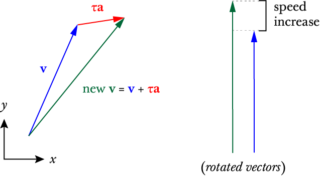
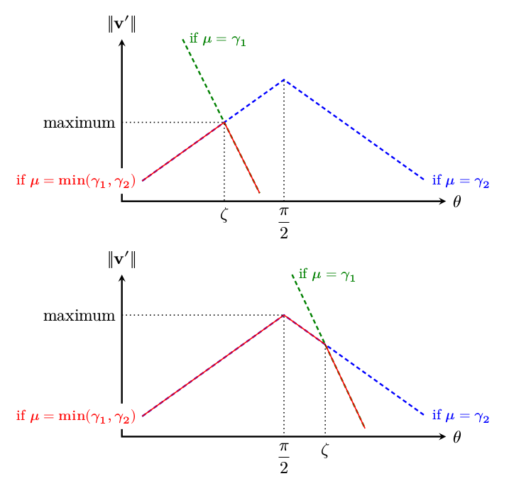
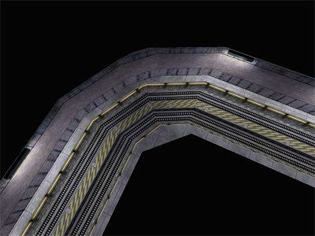
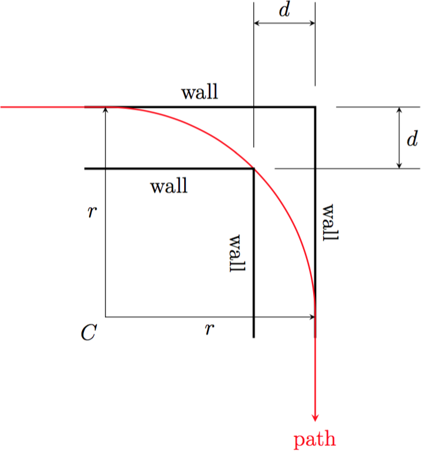
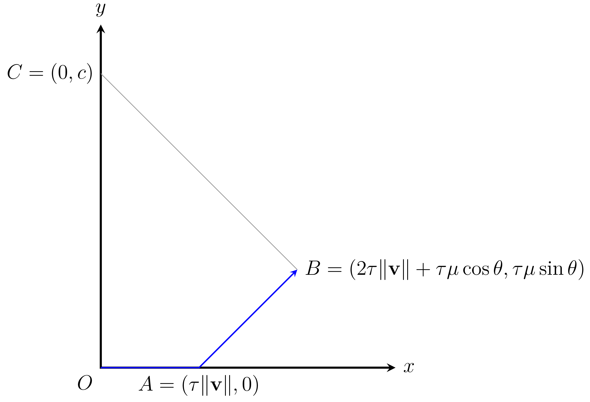

.. _strafing:

Strafing
========

*Strafing* in the context of Half-Life speedrunning refers to the technique of pressing the correct movement keys (usually the WASD keys) and moving the mouse left and right in a precise way to increase the player speed beyond what the developers intended or make sharp turns without sacrificing too much speed. Strafing as a technique can be achieved similarly in the air and on the ground. If there is a need to distinguish between them, we refer to the former as "airstrafing" and the latter as "groundstrafing". Strafing is commonly accompanied by a series of jumps intended to keep the player off the ground, as there is friction when moving on the ground. For the purpose of our discussions, the sole act of jumping repeatedly like a rabbit, regardless of whether strafing is done concurrently, is *bunnyhopping*, although the reader will find some in the community who include airstrafing when the term "bunnyhopping" is used. In this chapter, we will only discuss strafing and not bunnyhopping.

While this chapter is not the first mathematical treatment of this topic, it is the goal of the author to write the definitive analysis and optimisation of strafing in a significantly greater level of precision and thoroughness than seen in other sources. This chapter shall serve as the starting point and baseline for further discussions and analysis of strafing-related techniques and physics. Other attempts at mathematical treatments of strafing like `this by injx`_, `this by flafla2`_, `this by Kared13`_, `this by ZdrytchX`_, and `this by jrsala`_, are ad-hoc and suffer from flaws that make them less suited for further analyses (e.g. surfing analysis, speed-preserving strafing, curvature analysis, minimal-time paths), gaining a deeper understanding of strafing, or indeed for practical implementations.

.. _`this by injx`: http://www.funender.com/quake/articles/
.. _`this by flafla2`: http://flafla2.github.io/2015/02/14/bunnyhop.html
.. _`this by Kared13`: https://steamcommunity.com/sharedfiles/filedetails/?id=184184420
.. _`this by ZdrytchX`: https://sites.google.com/site/zdrytchx/how-to/strafe-jumping-physics-the-real-mathematics
.. _`this by jrsala`: https://gamedev.stackexchange.com/a/45656

Strafing is so fundamental to speedrunning, that a speedrunner ought to "get it out of the way" while focusing on other techniques. Strafing should be viewed as a building block that is used as a basis for other speedrunning techniques and tricks. If we do not cannot perform strafing near optimally, the entire speedrun falls apart. This applies to TASes as well: we want to optimise strafing as much as possible so that we can "forget about it" when constructing a TAS and permitting us to concentrate on the planning, "general picture", and specific tricks.

.. caution:: Be sure to familiarise yourself with the fundamentals of player movement described in :ref:`player movement`. Without the prerequisite knowledge, this chapter can be hard to follow.

Basic intuition
---------------

Before delving into the mathematics, it may be helpful to have a geometric intuition of how strafing works. In Half-Life, and indeed in real-life classical mechanics, the velocity and acceleration are defined as Euclidean vectors with a length (or magnitude) and a direction, typically drawn as an arrow in the Euclidean space. In the strafing context, we are only interested in vectors drawn on a 2D space. When a body in Half-Life accelerates in a frame, the acceleration vector, scaled by frame time, is added to the velocity vector to obtain a new velocity vector,

.. math:: \mathbf{v}' = \mathbf{v} + \tau\mathbf{a}

This may be interpreted geometrically as putting the acceleration arrow after the velocity arrow to obtain a new velocity arrow. The diagram looks like a triangle, as seen in :numref:`strafing intuition 1`. Now, notice that the new velocity arrow is *longer* than the previous velocity arrow. This means that the *speed* (represented by the arrow length) has been increased.

   Depiction of how strafing increases speed (i.e. the length of the velocity
   vector). On the left, the directions of the vectors have significance. On the
   right, we have rotated the vectors to that they line up, but therefore do not
   point to the correct direction (though having the correct length or
   magnitude).

In Half-Life physics, the magnitude or length of the acceleration vector :math:`\mathbf{a}` depends on the current speed and the angle between the velocity and itself, which in turn is controlled by the viewangles, as explained in :ref:`player air ground`. The task of finding the optimal angles to achieve a certain goal is the topic of this chapter.

.. _strafe building blocks:

Building blocks
---------------

Regardless of the objective of strafing, its physics is governed by the fundamental movement equation (FME). We will construct several few mathematical building blocks to aid further analyses. Firstly, write :math:`\lVert\mathbf{v}'\rVert = \sqrt{\mathbf{v}' \cdot \mathbf{v}'}`, where :math:`\mathbf{v}'` is already given in :ref:`player air ground`. Expanding each :math:`\mathbf{v}'` yields

.. math:: \lVert\mathbf{v}'\rVert
   = \sqrt{(\lambda(\mathbf{v}) + \mu\mathbf{\hat{a}}) \cdot (\lambda(\mathbf{v}) + \mu\mathbf{\hat{a}})}
   = \sqrt{\lVert\lambda(\mathbf{v})\rVert^2 + \mu^2 + 2 \lVert\lambda(\mathbf{v})\rVert \mu \cos\theta}
   :label: nextspeed

This can be done because the dot product satisfies the distributive law. Very quickly, we obtained :eq:`nextspeed` which is sometimes called the *scalar FME*, often used in practical applications as the most general way to compute new *speeds* (as opposed to velocity vectors) given :math:`\theta`.

.. tip:: This is a very common and useful trick that can be used to quickly
         yield an expression for the magnitude of vectorial outputs without
         explicit vectorial computations or geometric analyses. Half-Life
         physicists ought to learn this technique well.

From equation :eq:`nextspeed`, we can further write down the equations by assuming :math:`\mu = \gamma_1` and :math:`\mu = \gamma_2` respectively, to eliminate :math:`\mu`. These new equations can be found by expanding :math:`\mu`, again already given previously. We get

.. math::
   \begin{aligned}
   \lVert\mathbf{v}'_{\mu = \gamma_1}\rVert &= \sqrt{\lVert\lambda(\mathbf{v})\rVert^2 +
   k_e \tau MA \left( k_e \tau MA + 2 \lVert\lambda(\mathbf{v})\rVert \cos\theta \right)} \\
   \lVert\mathbf{v}'_{\mu = \gamma_2}\rVert &= \sqrt{\lVert\lambda(\mathbf{v})\rVert^2 \sin^2 \theta + L^2}
   \end{aligned}
   :label: nextspeed gammas

These equations will be important in the exploitative analyses of the FME shortly.

However, computing speeds is sometimes not sufficient. We sometimes want to also compute velocity *vectors* endowed with both directionality and magnitude, but without worrying about player viewangles and :math:`\mathbf{\hat{a}}`. We can achieve this by parametrising :math:`\mathbf{\hat{a}}` in terms of a rotation of :math:`\mathbf{\hat{v}}` by an angle of :math:`\theta`. This may be expressed as

.. math:: \mathbf{\hat{a}} = \mathbf{\hat{v}} R_z(\theta)

This is a matrix multiplication of :math:`\mathbf{\hat{v}}` by a rotation matrix. The benefit of writing the FME in this form is that we no longer need to worry about calculating :math:`\mathbf{\hat{f}}` and :math:`\mathbf{\hat{s}}`, which, recalling from :ref:`view vectors`, depend on the yaw angle :math:`\vartheta` in the 2D case. We also no longer need to worry about :math:`F`, :math:`S`, and :math:`M` needed to compute :math:`\mathbf{\hat{a}}`. All we need to know is the angle :math:`\theta` between velocity and acceleration vectors. This can make efficient computations easier as well, because the angle :math:`\theta` is easily computed (as we will see shortly) in just a few lines of code.

.. caution:: Remember from :ref:`notations` that vectors in this documentation are *row vectors*. Therefore, the order of multiplication is different from those in standard linear algebra textbooks. In fact, the components in :math:`R_z(\theta)` are also ordered differently.

With this idea in mind, we can rewrite the FME as

.. math:: \mathbf{v}' = \lambda(\mathbf{v}) + \mu\mathbf{\hat{v}}
   \begin{bmatrix}
   \cos\theta & -\sin\theta \\
   \sin\theta & \cos\theta
   \end{bmatrix}
   \quad\quad (\mathbf{v} \ne \mathbf{0})
   :label: newvelmat

Note that the precaution :math:`\mathbf{v} \ne \mathbf{0}` is needed so that the unit vector :math:`\mathbf{\hat{v}} = \mathbf{v} / \lVert\mathbf{v}\rVert` is well defined. In other words, the directionality of :math:`\mathbf{v}` is lost when it is zero. This is therefore one downside of parametrising in terms of :math:`\theta`, where the special case of zero velocity must be handled separately by replacing :math:`\mathbf{\hat{v}} = \mathbf{\hat{f}}` (and assuming :math:`\varphi = 0` as usual) in :eq:`newvelmat`, thereby involving the viewangles in the computations.

When written in the form of :eq:`newvelmat`, positive :math:`\theta` gives *clockwise* rotations, while negative :math:`\theta` gives *anticlockwise* rotations. If this convention is inconvenient for a particular application, one can easily reverse the directionality by reversing the signs of the :math:`\sin\theta` elements in the rotation matrix.

Maximum acceleration
--------------------

Airstrafing to continuously gain speed beyond what the developers intended is one of the oldest speedrunning tricks. It is of no surprise that one of the earliest inquiries into Half-Life physics is related to the question of how to airstrafe with the maximum acceleration, when research began circa 2012 by the author of this documentation. In this section, we will provide precise mathematical descriptions of how maximum-acceleration strafing works in a way that will provide a baseline for further analyses and also can readily be implemented in TAS tools.

We must define our metric for "maximum acceleration" in a mathematically precise way. Specifically, we want to maximise the *average scalar acceleration* over some period of time :math:`t`. The average scalar acceleration may in turn be defined as

.. math:: \overline{\lVert\mathbf{a}\rVert} = \frac{\Delta\lVert\mathbf{v}\rVert}{t} = \frac{\lVert\mathbf{v}_t\rVert - \lVert\mathbf{v}_0\rVert}{t}

where :math:`\lVert\mathbf{v}_t\rVert` is the speed at time :math:`t` and :math:`\lVert\mathbf{v}_0\rVert` is the initial speed. We believe this is a valid metric because it reflects the intention of the speedrunner better in the field: namely, to increase the speed as much as possible over some time, which automatically also increases the distance travelled within the same period of time, since the distance travelled is simply the sum of all the speeds in every frame within the period of time in question.

Arguments of the maxima
~~~~~~~~~~~~~~~~~~~~~~~

Let :math:`\mathbf{v}` be the current player velocity, :math:`\mathbf{v}'` the velocity after strafing, and :math:`\tau_g` the game frame time (see :ref:`frame rate`). To maximise the average scalar acceleration, it is sufficient to maximise the per-frame scalar acceleration

.. math:: \frac{\lVert\mathbf{v}'\rVert - \lVert\mathbf{v}\rVert}{\tau_g}

It turns out that maximising the per-frame acceleration "greedily" also maximises the global average acceleration over the span of some time :math:`t`. In other words, optimising only the individual frames result in the optimal "overall" acceleration as well. This is perhaps owing to good luck, because it is by no means a universal rule that local maxima yield a global maximum in other instances. We will prove this assertion in a later section.

.. TODO: prove this assertion

Now, we will assume :math:`\lVert\mathbf{v}\rVert` and :math:`\tau_g` are independent of any other variables. Therefore, we can ignore them, and the task of maximising acceleration boils down to maximising solely the new speed :math:`\lVert\mathbf{v}'\rVert`. Looking at :eq:`nextspeed gammas`, observe that the new speed is invariant to the transformation :math:`\theta \mapsto -\theta`, because both :math:`\cos\theta` and :math:`\sin^2\theta` are `even functions`_. Without loss of generality, we will consider only :math:`0 \le \theta \le \pi`. Define :math:`\zeta` such that :math:`\theta = \zeta` implies :math:`\mu = \gamma_1 = \gamma_2`, or

.. _`even functions`: https://en.wikipedia.org/wiki/Even_and_odd_functions

.. math:: \cos\zeta = \frac{L - k_e\tau MA}{\lVert\lambda(\mathbf{v})\rVert}

Here, the symbols have already been defined earlier in :ref:`player air ground`. Now, we make a few critical observations.

1. The curves :math:`\lVert\mathbf{v}'\rVert_{\mu = \gamma_1}(\theta)` and :math:`\lVert\mathbf{v}'\rVert_{\mu = \gamma_2}(\theta)` against :math:`\theta` intersect only at :math:`\theta = \zeta`, provided :math:`\zeta` exists. That is, the two equations for new speed in :eq:`nextspeed gammas` only equal each other when :math:`\theta = \zeta`.

2. :math:`\lVert\mathbf{v}'\rVert_{\mu = \gamma_1}(\theta)` is decreasing in :math:`0 \le \theta \le \pi`. This is because :math:`\cos\theta` is decreasing in this range.

3. :math:`\lVert\mathbf{v}'\rVert_{\mu = \gamma_2}(\theta)` is increasing in :math:`0 \le \theta \le \pi/2` and decreasing in :math:`\pi/2 \le \theta \le \pi`. This is because :math:`\sin^2\theta` behaves as such.

4. If :math:`\zeta` exists, :math:`\mu = \gamma_2` if :math:`0 \le \theta \le \zeta`, and :math:`\mu = \gamma_1` if :math:`\zeta < \theta \le \pi`. If :math:`\zeta` does not exist, then for all :math:`0 \le \theta \le \pi`, :math:`\mu = \gamma_1` if :math:`\cos\zeta > 1`, or :math:`\mu = \gamma_2` if :math:`\cos\zeta < -1`.

Therefore, we claim that to maximise :math:`\lVert\mathbf{v}'\rVert` we have optimal angle :math:`\theta = \Theta` such that

.. math:: \boxed{\Theta =
          \begin{cases}
          \pm\pi/2 & L - k_e \tau MA \le 0 \\
          \pm\zeta & 0 < L - k_e \tau MA \le \lVert\lambda(\mathbf{v})\rVert \\
          0 & L - k_e \tau MA > \lVert\lambda(\mathbf{v})\rVert
          \end{cases}}
   :label: maxaccel theta

We can immediately see that there are three distinct cases for the optimal strafing angle.

Case 2
++++++

To see the justification for case 2, suppose :math:`\zeta` exists and :math:`0 < \zeta < \pi/2`. This implies the second case in :eq:`maxaccel theta`. By observation 1 and 2, the always decreasing curve of :math:`\lVert\mathbf{v}'\rVert_{\mu=\gamma_1}` intersects that of :math:`\lVert\mathbf{v}'\rVert_{\mu=\gamma_2}` at :math:`\theta = \zeta`. But crucially, the intersection point lies in the increasing part of the latter curve, keeping in mind that the latter curve is increasing for :math:`0 \le \theta \le \pi/2` due to observation 3. On top of that, to the left of the intersection point where :math:`0 \le \theta \le \zeta` is the domain of the latter curve, which is increasing, while to the right of the intersection point :math:`\zeta < \theta \le \pi` is the domain of the former curve, which is decreasing. Therefore the optimal angle is simply at the point of intersection of the two curves, which happens to be the maximum or the peak within :math:`0 \le \theta \le \pi`.

These deductions assume :math:`\zeta` exists. In order for case 2 in :eq:`maxaccel theta` to hold true, we must have :math:`\lvert\zeta\rvert \le 1` because the cosine of numbers larger than one is undefined in real numbers. This implies

.. math:: 0 < \frac{L - k_e\tau MA}{\lVert\lambda(\mathbf{v})\rVert} \le 1

Note that the lower bound is :math:`0` instead of :math:`-1` because we are assuming :math:`0 \le \zeta \le \pi/2`. This inequality may be simplified to

.. math:: 0 < L - k_e\tau MA \le \lVert\lambda(\mathbf{v})\rVert

which is exactly the condition for case 2 in :eq:`maxaccel theta`.

Case 1
++++++

What if this condition for case 2 fails? Then it can fail in three different ways as one of the following failure conditions:

1. :math:`-\lVert\lambda(\mathbf{v})\rVert \le L - k_e\tau MA \le 0`
2. :math:`L - k_e\tau MA < -\lVert\lambda(\mathbf{v})\rVert`
3. :math:`L - k_e\tau MA > \lVert\lambda(\mathbf{v})\rVert`

Suppose the condition fails the first way. We have :math:`\zeta \ge \pi/2`, thus breaking our earlier assumption about :math:`\zeta \le \pi/2` in the previous discussions. By observation 3, the two speed curves intersect when the :math:`\lVert\mathbf{v}'\rVert_{\mu=\gamma_2}` curve is decreasing. This means that the maximum of this curve is also the global maximum, which occurs at :math:`\theta = \pi/2`, thus the case 1 in :eq:`maxaccel theta`. Now suppose the condition fails the second way. Then by observation 4, we see that the :math:`\mu = \gamma_2` for all :math:`0 \le \theta \le \pi`. Therefore, again, the global maximum occurs at :math:`\theta = \pi/2`. Since the optimal angle under both failure conditions is the same, we can merge failure conditions 1 and 2 to form the condition for case 1, given simply as

.. math:: L - k_e\tau MA \le 0

which is seen in :eq:`maxaccel theta`.

Case 3
++++++

Now, suppose the third failure condition holds. Then, by observation 4 again, we simply have :math:`\mu = \gamma_1` for all :math:`0 \le \theta \le \pi`. Since the :math:`\lVert\mathbf{v}'\rVert_{\mu=\gamma_1}` curve is decreasing in this range, the maximum occurs at :math:`\theta = 0`. This is seen in case 3 in :eq:`maxaccel theta`.

Have a look at :numref:`maxaccel theta graphs` which illustrates cases 1 and 2.

   Graphs of new speed against :math:`\theta` when :math:`\zeta < \pi/2` and when :math:`\zeta > \pi/2`. The green curve represents the new speed if :math:`\mu = \gamma_1` throughout regardless of :math:`\theta`, while the blue curve represents the new speed :math:`\mu = \gamma_2` throughout. The red curve is the actual curve of the new speed by taking :math:`\mu = \min(\gamma_1, \gamma_2)` as per the FME. From these graphs, it becomes clear where the maximum points are in each case.

Speed equations
~~~~~~~~~~~~~~~

Knowing the formulae for optimal :math:`\Theta`, it is a matter of simple substitutions into :eq:`nextspeed gammas` to obtain the new speed after one frame of strafing as

.. math:: \lVert\mathbf{v}'\rVert =
          \begin{cases}
          \sqrt{\lVert\lambda(\mathbf{v})\rVert^2 + L^2} & \Theta = \pm\pi/2 \\
          \sqrt{\lVert\lambda(\mathbf{v})\rVert^2 + k_e \tau MA (2L - k_e \tau MA)} & \Theta = \pm\zeta \\
          \lVert\lambda(\mathbf{v})\rVert + k_e \tau MA & \Theta = 0
          \end{cases}
   :label: maxaccel speed

For airstrafing, we can solve the recurrence relations easily and obtain formulae for the speed after :math:`n` frames of strafing as follows:

.. math:: \lVert\mathbf{v}_n\rVert =
          \begin{cases}
          \sqrt{\lVert\mathbf{v}_0\rVert^2 + nL^2} & \Theta = \pm\pi/2 \\
          \sqrt{\lVert\mathbf{v}_0\rVert^2 + nk_e \tau MA (2L - k_e \tau MA)} & \Theta = \pm\zeta \\
          \lVert\mathbf{v}_0\rVert + nk_e \tau MA & \Theta = 0
          \end{cases}
   :label: air maxaccel speed

These equations can be quite useful in planning.  For example, to calculate the number of frames required to airstrafe from :math:`320` ups to :math:`1000` ups at default Half-Life settings and 1000 fps, we solve

.. math:: 1000^2 = 320^2 + n \cdot 0.001 \cdot 320 \cdot 10 \cdot (60 - 0.001 \cdot 320 \cdot 10)
          \implies n \approx 4938

In addition, under airstrafing again, we can integrate the speed equations to obtain distance-time equations. Before doing this, we must make a change of variables by assuming continuous time and writing :math:`t = n\tau`. Then we compute

.. math:: d_t = \int_0^{t} \lVert\mathbf{v}_{t'}\rVert \; dt'

for each case.

For groundstrafing, however, the presence of friction means simple substitutions may not work. In more complex cases, it may be desirable to simply calculate the speeds frame by frame using the scalar FME.

Effects of frame rate
~~~~~~~~~~~~~~~~~~~~~

The frame rate can affect the acceleration significantly. Looking at the first case of :eq:`maxaccel speed`, the acceleration per frame is

.. math:: \frac{\sqrt{\lVert\lambda(\mathbf{v})\rVert^2 + L^2} - \lVert\lambda(\mathbf{v})\rVert}{\tau}

One can immediately see that the lower the :math:`\tau` (that is, the higher the frame rate), the higher the acceleration. The second case is similar. For the third case, however, frame rate has no effect on the acceleration, because the frame rate simply disappears from the expression for acceleration.

Effects of friction
~~~~~~~~~~~~~~~~~~~

There is a limit to the speed achievable by perfect groundstrafing alone. There will be a critical speed such that the increase in speed exactly cancels the friction, so that :math:`\lVert\mathbf{v}_{k + 1}\rVert = \lVert\mathbf{v}_k\rVert`, that is the speed reaches steady state. For example, suppose the optimal angle is :math:`\Theta = \pm\zeta` and geometric friction (see :ref:`player friction`) is at play. Then from the second case of :eq:`maxaccel speed` we write

.. math:: \lVert\mathbf{v}\rVert^2 = (1 - \tau k)^2 \lVert\mathbf{v}\rVert^2 + k_e \tau M^2 A (2 - k_e \tau A)

Solving for :math:`\lVert\mathbf{v}\rVert`, we obtain the maximum groundstrafe speed for this particular configuration, keeping in mind that :math:`k` is dependent on :math:`k_e`:

.. math:: M \sqrt{\frac{k_e A (2 - \tau k_e A)}{k (2 - \tau k)}}

Take the case of default Half-Life settings at 1000 fps, we calculate

.. math:: 320 \sqrt{\frac{1 \cdot 10 \cdot (2 - 0.001 \cdot 1 \cdot 10)}{4 \cdot (2 - 0.001 \cdot 4)}} \approx 505.2

This is then the absolute maximum speed achievable by groundstrafing alone in vanilla Half-Life. At another common frame rate of 100 fps, we instead obtain the steady state speed of :math:`\approx 498.2`. There is nothing we can do to groundstrafe beyond this speed!

Growth of speed
~~~~~~~~~~~~~~~

By obtaining :eq:`air maxaccel speed`, we can immediately make a few important observations. In the absence of friction and if :math:`\Theta \ne 0`, the speed over time grows sublinearly, or :math:`O(\sqrt{n})`. This implies that the acceleration gradually decreases over time, but never reaches zero. It is notable that the acceleration at lower speeds can be substantial (more than linear acceleration) compared to that at higher speeds. To see why, write new speed :math:`v_t = \sqrt{v_0^2 + tK}`, then taking the derivative with respective to :math:`t` to obtain acceleration, yielding

.. math:: a_t = \frac{dv_t}{dt} = \frac{K}{2 \sqrt{v_0^2 + tK}}

for some :math:`K`. Now observe that, at :math:`t = 0`, the acceleration :math:`a_t \to \infty` as initial speed decreases :math:`v_0 \to 0`.

.. TODO: ground strafe linear growth until v > E

Air-ground speed threshold
~~~~~~~~~~~~~~~~~~~~~~~~~~

The acceleration of groundstrafe is usually greater than that of airstrafe. It
is for this reason that groundstrafing is used to initiate bunnyhopping.
However, once the speed increases beyond :math:`E` the acceleration will begin
to decrease, as the friction grows proportionally with the speed. There will be
a critical speed beyond which the acceleration of airstrafe exceeds that of
groundstrafe. This is called the *air-ground speed threshold* (AGST), admittedly
a rather non-descriptive name.

Analytic solutions for AGST are always available, but they are cumbersome to
write and code. Sometimes the speed curves for airstrafe and groundstrafe
intersects several times, depending even on the initial speed itself. A more
practical solution in practice is to simply use Equation :eq:`nextspeed` to
compute the new airstrafe and groundstrafe speeds then comparing them.

Effects of bunnyhop cap
-----------------------

It is impossible to avoid this mechanism when jumping.  In speedruns a
workaround would be to ducktap instead, but each ducktap requires the player to
slide on the ground for one frame, thereby losing a bit of speed due to
friction.  In addition, a player cannot ducktap if there is insufficient space
above him.  In this case jumping is the only way to maintain speed, though
there are different possible styles to achieve this.

One way would be to move at constant horizontal speed, which is :math:`1.7M_m`.
The second way would be to accelerate while in the air, then backpedal after
landing on the ground until the speed reduces to :math:`1.7M_m` before jumping
off again.  Yet another way would be to accelerate in the air *and* on the
ground, though the speed will still decrease while on the ground as long as the
speed is greater than the maximum groundstrafe speed.  To the determine the
most optimal method we must compare the distance travelled for a given number
of frames.  We will assume that the maximum groundstrafe speed is lower than
:math:`1.7M_m`.

It turns out that the answer is not as straightforward as we may have thought.

TODO!!

Speed preserving strafing
-------------------------

Speed preserving strafing can be useful when we are strafing at high :math:`A`. It takes only about 4.4s to reach 2000 ups from rest at :math:`A = 100`. While making turns at 2000 ups, if the velocity is not parallel to the global axes the speed will exceed ``sv_maxvelocity``. Occasionally, this can prove cumbersome as the curvature decreases with increasing speed, making the player liable to collision with walls or other obstacles. Besides, as the velocity gradually becomes parallel to one of the global axes again, the speed will drop back to ``sv_maxvelocity``. This means, under certain situations, that the slight speed increase in the process of making the turn has little benefit. Therefore, it can sometimes be helpful to simply make turns at a constant ``sv_maxvelocity``. This is where the technique of *speed preserving strafing* comes into play. Another situation might be that we want to groundstrafe at a constant speed. When the speed is relatively low, constant speed groundstrafing can produce a very sharp curve, which is sometimes desirable in a very confined space.

We first consider the case where friction is absent. Setting :math:`\lVert\mathbf{v}'\rVert = \lVert\mathbf{v}\rVert` in Equation :eq:`nextspeed` and solving,

.. math:: \cos\theta = -\frac{\mu}{2\lVert\mathbf{v}\rVert}

If :math:`\mu = \gamma_1` then we must have :math:`\gamma_1 \le \gamma_2`, or

.. math:: k_e \tau MA \le L - \lVert\mathbf{v}\rVert \cos\theta \implies k_e \tau MA \le 2L

At this point we can go ahead and write out the full formula for :math:`\theta` that preserves speed while strafing

.. math:: \cos\theta =
          \begin{cases}
          -\displaystyle\frac{k_e \tau MA}{2\lVert\mathbf{v}\rVert} & k_e \tau MA \le 2L \\
          -\displaystyle\frac{L}{\lVert\mathbf{v}\rVert} & k_e \tau MA > 2L
          \end{cases}

On the other hand, if friction is present, then we have

.. math:: \lVert\mathbf{v}\rVert^2 = \lVert\lambda(\mathbf{v})\rVert^2 + \mu^2 + 2 \mu
          \lVert\lambda(\mathbf{v})\rVert \cos\theta

By the usual line of attack, we force :math:`\mu = \gamma_1` which implies that
:math:`\gamma_1 \le \gamma_2`, giving the formula

.. math:: \cos\theta = \frac{1}{2\lVert\lambda(\mathbf{v})\rVert} \left(
          \frac{\lVert\mathbf{v}\rVert^2 - \lVert\lambda(\mathbf{v})\rVert^2}{k_e \tau MA} -
          k_e \tau MA \right)

and the necessary condition

.. math:: \frac{\lVert\mathbf{v}\rVert^2 - \lVert\lambda(\mathbf{v})\rVert^2}{k_e \tau
          MA} + k_e \tau MA\le 2L

We can check that if friction is absent, then :math:`\lVert\mathbf{v}\rVert = \lVert\lambda(\mathbf{v})\rVert` and the condition becomes what we have obtained earlier. If this condition failed, however, then we instead have

.. math:: \cos\theta = -\frac{\sqrt{L^2 - \left( \lVert\mathbf{v}\rVert^2 -
          \lVert\lambda(\mathbf{v})\rVert^2 \right)}}{\lVert\lambda(\mathbf{v})\rVert}

Note that we took the negative square root, because :math:`\theta` needs to be
as large as possible so that the curvature of the strafing path is maximised,
which is one of the purposes of speed preserving strafing.  To derive the
necessary condition for the formula above, we again employ the standard
strategy, yielding

.. math:: k_e \tau MA - L > \sqrt{L^2 - \left( \lVert\mathbf{v}\rVert^2 -
          \lVert\lambda(\mathbf{v})\rVert^2 \right)}

Observe that we need :math:`k_e \tau MA > L` and :math:`L^2 \ge
\lVert\mathbf{v}\rVert^2 - \lVert\lambda(\mathbf{v})\rVert^2`.  Then we square the
inequality to yield the converse of the condition for :math:`\mu = \gamma_1`,
as expected.  Putting these results together, we obtain

.. math:: \cos\theta =
          \begin{cases}
          \displaystyle \frac{1}{2\lVert\lambda(\mathbf{v})\rVert} \left(
          \frac{\lVert\mathbf{v}\rVert^2 - \lVert\lambda(\mathbf{v})\rVert^2}{k_e \tau MA} -
          k_e \tau MA \right) & \displaystyle \text{if } \frac{\lVert\mathbf{v}\rVert^2 -
          \lVert\lambda(\mathbf{v})\rVert^2}{k_e \tau MA} + k_e \tau MA\le 2L \\
          \displaystyle -\frac{\sqrt{L^2 - \left( \lVert\mathbf{v}\rVert^2 -
          \lVert\lambda(\mathbf{v})\rVert^2 \right)}}{\lVert\lambda(\mathbf{v})\rVert} &
          \displaystyle \text{otherwise, if } k_e \tau MA > L \text{ and } L^2 \ge
          \lVert\mathbf{v}\rVert^2 - \lVert\lambda(\mathbf{v})\rVert^2
          \end{cases}

Note that, regardless of whether friction is present, if
:math:`\lvert\cos\theta\rvert > 1` then we might resort to using the optimal
angle to strafe instead.  This can happen when, for instance, the speed is so
small that the player will always gain speed regardless of strafing direction.
Or it could be that the effect of friction exceeds that of strafing, rendering
it impossible to prevent the speed reduction.  If
:math:`\lVert\mathbf{v}\rVert` is greater than the maximum groundstrafe speed,
then the angle that minimises the inevitable speed loss is obviously the
optimal strafing angle.

Curvature
---------

The locus of a point obtained by strafing is a spiral. Intuitively, at any given speed there is a limit to how sharp a turn can be made without lowering acceleration. It is commonly known that this limit grows harsher with higher speed. As tight turns are common in Half-Life, this becomes an important consideration that preoccupies speedrunners at almost every moment. Learning how navigate through tight corners by strafing without losing speed is a make-or-break skill in speedrunning.

It is natural to ask exactly how this limit can be quantified for the benefit of TASing. The simplest way to do so is to consider the *radius of curvature* of the path. Obviously, this quantity is not constant with time, except for speed preserving strafing. Therefore, when we talk about the radius of curvature, precisely we are referring to the *instantaneous* radius of curvature, namely the radius at a given instant in time. But time is discrete in Half-Life, so this is approximated by the radius in a given frame.

90 degrees turns
~~~~~~~~~~~~~~~~

Passageways in Half-Life commonly bend perpendicularly, so we frequently make 90
degrees turns by strafing. We intuitively understand how the width of a passage
limits the maximum radius of curvature one can sustain without colliding with
the walls. This implies that the speed is limited as well. When planning for
speedruns, it can prove useful to be able to estimate this limit for a given
turn without running a simulation or strafing by hand. In particular, we want to
compute the maximum speed for a given passage width.

   A common 90 degrees bend in the On A Rail chapter in Half-Life. Shown in this
   figure is one such example in the map ``c2a2e``. In an optimised speedrun,
   the player would be moving extremely fast in this section due to an earlier
   boost.

   Simplifying model of a common scenario similar to the one shown in
   :numref:`90 degrees c2a2e`.

We start by making some simplifying assumptions that will greatly reduce the
difficulty of analysis while closely modelling actual situations in practice.
Referring to :numref:`90 degrees strafe radius`, the first assumption we make is
that the width of the corridor is the same before and after the turn. This width
is denoted as :math:`d`, as one can see in the figure. This assumption is
justified because this is often true or approximately true in Half-Life maps.
The second assumption is that the path is circular. The centre of this circle,
also named the *centre of curvature*, is at point :math:`C`. As noted earlier,
the strafing path is in general a spiral with varying radius of curvature.
Nevertheless, the total time required to make such a turn is typically very
small. Within such short time frame, the radius would not have changed
significantly. Therefore it is not absurd to assume that the radius of curvature
is constant while making the turn. The third assumption is that the positions of
the player before and after making the turn coincide with the walls. This
assumption is arguably less realistic, but the resulting path is the larger
circular arc one can fit in this space.

By trivial applications of the Pythagorean theorem, it can be shown that the relationship between the radius of curvature :math:`r` and the width of the corridor :math:`d` is given by

.. math:: r = \left( 2 + \sqrt{2} \right) d \approx 3.414 d

This formula may be used to estimate the maximum radius of curvature for making such a turn without collision. However, the radius of curvature by itself is not very useful. We may wish to further estimate the maximum speed corresponding to this :math:`r`.

Radius-speed relationship
~~~~~~~~~~~~~~~~~~~~~~~~~

The following figure depicts the positions of the player at times :math:`t = 0`, :math:`t = \tau` and :math:`t = 2\tau`. The initial speed is :math:`\lVert\mathbf{v}\rVert`. All other symbols have their usual meaning.

Based on the figure, the radius of curvature may be approximated as the :math:`y`-intercept, or :math:`c`. Obviously, a more accurate approximation may be achieved by averaging :math:`c` and :math:`\mathit{BC}`. However, this results in a clumsy formula with little benefit. Empirically, the approximation by calculating :math:`c` is sufficiently accurate in practice. In consideration of this, it can be calculated that

.. math:: r \approx c = \frac{\tau}{\sin\theta} \left( \frac{2}{\mu} \lVert\mathbf{v}\rVert^2 + 3 \lVert\mathbf{v}\rVert \cos\theta + \mu \right)
  :label: radius-speed-relationship

Note that this is the most general formula, applicable to any type of strafing. From this equation, observe that the radius of curvature grows with the square of speed. This is a fairly rapid growth. On the other hand, under maximum speed strafing, the speed grows with the square root of time. Informally, the result of these two growth rates conspiring with one another is that the radius of curvature grows linearly with time. We also observe that the radius of curvature is directly influenced by :math:`\tau`, as experienced strafers would expect. Namely, we can make sharper turns at higher frame rates.

From Equation :eq:`radius-speed-relationship` we can derive formulae for various types of strafing by eliminating :math:`\theta`. For instance, in Type 2 strafing we have :math:`\theta = \pi/2`. Substituting, we obtain a very simple expression for the radius:

.. math:: r \approx \tau \left( \frac{2}{L} \lVert\mathbf{v}\rVert^2 + L \right)

Or, solving for :math:`\lVert\mathbf{v}\rVert`, we obtain a more useful equation:

.. math:: \lVert\mathbf{v}\rVert \approx \sqrt{\frac{L}{2} \left( \frac{r}{\tau} - L \right)}

For Type 1 strafing, the formula is clumsier. Recall that we have :math:`\mu = k_e \tau MA` and

.. math:: \cos\theta = \frac{L - k_e \tau MA}{\lVert\mathbf{v}\rVert}

To eliminate :math:`\sin\theta`, we can trivially rewrite the :math:`\cos\theta` equation in this form

.. math:: \sin\theta = \frac{\sqrt{\lVert\mathbf{v}\rVert^2 - (L - k_e \tau MA)^2}}{\lVert\mathbf{v}\rVert}

Then we proceed by substituting, yielding

.. math:: r \approx \frac{\tau \lVert\mathbf{v}\rVert}{\sqrt{\lVert\mathbf{v}\rVert^2 - (L - k_e \tau MA)^2}} \left( \frac{2}{k_e \tau MA} \lVert\mathbf{v}\rVert^2 + 3L - 2 k_e \tau MA \right)

We cannot simplify this equation further. In fact, solving for :math:`\lVert\mathbf{v}\rVert` is non-trivial as it requires finding a root to a relatively high order polynomial equation. As per the usual strategy when facing similar difficulties, we resort to iterative methods.
