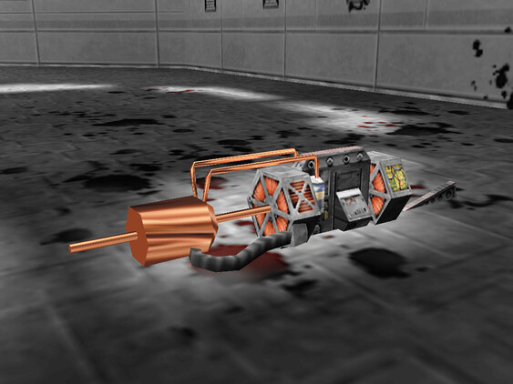
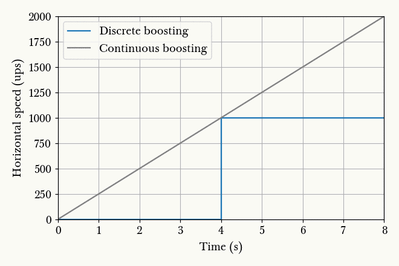
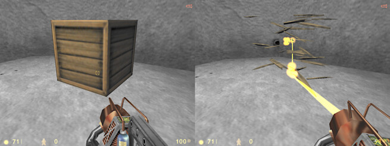
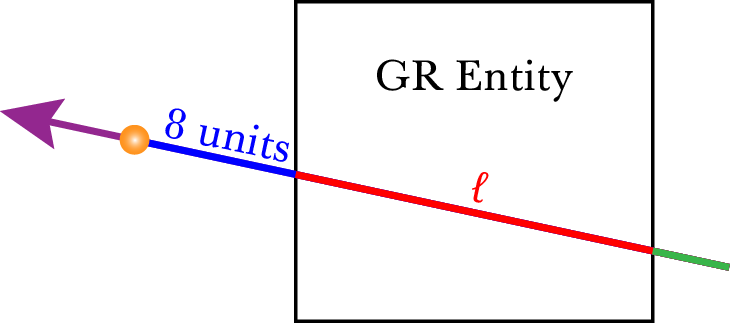
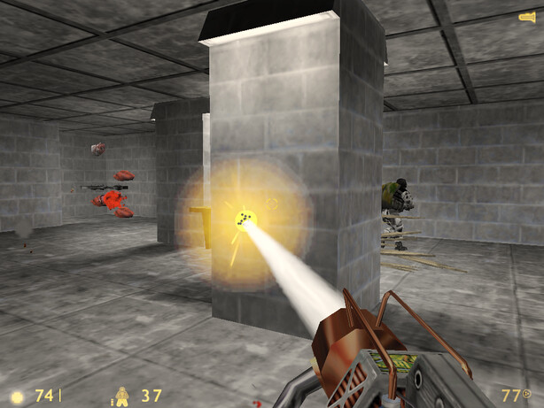
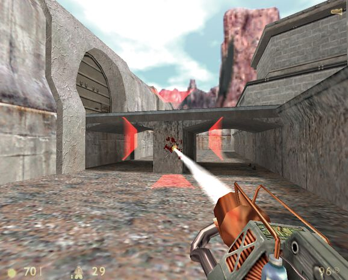
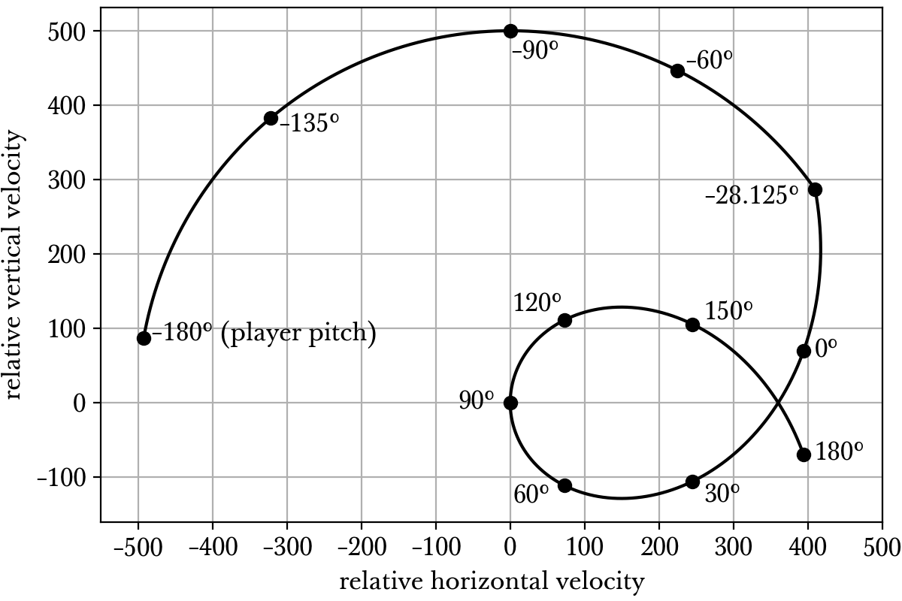
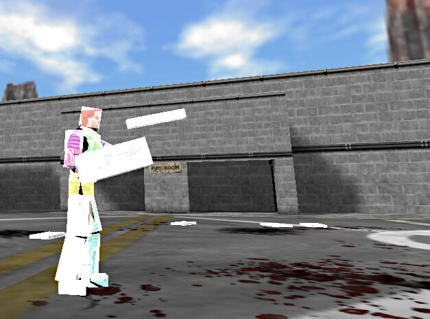
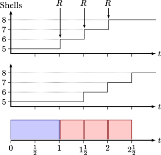

Weapons
=======

Half-Life is a shining example of having an already stellar gameplay elevated by well designed weapons, not just from a casual gamer's point of view, but also that of a speedrunner. In this article, we will attempt to describe the physics of all the weapons in Half-Life that may be relevant to speedrunning. The physics of the various weapons are varied and interesting, with complexities ranging from those requiring only the simplest of descriptions to those demanding a level of research rivalling the player movement physics.

.. TODO: satchels etc ignore the player, but after a save/load they no longer ignore the player
.. TODO: but gauss probably doesn't ignore satchels, so possible to hit a grenade with gauss and reflect?

.. TODO: many of the discussions below takes about "a timer of 0.1s", or "a timer of 0.2s" etc. These are not really correct. It really is "a timer of 0.1s + 1 frame", or at least sometimes it is. E.g. at host_framerate 0.001, we see that something that is supposed to happen once every 0.1s (e.g. the damage in gluon gun), sometimes only happens once every 0.101s:

.. 927.083435 hit!
   927.183472 hit!
   927.284424 hit!
   927.384460 hit!
   927.485474 hit!
   927.586426 hit!
   927.686462 hit!
   927.787476 hit!
   927.888428 hit!
   927.988464 hit!
   928.089478 hit!
   928.190430 hit!

.. Notice some of the gaps is 0.100, and others 0.101. E.g. This might be due to inherent FP errors when adding the frame time. This becomes worse that lower frame rates, the errors will be more pronounced!

.. _bullet spread:

Bullet spread
-------------

The bullets of some weapons in Half-Life have a spread that cause them to deviate from the target slightly. The amount of deviation depends on the weapon. The deviation appears to be random and unpredictable to a casual player. However, bullets fired by the player rely only on the shared RNG, which we have concluded in :ref:`shared rng` that it is wholly predictable and non-random. In particular, if in a TAS the player loads from a savestate and fires a weapon with bullet spread in some fixed :math:`n`-th frame, then the spread of the bullets will not change if the savestate is loaded again and the same actions are repeated.

The spread of the bullets when fired by the player is computed in ``CBaseEntity::FireBulletsPlayer``. One of the arguments to this function is the number of bullets :math:`n_B`. For example, the shotgun (see :ref:`shotgun`) in primary mode would pass 6 for this argument. In all other weapons that have bullet spreads, 1 is always passed in, because those weapons fire one bullet at a given time. This function also accepts several other obvious arguments. Of concern to us are the spread vector :math:`\mathbf{\Omega} \in \mathbb{R}^3`, the source of line trace :math:`\mathbf{a}`, the aiming direction :math:`\mathbf{d}`, the range :math:`\ell` of the weapon, the bullet type, and the shared RNG "seed" :math:`\sigma`.

This function uses the multidamage mechanism described in :ref:`damage system`. At a higher level, the function begins by doing a *clear* on the currently accumulated damage and sets the accumulated damage type to ``DMG_BULLET | DMG_NEVERGIB``. It then enters a loop that spreads and  *adds* or accumulates the damage that *will be inflicted* due to each of the :math:`n_B` bullets. Once it exits the loop, it does an *apply* operation. The effect of these is that the damage will usually be accumulated and then actually inflicted, rather than inflicted for each bullet.

The loop is the meat of the bullet spread physics. Let :math:`i` be the loop counter such that :math:`i = 1` in the first iteration, :math:`i = 2` in the second iteration, and so on. At the start of an iteration, it computes the deviation multipliers :math:`m_x` and :math:`m_y` in the horizontal and vertical directions respectively. Mathematically, these are computed as such:

.. math::
   \begin{aligned}
   m_x &\gets \mathfrak{R}_S\left(\sigma + i, -\frac{1}{2}, \frac{1}{2} \right) + \mathfrak{R}_S\left(\sigma + i + 1, -\frac{1}{2}, \frac{1}{2} \right) \\
   m_y &\gets \mathfrak{R}_S\left(\sigma + i + 2, -\frac{1}{2}, \frac{1}{2} \right) + \mathfrak{R}_S\left(\sigma + i + 3, -\frac{1}{2}, \frac{1}{2} \right)
   \end{aligned}
   :label: bullet spread shared RNG

Then, if :math:`\mathbf{\hat{s}}` and :math:`\mathbf{\hat{u}}` are the player's unit right and up vectors (see :ref:`view vectors`), then it traces a line ignoring the player entity from the source :math:`\mathbf{a}` to the point given by

.. math:: \mathbf{a} + \ell \left( \mathbf{d} + m_x \Omega_x \mathbf{\hat{s}} + m_y \Omega_y \mathbf{\hat{u}} \right)
   :label: bullet spread end point

If this line trace hits nothing, then nothing important is done. If this line hits an entity, then the ``TraceAttack`` of the hit entity will be called with an amount of damage depending on the bullet type argument passed to this function. The ``TraceAttack`` typically performs the *add* multidamage operation. The reader is encouraged to read the SDK code for more details.

.. _actual bullet range:

Actual bullet range
~~~~~~~~~~~~~~~~~~~

In :eq:`bullet spread end point`, we observe that distance from the source to the end point is not :math:`\ell`, the intended bullet range. We can see this because the direction vector is not normalised before being scaled up by :math:`\ell`. If we assume the player roll angle is 0 and :math:`\mathbf{d} = \mathbf{\hat{f}}`, both of which are true for the vast majority of the time, then it can be shown that the range of a bullet is actually

.. math:: \ell \sqrt{1 + m_x^2 \Omega_x^2 + m_y^2 \Omega_y^2}

rather than just :math:`\ell`. Though this error is very small and unnoticeable in practice. In the subsequent descriptions of the various weapons in this chapter, when we claim that a weapon has a bullet spread and a range of some value of :math:`\ell`, keep in mind that the actual range of the bullet is slightly longer depending on the spread. Weapons that do not have a bullet spread are not affected by the error described in this section.

.. _bullet distribution:

Distribution
~~~~~~~~~~~~

In :eq:`bullet spread shared RNG`, if we ignored the deeply flawed randomness of :math:`\mathfrak{R}_S`, then we can immediately see that :math:`-1 \le m_x < 1` and :math:`-1 \le m_y < 1`. In addition, both :math:`m_x` and :math:`m_y` are drawn from a triangular distribution (rather than a gaussian distribution claimed by the comments in the code), the PDF of which may be given by

.. math::
   f(z) =
   \begin{cases}
   z + 1 & -1 \le z < 0 \\
   1 - z & 0 \le z \le 1
   \end{cases}

However, due to the non-randomness of :math:`\mathfrak{R}_S`, and the fact that the values of the first argument provided to :math:`\mathfrak{R}_S` are deterministic and predictable, there are at most only 256 possible combinations of :math:`(m_x, m_y)`. This further implies that there are only at most 256 possible bullet spread patterns.

   An illustration of the bounds of the bullet spread, which is a square. A circle is drawn here for reference. The six dots drawn here represent the shotgun's primary attack bullet spread with a shared seed of :math:`\sigma = 87`.

We also observe that the spread of the bullets is square rather than circular. In other words, if :math:`\mathfrak{R}_S` is truly random and enough bullets have been fired at a wall, then the bullet markings on the wall would form a square rather than a circle. This is illustrated in :numref:`bullet spread distribution`. Notice that two of the pellets lie outside the circle, proving that bullet spreads are not confined within it. The deviation of bullets in each of the horizontal and vertical directions is independent. We can see this easily because :math:`m_x^2 + m_y^2 \le 1` is false.

Meaning of :math:`\mathbf{\Omega}`
~~~~~~~~~~~~~~~~~~~~~~~~~~~~~~~~~~

The vector :math:`\mathbf{\Omega}` is referred to as the spread vector above. The way this vector is named and defined in the SDK implies that each element in the vector is :math:`\sin(\theta_S/2)` where :math:`\theta_S` is the intended maximum side-to-side angle of deviation. In :numref:`bullet spread angle`, the angle :math:`\angle\mathit{BAC} = \theta_S/2` and therefore the length of :math:`\mathit{CC\,'} = \mathit{BD} = \sin(\theta_S/2)`. The SDK defines a few constants for :math:`\mathbf{\Omega}` that are used by the various weapons. For example, the MP5 (see :ref:`mp5`) uses the following as its :math:`\mathbf{\Omega}`:

.. code-block:: cpp
   :caption: ``dlls/weapons.h``

   #define VECTOR_CONE_6DEGREES	Vector( 0.05234, 0.05234, 0.05234 )

Indeed, :math:`2 \arcsin(0.05234) \approx 6.000464^\circ`.

   The different meaning of "bullet spread" used inconsistently in the SDK. :math:`A` is the bullet source of the line trace (denoted as :math:`\mathbf{a}`), :math:`\mathit{AC\,'B} = \mathit{AC}` has unit length represents the aiming direction, :math:`\mathit{ABD}` is a right-angle triangle, :math:`\mathit{CC\,'} = \mathit{BD}`, and :math:`\mathit{BC}` is an arc with a centre at :math:`A`.

However, if we look more closely at :eq:`bullet spread end point`, we see that the actual maximum angle of deviation is not exactly 6 degrees, for two reasons. Firstly, as explained in :ref:`bullet distribution`, the bullets spread in a square rather than a circle, so the angle of deviation from the centre is not constant. Even if we consider just the horizontal and the vertical angles of deviation, the actual angle differs from the intended angle because the method of obtaining the values defined in the SDK is incorrect given how those values are then used in :eq:`bullet spread end point`. Specifically, :eq:`bullet spread end point` makes the maximum deviation to be the the line :math:`\mathit{AD}` with angle :math:`\angle\mathit{BAD} < \angle\mathit{BAC}`. Using the MP5 as an example, the actual angle of deviation is :math:`2 \arctan 0.05234 \approx 5.992^\circ` which is smaller than intended.

In general, the actual angle of deviation :math:`\angle\mathit{BAD}` is always slightly smaller than the intended angle :math:`\angle\mathit{BAC}`. We can see this easily by expanding :math:`\arcsin x` and :math:`\arctan x` to two terms in their respective Maclaurin series:

.. math:: \arcsin x \approx x + \frac{x^6}{6} > \arctan x \approx x - \frac{x^3}{3}

Admittedly, the difference is very small thanks to the small angle approximations :math:`\sin x \approx \tan x \approx x` in radians.

.. _gauss:

Gauss
-----

The gauss is one of the more interesting weapons in Half-Life. One of the earliest speedrunning tricks, the simple gauss boosting, and one of the most recently discovered tricks, quickgaussing, are both gauss-related. The gauss is arguably the most complex weapon in Half-Life, and it is worth devoting some paragraphs exploring its behaviour.

   The gauss weapon model.

The gauss weapon has two modes, as any entry level Half-Life player would know. The primary mode of the gauss fires orange beams consuming 2 cells and providing 20 damage. The delay between shots in primary mode is 0.2s. The secondary mode is more interesting. In single-player mode, the weapon consumes a cell every 0.3s while charging, starting from an initial consumption of one cell. The minimum charge time is 0.5s. If the weapon charges for more than 10 seconds, the weapon will discharge and inflict 50 damage onto the player. The damage of the beam in secondary mode otherwise scales linearly with charging time :math:`T` such that

.. math:: D = 50 \min(T, 4)

Observe that the damage caps at 200 after charging for 4 seconds. The secondary fire produces a physical recoil, which is manifested by a change in the player velocity. If :math:`\mathbf{v}` is the current player velocity, and :math:`\mathbf{\hat{f}}` is the unit forward vector, then the new velocity is given by

.. math:: \mathbf{v}' = \mathbf{v} - 5D\mathbf{\hat{f}} \operatorname{diag}(1,1,0)
   :label: gauss velocity

where :math:`\operatorname{diag}(1,1,0)` refers to the diagonal matrix with 1, 1, and 0 as the entries on the diagonal. Observe that the vertical velocity never changes. To maximise horizontal speed change, the player must fire from zero pitch, which gives the maximum speed change of 1000 ups, one of the greatest speed boosts available in Half-Life. The gauss cannot be fired when the waterlevel is 3, and the gunfire volume is always 450 regardless of the mode.

The behaviour of gauss beams is relatively complex compared to other Half-Life projectiles. Intuitively, players recognise that gauss beams have a tendency to reflect off surfaces. Gauss beams can also "punch" through walls and damage entities at the opposite side, through a mechanism that is not obvious at first sight. Gauss beams can even inflict damage onto oneself under the right circumstances. What is more, the damage from gauss beams can be seemingly amplified when fired through particular geometries.

A detailed and complete understanding of the gauss behaviour can be achieved by reading the code in ``dlls/gauss.cpp`` in the Half-Life SDK. Rather than listing the code and tracing through line by line here, we shall explore the weapon by examples of its exploits.

.. From the "code" above, we immediately see that a necessary condition for beam reflection is an angle of incidence of below 60 degrees. After a reflection, the aiming direction :math:`\mathbf{\hat{a}}` will be pointing in the direction of the reflected beam. It can be easily shown that the vector remains a unit vector after the reflection. Observe also the next :math:`\mathbf{s}` is offset from the hit surface by 8 units.

.. We also observe that a radius damage of :math:`pD` is inflicted at the point of reflection. This damage decreases as the angle of incidence increases, which is intuitive. Next, :math:`D` get reduced by the radius damage amount. Multiple reflections can happen until :math:`D` gets reduced down to 10 or below, or after 10 iterations. We can thus think of :math:`D` as a kind of "energy level" of the beam. The more energy is used at each reflection, the fewer *further* reflections can be made.

.. If no reflection is made due to small angles of incidence, the beam will attempt to punch through the hit entity, provided the hit entity can reflect gauss and firing in secondary mode. The game will perform a trace offset slightly from the tracing end position to the same destination. The line typically hits the outer surface of a separate worldspawn entity if it begins from within an entity, or any entity surface otherwise. Then, the game will perform another trace from the end position of the previous trace to the end position of the first trace in the loop. This effectively determines the "exit point" of the beam, though this may not be the exit point of the first entity it punched through.

.. The distance between :math:`\mathbf{e}_t` and the latest :math:`\mathbf{e}_b` is an important quantity. The numerical value of this distance is compared to the damage level :math:`D` of the beam, and a chunk of code calculating explosive damage is only executed if the distance is below :math:`D`. The radius damage at the "exit point" can be significant if a fully charged beam is punched through the entity, though the damage is reduced by that distance.

.. _gauss mechanism:

Beam iterations
~~~~~~~~~~~~~~~

   Flow chart of

A gauss beam starts off with an initial damage :math:`D_1` and hit counter ``nMaxHits`` with an initial value of 10. The game then perform at most 10 iterations (tracked by ``nMaxHits`` which is decremented each iteration) to to calculate the dynamic behaviour of the gauss beam. In each iteration, the game may reduce the damage, inflict damage to some entity, or calculate beam reflection. If :math:`D_i \le 10` or ``nMaxHits`` reaches zero at some iteration :math:`i`, then the beam will stop iterating. This implies that the damage :math:`D_i` is akin to the "energy" of the beam.

Crucially, the game also keeps track of the *ignored entity*, or ``pentIgnore`` in the code. This ignored entity is initialised to be the player entity before the iterations begin. The ignored entity is the entity that will be ignored by any line tracing, and can be changed from time to time as we will see shortly. What entity is or is not being ignored plays a huge role in some of the common exploits of this weapon.

In performing line traces, the game also keeps track of :math:`\mathbf{\hat{p}}_i`, represented by ``vecDir`` in the code. You can think of this vector as representing the direction of a the gauss beam in any iteration. This direction vector is initialised to be the player's unit forward vector :math:`\mathbf{\hat{f}}`. It can be modified if the beam reflects, as we will see below.

Roughly speaking, in any iteration :math:`i`, the game begins by tracing a line from the player gun position :math:`\mathbf{s}_i` to 8192 units away in the direction of :math:`\mathbf{\hat{p}}_i`, namely with the end point of :math:`\mathbf{s}_i + 8192 \mathbf{\hat{p}}_i`. This line may or may not hit some entity. If no entity is hit, the iterations simply stop. Otherwise, the behaviour of the beam will depend on whether this entity is *gauss reflectable* (GR) or *non-gauss reflectable* (non-GR). For our purposes, we can say that an entity is gauss reflectable if it *cannot* receive damage, and vice versa.

.. note:: The game graphics will sometimes show a gauss beam seemingly reflecting off a non-gauss reflectable entity. This does not contradict what we described here: what you see is purely a client side visual artefact, and no reflection actually occurred on the server side. You can check this by placing an NPC in the path of the apparent reflected beam, and observe that the reflected beam does not damage the NPC.

Denote :math:`\mathbf{e}_{i,1}` the point of intersection of the tracing line and the hit entity. If the hit entity is non-GR, then the game will simply set the trace origin of the next iteration :math:`\mathbf{s}_{i+1} \gets \mathbf{e}_{i,1} + \mathbf{\hat{f}}`. This implies that the next trace origin is not exactly at the point of intersection, but displaced 1 unit away. Also, the game will set the ``pentIgnore`` to be the hit entity. This causes the line trace in the next iteration to ignore this entity. The game now proceeds to the next iteration.

On the other hand, if the hit entity is GR, then the beam behaviour is more complex. The game first sets the ignored entity ``pentIgnore`` to null, which causes the subsequent line traces in this iteration to *not* ignore anything. Then, the game decides whether to reflect the beam. If :math:`\mathbf{\hat{n}}_i` is the plane normal of the hit surface and :math:`\mathbf{\hat{p}}_i` is the current beam direction vector, then the game calculates the component of the beam in the direction of the plane normal, that is :math:`c = -\mathbf{\hat{n}}_i \cdot \mathbf{\hat{p}}_i`. This quantity can also be thought of this way: if :math:`\phi` is the angle of incidence (the shortest angle between the beam and the plane normal), then this quantity equals :math:`\cos\phi`.

A gauss beam can reflect only if :math:`c < 1/2`, which implies an angle of incidence *larger than 60 degrees*. If the beam reflects, the game will set the beam direction to be :math:`\mathbf{\hat{p}}_{i+1} \gets 2c\mathbf{\hat{n}} + \mathbf{\hat{p}}_i`. This new direction represents the direction of the reflected beam. Observe that the angle of reflection is the same as the angle of incidence, because

.. math:: \mathbf{\hat{n}}_i \cdot \mathbf{\hat{p}}_{i+1} = \mathbf{\hat{n}}_i \cdot (2c\mathbf{\hat{n}}_i + \mathbf{\hat{p}}_i) = 2c - c = c

Then the game will set :math:`\mathbf{s}_{i+1} \gets \mathbf{e}_{i,1} + 8 \mathbf{\hat{p}}_{i+1}` for the next iteration. Notice that the line trace source for the next iteration is displaced 8 units away from the point of reflection. Following this, the game will create an explosion with the origin at :math:`\mathbf{e}_{i,1}` and a source damage of :math:`c D_i` (see :ref:`explosions`). This implies that the larger the angle of incidence, the lower the blast damage. Finally, the game calculates the damage :math:`D_{i+1} \gets D_i (1 - \max(0.1, c))` for the next iteration. The game then proceeds to the next iteration.

On the other hand, if the beam cannot reflect, which implies an angle of incidence of *less than 60 degrees*, then the subsequent beam behaviour is the most complex. The game first checks if the beam has reached this point in the previous iterations. If so, the iterations will simply stop. Otherwise, now that the beam has just reached this point in the code, that check will fail for subsequent iterations. In addition, if this gauss beam is fired from the primary mode, then the game will also stop the iterations.

The game traces a line from :math:`\mathbf{e}_{i,1} + 8\mathbf{\hat{p}}_i` to :math:`\mathbf{s}_{i} + 8192 \mathbf{\hat{p}}_i`. Note that :math:`\mathbf{e}_{i,1}` always lies on the line from :math:`\mathbf{s}_i` to :math:`\mathbf{s}_i + 8192 \mathbf{\hat{p}}_i`. If the trace result is all solid, the game moves on to the next iteration. Otherwise, set the tracing point of intersection be :math:`\mathbf{e}_{i,2}`. Now, the game attempts to *trace backwards* by tracing from :math:`\mathbf{e}_{i,2}` to :math:`\mathbf{e}_{i,1}`. Set the tracing point of intersection be :math:`\mathbf{e}_{i,3}`. Now, denote

.. math:: \ell = \lVert\mathbf{e}_{i,3} - \mathbf{e}_{i,1}\rVert

If :math:`\ell \ge D_i`, the game moves on to the next iteration. Otherwise, if :math:`\ell = 0` set :math:`\ell \gets 1`. The game now calculates :math:`D_{i+1} \gets D_i - \ell`. With this new damage, the game then creates an explosion with the origin at :math:`\mathbf{e}_{i,3} + 8\mathbf{\hat{p}}_i` and source damage :math:`D_{i+1}`. Finally, the game sets :math:`\mathbf{s}_{i+1} \gets \mathbf{e}_{i,3} + \mathbf{\hat{p}}_i`.

Simple gauss boost
~~~~~~~~~~~~~~~~~~

One of the simplest tricks for the gauss weapon is simple gauss boosting. Namely, speed boosting from the recoil of firing the secondary attack. The simple gauss boost remains one of the most versatile boosting methods in Half-Life, and is used to great effects in a typical Half-Life speedrun. Unfortunately, the gauss being an endgame weapon is manifested by the fact that its ammo supply is relatively constrained. Good ammo planning must be done to maximise the effectiveness of this weapon.

A common task in speedrunning is to get from one point to another in the shortest time possible using simple gauss boosting. From :eq:`gauss velocity` we know that, assuming zero pitch, the horizontal speed boost is proportional to the charging time. On the other hand, the minimum charging time is 0.5 seconds. What is the optimal way to perform gauss boosts? Or, what is the boosting scheme for maximising the average speed (total distance travelled in a given time)? Should one repeatedly charge the gauss for 1s and firing, or repeatedly charge the gauss for 0.5s and firing? There is a simple way to answer this.

   Animation of horizontal speed against time with boosting schemes of different charging time :math:`T`, so that the final speed always ends up to be 2000 ups.

Suppose the player is stationary. At :math:`t = 0`, the player begins charging and after an interval :math:`T`, the player releases the charge. Immediately after the release, the player begins charging again for :math:`T`, and so on. From :numref:`simple gauss boosts` we observe that the smaller the boosting interval, the closer the graph approximates the continuous boosting line, which is a theoretical case of :math:`T = 0`. More importantly, observe that the area under the discrete graph also increases with decreasing :math:`T`, up to a maximum corresponding to the continuous case. Given that the minimum :math:`T` is half a second, we conclude that the optimal boosting scheme is to charge for half a second a firing, repeatedly.

If it is possible to pre-charge the gauss weapon before timing a particular run, then it is still beneficial to charge the weapon as much as possible and then release the charge at :math:`t = 0`. This gives a higher initial speed in :numref:`simple gauss boosts` instead of 0 as shown, which effectively shifts the graphs upwards and increasing the area under the graphs.

.. _quickgauss:

Quickgauss
~~~~~~~~~~

Quickgauss is a special kind of speed boosting similar to the simple gauss boost, except a save/load is done while the gauss is charging. When the charge is released after a game load, the result is similar to releasing a :math:`T = 4` secondary charge. In particular, the resulting speed boost and damage are the maximum attainable from the weapon, that is 1000 ups and 200 damage, while consuming only one cell and a charging time of half a second. This provides one of the highest accelerations from a single weapon achievable in game (2000 ups/s), and also one of the highest damage rates (400 dps).

Unfortunately, quickgauss only works in versions of Half-Life with the bunnyhop cap. This is because in these versions of Half-Life, in ``dlls/weapons.cpp`` the following lines define the states of the gauss weapon to be stored in the savestate:

.. code-block:: c++
   :emphasize-lines: 4

   TYPEDESCRIPTION CGauss::m_SaveData[] =
   {
       DEFINE_FIELD( CGauss, m_fInAttack, FIELD_INTEGER ),
   //  DEFINE_FIELD( CGauss, m_flStartCharge, FIELD_TIME ),
   //  DEFINE_FIELD( CGauss, m_flPlayAftershock, FIELD_TIME ),
   //  DEFINE_FIELD( CGauss, m_flNextAmmoBurn, FIELD_TIME ),
       DEFINE_FIELD( CGauss, m_fPrimaryFire, FIELD_BOOLEAN ),
   };
   IMPLEMENT_SAVERESTORE( CGauss, CBasePlayerWeapon );

Notice how the highlighted line is inexplicably commented out, so that ``m_flStartCharge`` does not get saved to the savestate. When the game is loaded from a save, this field will be zero. The calculation of current charging time is done by ``gpGlobals->time - m_pPlayer->m_flStartCharge`` throughout ``dlls/gauss.cpp``, with ``gpGlobals->time`` being much larger than 4 in most cases. If ``m_flStartCharge`` is zero, the calculated charging time will be much larger than 4, and thus clamped to 4 and giving the maximum damage and recoil. On the other hand, the consumption of cells while charging is done periodically over a real passage of time, rather than calculated from the charging time. Since the *real* charging time is only half a second, only one cell is consumed in total.

It should be immediately apparent that quickgaussing is very powerful. If quickgauss is available in a particular version of Half-Life, the runner will almost never need to use the simple gauss boosting, as quickgauss is so ammo efficient. In the rare cases where it is desirable to perform a boost less than the maximum attainable, the runner can pitch up or down accordingly when firing to reduce the boost amount, according to :eq:`gauss velocity`.

.. _entity piercing:

Entity piercing
~~~~~~~~~~~~~~~

When a beam hits a non-gauss-reflectable entity, which implies it is damageable, the beam will first inflict damage onto the entity. Then, in the next iteration, the beam will *ignore* that entity while continue tracing forward. This results in the beam passing right through the entity untouched, and hitting some other entity instead. It is also important to note the beam does not lose energy when it passes through non-GR entities. Understanding entity piercing allows the runner to save time and ammo by reducing the number of shots required to damage multiple targets.

.. _doublegauss:

Doublegauss
~~~~~~~~~~~

Doublegauss refers to the technique in which a gauss beam hits a non-gauss-reflectable target entity, reflects off a gauss-reflectable entity beyond the first entity, and hits the target entity again with the reflected beam. As described in :ref:`gauss mechanism`, a beam reflection is always accompanied by a radius damage created at the point of reflection. Using this technique, this radius damage is normally also inflicted onto the target entity. Typically, the target entity receives three damage inflictions overall. Though inconspicuous and seemingly unremarkable when executed in a speedrun, doublegauss is the secret to getting nearly double (with some caveats explained below) the damage out of a single shot for free, whether in primary or secondary mode.

   Aiming down at a crate and breaking it with one shot by shooting with the doublegauss mechanism. The crate was damaged three times, first by the incident beam, second by the radius damage on the ground below the crate, and third by the reflected beam. This technique very close to double the damage inflicted. This crate would otherwise have required two primary gauss shots to break, consuming four cells instead of two.

Let :math:`D` be the initial damage. In :ref:`entity piercing`, we explained that when a gauss beam hits a non-gauss-reflectable entity, it will inflict :math:`D` onto the entity. In :numref:`doublegauss figure`, this initial beam is represented by the :math:`\mathit{OA}`, and therefore the damage infliction point is :math:`A`. In the next beam iteration, the beam will ignore the target entity and pass right through it as line :math:`\mathit{AR}`. [#ARline]_ Suppose the beam subsequently hits a gauss-reflectable entity at :math:`R`, such as the ground or a wall. If the angle of incidence is greater than 60 degrees, which is a necessary condition for the beam to reflect, the beam will reflect off the GR entity, as explained in :ref:`gauss mechanism`.

.. figure:: images/doublegauss-parts.svg
   :name: doublegauss figure

   An illustration of the doublegauss technique. :math:`O` is the starting point of the gauss beam. :math:`A` is the point of intersection of the incident beam with the non-gauss-reflectable target entity and where the first damage is inflicted. :math:`R` is the point on the gauss-reflectable entity where the beam reflects. :math:`B` is the start position of the reflected beam, which is exactly 8 units away from :math:`R`. :math:`C` is some point along the reflected beam and does not necessarily represent the end of the beam.

Recall that if the angle of incidence is :math:`\phi`, then the radius damage created from the reflection is :math:`D \cos\phi`. This radius damage will be inflicted onto the target entity with the explosion origin at :math:`R`. The actual damage inflicted depends on how far away the target entity is from :math:`R` as described in :ref:`explosion physics`. In most cases, the target entity is in contact with the GR entity. For instance, the target entity could be a damageable crate (:ref:`func_breakable`) which is almost always resting and in contact with the ground in Half-Life maps. In such cases, the distance of the target entity from :math:`R` will be zero, causing the full radius damage to be inflicted onto it.

At the end of the second iteration, the gauss beam will no longer ignore the target entity stuck in the first iteration. The reflected beam :math:`\mathit{BC}` will hit the target entity again at point :math:`B` (point blank) in the third iteration, though with a reduced damage of :math:`D \left(1 - \cos\phi\right)`. Observe that because :math:`B` is 8 units away from :math:`R`, it is possible for :math:`B` to be positioned beyond the target entity and missing it, resulting in a bypass (:ref:`reflection bypass`). Assuming :math:`B` is inside the target entity, then the damage inflictions onto the target are shown in the table below.

================== ============
Iteration          Damage
================== ============
First              :math:`D`
Second             :math:`\le D \cos\phi`
Third              :math:`D \left(1 - \cos\phi\right)`
================== ============

The total damage inflicted onto the target non-GR entity is simply the sum of all damages, which has a maximum of :math:`2D`. Observe that the maximum possible damage is independent of the angle of incidence :math:`\phi`.

In the above analysis, we ignored what could happen next for the beam :math:`\mathit{BC}`. In reality, this beam could carry on to hit other entities, and even triggering subsequent doublegausses. Let :math:`D_1` be initial damage and :math:`\phi_1` be the angle of incidence of the first doublegauss. In the first doublegauss, the maximum potential damage inflicted is :math:`2D_1` and the remaining beam damage is :math:`D_2 = D_1 \left( 1 - \cos\phi_1 \right)`. In the second doublegauss, the maximum potential damage inflicted is therefore :math:`2D_2` and the remaining beam damage is :math:`D_3 = D_2 \left( 1 - \cos\phi_2 \right)`. In general, the maximum potential damage inflicted by the :math:`n`-th doublegauss is simply :math:`2D_n` and the remaining damage is

.. math:: D_{n+1} = D_n \left( 1 - \cos\phi_n \right) = D_1 \prod_{i=1}^n \left( 1 - \cos\phi_i \right)

Therefore, the total maximum potential damage inflicted by all of the :math:`n` doublegauss executions is

.. math:: \sum_{i=1}^n 2D_i = 2D_1 \left( 1 + \sum_{i=2}^n \prod_{j=1}^{i-1} \left( 1 - \cos\phi_j \right) \right)

Of academic note, as each of :math:`\phi_1,\phi_2,\ldots,\phi_n` tends towards :math:`\pi/2`, the total damage tends towards :math:`2D_1n`. Therefore, at least purely mathematically, we could have infinite total damage inflicted by a single shot. Examining :numref:`gauss-flowchart` more closely, however, reveals that the maximum number of beam iterations is :math:`n = 10`. A quickgauss (:ref:`quickgauss`) gives :math:`D_1 = 200`, which translates to the maximum total damage by a single shot of gauss as 4000, when combined with the doublegauss technique and the precise arrangement of entities in a map.

.. FIXME: seems like entity piercing sometimes doesn't work on non monsters?

.. _entity punch:

Entity punch
~~~~~~~~~~~~

As explained in :ref:`gauss mechanism`, a secondary gauss beam can punch through a GR entity if it does not meet the criterion for reflection. The damage produced by an entity punch is dependent on :math:`\ell`. This quantity is typically the thickness of the wall, but this is not always the case. In particular, the position :math:`\mathbf{e}_{i,2}` is found by tracing a line from the *inside* an entity. It is not always obvious what the line can "see" and end up under these circumstances. Sometimes, the trace line can ignore (unrelated to ``pentIgnore``) and not able to detect certain entities, and therefore the line tracing may end at a further point, skipping these undetected entities along the way. And sometimes, if the thickness of an entity is too high, the game may wrongly determine that the trace is all solid.

   A secondary gauss beam can punch through a GR entity and create an explosion 8 units away from the exit point, with a damage magnitude proportional to :math:`\ell`.

If the line tracings went well, the game will create an explosion 8 units away from the exit point. The thinner the walls or entities (barring the caveats above), the higher the explosive damage. Since the explosion origin is displaced from the exit surface, it is possible for the origin to be located inside some other entity, thus causes nuking (see :ref:`nuking`). In general, entity punching can be very powerful. With a full gauss charge, the player can instantly create explosions of a maximum of 200 source damage, outclassing most explosive weapons.

   An in-game execution of the gauss entity punch mechanism. While the beam struck the pillar and completely missed the human grunt targets, the explosion created on the other side of the pillar was able to reduce the grunt on the left into gibs and tear down a table on the right into splinters.

Reflection boost
~~~~~~~~~~~~~~~~

Reflection boost refers to boosting which involves a reflection of the gauss beam. There are two variants of gauss reflect boost: *ducking* and *standing*. Reflection boosts can be used to provide vertical boost, which is not possible with a normal gauss boost in single player. The vertical boost is provided by means of self-inflicted damage, which can be costly to player health.

The ducking reflect boost sequence is as follows.

#. Start charging for quickgauss
#. Duck on the ground
#. Pitch to 30 degrees downward
#. Jump *just* before firing
#. Save/load for quickgauss

The beam should be reflected off the ground, at a 60 degrees angle of incidence. This provides the player a 866 ups horizontal boost and a respectable vertical boost. The sequence demands high precision to produce the desired effects.

The standing reflect boost uses explosive damage from beam reflection as well. However, the standing reflect boost sequence requires even higher precision to execute.

#. Start charging for quickgauss
#. Stand touching a wall
#. Pitch to 60 degrees downward
#. Yaw to look *perpendicularly into* the wall
#. Offset the yaw slightly to the left or right by about 1 to 2 degrees
#. Duck and jump *simultaneously* just before firing
#. Save/load for quickgauss

The result, however, is respectable.

.. TODO: why does this not happen with very thick walls? Like the walls at the top barney in crossfire

.. _selfgauss:

Selfgauss
~~~~~~~~~

Selfgauss is a very well known trick, but probably one of the least understood among speedrunners. Selfgaussing is the result of the beam hitting the player as it is being fired out of the imaginary gun barrel, or specifically the player's gun position. This is due to the origin of the line tracing :math:`\mathbf{s}_i` being *inside the player model*. An analogy from the real world would be firing a pistol from inside one's body, so that the bullet hits the player's internals point blank. The outcome is a perfectly vertical speed boost, as the inflictor origin :math:`\mathbf{r}_\text{inflictor}` and the player origin :math:`\mathbf{r}` coincides, thus giving a perfectly upward :math:`\mathbf{\hat{d}}` vector (see :ref:`damage boosting`).

.. caution:: It is a common misconception that selfgauss occurs because the beam somehow "reflects" backwards onto the player after hitting a wall. It is easy to see that this is a wrong explanation, because the beam cannot reflect when the angle of incidence is less than 60 degrees, and the gauss beam cannot reverse its damage inflicting direction.

In the first iteration, the gauss beam will ignore the player, because ``pentIgnore`` is set the be the player entity, as explained in :ref:`gauss mechanism`. Selfgauss will only work in the next iteration if ``pentIgnore`` is set to null, and :math:`\mathbf{s}_i = \mathbf{s}_{i+1}`. Therefore, selfgauss cannot happen if the beam strikes a non-gauss reflectable entity, for it modifies :math:`\mathbf{s}_{i+1}` in the next iteration. Selfgauss cannot happen if the beam reflects, as reflections change :math:`\mathbf{s}_{i+1}` as well.

   A famous selfgauss spot in the ``boot_camp`` multiplayer map that has caused many players to die unintentionally.

Suppose when the player fires the gauss in secondary mode, the beam first strikes some entity at a sufficiently small angle of incidence so that the beam does not reflect. Assuming this entity is gauss reflectable, the game will perform two traces to determine the distance between the "exit point" and the entry point. This distance is denoted as :math:`\ell`. Selfgauss will only work if :math:`\ell` is less than the numerical damage of the beam. If the opposite is true, then :math:`\mathbf{s}_{i+1}` will be modified, preventing selfgauss. This implies that higher :math:`\ell` is more desirable as it allows for selfgaussing with a greater damage, and thus producing greater boosts. The same caveat with regards to the meaning of :math:`\ell` should be applied, as explained in :ref:`entity punch`. Namely, while it commonly is found to be the thickness of the entity the beam is hitting, this is not always the case. It is not always easy to tell at first sight what :math:`\ell` might be for a given geometry and terrain.

To perform selfgauss in practice, there are a few notes to keep in mind. Recall from :ref:`hitgroup` that attacks that trace to the player's head will deal three times the original damage. To save ammo, it is desirable to headshot the player while selfgaussing, giving a higher speed boost to ammo ratio. In addition, it is desirable to jump immediately before selfgaussing, as jumping provides an important initial vertical speed that can save health and ammo. However, note that a simple jump may not work. Recall from :ref:`duckjump` that when the player jumps, the player model plays the jumping animation, which changes the model geometry (and thus the hitboxes' positions) considerably. This can prevent headshotting even when the beam is fired from the same viewangles without jumping. The solution is to duck and jump, which prevents the jumping animation from playing.

Entity selfgauss
~~~~~~~~~~~~~~~~

Entity selfgaussing is a way of doubling the damage of a secondary gauss attack using the same number of cells and charge time. Entity selfgaussing works very similarly to selfgauss (:ref:`selfgauss`). The only difference is that, in the first beam iteration, the beam should hit the target entity which must be non-GR. As a result, the first damage will be inflicted and :math:`\mathbf{s}_{i+1}` will be calculated to be *inside the target entity*. The rest of the mechanism work exactly the same as that of selfgauss, except the trace origins are inside the target entity rather than the inside the player entity. Specifically, the beam will ignore the target entity in the second iteration and inflict a second unattenuated damage onto the entity in the third iteration. This implies that the conditions for triggering entity selfgauss are the same as selfgauss *as though the target entity were not there*.

Gauss rapid fire
~~~~~~~~~~~~~~~~

When firing the gauss in the primary mode, there is a small delay between shots, similar to how other weapons behave. However, unlike other weapons in Half-Life, if a save/load is performed immediately after a primary fire, this firing delay will be eliminated entirely. Consequently, it is possible to fire the gauss at a dramatic rate, dishing out an extreme damage rate. For instance, each primary fire deals 20 damage. At 1000 fps, it is possible to fire the weapon at a rate of 1000 times per second, for a total of 50 shots (recall that each primary fire consumes 2 out of 100 cells). This results in an impressive 1000 damage in just 0.05 seconds. The downside, of course, is the dramatic ammo consumption.

Gauss rapid fire is useful in situations where gibbing damageable entities as quick as possible is of utmost consideration, thanks to the primary fire's ability to gib corpses. For example, clearing monsters in a narrow pathway which obstruct the runner's path. The runner should always headshot monsters if possible to obtain a three times damage boost. The weapon should be continuously fired even as the corpse is slowly falling after the monster is dead.

.. _reflection bypass:

Reflection bypass
~~~~~~~~~~~~~~~~~

The reflection bypass refers to a method of causing the gauss beam to reflect and bypass a solid obstruction. Unlike the traditional way of punching through a wall using the secondary attack, this method relies on shooting very close to an edge so that the origin :math:`\mathbf{s}_i` of the reflected beam at some iteration :math:`i` is *outside the obstructing entity*. This works because the origin of the reflected beam :math:`\mathbf{s}_{j+1}` is 8 units away from :math:`\mathbf{e}_{j,1}` in the direction of the reflected vector :math:`\mathbf{\hat{p}}_{j+1}`. This 8 units skip in space allows bypassing any entity of any type of sufficient thinness. This trick works on both GR and non-GR entities, and for both primary and secondary shots.

   A gauss beam reflecting and bypassing a thin entity. The entity that lies within the dotted line of 8 units in length is skipped completely by the reflected beam.

This trick is useful for getting the beam to hit some entity on the other side of some thin obstruction with less than 8 units thickness. Although 8 units thin entities are relatively rare in Half-Life, it is not unusual to find them from time to time. The downside of this trick is that the beam loses some damage after reflection.

Hornet gun
----------

The hornets created in primary fire has initial velocity

.. math:: \mathbf{v}_h = 300 \mathbf{\hat{f}}

where :math:`\mathbf{\hat{f}}` is the player's unit forward vector. Hornets
created in second fire has initial velocity

.. math:: \mathbf{v}_h = 1200 \mathbf{\hat{f}}

In both cases, the initial velocity is independent of the player velocity.

TODO

TODO

Gluon gun
---------

The gluon gun, also known as the egon gun, is a powerful weapon when measured by the damage rate, especially in casual gameplay. Its damage rate is so high that it can obliterate almost every damageable entity in mere moments. It also does not require a particularly good aim or set up to use effectively. In speedrunning, however, weapon switching, the gauss (:ref:`gauss`), and precise explosive placements almost always deliver better damage rate in short bursts.

The gluon gun only fires in the primary mode. It cannot be fired when the waterlevel is 3. Like the gauss, when fired it produces a sound of volume 450. When ``+attack`` is issued, the gluon gun initialises a damage countdown of 0.1s. If ``+attack`` is still active after 0.1s, the first damage will be inflicted onto whatever damageable entity is in aim. A line is traced from the player's gun position to 2048 units in the direction of :math:`\mathbf{\hat{f}}` until an entity is hit. This implies the gluon gun only has a range of 2048 units. In addition, an ammo cell is consumed simultaneously with the damage. After the first damage infliction and cell consumption, a countdown to the next damage of 0.1s is restarted. In the default game settings, 14 damage of type ``DMG_ENERGYBEAM | DMG_ALWAYSGIB`` is inflicted in the first and subsequent damages. This cycle continues until the attack is interrupted. If :math:`\delta` is the Dirac delta function, then the damage inflicted at time :math:`t` may be written as

.. math:: D(t) = 14 \sum_{i=1}^\infty \delta(t - 0.1i)

Overall, the damage rate is 140 per second and the ammo consumption rate is 10 per second. When the attack stops, it takes 0.5s to restart it.

.. _tripmine:

Tripmine
--------

Tripmines can be placed 128 units away from the player's gun position. The origin of the tripmine will be placed 8 units away from the surface, with the beam parallel with the surface normal. Upon placing, the tripmine will be powered up after 1 if the bit 1 is set in ``pev->spawnflags``, or 2.5 seconds otherwise.

.. TODO: explain what happens in PowerupThink()!

Tripmines have a health of 1.

.. _handgrenade:

Hand grenade
------------

The handgrenade is one of the most useful weapons for damage boosting in
Half-Life. It is versatile and can be used in many situations. However, making a
handgrenade land and explode at the right location can be tricky due to its
bouncy nature and the delayed detonation.

The handgrenade experiences entity gravity :math:`g_e = 0.5` and entity friction
:math:`k_e = 0.8`, and moves with type ``MOVETYPE_BOUNCE``. As a result, the
handgrenade experiences only half of the gravity experienced by the player. In
addition, recall from :ref:`collision` that, if the entity friction is not 1,
then a ``MOVETYPE_BOUNCE`` entity has bounce coefficient :math:`b = 2 - k_e`,
which, in the case of the handgrenade, is numerically :math:`b = 1.2`. This is
why a handgrenade bounces off surfaces unlike other entities.

Interestingly, the initial speed and direction of the grenade when it is tossed
depend on the player pitch in a subtle way. For example, when :math:`\varphi =
\pi/2` (i.e. the player is facing straight down) the initial speed and direction
are :math:`0` and :math:`\pi/2` respectively. However, when :math:`\varphi = 0`
the initial speed and direction now become :math:`400` and :math:`-\pi/18 =
-10^\circ` respectively. Another notable aspect of handgrenades is that its
initial velocity depends on the player velocity at the instant of throwing. This
is unlike MP5 grenades.

In general, we can describe the initial velocity and direction of handgrenades
in the following way. **Assuming all angles are in degrees**. First of all, the
player pitch will be clamped within :math:`(-180^\circ, 180^\circ]`. Let
:math:`\varphi_g` be the handgrenade's initial pitch, then we have

.. math:: \varphi_g = -10^\circ +
          \begin{cases}
          8\varphi/9 & \varphi < 0 \\
          10\varphi/9 & \varphi \ge 0
          \end{cases}

And if :math:`\mathbf{v}` is the current player velocity, :math:`\mathbf{v}_g`
is the grenade's initial velocity, and :math:`\mathbf{\hat{f}}_g` is the unit
forward vector computed using :math:`\varphi_g` and player's :math:`\vartheta`,
then

.. math:: \mathbf{v}_g = \mathbf{v} + \min(500, 360 - 4\varphi_g)
          \mathbf{\hat{f}}_g

To visualise this equation, we plotted :numref:`handgrenade vel 1` which depicts
how the handgrenade's relative horizontal speed and vertical velocities vary
with player pitch.

   Plot of the relationship between relative horizontal and vertical velocities
   by varying the player pitch :math:`-180^\circ < \varphi \le 180^\circ`.

From :numref:`handgrenade vel 1`, we can make a few observations to understand
the handgrenade throwing angles better. Firstly, player pitch within :math:`-180
< \varphi \le -28.125^\circ`, the curve is a circular arc. This is because the
relative speed of the full 3D relative velocity vector is exactly :math:`500`,
since in this range :math:`500 \le 360 - 4 \varphi_g`. Player pitch beyond the
non-smooth point at :math:`\varphi = -28.125^\circ` corresponds to a less
trivial curve, however, as the relative speed itself varies with the pitch. A
second observation we can make is that, for the vast majority of player pitch,
the relative vertical velocity is positive or pointing upward. There exist some
pitch angles that result in downward vertical velocity, and these angles may be
useful under certain circumstances. A third observation is that, there is a
difference between throwing backwards by rotating :math:`\vartheta` by 180
degrees and keeping :math:`\varphi` the same, versus keeping :math:`\vartheta`
the same and setting :math:`\varphi \mapsto 360^\circ - \varphi`. For example,
although the player's unit forward vector :math:`\mathbf{\hat{f}} = \langle -1,
0, 0\rangle` is exactly the same when :math:`\vartheta = 0^\circ` and
:math:`\varphi = -180^\circ`, and when :math:`\vartheta = 180^\circ` and
:math:`\varphi = 0^\circ`, observe that the throw velocity is quite different.
Indeed, by having :math:`\varphi = -180^\circ` we obtain the maximum possible
horizontal throwing velocity not attainable with the "normal" player pitch range
in :math:`[-90^\circ, 90^\circ]`. A fourth observation is that, assuming the
player pitch lies within :math:`[0^\circ, 180^\circ]`, the relative *horizontal
velocity* is invariant under the transformation :math:`\varphi \mapsto
180^\circ - \varphi`. For example, the relative horizontal velocity at
:math:`\varphi = 60^\circ` and :math:`\varphi = 120^\circ = 180^\circ -
60^\circ` is equal.

.. _glock:

Glock
-----

The glock [#glockfile]_, also known as the 9mm handgun, is the first hitscan ranged weapon acquired by the player in Half-Life. It does not see much use in speedruns once more powerful alternatives are acquired, owing to its relatively slow firing rate and low damage. Nevertheless, it can be used in a combination of weapons for quick weapon switching, offering 8 damage of type ``DMG_BULLET``. The volume of the gunfire is 600. Like most hitscan weapons in Half-Life, glock's range is 8192 units from the player's gun position. Reloading the glock takes 1.5s. Unlike the revolver (:ref:`revolver`), the glock can be fired under water. It can also be fired in both primary and secondary mode. The main differences between them are the firing rate and the bullet spread.

=========  ==============  ===========================
Mode       Cycle time      Bullet spread (square type)
=========  ==============  ===========================
Primary    0.3s            :math:`2\arctan 0.01 \approx 1.15^\circ`
Secondary  0.2s            :math:`2\arctan 0.1 \approx 11.4^\circ`
=========  ==============  ===========================

In primary mode, glock's precision is only slightly worse than the revolver. In practice, since the damage of each shot in either mode is the same, the speedrunner should almost always fire in the secondary mode when a sustained fire is called for. The lack of precision can be compensated easily by knowing where the next shot would land and adjusting the player yaw and pitch.

.. _mp5:

MP5
---

The MP5 submachine gun is a fairly versatile weapon thanks to its secondary mode of firing contact grenades. The primary mode is also always fairly strong in the early game. Although it shares the ammo capacity with the glock (:ref:`glock`), the damage of each bullet is 5 in the default game settings, lower than the glock's damage. Nonetheless, the MP5 primary mode fires a shot every 0.1s, yielding a respectable damage rate of 50 per second, which is higher than glock's 40 per second in the secondary mode. Unlike the glock's secondary mode, the MP5's primary mode fires at a higher precision, with a square type bullet spread of :math:`6^\circ` in single-player. The MP5 can fire in neither the primary nor the secondary mode when the waterlevel is 3. Like the glock, the primary fire has a range of 8192 units from the player's gun position, reloading takes 1.5s, and the volume of gunfire is 600.

An MP5 grenade can be fired at a sound volume of 600. When touched, it explodes with a source damage of 100 in the default game settings. See :ref:`contact grenades` for a description of its explosive physics. An MP5 grenade has an entity gravity multiplier of :math:`g_e = 0.5`, causing it to experience a gravity of half the strength as experienced by the player. It is fired from the starting position of :math:`\mathit{GunPosition} + 16\mathbf{\hat{f}}`, at a rate of one grenade per second. Interestingly, the grenade is unique in how its initial velocity is independent of the current player velocity. This contradicts real life physics. In particular, the initial velocity of the grenade is always

.. math:: 800 \mathbf{\hat{f}}

where :math:`\mathbf{\hat{f}}` is the player's unit forward vector. This idiosyncratic behaviour can be advantageous in certain situations. For instance, the speedrunner could "outrun" the grenade with the intention of making it explode adjacent or behind the player at some point later.

It is possible to have two MP5 grenades touch each other and explode together.

.. TODO: expand on this!

.. _revolver:

.357 Magnum revolver
--------------------

The .357 Magnum revolver or Colt Python is a very powerful hitscan weapon that fires high damaging rounds. With the default game settings, a single shot of the revolver deals 40 damage of type ``DMG_BULLET``, which is greater than that of gauss in primary mode. The bullet range is 8192 units from the player's gun position. Each shot creates a sound with volume 1000. The behaviour of the revolver is simple. In single-player mode, which is game mode we are most interested in, it only fires in primary mode. It cannot be fired when the waterlevel is 3. When the waterlevel is less than 3 and the clip is not empty, it fires once every 0.75 seconds. A reload takes 2 seconds. Contrary to what some believed, the revolver has a square bullet spread of :math:`1^\circ` in the horizontal and vertical directions.

Crossbow
--------

The crossbow is very powerful and important in speedrunning, thanks to its high damage. The crossbow has many downsides, however. It is not a hitscan weapon in single-player. When fired, a bolt entity is created with a low sound volume of 200, from a starting position of :math:`\mathit{GunPosition} - 2\mathbf{\hat{u}}`. The bolt is set to have a movetype of ``MOVETYPE_FLY``, which makes it ignore gravity. The initial velocity of the crossbow bolt depends on the waterlevel at the time it is fired:

.. math:: \begin{cases}
          1000 \mathbf{\hat{f}} & \mathit{waterlevel} = 3 \\
          2000 \mathbf{\hat{f}} & \mathit{waterlevel} < 3
          \end{cases}

   With ``r_drawentities 4`` we can see the model of the actual crossbow bolt entity that is created ex nihilo before the player when the crossbow is fired. In this screenshot, the bolt has already travelled for some distance.

When the bolt touches a damageable entity, it applies a damage of type ``DMG_BULLET`` and removes itself from the world. If the entity it touches is not damageable and is the ``worldspawn`` entity, it will embed itself at where the entity is struck for 10s as a ``SOLID_NOT``.

.. tip::
   This is a quick-and-dirty way of testing if an entity is the ``worldspawn``: simply fire the crossbow at the entity and check if the bolt embeds itself on it.

Similar to the 357 revolver (:ref:`revolver`), the crossbow fires at a rate of one bolt per 0.75 seconds. Still, it reloads at a glacial speed, taking 4.5 seconds to complete. Despite these downsides, the crossbow bolt does not have a spread and no known mechanism can cause its path to deviate.

Crowbar
-------

The crowbar is

.. _shotgun:

Shotgun
-------

The shotgun is a very powerful hitscan weapon in Half-Life, and has seen much use in the early and middle game, and as a quick weapon switching combination in the late game. It can be fired in primary or secondary mode. Regardless of the mode, the shotgun fires a certain number of pellets in each shot. Each pellet deals a damage of 5 in the default game settings. The shotgun has a bullet spread of approximately :math:`10^\circ` in both modes, and creates a volume of 1000. Unlike other hitscan weapons, the shotgun has a range of only 2048 units from the player's gun position. Here are the differences between the primary and the secondary modes:

=========  =======  ======  ==========  ============
Mode       Pellets  Shells  Cycle time  Total damage
=========  =======  ======  ==========  ============
Primary    6        1       0.75s       30
Secondary  12       2       1.5s        60
=========  =======  ======  ==========  ============

The shotgun has a more complex reloading behaviour. [#shotgun-reload]_ Unlike other weapons, there is a delay after firing before the shotgun can be reloaded, and this delay is the cycle time corresponding to the last firing mode. For example, if the player fires the shotgun in secondary mode at time :math:`t = 0` and tries to reload at :math:`t = 0.3 < 1.5`, the weapon will not respond.

Suppose the player initiates a reload after more than the cycle time since the last shot, either by issuing the ``+reload`` command or by emptying the clip. The ``CShotGun::Reload`` function will get called by ``CBasePlayerWeapon::ItemPostFrame``, which kickstarts the reload process and starting a firing delay timer of one second. This causes the player to not be able to fire and cancel the reload until one second after the reload has begun. When this timer expires, the shotgun will initiate the actual loading of shells into the clip. This new state begins by starting another timer of half a second. Once this other timer expires, a shell will be added to the clip, and then the half-a-second timer restarts, and so on. This cycle is repeated at a rate of one shell every 0.5s, until either the clip is full or interrupted by firing the weapon.

Fast shotgun reload
~~~~~~~~~~~~~~~~~~~

The fast shotgun reload technique decreases the total shotgun reloading time by half a second. Observe that while the half-second timer is active and pending the loading of the next shell, the player can forcibly issue the ``+reload`` command again. Normally, issuing ``+reload`` while reloading other weapons has no effect. Those weapons call ``CBasePlayerWeapon::DefaultReload`` to reload, which sets the ``CBasePlayerWeapon::m_fInReload`` to true to indicate that reloading is in progress. If the player then issues a ``+reload`` command, a check in ``CBasePlayerWeapon::ItemPostFrame`` will prevent calling ``Reload`` again:

.. code-block:: c++
   :caption: ``CBasePlayerWeapon::ItemPostFrame``

   else if ( m_pPlayer->pev->button & IN_RELOAD && iMaxClip() != WEAPON_NOCLIP && !m_fInReload )
   {
       // reload when reload is pressed, or if no buttons are down and weapon is empty.
       Reload();
   }

The shotgun, however, does not call the ``CBasePlayerWeapon::DefaultReload`` and so ``CBasePlayerWeapon::m_fInReload`` remains false at all time. Every time the player issues ``+reload``, ``CShotGun::Reload`` will be called. As illustrated in :numref:`shotgun-reload-fig`, if ``CShotGun::Reload`` is called while the half-second timer is still active, the shotgun will load the next shell prematurely, before the timer expires. In other words, in normal reloading (represented by the second graph) shells are loaded at the trailing edges of the half-second timers, but manually issuing ``+reload`` moves each loading of shell to the leading edge.

   An illustration of the fast shotgun reload technique, starting from a shell count of 5. The top two graphs represent the shell count in the clip over time, while the bottom represents the timers in the reload cycle. The blue one-second timer prevents interruption to the reload process by firing.

By issuing the ``+reload`` command at the points :math:`R` in the top graph, the shell count can be incremented early. The result is that the clip is filled with 8 shells at :math:`t = 2`, compared to :math:`t = 2 \frac{1}{2}` in the normal reloading process (second graph). In general, it takes half a second shorter to fill the clip with the desired shell count. Note that once a shell has been loaded within a half-second window, issuing ``+reload`` again has no effect until the current timer expires.

.. _satchel:

Satchel charge
--------------

The satchel charge provides one of the highest explosive damages at the player's disposal. As a weapon, it has both primary and secondary mode. The behaviour in each mode depends on the weapon's state. If there is no thrown charges, issuing either ``+attack`` or ``+attack2`` will throw a charge. Then, issuing ``+attack`` again will detonate the charge, while issuing ``+attack2`` will throw another charge.

Throwing a satchel charge creates the entity at the player origin, rather than the gun position. The initial velocity of the satchel charge is set to be

.. math:: \mathbf{v}_{\mathit{SC}} = \mathbf{v} + 274\mathbf{\hat{f}}

where :math:`\mathbf{v}` is the current player velocity and :math:`\mathbf{\hat{f}}` is the player's unit forward vector. After a satchel charge is thrown, it takes half a second before another one can be thrown. The only way to detonate the thrown charges is to issue the primary attack at least one second since the last one was thrown. When issued, the weapon searches for all the thrown satchel charges within 4096 units from the player's origin. All charges with the owner set to the player will be detonated. The weapon then starts a timer of one second before any more charges can be thrown again.

A satchel charge has a source damage of 150 in the default game settings, which is higher than average. Refer to :ref:`detonating grenades` for the explosive physics of the satchel charge. With regards to its movement physics, it is similar to the hand grenade (:ref:`handgrenade`) in that it has an entity gravity of :math:`g_e = 0.5`, an entity friction of :math:`k_e = 0.8`, and is set to have a movetype of ``MOVETYPE_BOUNCE``. This allows the satchel charge to experience half the gravity as experienced by the player, in addition to bounciness when colliding with other entities. One difference from the hand grenade is that the entity gravity is reset to 1 in the ``CSatchelCharge::SatchelSlide`` touch function upon touching another entity other than its owner. This makes a thrown satchel charge twice as heavy as soon as touching some entity such as a wall.

The satchel charge has a unique water physics. The satchel charge entity checks its waterlevel once every 0.1s in ``CSatchelCharge::SatchelThink``. If the waterlevel is 3, the entity's movetype is set to be ``MOVETYPE_FLY``, making it ignore gravity. In addition, the new velocity is set to be

.. math:: \mathbf{v}_{\mathit{SC}}' = 0.8 \mathbf{v}_{\mathit{SC}} + 8 \mathbf{\hat{k}}

where :math:`\mathbf{\hat{k}} = \langle 0,0,1\rangle`. In this movetype, the satchel charge will not see its velocity modified by any means except the above. Therefore, we can easily determine the steady state velocity to be :math:`40\mathbf{\hat{k}}`, which can be found by equating :math:`\mathbf{v}_{\mathit{SC}}' = \mathbf{v}_{\mathit{SC}}` and solving. If the waterlevel is 0, the movetype will be reset back to ``MOVETYPE_BOUNCE``. In any waterlevel other than 0 or 3, the velocity is modified as such:

.. math:: \mathbf{v}_{\mathit{SC}}' = \mathbf{v}_{\mathit{SC}} - 8 \mathbf{\hat{k}}

The satchel charge also applies an additional geometric friction when it is close to the ground. Specifically, every 0.1s, it traces a line from the charge origin :math:`\mathbf{r}_{\mathit{SC}}` to 10 units below at :math:`\mathbf{r}_{\mathit{SC}} - 10\mathbf{\hat{k}}`. If this line hits an entity other than monsters, the satchel charge will modify its velocity to

.. math:: \mathbf{v}_{\mathit{SC}}' = 0.95 \mathbf{v}_{\mathit{SC}}

The satchel charge has an owner property that remembers who created it. The satchel charge will pass through the owner, but collide with any other entity. The owner property is saved across save loads. It is also saved across map changes, provided the satchel charge does not disappear across transition. If it does disappear, the charge will lose the information about who the owner is, and so it cannot be detonated on primary attack and it will collide with the original owner.

.. TODO: explain why

Squeak grenade
--------------

The squeak grenade is a weapon the player can carry. Upon release a squeak grenade, it turns hostile and will attack any human, including the player. The weapon only has the primary attack. The velocity of the grenade upon release is

.. math:: \mathbf{v}_g = \mathbf{v} + 200\mathbf{\hat{f}}

where :math:`\mathbf{v}` is the velocity of the player and :math:`\mathbf{\hat{f}}` is the unit forward view vector of the player.

The behaviour of the squeak grenade after release is described in :ref:`squeak grenade monster`.

.. rubric:: Footnotes

.. [#ARline] Representing the second iteration beam as :math:`\mathit{AR}` is technically not correct, because the start of the beam is not exactly :math:`A`, but rather, :math:`A` offset by 1 unit in the direction of :math:`\mathit{AR}`.

.. [#glockfile] A note on glock's implementation in the Half-Life SDK: the ``dlls/glock.cpp`` is not the file to look for. The code actually resides in ``dlls/wpn_shared/hl_wpn_glock.cpp``.

.. [#shotgun-reload] This description of the shotgun reloading process is an abstraction over the implementation details in the SDK code, at a level appropriate for understanding the mechanisms relevant to exploitation and speedrunning. If you wish to understand the logic at a lower level, there is no substitute to reading the actual code in ``dlls/shotgun.cpp``.
