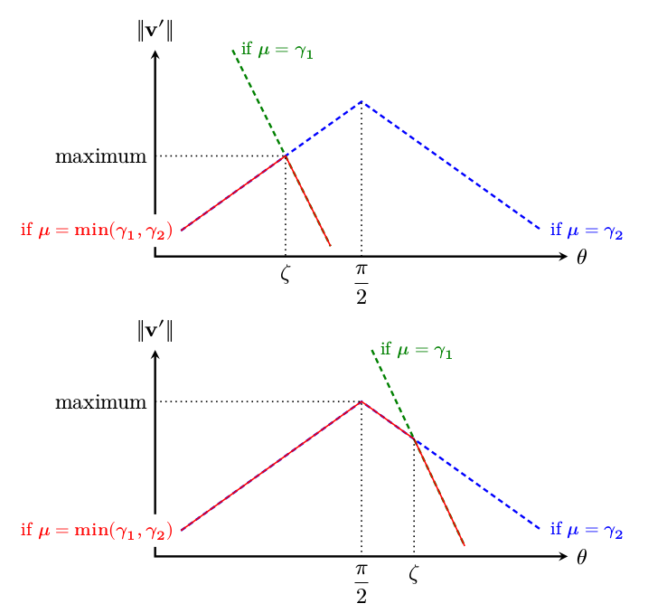
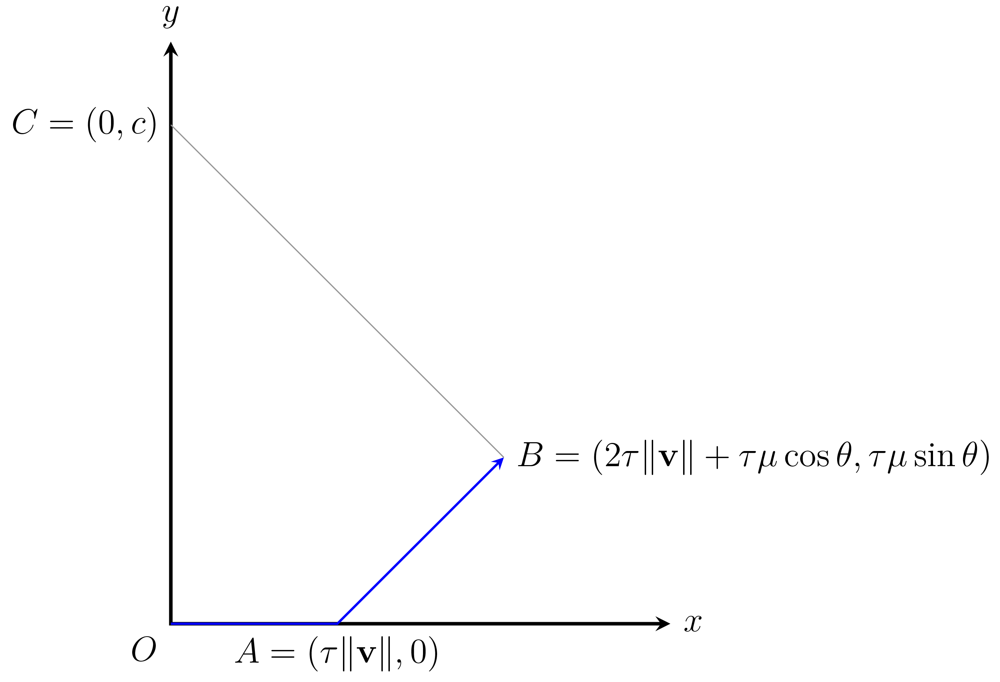

.. _strafing:

Strafing
========

*Strafing* in the context of Half-Life physics refers to the act of pressing the correct movement keys and moving the mouse in a precise way, typically with the aim of gradually increasing the horizontal speed or cornering without losing too much speed. Strafing is commonly accompanied by a series of jumps intended to keep the player off the ground, as ground movements are subject to friction. This combination of techniques is simply *bunnyhopping*. Since the strafing part of bunnyhopping is much more interesting than the jumping part, we will focus only on the former in this chapter.

Strafing is so fundamental to speedrunning, that a speedrunner ought to "get it out of the way" while focusing on other techniques. This applies to TASes as well: we want to optimise strafing as much as possible so that we can pretty much forget about it when TASing, allowing us to concentrate on the "general picture".

.. tip:: Before venturing further in this chapter, be sure to familiarise yourself with the fundamentals (:ref:`player movement`).

Building blocks
---------------

Before exploiting the fundamental movement equation (FME) for our own gains, there are a few mathematical building blocks we should be aware of to make analyses easier. Firstly, write :math:`\lVert\mathbf{v}'\rVert = \sqrt{\mathbf{v}' \cdot \mathbf{v}'}`. Expanding yields

.. math:: \lVert\mathbf{v}'\rVert
   = \sqrt{(\lambda(\mathbf{v}) + \mu\mathbf{\hat{a}}) \cdot (\lambda(\mathbf{v}) + \mu\mathbf{\hat{a}})}
   = \sqrt{\lVert\lambda(\mathbf{v})\rVert^2 + \mu^2 + 2 \lVert\lambda(\mathbf{v})\rVert \mu \cos\theta}
   :label: nextspeed

This is a very common line of attack that quickly yields an expression for the magnitude of vectorial outputs without explicit vectorial computations or geometric analyses. Half-Life physicists ought to learn this technique well. Equation :eq:`nextspeed` is sometimes called the *scalar FME*, often used in practical applications as the most general way to compute new speeds given :math:`\theta`.

From the scalar FME, we can further write down the equations when assuming :math:`\mu = \gamma_1` or :math:`\mu = \gamma_2`. These can be found by expanding :math:`\mu`, giving

.. math::
   \begin{aligned}
   \lVert\mathbf{v}'\rVert_{\mu = \gamma_1} &= \sqrt{\lVert\lambda(\mathbf{v})\rVert^2 +
   k_e \tau MA \left( k_e \tau MA + 2 \lVert\lambda(\mathbf{v})\rVert \cos\theta \right)} \\
   \lVert\mathbf{v}'\rVert_{\mu = \gamma_2} &= \sqrt{\lVert\lambda(\mathbf{v})\rVert^2 \sin^2 \theta + L^2}
   \end{aligned}
   :label: nextspeed gammas

These equations will be important in the exploitative analyses of the FME.

However, computing speeds is sometimes not sufficient. It may be desirable to compute velocity *vectors* given :math:`\theta` without worrying about viewangles and :math:`\mathbf{\hat{a}}`. We can achieve this by parameterising :math:`\mathbf{\hat{a}}` by a rotation of :math:`\mathbf{\hat{v}}` by an angle of :math:`\theta`, expressed as :math:`\mathbf{\hat{v}} R_z(\theta)` which is a matrix multiplication by a rotation matrix.

.. caution:: Remember from :ref:`notations` that vectors in this documentation are *row vectors*. Therefore, the order of multiplication is different from those in standard linear algebra textbooks. In fact, the components in :math:`R_z(\theta)` are also ordered differently.

With this idea in mind, we can rewrite the FME as

.. math:: \mathbf{v}' = \lambda(\mathbf{v}) + \mu\mathbf{\hat{v}}
   \begin{bmatrix}
   \cos\theta & -\sin\theta \\
   \sin\theta & \cos\theta
   \end{bmatrix}
   \quad\quad (\mathbf{v} \ne \mathbf{0})
   :label: newvelmat

Note that the precaution :math:`\mathbf{v} \ne \mathbf{0}` is needed so that the unit vector :math:`\mathbf{\hat{v}} = \mathbf{v} / \lVert\mathbf{v}\rVert` is well defined. This is one downside of :eq:`newvelmat`, where the special case of zero velocity must be dealt with separately by redefining :math:`\mathbf{\hat{v}} = \mathbf{\hat{f}}` (with :math:`\varphi = 0` as usual), thereby involving the viewangles.

When written in the form of :eq:`newvelmat`, positive :math:`\theta` gives *clockwise* rotations, while negative :math:`\theta` gives *anticlockwise* rotations. If this convention is inconvenient for a particular application, one can easily reverse the directionality by reversing the signs of the :math:`\sin\theta` elements in the rotation matrix.

Maximum acceleration
--------------------

One of the primary goals of strafing is to accelerate the player horizontal speed as much as possible. It is of no surprise that one of the earliest inquiries into the Half-Life physics is the question of maximum acceleration strafing, when research began circa 2012 by the author of this documentation.

Arguments of the maxima
~~~~~~~~~~~~~~~~~~~~~~~

It turns out that maximising the acceleration per frame gives rise to the global optimum. This is perhaps owing to good luck, because it is by no means a universal rule that this holds in other instances. To maximise acceleration is to maximise the per-frame quantity

.. math:: \frac{\lVert\mathbf{v}'\rVert - \lVert\mathbf{v}\rVert}{\tau}

Firstly, we will assume constant :math:`\tau`. Therefore, the task of maximising acceleration boils down to maximising the new speed :math:`\lVert\mathbf{v}'\rVert`. Looking at :eq:`nextspeed gammas`, observe that the speed is invariant to the transformation :math:`\theta \mapsto -\theta`. Therefore, for simplicity, we will consider only :math:`0 \le \theta \le \pi`. Now let us quickly define :math:`\zeta` such that :math:`\theta = \zeta` implies :math:`\mu = \gamma_1 = \gamma_2`, or

.. math:: \cos\zeta = \frac{L - k_e\tau MA}{\lVert\lambda(\mathbf{v})\rVert}

Then observe that

1. :math:`\lVert\mathbf{v}'\rVert_{\mu = \gamma_1}` and :math:`\lVert\mathbf{v}'\rVert_{\mu = \gamma_2}` intersects only at :math:`\theta = \zeta` if :math:`\zeta` exists.

2. :math:`\lVert\mathbf{v}'\rVert_{\mu = \gamma_1}` is decreasing in :math:`0 \le \theta \le \pi`

3. :math:`\lVert\mathbf{v}'\rVert_{\mu = \gamma_2}` is increasing in :math:`0 \le \theta \le \pi/2` and decreasing in :math:`\pi/2 \le \theta \le \pi`

4. :math:`\mu = \gamma_2` if :math:`0 \le \theta \le \zeta`, and :math:`\mu = \gamma_1` if :math:`\zeta < \theta \le \pi`. If :math:`\zeta` does not exist, then :math:`\mu = \gamma_1` throughout.

Therefore, we claim that to maximise :math:`\lVert\mathbf{v}'\rVert` we have optimal angle :math:`\theta = \Theta` such that

.. math:: \boxed{\Theta =
          \begin{cases}
          \pm\pi/2 & L - k_e \tau MA \le 0 \\
          \pm\zeta & 0 < L - k_e \tau MA \le \lVert\lambda(\mathbf{v})\rVert \\
          0 & L - k_e \tau MA > \lVert\lambda(\mathbf{v})\rVert
          \end{cases}}
   :label: maxaccel theta

To see why, suppose :math:`\zeta` exists and :math:`0 < \zeta < \pi/2`. This implies the second case in :eq:`maxaccel theta`. When this is the case, the always decreasing curve of :math:`\lVert\mathbf{v}'\rVert_{\mu=\gamma_1}` intersects that of :math:`\lVert\mathbf{v}'\rVert_{\mu=\gamma_2}` at :math:`\theta = \zeta` where the latter curve is still increasing (remember that the latter curve is increasing until :math:`\theta = \pi/2`). To the left of the :math:`\theta = \zeta` point is the domain of the latter curve, which is increasing, while beyond the point is the domain of the former curve, which is decreasing. Therefore the optimal angle is simply at the peak: the point of intersection of the two curves.

Now suppose :math:`\zeta \ge \pi/2`, the :math:`\lVert\mathbf{v}'\rVert_{\mu=\gamma_1}` curve intersects the :math:`\lVert\mathbf{v}'\rVert_{\mu=\gamma_2}` curve at the point where the latter is decreasing. :math:`0 \le \theta \le \zeta` is the domain of the latter curve which contains the maximum point at :math:`\pi/2`. Have a look at :numref:`maxaccel theta graphs` which illustrates these two cases.

   Graphs of new speed against :math:`\theta` when :math:`\zeta < \pi/2` and when :math:`\zeta > \pi/2`. The green curve represents the new speed if :math:`\mu = \gamma_1` throughout regardless of :math:`\theta`, while the blue curve represents the new speed :math:`\mu = \gamma_2` throughout. The red curve is the actual curve of the new speed by taking :math:`\mu = \min(\gamma_1, \gamma_2)` as per the FME. From these graphs, it becomes clear where the maximum points are in each case.

What if :math:`\zeta` does not exist? We then take the third case in :eq:`maxaccel theta`. Recall from our observations that :math:`\mu = \gamma_1` throughout in this case, and since this curve is decreasing, the maximum point is at :math:`\theta = 0`.

Knowing the formulae for optimal :math:`\Theta`, it is a matter of simple substitutions into :eq:`nextspeed gammas` to obtain

.. math:: \lVert\mathbf{v}'\rVert =
          \begin{cases}
          \sqrt{\lVert\lambda(\mathbf{v})\rVert^2 + L^2} & \Theta = \pm\pi/2 \\
          \sqrt{\lVert\lambda(\mathbf{v})\rVert^2 + k_e \tau MA (2L - k_e \tau MA)} & \Theta = \pm\zeta \\
          \lVert\lambda(\mathbf{v})\rVert + k_e \tau MA & \Theta = 0
          \end{cases}
   :label: maxaccel speed

For airstrafing, we can solve the recurrence relations easily and obtain formulae for the speed after :math:`n` frames of strafing as follows:

.. math:: \lVert\mathbf{v}_n\rVert =
          \begin{cases}
          \sqrt{\lVert\mathbf{v}_0\rVert^2 + nL^2} & \Theta = \pm\pi/2 \\
          \sqrt{\lVert\mathbf{v}_0\rVert^2 + nk_e \tau MA (2L - k_e \tau MA)} & \Theta = \pm\zeta \\
          \lVert\mathbf{v}_0\rVert + nk_e \tau MA & \Theta = 0
          \end{cases}
   :label: air maxaccel speed

These equations can be quite useful in planning.  For example, to calculate the number of frames required to airstrafe from :math:`320` ups to :math:`1000` ups at default Half-Life settings and 1000 fps, we solve

.. math:: 1000^2 = 320^2 + n \cdot 0.001 \cdot 320 \cdot 10 \cdot (60 - 0.001 \cdot 320 \cdot 10)
          \implies n \approx 4938

For groundstrafing, however, the presence of friction means simple substitutions may not work. In more complex cases, it may be desirable to simply calculate the speeds frame by frame using the scalar FME.

Effects of frame rate
~~~~~~~~~~~~~~~~~~~~~

The frame rate can affect the acceleration significantly. Looking at the first case of :eq:`maxaccel speed`, the acceleration per frame is

.. math:: \frac{\sqrt{\lVert\lambda(\mathbf{v})\rVert^2 + L^2} - \lVert\lambda(\mathbf{v})\rVert}{\tau}

One can immediately see that the lower the :math:`\tau` (that is, the higher the frame rate), the higher the acceleration. The second case is similar. For the third case, however, frame rate has no effect on the acceleration, because the frame rate simply disappears from the expression for acceleration.

Effects of friction
~~~~~~~~~~~~~~~~~~~

There is a limit to the speed achievable by perfect groundstrafing alone. There will be a critical speed such that the increase in speed exactly cancels the friction, so that :math:`\lVert\mathbf{v}_{k + 1}\rVert = \lVert\mathbf{v}_k\rVert`, that is the speed reaches steady state. For example, suppose optimal :math:`\theta = \zeta` and geometric friction (see :ref:`player friction`) is at play. Then by substituting into :eq:`nextspeed` we have

.. math:: \lVert\mathbf{v}\rVert^2 = (1 - \tau k)^2 \lVert\mathbf{v}\rVert^2 + k_e \tau M^2 A (2 - k_e \tau A)

Solving for :math:`\lVert\mathbf{v}\rVert`, we obtain the maximum groundstrafe speed for this particular configuration, keeping in mind that :math:`k` is dependent on :math:`k_e`:

.. math:: M \sqrt{\frac{k_e A (2 - \tau k_e A)}{k (2 - \tau k)}}

Take the case of default Half-Life settings at 1000 fps, we calculate

.. math:: 320 \sqrt{\frac{1 \cdot 10 \cdot (2 - 0.001 \cdot 1 \cdot 10)}{4 \cdot (2 - 0.001 \cdot 4)}} \approx 505.2

This is then the absolute maximum speed achievable by groundstrafing alone in vanilla Half-Life. At another common frame rate of 100 fps, we instead obtain the steady state speed of :math:`\approx 498.2`.

Growth of speed
~~~~~~~~~~~~~~~

By obtaining :eq:`air maxaccel speed`, we can immediately make a few important observations. In the absence of friction and if :math:`\Theta \ne 0`, the speed over time grows sublinearly, or :math:`O(\sqrt{n})`. This implies that the acceleration gradually decreases over time, but never reaches zero. It is notable that the acceleration at lower speeds can be substantial (more than linear acceleration) compared to that at higher speeds.

.. TODO: ground strafe linear growth until v > E

Air-ground speed threshold
~~~~~~~~~~~~~~~~~~~~~~~~~~

The acceleration of groundstrafe is usually greater than that of airstrafe.  It
is for this reason that groundstrafing is used to initiate bunnyhopping.
However, once the speed increases beyond :math:`E` the acceleration will begin
to decrease, as the friction grows proportionally with the speed.  There will
be a critical speed beyond which the acceleration of airstrafe exceeds that of
groundstrafe.  This is called the *air-ground speed threshold* (AGST),
admittedly a rather non-descriptive name.

Analytic solutions for AGST are always available, but they are cumbersome to
write and code.  Sometimes the speed curves for airstrafe and groundstrafe
intercepts several times, depending even on the initial speed itself.  A more
practical solution in practice is to simply use Equation :eq:`nextspeed` to
compute the new airstrafe and groundstrafe speeds then comparing them.

Bunnyhop cap
------------

We must introduce :math:`M_m`, which is the value of ``sv_maxspeed``.  It is
not always the case that :math:`M_m = M`, since :math:`M` can be affected by
duckstate and the values of :math:`F`, :math:`S` and :math:`U`.

All Steam versions of Half-Life have an infamous "cap" on bunnyhop speed which
is triggered only when jumping with player speed greater than :math:`1.7M_m`.
Note that the aforementioned speed is not horizontal speed, but rather, the
magnitude of the entire :math:`\mathbb{R}^3` vector.  When this mechanism is
triggered, the new velocity will become :math:`1.105 M_m \mathbf{\hat{v}}`.

It is impossible to avoid this mechanism when jumping.  In speedruns a
workaround would be to ducktap instead, but each ducktap requires the player to
slide on the ground for one frame, thereby losing a bit of speed due to
friction.  In addition, a player cannot ducktap if there is insufficient space
above him.  In this case jumping is the only way to maintain speed, though
there are different possible styles to achieve this.

One way would be to move at constant horizontal speed, which is :math:`1.7M_m`.
The second way would be to accelerate while in the air, then backpedal after
landing on the ground until the speed reduces to :math:`1.7M_m` before jumping
off again.  Yet another way would be to accelerate in the air *and* on the
ground, though the speed will still decrease while on the ground as long as the
speed is greater than the maximum groundstrafe speed.  To the determine the
most optimal method we must compare the distance travelled for a given number
of frames.  We will assume that the maximum groundstrafe speed is lower than
:math:`1.7M_m`.

It turns out that the answer is not as straightforward as we may have thought.

TODO!!

Speed preserving strafing
-------------------------

Speed preserving strafing can be useful when we are strafing at high :math:`A`. It takes only about 4.4s to reach 2000 ups from rest at :math:`A = 100`. While making turns at 2000 ups, if the velocity is not parallel to the global axes the speed will exceed ``sv_maxvelocity``. Occasionally, this can prove cumbersome as the curvature decreases with increasing speed, making the player liable to collision with walls or other obstacles. Besides, as the velocity gradually becomes parallel to one of the global axes again, the speed will drop back to ``sv_maxvelocity``. This means, under certain situations, that the slight speed increase in the process of making the turn has little benefit. Therefore, it can sometimes be helpful to simply make turns at a constant ``sv_maxvelocity``. This is where the technique of *speed preserving strafing* comes into play. Another situation might be that we want to groundstrafe at a constant speed. When the speed is relatively low, constant speed groundstrafing can produce a very sharp curve, which is sometimes desirable in a very confined space.

We first consider the case where friction is absent. Setting :math:`\lVert\mathbf{v}'\rVert = \lVert\mathbf{v}\rVert` in Equation :eq:`nextspeed` and solving,

.. math:: \cos\theta = -\frac{\mu}{2\lVert\mathbf{v}\rVert}

If :math:`\mu = \gamma_1` then we must have :math:`\gamma_1 \le \gamma_2`, or

.. math:: k_e \tau MA \le L - \lVert\mathbf{v}\rVert \cos\theta \implies k_e \tau MA \le 2L

At this point we can go ahead and write out the full formula for :math:`\theta` that preserves speed while strafing

.. math:: \cos\theta =
          \begin{cases}
          -\displaystyle\frac{k_e \tau MA}{2\lVert\mathbf{v}\rVert} & k_e \tau MA \le 2L \\
          -\displaystyle\frac{L}{\lVert\mathbf{v}\rVert} & k_e \tau MA > 2L
          \end{cases}

On the other hand, if friction is present, then we have

.. math:: \lVert\mathbf{v}\rVert^2 = \lVert\lambda(\mathbf{v})\rVert^2 + \mu^2 + 2 \mu
          \lVert\lambda(\mathbf{v})\rVert \cos\theta

By the usual line of attack, we force :math:`\mu = \gamma_1` which implies that
:math:`\gamma_1 \le \gamma_2`, giving the formula

.. math:: \cos\theta = \frac{1}{2\lVert\lambda(\mathbf{v})\rVert} \left(
          \frac{\lVert\mathbf{v}\rVert^2 - \lVert\lambda(\mathbf{v})\rVert^2}{k_e \tau MA} -
          k_e \tau MA \right)

and the necessary condition

.. math:: \frac{\lVert\mathbf{v}\rVert^2 - \lVert\lambda(\mathbf{v})\rVert^2}{k_e \tau
          MA} + k_e \tau MA\le 2L

We can check that if friction is absent, then :math:`\lVert\mathbf{v}\rVert = \lVert\lambda(\mathbf{v})\rVert` and the condition becomes what we have obtained earlier. If this condition failed, however, then we instead have

.. math:: \cos\theta = -\frac{\sqrt{L^2 - \left( \lVert\mathbf{v}\rVert^2 -
          \lVert\lambda(\mathbf{v})\rVert^2 \right)}}{\lVert\lambda(\mathbf{v})\rVert}

Note that we took the negative square root, because :math:`\theta` needs to be
as large as possible so that the curvature of the strafing path is maximised,
which is one of the purposes of speed preserving strafing.  To derive the
necessary condition for the formula above, we again employ the standard
strategy, yielding

.. math:: k_e \tau MA - L > \sqrt{L^2 - \left( \lVert\mathbf{v}\rVert^2 -
          \lVert\lambda(\mathbf{v})\rVert^2 \right)}

Observe that we need :math:`k_e \tau MA > L` and :math:`L^2 \ge
\lVert\mathbf{v}\rVert^2 - \lVert\lambda(\mathbf{v})\rVert^2`.  Then we square the
inequality to yield the converse of the condition for :math:`\mu = \gamma_1`,
as expected.  Putting these results together, we obtain

.. math:: \cos\theta =
          \begin{cases}
          \displaystyle \frac{1}{2\lVert\lambda(\mathbf{v})\rVert} \left(
          \frac{\lVert\mathbf{v}\rVert^2 - \lVert\lambda(\mathbf{v})\rVert^2}{k_e \tau MA} -
          k_e \tau MA \right) & \displaystyle \text{if } \frac{\lVert\mathbf{v}\rVert^2 -
          \lVert\lambda(\mathbf{v})\rVert^2}{k_e \tau MA} + k_e \tau MA\le 2L \\
          \displaystyle -\frac{\sqrt{L^2 - \left( \lVert\mathbf{v}\rVert^2 -
          \lVert\lambda(\mathbf{v})\rVert^2 \right)}}{\lVert\lambda(\mathbf{v})\rVert} &
          \displaystyle \text{otherwise, if } k_e \tau MA > L \text{ and } L^2 \ge
          \lVert\mathbf{v}\rVert^2 - \lVert\lambda(\mathbf{v})\rVert^2
          \end{cases}

Note that, regardless of whether friction is present, if
:math:`\lvert\cos\theta\rvert > 1` then we might resort to using the optimal
angle to strafe instead.  This can happen when, for instance, the speed is so
small that the player will always gain speed regardless of strafing direction.
Or it could be that the effect of friction exceeds that of strafing, rendering
it impossible to prevent the speed reduction.  If
:math:`\lVert\mathbf{v}\rVert` is greater than the maximum groundstrafe speed,
then the angle that minimises the inevitable speed loss is obviously the
optimal strafing angle.

Curvature
---------

The locus of a point obtained by strafing is a spiral. Intuitively, at any given speed there is a limit to how sharp a turn can be made without lowering acceleration. It is commonly known that this limit grows harsher with higher speed. As tight turns are common in Half-Life, this becomes an important consideration that preoccupies speedrunners at almost every moment. Learning how navigate through tight corners by strafing without losing speed is a make-or-break skill in speedrunning.

It is natural to ask exactly how this limit can be quantified for the benefit of TASing. The simplest way to do so is to consider the *radius of curvature* of the path. Obviously, this quantity is not constant with time, except for speed preserving strafing. Therefore, when we talk about the radius of curvature, precisely we are referring to the *instantaneous* radius of curvature, namely the radius at a given instant in time. But time is discrete in Half-Life, so this is approximated by the radius in a given frame.

90 degrees turns
~~~~~~~~~~~~~~~~

Passageways in Half-Life commonly bend perpendicularly, so we frequently make 90 degrees turns by strafing. We can imagine how the width of a passage limits the maximum radius of curvature one can sustain without colliding with the walls. This implies that the speed is limited as well. When planning for speedruns, it can prove useful to be able to estimate this limit for a given turn without running a simulation or strafing by hand. In particular, we want to compute the maximum speed for a given passage width. We start by making some simplifying assumptions that will greatly reduce the difficulty of analysis while closely modelling actual situations in practice. Refer to the figure below.

.. figure:: static/90-degrees-strafe-radius.png
   :height: 800px
   :width: 754px
   :scale: 50%
   :align: center

The first assumption we make is that the width of the corridor is the same before and after the turn. This width is denoted as :math:`d`, as one can see in the figure. This assumption is justified because this is often true or approximately true in Half-Life maps. The second assumption is that the path is circular. The centre of this circle, also named the *centre of curvature*, is at point :math:`C`. As noted earlier, the strafing path is in general a spiral with varying radius of curvature. Nevertheless, the total time required to make such a turn is typically very small. Within such short time frame, the radius would not have changed significantly. Therefore it is not absurd to assume that the radius of curvature is constant while making the turn. The third assumption is that the positions of the player before and after making the turn coincide with the walls. This assumption is arguably less realistic, but the resulting path is the larger circular arc one can fit in this space.

By trivial applications of the Pythagorean theorem, it can be shown that the relationship between the radius of curvature :math:`r` and the width of the corridor :math:`d` is given by

.. math:: r = \left( 2 + \sqrt{2} \right) d \approx 3.414 d

This formula may be used to estimate the maximum radius of curvature for making such a turn without collision. However, the radius of curvature by itself is not very useful. We may wish to further estimate the maximum speed corresponding to this :math:`r`.

Radius-speed relationship
~~~~~~~~~~~~~~~~~~~~~~~~~

The following figure depicts the positions of the player at times :math:`t = 0`, :math:`t = \tau` and :math:`t = 2\tau`. The initial speed is :math:`\lVert\mathbf{v}\rVert`. All other symbols have their usual meaning.

Based on the figure, the radius of curvature may be approximated as the :math:`y`-intercept, or :math:`c`. Obviously, a more accurate approximation may be achieved by averaging :math:`c` and :math:`\mathit{BC}`. However, this results in a clumsy formula with little benefit. Empirically, the approximation by calculating :math:`c` is sufficiently accurate in practice. In consideration of this, it can be calculated that

.. math:: r \approx c = \frac{\tau}{\sin\theta} \left( \frac{2}{\mu} \lVert\mathbf{v}\rVert^2 + 3 \lVert\mathbf{v}\rVert \cos\theta + \mu \right)
  :label: radius-speed-relationship

Note that this is the most general formula, applicable to any type of strafing. From this equation, observe that the radius of curvature grows with the square of speed. This is a fairly rapid growth. On the other hand, under maximum speed strafing, the speed grows with the square root of time. Informally, the result of these two growth rates conspiring with one another is that the radius of curvature grows linearly with time. We also observe that the radius of curvature is directly influenced by :math:`\tau`, as experienced strafers would expect. Namely, we can make sharper turns at higher frame rates.

From Equation :eq:`radius-speed-relationship` we can derive formulae for various types of strafing by eliminating :math:`\theta`. For instance, in Type 2 strafing we have :math:`\theta = \pi/2`. Substituting, we obtain a very simple expression for the radius:

.. math:: r \approx \tau \left( \frac{2}{L} \lVert\mathbf{v}\rVert^2 + L \right)

Or, solving for :math:`\lVert\mathbf{v}\rVert`, we obtain a more useful equation:

.. math:: \lVert\mathbf{v}\rVert \approx \sqrt{\frac{L}{2} \left( \frac{r}{\tau} - L \right)}

For Type 1 strafing, the formula is clumsier. Recall that we have :math:`\mu = k_e \tau MA` and

.. math:: \cos\theta = \frac{L - k_e \tau MA}{\lVert\mathbf{v}\rVert}

To eliminate :math:`\sin\theta`, we can trivially rewrite the :math:`\cos\theta` equation in this form

.. math:: \sin\theta = \frac{\sqrt{\lVert\mathbf{v}\rVert^2 - (L - k_e \tau MA)^2}}{\lVert\mathbf{v}\rVert}

Then we proceed by substituting, yielding

.. math:: r \approx \frac{\tau \lVert\mathbf{v}\rVert}{\sqrt{\lVert\mathbf{v}\rVert^2 - (L - k_e \tau MA)^2}} \left( \frac{2}{k_e \tau MA} \lVert\mathbf{v}\rVert^2 + 3L - 2 k_e \tau MA \right)

We cannot simplify this equation further. In fact, solving for :math:`\lVert\mathbf{v}\rVert` is non-trivial as it requires finding a root to a relatively high order polynomial equation. As per the usual strategy when facing similar difficulties, we resort to iterative methods.

Implementation notes
--------------------

Vectorial compensation
~~~~~~~~~~~~~~~~~~~~~~
