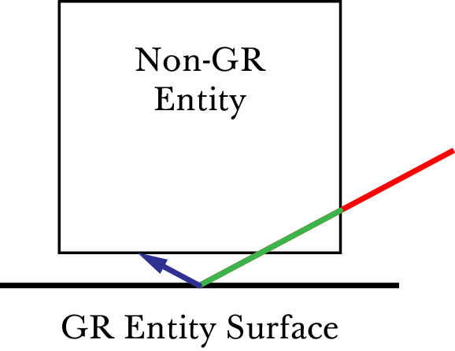
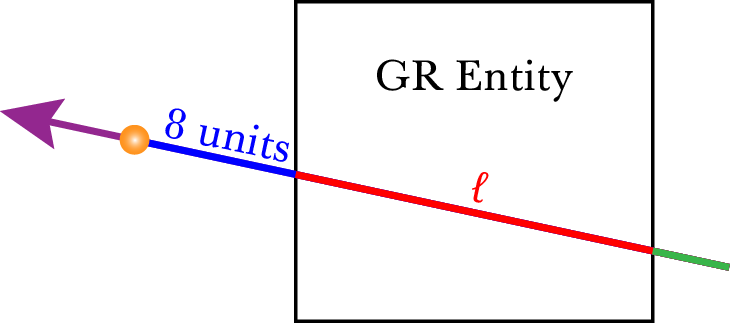
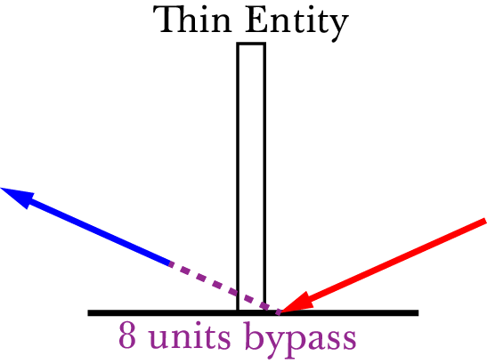

Weapons
=======

.. TODO: satchels etc ignore the player, but after a save/load they no longer ignore the player
.. TODO: but gauss probably doesn't ignore satchels, so possible to hit a grenade with gauss and reflect?

Gauss
-----

The gauss is one of the more interesting weapons in Half-Life. One of the earliest speedrunning tricks, the simple gauss boosting, and one of the most recently discovered tricks, quickgaussing, are both gauss-related. The gauss is arguably the most complex weapon in Half-Life, and it is worth devoting some paragraphs exploring its behaviour.

The gauss weapon has two modes, as any entry level Half-Life player knows. The primary mode of the gauss fires orange beams consuming 2 cells and providing 20 damage. The delay between shots in primary mode is 0.2s. The secondary mode is more interesting. In single-player mode, the weapon consumes a cell every 0.3s while charging, starting from an initial consumption of one cell. The minimum charge time is 0.5s. If the weapon charges for more than 10 seconds, the weapon will discharge and inflict 50 damage onto the player. The damage of the beam in secondary mode otherwise scales linearly with charging time :math:`T` such that

.. math:: D = 50 \min(T, 4)

Observe that the damage caps at 200 after charging for 4 seconds. The secondary fire produces a physical recoil, which is manifested by a change in the player velocity. If :math:`\mathbf{v}` is the current player velocity, and :math:`\mathbf{\hat{f}}` is the unit forward vector, then the new velocity is given by

.. math:: \mathbf{v}' = \mathbf{v} - 5D\mathbf{\hat{f}} \operatorname{diag}(1,1,0)
   :label: gauss velocity

where :math:`\operatorname{diag}(1,1,0)` refers to the diagonal matrix with 1, 1, and 0 as the entries on the diagonal. Observe that the vertical velocity never changes. To maximise horizontal speed change, the player must fire from zero pitch, which gives the maximum speed change of 1000 ups, one of the greatest speed boosts available in Half-Life.

The behaviour of gauss beams is relatively complex compared to other Half-Life projectiles. Intuitively, players recognise that gauss beams have a tendency to reflect off surfaces. Gauss beams can also "punch" through walls and damage entities at the opposite side, through a mechanism that is not obvious at first sight. Gauss beams can even inflict damage onto oneself under the right circumstances. What is more, the damage from gauss beams can be seemingly amplified when fired through particular geometries.

A detailed and complete understanding of the gauss behaviour can be achieved by reading the code in ``dlls/gauss.cpp`` in the Half-Life SDK. Rather than listing the code and tracing through line by line here, we shall explore the weapon by examples of its exploits.

.. From the "code" above, we immediately see that a necessary condition for beam reflection is an angle of incidence of below 60 degrees. After a reflection, the aiming direction :math:`\mathbf{\hat{a}}` will be pointing in the direction of the reflected beam. It can be easily shown that the vector remains a unit vector after the reflection. Observe also the next :math:`\mathbf{s}` is offset from the hit surface by 8 units.

.. We also observe that a radius damage of :math:`pD` is inflicted at the point of reflection. This damage decreases as the angle of incidence increases, which is intuitive. Next, :math:`D` get reduced by the radius damage amount. Multiple reflections can happen until :math:`D` gets reduced down to 10 or below, or after 10 iterations. We can thus think of :math:`D` as a kind of "energy level" of the beam. The more energy is used at each reflection, the fewer *further* reflections can be made.

.. If no reflection is made due to small angles of incidence, the beam will attempt to punch through the hit entity, provided the hit entity can reflect gauss and firing in secondary mode. The game will perform a trace offset slightly from the tracing end position to the same destination. The line typically hits the outer surface of a separate worldspawn entity if it begins from within an entity, or any entity surface otherwise. Then, the game will perform another trace from the end position of the previous trace to the end position of the first trace in the loop. This effectively determines the "exit point" of the beam, though this may not be the exit point of the first entity it punched through.

.. The distance between :math:`\mathbf{e}_t` and the latest :math:`\mathbf{e}_b` is an important quantity. The numerical value of this distance is compared to the damage level :math:`D` of the beam, and a chunk of code calculating explosive damage is only executed if the distance is below :math:`D`. The radius damage at the "exit point" can be significant if a fully charged beam is punched through the entity, though the damage is reduced by that distance.

.. _gauss mechanism:

Beam iterations
~~~~~~~~~~~~~~~

A gauss beam starts off with an initial damage :math:`D_1` and hit counter ``nMaxHits`` with an initial value of 10. The game then perform at most 10 iterations (tracked by ``nMaxHits`` which is decremented each iteration) to to calculate the dynamic behaviour of the gauss beam. In each iteration, the game may reduce the damage, inflict damage to some entity, or calculate beam reflection. If :math:`D_i \le 10` or ``nMaxHits`` reaches zero at some iteration :math:`i`, then the beam will stop iterating. This implies that the damage :math:`D_i` is akin to the "energy" of the beam.

Crucially, the game also keeps track of the *ignored entity*, or ``pentIgnore`` in the code. This ignored entity is initialised to be the player entity before the iterations begin. The ignored entity is the entity that will be ignored by any line tracing, and can be changed from time to time as we will see shortly. What entity is or is not being ignored plays a huge role in some of the common exploits of this weapon.

In performing line traces, the game also keeps track of :math:`\mathbf{\hat{p}}_i`, represented by ``vecDir`` in the code. You can think of this vector as representing the direction of a the gauss beam in any iteration. This direction vector is initialised to be the player's unit forward vector :math:`\mathbf{\hat{f}}`. It can be modified if the beam reflects, as we will see below.

Roughly speaking, in any iteration :math:`i`, the game begins by tracing a line from the player gun position :math:`\mathbf{s}_i` to 8192 units away in the direction of :math:`\mathbf{\hat{p}}_i`, namely with the end point of :math:`\mathbf{s}_i + 8192 \mathbf{\hat{p}}_i`. This line may or may not hit some entity. If no entity is hit, the iterations simply stop. Otherwise, the behaviour of the beam will depend on whether this entity is *gauss reflectable* (GR) or *non-gauss reflectable* (non-GR). For our purposes, we can say that an entity is gauss reflectable if it *cannot* receive damage, and vice versa.

.. note:: The game graphics will sometimes show a gauss beam seemingly reflecting off a non-gauss reflectable entity. This does not contradict what we described here: what you see is purely a client side visual artefact, and no reflection actually occurred on the server side. You can check this by placing an NPC in the path of the apparent reflected beam, and observe that the reflected beam does not damage the NPC.

Denote :math:`\mathbf{e}_{i,1}` the point of intersection of the tracing line and the hit entity. If the hit entity is non-GR, then the game will simply set the trace origin of the next iteration :math:`\mathbf{s}_{i+1} \gets \mathbf{e}_{i,1} + \mathbf{\hat{f}}`. This implies that the next trace origin is not exactly at the point of intersection, but displaced 1 unit away. Also, the game will set the ``pentIgnore`` to be the hit entity. This causes the line trace in the next iteration to ignore this entity. The game now proceeds to the next iteration.

On the other hand, if the hit entity is GR, then the beam behaviour is more complex. The game first sets the ignored entity ``pentIgnore`` to null, which causes the subsequent line traces in this iteration to *not* ignore anything. Then, the game decides whether to reflect the beam. If :math:`\mathbf{\hat{n}}_i` is the plane normal of the hit surface and :math:`\mathbf{\hat{p}}_i` is the current beam direction vector, then the game calculates the component of the beam in the direction of the plane normal, that is :math:`c = -\mathbf{\hat{n}}_i \cdot \mathbf{\hat{p}}_i`. This quantity can also be thought of this way: if :math:`\phi` is the angle of incidence (the shortest angle between the beam and the plane normal), then this quantity equals :math:`\cos\phi`.

A gauss beam can reflect only if :math:`c < 1/2`, which implies an angle of incidence *larger than 60 degrees*. If the beam reflects, the game will set the beam direction to be :math:`\mathbf{\hat{p}}_{i+1} \gets 2c\mathbf{\hat{n}} + \mathbf{\hat{p}}_i`. This new direction represents the direction of the reflected beam. Observe that the angle of reflection is the same as the angle of incidence, because

.. math:: \mathbf{\hat{n}}_i \cdot \mathbf{\hat{p}}_{i+1} = \mathbf{\hat{n}}_i \cdot (2c\mathbf{\hat{n}}_i + \mathbf{\hat{p}}_i) = 2c - c = c

Then the game will set :math:`\mathbf{s}_{i+1} \gets \mathbf{e}_{i,1} + 8 \mathbf{\hat{p}}_{i+1}` for the next iteration. Notice that the line trace source for the next iteration is displaced 8 units away from the point of reflection. Following this, the game will create an explosion with the origin at :math:`\mathbf{e}_{i,1}` and a source damage of :math:`c D_i` (see :ref:`explosions`). This implies that the larger the angle of incidence, the lower the blast damage. Finally, the game calculates the damage :math:`D_{i+1} \gets D_i (1 - \max(0.1, c))` for the next iteration. The game then proceeds to the next iteration.

On the other hand, if the beam cannot reflect, which implies an angle of incidence of *less than 60 degrees*, then the subsequent beam behaviour is the most complex. The game first checks if the beam has reached this point in the previous iterations. If so, the iterations will simply stop. Otherwise, now that the beam has just reached this point in the code, that check will fail for subsequent iterations. In addition, if this gauss beam is fired from the primary mode, then the game will also stop the iterations.

The game traces a line from :math:`\mathbf{e}_{i,1} + 8\mathbf{\hat{p}}_i` to :math:`\mathbf{s}_{i} + 8192 \mathbf{\hat{p}}_i`. Note that :math:`\mathbf{e}_{i,1}` always lies on the line from :math:`\mathbf{s}_i` to :math:`\mathbf{s}_i + 8192 \mathbf{\hat{p}}_i`. If the trace result is all solid, the game moves on to the next iteration. Otherwise, set the tracing point of intersection be :math:`\mathbf{e}_{i,2}`. Now, the game attempts to *trace backwards* by tracing from :math:`\mathbf{e}_{i,2}` to :math:`\mathbf{e}_{i,1}`. Set the tracing point of intersection be :math:`\mathbf{e}_{i,3}`. Now, denote

.. math:: \ell = \lVert\mathbf{e}_{i,3} - \mathbf{e}_{i,1}\rVert

If :math:`\ell \ge D_i`, the game moves on to the next iteration. Otherwise, if :math:`\ell = 0` set :math:`\ell \gets 1`. The game now calculates :math:`D_{i+1} \gets D_i - \ell`. With this new damage, the game then creates an explosion with the origin at :math:`\mathbf{e}_{i,3} + 8\mathbf{\hat{p}}_i` and source damage :math:`D_{i+1}`. Finally, the game sets :math:`\mathbf{s}_{i+1} \gets \mathbf{e}_{i,3} + \mathbf{\hat{p}}_i`.

Simple gauss boost
~~~~~~~~~~~~~~~~~~

One of the simplest tricks for the gauss weapon is simple gauss boosting. Namely, speed boosting from the recoil of firing the secondary attack. The simple gauss boost remains one of the most versatile boosting methods in Half-Life, and is used to great effects in a typical Half-Life speedrun. Unfortunately, the gauss being an endgame weapon is manifested by the fact that its ammo supply is relatively constrained. Good ammo planning must be done to maximise the effectiveness of this weapon.

A common task in speedrunning is to get from one point to another in the shortest time possible using simple gauss boosting. From :eq:`gauss velocity` we know that, assuming zero pitch, the horizontal speed boost is proportional to the charging time. On the other hand, the minimum charging time is 0.5 seconds. What is the optimal way to perform gauss boosts? Or, what is the boosting scheme for maximising the average speed (total distance travelled in a given time)? Should one repeatedly charge the gauss for 1s and firing, or repeatedly charge the gauss for 0.5s and firing? There is a simple way to answer this.

.. figure:: static/simple_gauss_boosts.gif
   :scale: 90%
   :name: simple gauss boosts
   :align: center

   Animation of horizontal speed against time with boosting schemes of different charging time :math:`T`, so that the final speed always ends up to be 2000 ups.

Suppose the player is stationary. At :math:`t = 0`, the player begins charging and after an interval :math:`T`, the player releases the charge. Immediately after the release, the player begins charging again for :math:`T`, and so on. From :numref:`simple gauss boosts` we observe that the smaller the boosting interval, the closer the graph approximates the continuous boosting line, which is a theoretical case of :math:`T = 0`. More importantly, observe that the area under the discrete graph also increases with decreasing :math:`T`, up to a maximum corresponding to the continuous case. Given that the minimum :math:`T` is half a second, we conclude that the optimal boosting scheme is to charge for half a second a firing, repeatedly.

If it is possible to pre-charge the gauss weapon before timing a particular run, then it is still beneficial to charge the weapon as much as possible and then release the charge at :math:`t = 0`. This gives a higher initial speed in :numref:`simple gauss boosts` instead of 0 as shown, which effectively shifts the graphs upwards and increasing the area under the graphs.

Quickgauss
~~~~~~~~~~

Quickgauss is a special kind of speed boosting similar to the simple gauss boost, except a save/load is done while the gauss is charging. When the charge is released after a game load, the result is similar to releasing a :math:`T = 4` secondary charge. In particular, the resulting speed boost and damage are the maximum attainable from the weapon, that is 1000 ups and 200 damage, while consuming only one cell and a charging time of half a second. This provides one of the highest accelerations from a single weapon achievable in game (2000 ups/s), and also one of the highest damage rates (400 dps).

Unfortunately, quickgauss only works in versions of Half-Life with the bunnyhop cap. This is because in these versions of Half-Life, in ``dlls/weapons.cpp`` the following lines define the states of the gauss weapon to be stored in the savestate:

.. code-block:: c++
   :emphasize-lines: 4

   TYPEDESCRIPTION CGauss::m_SaveData[] = 
   {
       DEFINE_FIELD( CGauss, m_fInAttack, FIELD_INTEGER ),
   //  DEFINE_FIELD( CGauss, m_flStartCharge, FIELD_TIME ),
   //  DEFINE_FIELD( CGauss, m_flPlayAftershock, FIELD_TIME ),
   //  DEFINE_FIELD( CGauss, m_flNextAmmoBurn, FIELD_TIME ),
       DEFINE_FIELD( CGauss, m_fPrimaryFire, FIELD_BOOLEAN ),
   };
   IMPLEMENT_SAVERESTORE( CGauss, CBasePlayerWeapon );

Notice how the highlighted line is inexplicably commented out, so that ``m_flStartCharge`` does not get saved to the savestate. When the game is loaded from a save, this field will be zero. The calculation of current charging time is done by ``gpGlobals->time - m_pPlayer->m_flStartCharge`` throughout ``dlls/gauss.cpp``, with ``gpGlobals->time`` being much larger than 4 in most cases. If ``m_flStartCharge`` is zero, the calculated charging time will be much larger than 4, and thus clamped to 4 and giving the maximum damage and recoil. On the other hand, the consumption of cells while charging is done periodically over a real passage of time, rather than calculated from the charging time. Since the *real* charging time is only half a second, only one cell is consumed in total.

It should be immediately apparent that quickgaussing is very powerful. If quickgauss is available in a particular version of Half-Life, the runner will almost never need to use the simple gauss boosting, as quickgauss is so ammo efficient. In the rare cases where it is desirable to perform a boost less than the maximum attainable, the runner can pitch up or down accordingly when firing to reduce the boost amount, according to :eq:`gauss velocity`.

.. _entity piercing:

Entity piercing
~~~~~~~~~~~~~~~

When a beam hits a non-gauss-reflectable entity, which implies it is damageable, the beam will first inflict damage onto the entity. Then, in the next iteration, the beam will *ignore* that entity while continue tracing forward. This results in the beam passing right through the entity untouched, and hitting some other entity instead. It is also important to note the the beam does not lose energy when it passes through non-GR entities. Understanding entity piercing allows the runner to save time and ammo by reducing the number of shots required to damage multiple targets.

.. _multigauss:

Multigauss
~~~~~~~~~~

Multigauss refers to the gauss beam hitting a non-gauss-reflectable entity, reflecting on some adjacent gauss-reflectable entity, and then hitting the same entity again with the reflected beam. In addition, a small radius damage is inflicted onto the entity as the beam reflects. Multigauss is useful for getting double the normal damage out of gauss beams for free.

   Multigauss in action, depicted by a single gauss beam in three iterations (red, green, and blue) hitting a non-gauss-reflectable entity (i.e. damageable) twice. A radius damage is also produced at the point of reflection, though it is not depicted here.

As explained in :ref:`entity piercing`, when a gauss beam hits a non-gauss-reflectable entity, it will inflict damage :math:`D` onto the entity. This is shown by the red portion of the beam in :numref:`multigauss figure`. In the next iteration, the beam will ignore the entity that got hit, passing right through the entity. Suppose the beam then hits a gauss-reflectable entity, such as the ground or wall. If the angle of incidence is greater than 60 degrees (a necessary condition for the beam to reflect), the beam will reflect off the GR entity, as explained in :ref:`gauss mechanism`.

Whenever a gauss beam reflects, a radius damage will be applied from the point of reflection. This is a little known fact among Half-Life players. Suppose the angle of incident is :math:`\phi`. Then the radius damage is calculated to be :math:`D \cos\phi`. This radius damage will be inflicted onto the non-GR entity, though the final amount obviously depends on how far away the entity is from the point of reflection. In the most common case, the non-GR entity is simply in contact with the GR entity. For instance, a damageable crate (non-GR) is usually in contact with the ground (GR). As a result, the distance of the non-GR entity from the point of reflection will be zero, causing 100% of the radius damage to be inflicted onto it.

At the end of the second iteration, the gauss beam will no longer ignore the non-GR entity that got hit in the first iteration. Therefore, the reflected beam will hit the entity in question again in the third iteration provided the entity is sufficiently thick (otherwise you would be triggering a bypass instead, as explained in :ref:`reflection bypass`), though with a damage of :math:`D (1 - \cos\phi)`. Overall, the damages inflicted onto the entity in question is shown in the table below.

================== ============
Iteration          Damage
================== ============
First              :math:`D`
Second             :math:`\le D \cos\phi`
Third              :math:`D (1 - \cos\phi)`
================== ============

The total damage inflicted onto the non-GR entity is simply the sum of all damages, which has a maximum of :math:`2D`, or twice the damage. Notice how the total damage is independent of the angle of incident :math:`\phi`. The only reason that causes the total damage to be less than :math:`2D` is the non-GR entity located at a distance away from the point of reflection. Never the less, even if we ignore the radius damage, the total damage inflicted onto the entity is still greater than the damage of a normal beam alone.

.. _entity punch:

Entity punch
~~~~~~~~~~~~

As explained in :ref:`gauss mechanism`, a secondary gauss beam can punch through a GR entity if it does not meet the criterion for reflection. The damage produced by an entity punch is dependent on :math:`\ell`. This quantity is typically the thickness of the wall, but this is not always the case. In particular, the position :math:`\mathbf{e}_{i,2}` is found by tracing a line from the *inside* an entity. It is not always obvious what the line can "see" and end up under these circumstances. Sometimes, the trace line can ignore (unrelated to ``pentIgnore``) and not able to detect certain entities, and therefore the line tracing may end at a further point, skipping these undetected entities along the way. And sometimes, if the thickness of an entity is too high, the game may wrongly determine that the trace is all solid.

   A secondary gauss beam can punch through a GR entity and create an explosion 8 units away from the exit point, with a damage magnitude proportional to :math:`\ell`.

If the line tracings went well, the game will create an explosion 8 units away from the exit point. The thinner the walls or entities (barring the caveats above), the higher the explosive damage. Since the explosion origin is displaced from the exit surface, it is possible for the origin to be located inside some other entity, thus causes nuking (see :ref:`nuking`). In general, entity punching can be very powerful. With a full gauss charge, the player can instantly create explosions of a maximum of 200 source damage, outclassing most explosive weapons.

Reflection boost
~~~~~~~~~~~~~~~~

Reflection boost refers to boosting which involves a reflection of the gauss beam. There are two variants of gauss reflect boost: *ducking* and *standing*. Reflection boosts can be used to provide vertical boost, which is not possible with a normal gauss boost in single player. The vertical boost is provided by means of self-inflicted damage, which can be costly to player health.

The ducking reflect boost sequence is as follows.

#. Start charging for quickgauss
#. Duck on the ground
#. Pitch to 30 degrees downward
#. Jump *just* before firing
#. Save/load for quickgauss

The beam should be reflected off the ground, at a 60 degrees angle of incidence. This provides the player a 866 ups horizontal boost and a respectable vertical boost. The sequence demands high precision to produce the desired effects.

The standing reflect boost uses explosive damage from beam reflection as well. The standing reflection boost essentially works by performing a self-inflicted multigauss (:ref:`multigauss`). However, the standing reflect boost sequence requires even higher precision to execute.

#. Start charging for quickgauss
#. Stand touching a wall
#. Pitch to 60 degrees downward
#. Yaw to look *perpendicularly into* the wall
#. Offset the yaw slightly to the left or right by about 1 to 2 degrees
#. Duck and jump *simultaneously* just before firing
#. Save/load for quickgauss

The result, however, is respectable.

.. TODO: why does this not happen with very thick walls? Like the walls at the top barney in crossfire

.. _selfgauss:

Selfgauss
~~~~~~~~~

Selfgauss is a very well known trick, but probably one of the least understood among speedrunners. Selfgaussing is the result of the beam hitting the player as it is being fired out of the imaginary gun barrel, or specifically the player's gun position. This is due to the origin of the line tracing :math:`\mathbf{s}_i` being *inside the player model*. An analogy from the real world would be firing a pistol from inside one's body, so that the bullet hits the player's internals point blank. The outcome is a perfectly vertical speed boost, as the inflictor origin :math:`\mathbf{r}_\text{inflictor}` and the player origin :math:`\mathbf{r}` coincides, thus giving a perfectly upward :math:`\mathbf{\hat{d}}` vector (see :ref:`damage boosting`).

It is a common misconception that selfgauss occurs because the beam somehow "reflects" backwards onto the player after hitting a wall. It is easy to see that this is a wrong explanation, because the beam cannot reflect when the angle of incidence is less than 60 degrees, and the gauss beam cannot reverse its damage inflicting direction.

In the first iteration, the gauss beam will ignore the player, because ``pentIgnore`` is set the be the player entity, as explained in :ref:`gauss mechanism`. Selfgauss will only work in the next iteration if ``pentIgnore`` is set to null, and :math:`\mathbf{s}_i = \mathbf{s}_{i+1}`. Therefore, selfgauss cannot happen if the beam strikes a non-gauss reflectable entity, for it modifies :math:`\mathbf{s}_{i+1}` in the next iteration. Selfgauss cannot happen if the beam reflects, as reflections change :math:`\mathbf{s}_{i+1}` as well.

Suppose when the player fires the gauss in secondary mode, the beam first strikes some entity at a sufficiently small angle of incidence so that the beam does not reflect. Assuming this entity is gauss reflectable, the game will perform two traces to determine the distance between the "exit point" and the entry point. This distance is denoted as :math:`\ell`. Selfgauss will only work if :math:`\ell` is less than the numerical damage of the beam. If the opposite is true, then :math:`\mathbf{s}_{i+1}` will be modified, preventing selfgauss. This implies that higher :math:`\ell` is more desirable as it allows for selfgaussing with a greater damage, and thus producing greater boosts. The same caveat with regards to the meaning of :math:`\ell` should be applied, as explained in :ref:`entity punch`. Namely, while it commonly is found to be the thickness of the entity the beam is hitting, this is not always the case. It is not always easy to tell at first sight what :math:`\ell` might be for a given geometry and territory.

To perform selfgauss in practice, there are a few notes to keep in mind. Recall from :ref:`hitgroup` that attacks that trace to the player's head will deal three times the original damage. To save ammo, it is desirable to headshot the player while selfgaussing, giving a higher speed boost to ammo ratio. In addition, it is desirable to jump immediately before selfgaussing, as jumping provides an important initial vertical speed that can save health and ammo. However, note that a simple jump may not work. Recall from :ref:`duckjump` that when the player jumps, the player model plays the jumping animation, which changes the model geometry (and thus the hitboxes' positions) considerably. This can prevent headshotting even when the beam is fired from the same viewangles without jumping. The solution is to duck and jump, which prevents the jumping animation from playing.

Doublegauss
~~~~~~~~~~~

The doublegauss is a way of doubling the damage of a secondary gauss attack using the same number of cells and charge time. Doublegauss works very similarly to selfgauss (:ref:`selfgauss`). The only difference is that, in the first beam iteration, the beam should hit the target entity which must be non-GR. As a result, the first damage will be inflicted and :math:`\mathbf{s}_{i+1}` will be calculated to be *inside the target entity*. The rest of the mechanism work exactly the same as that of selfgauss, except the trace origins are inside the target entity rather than the inside the player entity. Specifically, the beam will ignore the target entity in the second iteration and inflict a second unattenuated damage onto the entity in the third iteration. This implies that the conditions for triggering doublegauss are the same as selfgauss *as though the target entity were not there*.

Gauss rapid fire
~~~~~~~~~~~~~~~~

When firing the gauss in the primary mode, there is a small delay between shots, similar to how other weapons behave. However, unlike other weapons in Half-Life, if a save/load is performed immediately after a primary fire, this firing delay will be eliminated entirely. Consequently, it is possible to fire the gauss at a dramatic rate, dishing out an extreme damage rate. For instance, each primary fire deals 20 damage. At 1000 fps, it is possible to fire the weapon at a rate of 1000 times per second, for a total of 50 shots (recall that each primary fire consumes 2 out of 100 cells). This results in an impressive 1000 damage in just 0.05 seconds. The downside, of course, is the dramatic ammo consumption.

Gauss rapid fire is useful in situations where gibbing damageable entities as quick as possible is of utmost consideration, thanks to the primary fire's ability to gib corpses. For example, clearing monsters in a narrow pathway which obstruct the runner's path. The runner should always headshot monsters if possible to obtain a three times damage boost. The weapon should be continuously fired even as the corpse is slowly falling after the monster is dead.

.. _reflection bypass:

Reflection bypass
~~~~~~~~~~~~~~~~~

   A gauss beam reflecting and bypassing a thin entity. The entity that lies within the purple dashed line remains undetected and untouched by the gauss beam.

The reflection bypass refers to a method of causing the gauss beam to reflect and bypass a solid obstruction. Unlike the traditional way of punching through a wall using the secondary attack, this method relies on shooting very close to an edge so that the origin :math:`\mathbf{s}_i` of the reflected beam at some iteration :math:`i` is *outside the obstructing entity*. This works because the origin of the reflected beam :math:`\mathbf{s}_{j+1}` is 8 units away from :math:`\mathbf{e}_{j,1}` in the direction of the reflected vector :math:`\mathbf{\hat{p}}_{j+1}`. This 8 units skip in space allows bypassing any entity of any type of sufficient thinness. This trick works on both GR and non-GR entities, and for both primary and secondary shots.

This trick is useful for getting the beam to hit some entity on the other side of some thin obstruction with less than 8 units thickness. Although 8 units thin entities are relatively rare in Half-Life, it is not unusual to find them from time to time. The downside of this trick is that the beam loses damage after reflection.

Hornet gun
----------

Handgrenades
------------

The handgrenade is one of the most useful weapons for damage boosting in
Half-Life.  It is versatile and can be used in many situations.  Interestingly,
the initial speed and direction of the grenade when it is tossed depend on the
player pitch in a subtle way.  For example, when :math:`\varphi = \pi/2`
(i.e. the player is facing straight down) the initial speed and direction are
:math:`0` and :math:`\pi/2` respectively.  However, when :math:`\varphi = 0`
the initial speed and direction now become :math:`400` and :math:`-\pi/18 =
-10^\circ` respectively.  Another notable aspect of handgrenades is that its
initial velocity depends on the player velocity at the instant of throwing.
This is unlike MP5 grenades.

In general, we can describe the initial velocity and direction of handgrenades
in the following way.  **Assuming all angles are in degrees**.  First of all,
the player pitch will be clamped within :math:`(-180^\circ, 180^\circ]`.  Let
:math:`\varphi_g` be the handgrenade's initial pitch, then we have

.. math:: \varphi_g = -10^\circ +
          \begin{cases}
          (8/9) \varphi & \text{if } \varphi < 0 \\
          (10/9) \varphi & \text{otherwise}
          \end{cases}

And if :math:`\mathbf{v}_g` is its initial velocity and
:math:`\mathbf{\hat{f}}_g` is the unit forward vector constructed using
:math:`\varphi_g`, then

.. math:: \mathbf{v}_g = \mathbf{v} + \min(500, 360 - 4\varphi_g)
          \mathbf{\hat{f}}_g

To visualise this equation, we plotted a graph of the handgrenade's horizontal
speed and vertical velocity relative to the player against the player pitch.

.. image:: static/handgrenade-vel.png

TODO

MP5
---

The bullets are spread in similar ways to shotgun bullets, except there is only one bullet per ammo. See :ref:`shotgun` for a description of how bullet spreads are computed.

.. _shotgun:

Shotgun
-------

The shotgun is a very powerful weapon in Half-Life.

The primary attack of the shotgun fires 6 bullets and consumes 1 shell. The delay between shots is 0.75 seconds. The secondary attack fires 12 bullets and consumes 2 shells. The delay between shots is 1.5 seconds. Both the primary and the secondary attacks fire off multiple bullets, which is unique among Half-Life weapons. A special function called ``FireBulletsPlayer`` in ``combat.cpp`` is used to compute the damage tracings for shotguns and a few other weapons.

For each bullet, the game computes a pseudorandom direction vector which is then used for tracing attacks. The direction vector is randomised using the shared RNG (see :ref:`shared rng`), with the seed increased successively in a predictable way as the game iterates through all bullets. As there are only 256 possible ways to seed the shared RNG, so are there only 256 possible shotgun spread patterns.

Squeak grenade
--------------

The squeak grenade is a weapon the player can carry. Upon release a squeak grenade, it turns hostile and will attack any human, including the player. The weapon only has the primary attack. The velocity of the grenade upon release is

.. math:: \mathbf{v}_g = \mathbf{v} + 200\mathbf{\hat{f}}

where :math:`\mathbf{v}` is the velocity of the player and :math:`\mathbf{\hat{f}}` is the unit forward view vector of the player.

The behaviour of the squeak grenade after release is described in :ref:`squeak grenade monster`.
