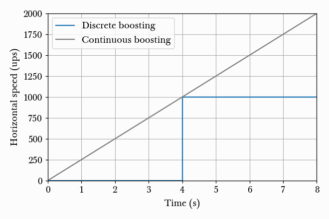
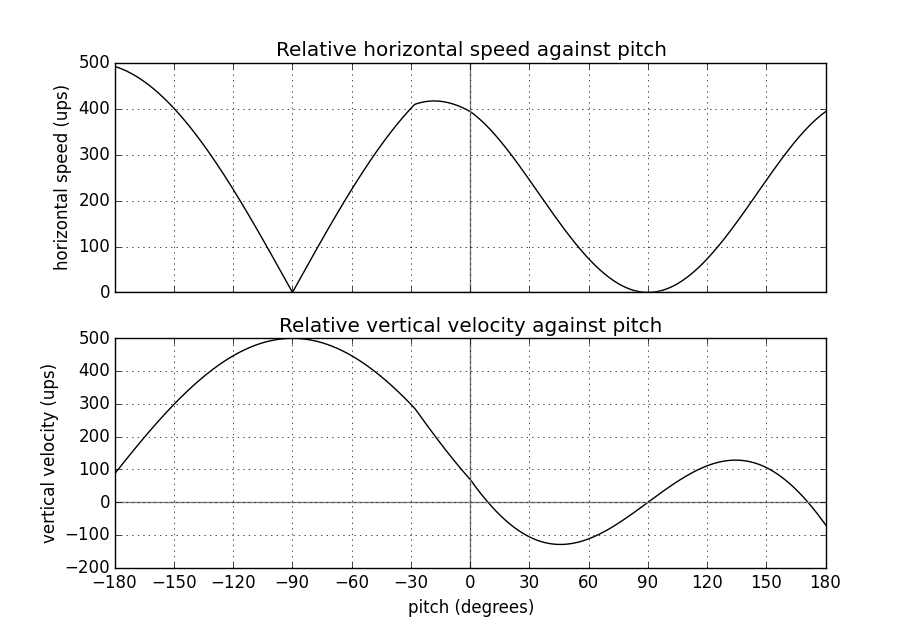

Weapons
=======

.. TODO: satchels etc ignore the player, but after a save/load they no longer ignore the player
.. TODO: but gauss probably doesn't ignore satchels, so possible to hit a grenade with gauss and reflect?

Gauss
-----

The gauss is one of the more interesting weapons in Half-Life. One of the earliest speedrunning tricks, the simple gauss boosting, and one of the most recently discovered tricks, quickgaussing, are both gauss-related.

The gauss weapon has two modes, as any entry level Half-Life player would know. The primary mode of the gauss fires orange beams consuming 2 cells and providing 20 damage. The delay between shots in primary mode is 0.2s.

The secondary mode is more interesting. In single-player mode, the weapon consumes a cell every 0.3s while charging, starting from an initial consumption of one cell. The minimum charge time is 0.5s. If the weapon charges for more than 10 seconds, the weapon will discharge and inflict 50 damage to the player. The damage in secondary mode otherwise scales linearly with charging time :math:`T` such that

.. math:: D = 50 \min(T, 4)

Observe that the damage caps at 200 after charging for 4 seconds. The secondary fire produces a physical recoil, which is manifested by a change in the player velocity. If :math:`\mathbf{v}` is the current player velocity, and :math:`\mathbf{\hat{f}}` is the forward view, then the new velocity is given by

.. math:: \mathbf{v}' = \mathbf{v} - 5D\mathbf{\hat{f}} \cdot \langle 1, 1, 0\rangle
   :label: gauss velocity

Observe that the vertical velocity never changes. To maximise horizontal speed change, the player must fire from zero pitch. The maximum speed change would be 1000 ups, which is one of the greatest practical speed boosts available in Half-Life.

The behaviour of gauss beams is relatively complex compared to other Half-Life weapons, and it deserves a detailed description. Intuitively, players recognise that gauss beams have a tendency to reflect off surfaces. Gauss beams can also "punch" through walls and damage entities at the opposite side, through a mechanism that is not obvious at first sight. Gauss beams can even inflict damage onto the attacker in the right circumstances. What is more, the damage from gauss beams can get seemingly amplified when fired through particular geometries.

To understand these phenomena, we will walk through how the weapon handles reflections and piercings. The code responsible for the physics is in the ``CGauss::Fire`` function in ``dll/gauss.cpp``. The algorithm translated to "human assembly language" would look like the following, ignoring the irrelevant elements.

#. :math:`\mathbf{\hat{a}} \gets \mathbf{\hat{f}}` (aiming direction)
#. :math:`\mathbf{s} \gets \mathbf{g}` where :math:`\mathbf{g}` is the player's gun position (origin plus view offset).
#. :math:`\mathbf{t} \gets \mathbf{s} + 8192\mathbf{\hat{a}}`.
#. :math:`n \gets 10`.
#. ``ignored_entity`` :math:`\gets` ``player_entity``.
#. **LOOP**:
#. If :math:`D \le 10` or :math:`n \le 0`, go to **EXIT**.
#. :math:`n \gets n - 1`.
#. Perform a trace from :math:`\mathbf{s}` to :math:`\mathbf{t}`, ignoring ``ignored_entity``, set :math:`\mathbf{e}_t` to the tracing end position.
#. If trace is all solid from :math:`\mathbf{s}` to :math:`\mathbf{t}`, go to **EXIT**.
#. Inflicts :math:`D` damage to the hit entity.
#. If ``hit_entity`` cannot reflect gauss (i.e. not BSP model or damageable), go to **NO REFLECT**.
#. ``ignored_entity`` :math:`\gets` ``nil``
#. :math:`p \gets -\mathbf{\hat{n}} \cdot \mathbf{\hat{a}}` where :math:`\mathbf{\hat{n}}` is the plane normal of hit entity.
#. If :math:`p \ge 0.5`, that is if the angle of incidence of :math:`\mathbf{\hat{a}}` is below 60 degrees, go to **STEEP ANGLE**.
#. :math:`\mathbf{\hat{a}} \gets \mathbf{\hat{a}} + 2p\mathbf{\hat{n}}`.
#. :math:`\mathbf{s} \gets \mathbf{e}_t + 8\mathbf{\hat{a}}`.
#. :math:`\mathbf{t} \gets \mathbf{s} + 8192\mathbf{\hat{a}}`.
#. Inflict a radius damage of :math:`pD` at :math:`\mathbf{e}_t`.
#. If :math:`p = 0`, :math:`p \gets 0.1`.
#. :math:`D \gets (1 - p)D`.
#. Go to **LOOP**.
#. **STEEP ANGLE**:
#. If the beam has punched, go to **EXIT**.
#. If in primary mode, go to **EXIT**.
#. Perform a trace from :math:`\mathbf{e}_t + 8\mathbf{\hat{a}}` to :math:`\mathbf{t}`, ignoring ``ignored_entity``, set :math:`\mathbf{e}_b` to the trace end position (not :math:`\mathbf{e}_t`!).
#. If trace is all solid, :math:`D \gets 0` and go to **LOOP**.
#. Perform a trace from :math:`\mathbf{e}_b` to :math:`\mathbf{e}_t` ignoring ``ignored_entity``, set :math:`\mathbf{e}_b` to the trace end position.
#. :math:`p \gets \lVert \mathbf{e}_b - \mathbf{e}_t \rVert`.
#. If :math:`p \ge D`, go to **LOOP**.
#. :math:`D \gets D - \begin{cases} p & p \ne 0 \\ 1 & p = 0 \end{cases}`.
#. Inflict a radius damage of :math:`D` at :math:`\mathbf{e}_b + 8\mathbf{\hat{a}}`.
#. :math:`\mathbf{s} \gets \mathbf{e}_b + \mathbf{\hat{a}}`.
#. Go to **LOOP**.
#. **NO REFLECT**:
#. :math:`\mathbf{s} \gets \mathbf{e}_t + \mathbf{\hat{f}}`.
#. ``ignored_entity`` :math:`\gets` ``hit_entity``
#. Go to **LOOP**.
#. **EXIT**:

From the "code" above, we immediately see that a necessary condition for beam reflection is an angle of incidence of below 60 degrees. After a reflection, the aiming direction :math:`\mathbf{\hat{a}}` will be pointing in the direction of the reflected beam. It can be easily shown that the vector remains a unit vector after the reflection. Observe also the next :math:`\mathbf{s}` is offset from the hit surface by 8 units.

We also observe that a radius damage of :math:`pD` is inflicted at the point of reflection. This damage decreases as the angle of incidence increases, which is intuitive. Next, :math:`D` get reduced by the radius damage amount. Multiple reflections can happen until :math:`D` gets reduced down to 10 or below, or after 10 iterations. We can thus think of :math:`D` as a kind of "energy level" of the beam. The more energy is used at each reflection, the fewer *further* reflections can be made.

If no reflection is made due to small angles of incidence, the beam will attempt to punch through the hit entity, provided the hit entity can reflect gauss and firing in secondary mode. The game will perform a trace offset slightly from the tracing end position to the same destination. The line typically hits the outer surface of a separate worldspawn entity if it begins from within an entity, or any entity surface otherwise. Then, the game will perform another trace from the end position of the previous trace to the end position of the first trace in the loop. This effectively determines the "exit point" of the beam, though this may not be the exit point of the first entity it punched through.

The distance between :math:`\mathbf{e}_t` and the latest :math:`\mathbf{e}_b` is an important quantity. The numerical value of this distance is compared to the damage level :math:`D` of the beam, and a chunk of code calculating explosive damage is only executed if the distance is below :math:`D`. The radius damage at the "exit point" can be significant if a fully charged beam is punched through the entity, though the damage is reduced by that distance.

Simple gauss boost
~~~~~~~~~~~~~~~~~~

One of the simplest tricks for the gauss weapon is simple gauss boosting. Namely, speed boosting from the recoil of firing the secondary attack.

From :eq:`gauss velocity` we know that, assuming zero pitch, the horizontal speed boost is proportional to the charging time. On the other hand, the minimum charging time is 0.5 seconds. What is then the optimal way to perform gauss boosts? This is better stated as, what is the boosting scheme for maximising the average speed (total distance travelled in a given time)? Should one repeatedly charge the gauss for 1s and firing, or repeatedly charge the gauss for 0.5s and firing? There is a simple way to answer this.

   Animation of horizontal speed against time with boosting schemes of different charging time :math:`T`, so that the final speed always ends up to be 2000 ups.

Suppose the player is stationary. At :math:`t = 0`, the player begins charging and after an interval :math:`T`, the player releases the charge. Immediately after the release, the player begins charging again for :math:`T`, and so on. From :numref:`simple gauss boosts` we observe that the smaller the boosting interval, the closer the graph approximates the continuous boosting line, which is a theoretical case of :math:`\Delta t = 0`. More importantly, observe that the area under the discrete graph also increases with decreasing :math:`\Delta t`, up to a maximum corresponding to the continuous case. Given that the minimum :math:`T` is half a second, this is the optimal boosting scheme, namely to charge for half a second a firing, repeatedly.

If it is possible to pre-charge the gauss weapon before timing a particular run, then it is still beneficial to charge the weapon as much as possible and then release the charge at :math:`t = 0`. This gives a higher initial speed in :numref:`simple gauss boosts` instead of 0 as shown, which effectively shifts the graphs upwards and increasing the area under the graphs.

Quickgauss
~~~~~~~~~~

Quickgauss is a special kind of speed boosting similar to the simple gauss boost, except a save/load is done while the gauss is charging. When the charge is released after a game load, the result is similar to releasing a :math:`T = 4` secondary charge. In particular, the resulting speed boost and damage are the maximum attainable from the weapon, that is 1000 ups and 200 damage, while consuming only one cell and a charging time of half a second. This gives an one of the highest accelerations from a single weapon achievable in game (2000 ups/s), and also one of the highest damage rates (400 dps).

Unfortunately, quickgauss only works in versions of Half-Life with the bunnyhop cap. This is because in these versions of Half-Life, in ``dlls/weapons.cpp`` the following lines define the states of the gauss weapon to be stored in the savestate:

.. code-block:: c++
   :emphasize-lines: 4

   TYPEDESCRIPTION CGauss::m_SaveData[] = 
   {
       DEFINE_FIELD( CGauss, m_fInAttack, FIELD_INTEGER ),
   //  DEFINE_FIELD( CGauss, m_flStartCharge, FIELD_TIME ),
   //  DEFINE_FIELD( CGauss, m_flPlayAftershock, FIELD_TIME ),
   //  DEFINE_FIELD( CGauss, m_flNextAmmoBurn, FIELD_TIME ),
       DEFINE_FIELD( CGauss, m_fPrimaryFire, FIELD_BOOLEAN ),
   };
   IMPLEMENT_SAVERESTORE( CGauss, CBasePlayerWeapon );

Notice how the highlighted line is inexplicably commented out, so that ``m_flStartCharge`` does not get saved to the savestate. When the game is loaded from a save, this field will be zero. The calculation of current charging time is done by ``gpGlobals->time - m_pPlayer->m_flStartCharge`` throughout ``dlls/gauss.cpp``, with ``gpGlobals->time`` being much larger than 4 in most cases. If ``m_flStartCharge`` is zero, the charging time will be much larger than 4, and thus clamped to 4 and giving the maximum damage and recoil. On the other hand, the consumption of cells while charging is done periodically. Since the *true* charging time is only half a second, only one cell is consumed in total.

.. TODO: why does this not happen with very thick walls? Like the walls at the top barney in crossfire

.. _selfgauss:

Selfgauss
~~~~~~~~~

Selfgauss is a very well known trick, but probably one of the least understood among speedrunners. Selfgaussing is the result of the beam hitting the player as it is being fired out of the imaginary gun barrel, or specifically the player's gun position. This is due to the origin of the first line tracing :math:`\mathbf{s}` being inside the player model. An analogy from the real world would be firing a pistol from inside one's body, so that the bullet hits the player's internals point blank. The outcome is a perfectly vertical speed boost, as the inflictor origin and the player origin coincides, thus giving a perfectly upward delta-v vector.

Selfgauss cannot happen if the beam strikes a non-gauss-reflectable entity, for it modifies :math:`\mathbf{s}`, the line tracing source after one iteration. Selfgauss cannot happen if the beam reflects, as reflections change :math:`\mathbf{s}` as well. Suppose when the player fires the gauss in secondary mode, the beam first strikes some entity at a sufficiently small angle of incidence so that the beam does not reflect. Assuming this entity is gauss-reflectable, the game will perform two traces to determine the distance between the "exit point" and the entry point. This distance may be called the *selfgauss thickness*. Selfgauss will only work if the selfgauss thickness is less than the damage of the beam. If the opposite is true, then :math:`\mathbf{s}` will be modified, preventing selfgaussing. This implies that higher a selfgauss thickness is more desirable as it allows for selfgaussing with a greater damage.

.. TODO: not really wall, but also empty spaces, explain

.. note:: Incomplete paragraph

It is important to note that the selfgauss thickness is *not* always the thickness of some wall or entity that got struck.

To perform selfgaussing in practice, there are a few notes to keep in mind. Recall from :ref:`hitgroup` that attacks that trace to the player's head will deal three times the original damage. To save ammo, it is desirable to headshot the player while selfgaussing, giving a higher speed boost to ammo ratio. In addition, it is desirable to jump immediately before selfgaussing, as jumping provides an important initial vertical speed that can save health and ammo. However, note that a simple jump may not work. Recall from :ref:`duckjump` that when the player jumps, the player model plays the jumping animation, which changes the model geometry (and thus the hitboxes' positions) considerably. This can prevent headshotting even when the beam is fired from the same viewangles without jumping. The solution is to duck and jump, which prevents the jumping animation from playing.

Gauss rapid fire
~~~~~~~~~~~~~~~~

Gauss multihitting
~~~~~~~~~~~~~~~~~~

Under the right circumstances it is possible to hit an entity multiple times in one shot. This gives a maximum of two times the normal damage.

Reflection boost
~~~~~~~~~~~~~~~~

There are two variants of gauss reflect boost: *ducking* and *standing*. The ducking reflect boost sequence is as follows.

#. Start charging for quickgauss
#. Duck on the ground
#. Pitch to 30 degrees downward
#. Jump *just* before firing
#. Save/load for quickgauss

The beam should be reflected off the ground, at a 60 degrees angle of incidence. This provides the player a 866 ups horizontal boost and a respectable vertical boost. The sequence demands high precision to produce the desired effects.

The standing reflect boost uses explosive damage from beam reflection as well. However, the standing reflect boost sequence requires even higher precision to execute.

#. Start charging for quickgauss
#. Stand touching a wall
#. Pitch to 60 degrees downward
#. Yaw to look *perpendicularly into* the wall
#. Offset the yaw slightly to the left or right by about 1 to 2 degrees
#. Duck and jump *simultaneously* just before firing
#. Save/load for quickgauss

The result, however, is respectable.

Doublegauss
~~~~~~~~~~~

The doublegauss is a way of doubling the damage of a secondary gauss attack using the same number of cells and charge time.

Reflection punch
~~~~~~~~~~~~~~~~

The reflection punch refers to a method of punching the gauss beam through a solid obstruction. Unlike the traditional way of punching through a wall using the secondary attack, this method relies on shooting very close to an edge so that the origin of the reflected beam is inside the obstruction.

Hornet gun
----------

Handgrenades
------------

The handgrenade is one of the most useful weapons for damage boosting in
Half-Life.  It is versatile and can be used in many situations.  Interestingly,
the initial speed and direction of the grenade when it is tossed depend on the
player pitch in a subtle way.  For example, when :math:`\varphi = \pi/2`
(i.e. the player is facing straight down) the initial speed and direction are
:math:`0` and :math:`\pi/2` respectively.  However, when :math:`\varphi = 0`
the initial speed and direction now become :math:`400` and :math:`-\pi/18 =
-10^\circ` respectively.  Another notable aspect of handgrenades is that its
initial velocity depends on the player velocity at the instant of throwing.
This is unlike MP5 grenades.

In general, we can describe the initial velocity and direction of handgrenades
in the following way.  **Assuming all angles are in degrees**.  First of all,
the player pitch will be clamped within :math:`(-180^\circ, 180^\circ]`.  Let
:math:`\varphi_g` be the handgrenade's initial pitch, then we have

.. math:: \varphi_g = -10^\circ +
          \begin{cases}
          (8/9) \varphi & \text{if } \varphi < 0 \\
          (10/9) \varphi & \text{otherwise}
          \end{cases}

And if :math:`\mathbf{v}_g` is its initial velocity and
:math:`\mathbf{\hat{f}}_g` is the unit forward vector constructed using
:math:`\varphi_g`, then

.. math:: \mathbf{v}_g = \mathbf{v} + \min(500, 360 - 4\varphi_g)
          \mathbf{\hat{f}}_g

To visualise this equation, we plotted a graph of the handgrenade's horizontal
speed and vertical velocity relative to the player against the player pitch.

TODO

MP5
---

The bullets are spread in similar ways to shotgun bullets, except there is only one bullet per ammo. See :ref:`shotgun` for a description of how bullet spreads are computed.

.. _shotgun:

Shotgun
-------

The shotgun is a very powerful weapon in Half-Life.

The primary attack of the shotgun fires 6 bullets and consumes 1 shell. The delay between shots is 0.75 seconds. The secondary attack fires 12 bullets and consumes 2 shells. The delay between shots is 1.5 seconds. Both the primary and the secondary attacks fire off multiple bullets, which is unique among Half-Life weapons. A special function called ``FireBulletsPlayer`` in ``combat.cpp`` is used to compute the damage tracings for shotguns and a few other weapons.

For each bullet, the game computes a pseudorandom direction vector which is then used for tracing attacks. The direction vector is randomised using the shared RNG (see :ref:`shared rng`), with the seed increased successively in a predictable way as the game iterates through all bullets. As there are only 256 possible ways to seed the shared RNG, so are there only 256 possible shotgun spread patterns.

Squeak grenade
--------------

The squeak grenade is a weapon the player can carry. Upon release a squeak grenade, it turns hostile and will attack any human, including the player. The weapon only has the primary attack. The velocity of the grenade upon release is

.. math:: \mathbf{v}_g = \mathbf{v} + 200\mathbf{\hat{f}}

where :math:`\mathbf{v}` is the velocity of the player and :math:`\mathbf{\hat{f}}` is the unit forward view vector of the player.

The behaviour of the squeak grenade after release is described in :ref:`squeak grenade monster`.
